---
params:
 title: "Technical Potential of Demand Response"
 subtitle: "Heat Pump Analysis"
title: 'Technical Potential of Demand Response'
subtitle: 'Heat Pump Analysis'
author: 'Carsten Dortans (xxx@otago.ac.nz)'
date: 'Last run at: 2018-09-28 15:34:55'
output:
  bookdown::html_document2:
    toc: true
    toc_float: TRUE
    toc_depth: 2
    keep_md: TRUE
    self_contained: no
  bookdown::pdf_document2:
    toc: true
    toc_depth: 2

---


\newpage

# Citation

If you wish to use any of the material from this report please cite as:

 * Dortans, C. (2018) Technical Potential of Demand Response: Heat Pump Analysis, [Centre for Sustainability](http://www.otago.ac.nz/centre-sustainability/), University of Otago: Dunedin, New Zealand.

This work is (c) 2018 the University of Southampton.

\newpage

# About

## Circulation


Report circulation:

 * Restricted to: [NZ GREEN Grid](https://www.otago.ac.nz/centre-sustainability/research/energy/otago050285.html) project partners and contractors.
 
## Purpose

This report is intended to: 

 * load and test GREEN Grid heat pump and hot water profiles.

## Requirements:

 * test dataset stored at /Volumes/hum-csafe/Research Projects/GREEN Grid/cleanData/safe/gridSpy/1min/dataExtracts/

## History


Generally tracked via our git.soton [repo](https://git.soton.ac.uk/ba1e12/nzGREENGrid):

 * [history](https://git.soton.ac.uk/ba1e12/nzGREENGrid/commits/master)
 * [issues](https://git.soton.ac.uk/ba1e12/nzGREENGrid/issues)
 
Specific history of this code:

 * https://github.com/CfSOtago/GREENGrid/commits/master/analysis/demandResponse/

## Support


This work was supported by:

 * The [University of Otago](https://www.otago.ac.nz/);
 * The [University of Southampton](https://www.southampton.ac.uk/);
 * The New Zealand [Ministry of Business, Innovation and Employment (MBIE)](http://www.mbie.govt.nz/) through the [NZ GREEN Grid](https://www.otago.ac.nz/centre-sustainability/research/energy/otago050285.html) project;
 * [SPATIALEC](http://www.energy.soton.ac.uk/tag/spatialec/) - a [Marie Skłodowska-Curie Global Fellowship](http://ec.europa.eu/research/mariecurieactions/about-msca/actions/if/index_en.htm) based at the University of Otago’s [Centre for Sustainability](http://www.otago.ac.nz/centre-sustainability/staff/otago673896.html) (2017-2019) & the University of Southampton's Sustainable Energy Research Group (2019-2020).

We do not 'support' the code but if you notice a problem please check the [issues](https://github.com/CfSOtago/GREENGrid/issues) on our [repo](https://github.com/CfSOtago/GREENGrid) and if it doesn't already exist, please open a new one.
 

# Load data files

## Heat pump profiles

This file is the pre-aggregated data for all heat pump circuits in the GREEN Grid data for April 2015 - March 2016 (check!)


```r
#ggParams$profilesFile <- paste0(ggParams$dataLoc, "Heat #Pump_2015-04-01_2016-03-31_observations.csv.gz")
```

In this section we load and describe the  data files from .


```r
#print(paste0("Trying to load: ", ggParams$profilesFile))

heatPumpProfileDT1 <- data.table::as.data.table(
 readr::read_csv("/Volumes/hum-csafe/Research Projects/GREEN Grid/cleanData/safe/gridSpy/1min/dataExtracts/Heat Pump_2015-04-01_2016-03-31_observations.csv.gz",
                       col_types = cols(
                       hhID = col_character(),
                       linkID = col_character(),
                       r_dateTime = col_datetime(format = ""),
                       circuit = col_character(),
                       powerW = col_double() # <- crucial otherwise readr infers integers for some reason
                     )
                 )
)

#heatPumpProfileDT1 <- #data.table::as.data.table(readr::read_csv(ggParams$profilesFile))

heatPumpProfileDT <- heatPumpProfileDT1
heatPumpProfileDT <- heatPumpProfileDT[, year := lubridate::year(r_dateTime)]
heatPumpProfileDT <- heatPumpProfileDT[, obsHourMin := hms::as.hms(r_dateTime)]
heatPumpProfileDT <- heatPumpProfileDT[, month := lubridate::month(r_dateTime)]

heatPumpProfileDT <- heatPumpProfileDT[month == 12 | month == 1 | month == 2, season := "Summer"]
heatPumpProfileDT <- heatPumpProfileDT[month == 3 | month == 4 | month == 5, season := "Autumn"]
heatPumpProfileDT <- heatPumpProfileDT[month == 6 | month == 7 | month == 8, season := "Winter"]
heatPumpProfileDT <- heatPumpProfileDT[month == 9 | month == 10 | month == 11, season := "Spring"]

#Building daily average per season

#heatPumpProfileDT[ , 5][is.na(heatPumpProfileDT[ , 5] ) ] = 0 

heatPumpProfileDT <- heatPumpProfileDT[, .(meanW = mean(powerW, na.rm = TRUE)), keyby = .(obsHourMin, season)]
```


Describe using skim:


```r
skimr::skim(heatPumpProfileDT)
```

```
## Skim summary statistics
##  n obs: 5760 
##  n variables: 3 
## 
## ── Variable type:character ────────────────────────────────────────────────────────────────────────────────────────────
##  variable missing complete    n min max empty n_unique
##    season       0     5760 5760   6   6     0        4
## 
## ── Variable type:difftime ─────────────────────────────────────────────────────────────────────────────────────────────
##    variable missing complete    n    min        max     median n_unique
##  obsHourMin       0     5760 5760 0 secs 86340 secs 43170 secs     1440
## 
## ── Variable type:numeric ──────────────────────────────────────────────────────────────────────────────────────────────
##  variable missing complete    n   mean     sd    p0   p25    p50    p75
##     meanW       0     5760 5760 143.53 117.47 34.99 69.26 104.83 174.66
##    p100     hist
##  613.89 ▇▃▂▁▁▁▁▁
```

Draw a plot of GreenGrid heat pump profiles.


```r
myPlot <- ggplot2::ggplot(heatPumpProfileDT, aes(x = obsHourMin, colour = season)) +
  geom_point(aes(y = meanW)) +
  facet_grid(season ~ .)

myPlot
```

<div class="figure">
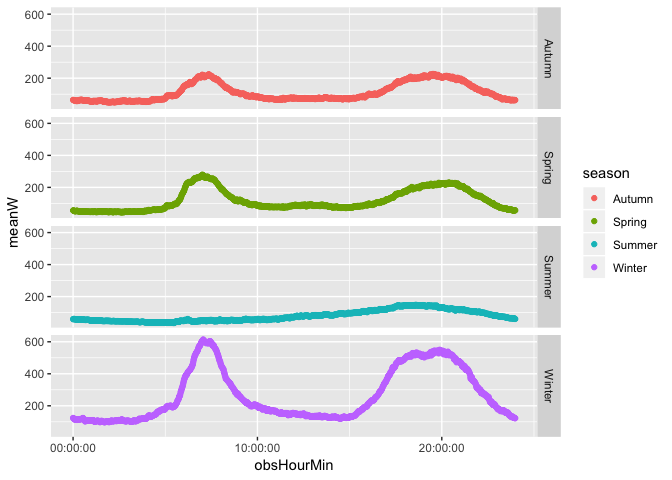
<p class="caption">(\#fig:profilePlot)Heat pump profiles</p>
</div>


#Scaling
##Scaling method 1

Now draw a plot of what woud happen if we scaled this up to all NZ households?

Figure \@ref(fig:scaledUpPlots)


```r
nzHH <- 1549890

heatPumpProfileDT <- heatPumpProfileDT[, scaledMWmethod1 := (meanW * nzHH)/10^6]

myPlot <- ggplot2::ggplot(heatPumpProfileDT, aes(x = obsHourMin, colour = season)) +
  geom_point(aes(y = scaledMWmethod1)) +
  facet_grid(season ~ .)

myPlot
```

<div class="figure">
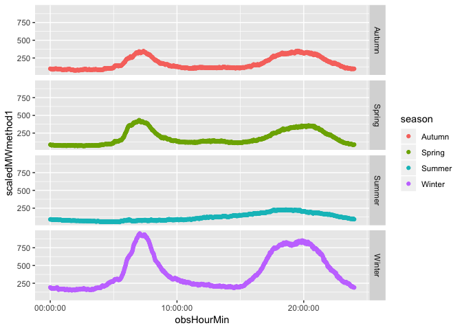
<p class="caption">(\#fig:scaledUpPlots)Mean Load Heat Pumps by Season</p>
</div>

##Scaling method 2

Alternative calculation method: Assuming EECA data is correct for heat pump value, 1) generating the percentage of total load (peroftotal) while telling data.table to create a new column with the calculation of the percentage. We then multiplied EECA's total GWh with the percentage


```r
totalGWH<-708

summeanW<-heatPumpProfileDT[,sum(meanW)]


heatPumpProfileDT <- heatPumpProfileDT[, EECApmMethod2 := (meanW / summeanW) * totalGWH] 

myPlot <- ggplot2::ggplot(heatPumpProfileDT, aes(x = obsHourMin, colour = season)) +
  geom_point(aes(y = EECApmMethod2)) +
  facet_grid(season ~ .) +
  labs(x='Time of Day', y='GWh')

myPlot
```

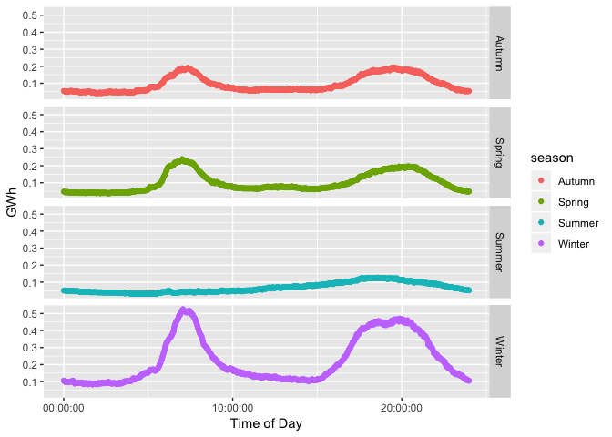<!-- -->

#Aggregation to half-hours

So far we have used data at the 1 minute level. This makes for difficulties in comparison with standared electricity sector half-hourly tariff periods etc. This section takes each scaling method, aggregates to half-hours as appropriate and re-plots.

To do that we need to set a half-hour value from the observed time. We do this using truncate so that:

 * 13:18:00 -> 13:00:00
 * 13:40:00 -> 13:30 etc

> NB: This means any plots will be using the 1/2 hour value at the  _start_  of the period!


```r
# create a 'half hour' variable for aggregation
heatPumpProfileDT <- heatPumpProfileDT[, obsHalfHour := hms::trunc_hms(obsHourMin, 1800)] # <- this truncates the time to the previous half hour (hms works in seconds so 30 mins * 60 secs = 1800 secs). e.g. 13:18:00 -> 13:00:00 but 13:40:00 -> 13:30 etc

# This means any plots will be using the 1/2 hour value at the  -> start <-  of the period!

# check
head(heatPumpProfileDT)
```

```
##    obsHourMin season     meanW scaledMWmethod1 EECApmMethod2 obsHalfHour
## 1:   00:00:00 Autumn  64.40783        99.82505    0.05515844    00:00:00
## 2:   00:00:00 Spring  55.96022        86.73218    0.04792396    00:00:00
## 3:   00:00:00 Summer  59.26967        91.86146    0.05075815    00:00:00
## 4:   00:00:00 Winter 124.01313       192.20670    0.10620402    00:00:00
## 5:   00:01:00 Autumn  63.29641        98.10247    0.05420663    00:00:00
## 6:   00:01:00 Spring  55.18319        85.52787    0.04725852    00:00:00
```

## Method 1


```r
# aggregate the scaled MW to half hours
# as it is MW we need to take the mean - taking the sum would not be meaningful
method1AggDT <- heatPumpProfileDT[, .(meanMW = mean(scaledMWmethod1)), 
                                  keyby = .(season, obsHalfHour)] # <- takes the mean for each category of half hour & season

#Change the order in facet_grid()
method1AggDT$season <- factor(method1AggDT$season, levels = c("Spring","Summer",
                                                    "Autumn", "Winter"))

myPlot <- ggplot2::ggplot(method1AggDT, aes(x = obsHalfHour, colour = season)) +
  geom_point(aes(y = meanMW)) +
  facet_grid(season ~ .) +
  theme(text = element_text(family = "Cambria")) +
  labs(x='Time of Day', y='Mean MW') +
  scale_x_time(breaks = c(hms::as.hms("00:00:00"), hms::as.hms("04:00:00"), hms::as.hms("08:00:00"),       hms::as.hms("12:00:00"), hms::as.hms("16:00:00"), 
  hms::as.hms("20:00:00"))) 

myPlot
```

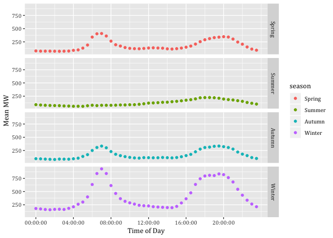<!-- -->


## Method 2
Used the EECA total NZ number for heat pump energy consumption and converted it into GWh. Converted minute data into half-hour steps. 
To do :-)

> NB: should you aggregate this scaling method using mean or sum? Why? :-) -->Since we take the percentages of GWh we need to sum up


```r
# aggregate the percentage of GWh
method2AggDT <- heatPumpProfileDT[, .(GWh = sum(EECApmMethod2)), 
                                  keyby = .(season, obsHalfHour)] # <- takes the sum for each category of half hour & season

#Change the order in facet_grid()
method2AggDT$season <- factor(method2AggDT$season, levels = c("Spring","Summer",
                                                    "Autumn", "Winter"))

myPlot <- ggplot2::ggplot(method2AggDT, aes(x = obsHalfHour, colour=GWh)) +
  geom_point(aes(y = GWh)) +
  ggtitle("Total New Zealand half hour heat pump energy consumption by season for 2015") +
  facet_grid(season ~ .) +
  labs(x='Time of Day', y='GWh') +
  theme(text = element_text(family = "Cambria")) +
  scale_x_time(breaks = c(hms::as.hms("00:00:00"), hms::as.hms("04:00:00"), hms::as.hms("08:00:00"),       hms::as.hms("12:00:00"), hms::as.hms("16:00:00"), 
  hms::as.hms("20:00:00"))) +
scale_colour_gradient(low= "green", high="red")

myPlot
```

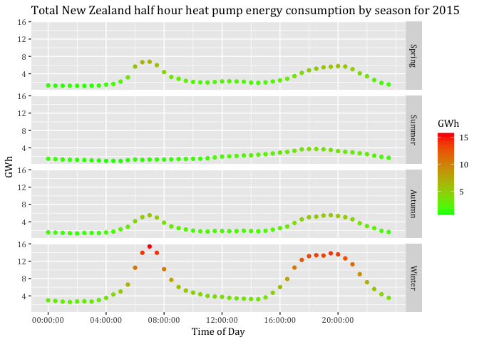<!-- -->

#BRANZ vs. EECA comparison

```r
nzHHheatPumps <- 515015 #This is based on the BRANZ report of household ownership (House condition survey 2015) and 2013 census data
wToKw <- 1000
assumeDaysPerSeason <- 90

heatPumpProfileDT <- heatPumpProfileDT[, scaledGWh := (((meanW * nzHHheatPumps)/wToKw)*(1/60)*assumeDaysPerSeason)/1000/1000] # <- convert mean W to kWh for all NZ hhs, then assumes 90 days per season and calculate GWh

sumbranzGWh <- heatPumpProfileDT[, sum(scaledGWh)]


diffbranzeeca <- 1-(sumbranzGWh/totalGWH)
skimr::skim(sumbranzGWh)
```

```
## 
## Skim summary statistics
## 
## ── Variable type:numeric ──────────────────────────────────────────────────────────────────────────────────────────────
##     variable missing complete n   mean sd     p0    p25    p50    p75
##  sumbranzGWh       0        1 1 638.66 NA 638.66 638.66 638.66 638.66
##    p100     hist
##  638.66 ▁▁▁▇▁▁▁▁
```

```r
skimr::skim(totalGWH)
```

```
## 
## Skim summary statistics
## 
## ── Variable type:numeric ──────────────────────────────────────────────────────────────────────────────────────────────
##  variable missing complete n mean sd  p0 p25 p50 p75 p100     hist
##  totalGWH       0        1 1  708 NA 708 708 708 708  708 ▁▁▁▇▁▁▁▁
```

```r
skimr::skim(diffbranzeeca)
```

```
## 
## Skim summary statistics
## 
## ── Variable type:numeric ──────────────────────────────────────────────────────────────────────────────────────────────
##       variable missing complete n  mean sd    p0   p25   p50   p75  p100
##  diffbranzeeca       0        1 1 0.098 NA 0.098 0.098 0.098 0.098 0.098
##      hist
##  ▁▁▁▇▁▁▁▁
```
Wee identify that BRANZ in comination with GREENGrid Grid Spy and 2013 household ownership census data represent a 9% lower total energy consumption for heat pumps than EECA calculates.

EECA total energy consumption by heat pumps for 2015 (totalGWH) <- 708GWh

BRANZ 40% of owner-occupied households and 25% of rentals own heat pumps. Energy consumption based on BRANZ proportion, Census 2013 and GREENGris Grid Spy data (sumbranzGWh) <- 638GWh 


#Yearly consumption
We need the original data for this, currently the data basis is for an average day in each season.

```r
heatPumpProfileDT <- heatPumpProfileDT[, obsHalfHour := hms::trunc_hms(obsHourMin, 1800)]
```

# Technical potential of demand response: Scenarios for heat pump data
We assume that peak time periods are prevalent from 6.00am-10.00am and from 4.00pm-8.00pm.

## Load curtailment to zero: SC1
In this first scenario we assume that the laod during peak time periods is cut out of the consumption pattern.

###Defining peak/off-peak periods 
Steps:
1) Extracting peak time-periods from heat pump data
2) Building sum of GWh


```r
MPS <- hms::as.hms("06:00:00")
MPE <- hms::as.hms("10:00:00")

EPS <- hms::as.hms("17:00:00")
EPE <- hms::as.hms("21:00:00")

OP1S <- hms::as.hms("21:30:00")
OP1E <- hms::as.hms("23:30:00")

OP12S <- hms::as.hms("00:00:00")
OP12E <- hms::as.hms("05:30:00")

OP2S <- hms::as.hms("10:30:00")
OP2E <- hms::as.hms("16:30:00")


sc1data <- heatPumpProfileDT
sc1data[, c("medianW", "obsHourMin", "meanW", "nObs", "sdW",
            "scaledMWmethod1", "EECApmMethod2"):=NULL] #Deleting unnecessary columns
```

```
## Warning in `[.data.table`(sc1data, , `:=`(c("medianW", "obsHourMin",
## "meanW", : Adding new column 'medianW' then assigning NULL (deleting it).
```

```
## Warning in `[.data.table`(sc1data, , `:=`(c("medianW", "obsHourMin",
## "meanW", : Adding new column 'nObs' then assigning NULL (deleting it).
```

```
## Warning in `[.data.table`(sc1data, , `:=`(c("medianW", "obsHourMin",
## "meanW", : Adding new column 'sdW' then assigning NULL (deleting it).
```

```r
sc1data <- sc1data[, .(GWh = sum(scaledGWh)), 
                    keyby = .(season, obsHalfHour)]


sc1data <- sc1data[, Period := "Not Peak"]

sc1data <- sc1data[obsHalfHour >= MPS & 
                     obsHalfHour <= MPE,
                   Period := "Morning Peak"]

sc1data <- sc1data[obsHalfHour >= EPS & 
                     obsHalfHour <= EPE,
                   Period := "Evening Peak"]

sc1data <- sc1data[obsHalfHour >= OP1S & 
                     obsHalfHour <= OP1E,
                   Period := "Off Peak 1"]

sc1data <- sc1data[obsHalfHour >= OP12S & 
                     obsHalfHour <= OP12E,
                   Period := "Off Peak 1"]

sc1data <- sc1data[obsHalfHour >= OP2S & 
                     obsHalfHour <= OP2E,
                   Period := "Off Peak 2"]
```


### Visualising periods

```r
#Change the order in facet_grid()
sc1data$season <- factor(sc1data$season, levels = c("Spring","Summer",
                                                    "Autumn", "Winter"))

myPlot <- ggplot2::ggplot(sc1data, aes(x = obsHalfHour, color=Period)) +
  geom_point(aes(y=GWh), size=1, alpha = 1) +
  theme(text = element_text(family = "Cambria")) +
  ggtitle("Total heat pump energy consumption per day by time-period") +
  facet_grid(season ~ .) +
  labs(x='Time of Day', y='GWh') +
  scale_color_discrete(breaks=c("Off Peak 1", "Morning Peak", "Off Peak 2",
                                "Evening Peak")) +
  scale_color_discrete(breaks=c("Off Peak 1", "Morning Peak", "Off Peak 2",
                                "Evening Peak"))+
  scale_x_time(breaks = c(hms::as.hms("00:00:00"), hms::as.hms("04:00:00"), hms::as.hms("08:00:00"),       hms::as.hms("12:00:00"), hms::as.hms("16:00:00"), 
  hms::as.hms("20:00:00"))) 
```

```
## Scale for 'colour' is already present. Adding another scale for
## 'colour', which will replace the existing scale.
```

```r
  #scale_colour_gradient(low= "green", high="red", guide = "colorbar")

myPlot
```

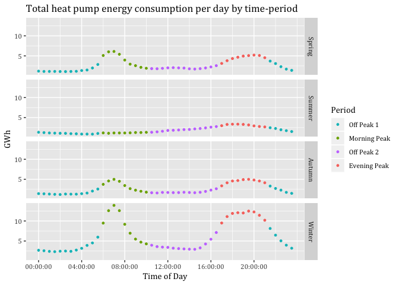<!-- -->

```r
#ggsave("Total heat pump energy consumption by time-period for 2015.jpeg",
#       dpi=600)
```

### Potential load curtailment output by period in GWh


```r
sc1data <- sc1data[, .(PotCur = sum(GWh)),
                   keyby = .(season, Period)]
sc1data
```

```
##     season       Period    PotCur
##  1: Spring Evening Peak  40.78758
##  2: Spring Morning Peak  36.10921
##  3: Spring   Off Peak 1  28.78128
##  4: Spring   Off Peak 2  25.61482
##  5: Summer Evening Peak  27.80357
##  6: Summer Morning Peak  10.80551
##  7: Summer   Off Peak 1  22.60697
##  8: Summer   Off Peak 2  26.18007
##  9: Autumn Evening Peak  40.23145
## 10: Autumn Morning Peak  30.00890
## 11: Autumn   Off Peak 1  29.61507
## 12: Autumn   Off Peak 2  23.81100
## 13: Winter Evening Peak 102.90678
## 14: Winter Morning Peak  79.14425
## 15: Winter   Off Peak 1  64.48189
## 16: Winter   Off Peak 2  49.77366
```

### Visualising curtailed periods


```r
sc1data <- heatPumpProfileDT
sc1data[, c("medianW", "obsHourMin", "meanW", "nObs", "sdW",
            "scaledMWmethod1", "EECApmMethod2"):=NULL] #Deleting unnecessary columns
```

```
## Warning in `[.data.table`(sc1data, , `:=`(c("medianW", "obsHourMin",
## "meanW", : Adding new column 'medianW' then assigning NULL (deleting it).
```

```
## Warning in `[.data.table`(sc1data, , `:=`(c("medianW", "obsHourMin",
## "meanW", : Adding new column 'obsHourMin' then assigning NULL (deleting
## it).
```

```
## Warning in `[.data.table`(sc1data, , `:=`(c("medianW", "obsHourMin",
## "meanW", : Adding new column 'meanW' then assigning NULL (deleting it).
```

```
## Warning in `[.data.table`(sc1data, , `:=`(c("medianW", "obsHourMin",
## "meanW", : Adding new column 'nObs' then assigning NULL (deleting it).
```

```
## Warning in `[.data.table`(sc1data, , `:=`(c("medianW", "obsHourMin",
## "meanW", : Adding new column 'sdW' then assigning NULL (deleting it).
```

```
## Warning in `[.data.table`(sc1data, , `:=`(c("medianW", "obsHourMin",
## "meanW", : Adding new column 'scaledMWmethod1' then assigning NULL
## (deleting it).
```

```
## Warning in `[.data.table`(sc1data, , `:=`(c("medianW", "obsHourMin",
## "meanW", : Adding new column 'EECApmMethod2' then assigning NULL (deleting
## it).
```

```r
sc1data <- sc1data[, .(GWhs1 = sum(scaledGWh)), 
                    keyby = .(season, obsHalfHour)]

sc1data <- sc1data[, Period := "Not Peak"]

sc1data <- sc1data[obsHalfHour >= MPS & 
                     obsHalfHour <= MPE,
                   Period := "Morning Peak"]

sc1data <- sc1data[obsHalfHour >= EPS & 
                     obsHalfHour <= EPE,
                   Period := "Evening Peak"]

sc1data <- sc1data[obsHalfHour >= OP1S & 
                     obsHalfHour <= OP1E,
                   Period := "Off Peak 1"]

sc1data <- sc1data[obsHalfHour >= OP12S & 
                     obsHalfHour <= OP12E,
                   Period := "Off Peak 1"]

sc1data <- sc1data[obsHalfHour >= OP2S & 
                     obsHalfHour <= OP2E,
                   Period := "Off Peak 2"]

sc1data <- sc1data[, GWh:=GWhs1] # Creating new column GWh based on GWhs1


#sc1data <- sc1data[Period == "Evening Peak",
                   #GWh := 0]

sc1data <- sc1data[, GWh:= ifelse(Period == "Evening Peak", 0, GWh )] # If Period is Evening peak then make GWh zero
                   
sc1data <- sc1data[, GWh:= ifelse(Period == "Morning Peak", 0, GWh )]


#Change the order in facet_grid()
sc1data$season <- factor(sc1data$season, levels = c("Spring","Summer",
                                                    "Autumn", "Winter"))
#setnames(sc1data, old=c("GWh"), new=c("MWh"))

myPlot <- ggplot2::ggplot(sc1data, aes(x = obsHalfHour, y = GWh, color=GWh)) +
  geom_line(size=1) +
  theme(text = element_text(family = "Cambria")) +
  ggtitle("Total heat pump load curtailment in peak time-periods by season") +
  facet_grid(season ~ .) +
  labs(x='Time of Day', y='GWh') +
  #scale_y_continuous(breaks = c(3, 6, 9, 12)) +
  scale_x_time(breaks = c(hms::as.hms("00:00:00"), hms::as.hms("04:00:00"), hms::as.hms("08:00:00"),       hms::as.hms("12:00:00"), hms::as.hms("16:00:00"), 
  hms::as.hms("20:00:00"))) +
  scale_colour_gradient(low= "green", high="red", guide = "colorbar")

myPlot
```

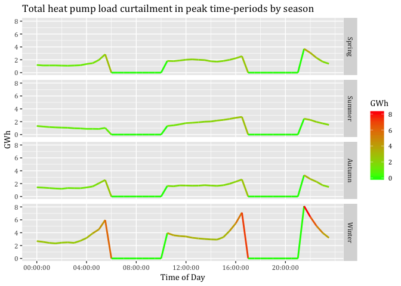<!-- -->

```r
#ggsave("Total heat pump load curtailment in peak time-periods by season.jpeg",
     # dpi=600) 
```
##Load curtailment of particular amount: SC2
###Visualising new load profile

```r
sc1data <- heatPumpProfileDT
sc1data[, c("medianW", "obsHourMin", "meanW", "nObs", "sdW",
            "scaledMWmethod1", "EECApmMethod2"):=NULL] #Deleting unnecessary columns
```

```
## Warning in `[.data.table`(sc1data, , `:=`(c("medianW", "obsHourMin",
## "meanW", : Adding new column 'medianW' then assigning NULL (deleting it).
```

```
## Warning in `[.data.table`(sc1data, , `:=`(c("medianW", "obsHourMin",
## "meanW", : Adding new column 'obsHourMin' then assigning NULL (deleting
## it).
```

```
## Warning in `[.data.table`(sc1data, , `:=`(c("medianW", "obsHourMin",
## "meanW", : Adding new column 'meanW' then assigning NULL (deleting it).
```

```
## Warning in `[.data.table`(sc1data, , `:=`(c("medianW", "obsHourMin",
## "meanW", : Adding new column 'nObs' then assigning NULL (deleting it).
```

```
## Warning in `[.data.table`(sc1data, , `:=`(c("medianW", "obsHourMin",
## "meanW", : Adding new column 'sdW' then assigning NULL (deleting it).
```

```
## Warning in `[.data.table`(sc1data, , `:=`(c("medianW", "obsHourMin",
## "meanW", : Adding new column 'scaledMWmethod1' then assigning NULL
## (deleting it).
```

```
## Warning in `[.data.table`(sc1data, , `:=`(c("medianW", "obsHourMin",
## "meanW", : Adding new column 'EECApmMethod2' then assigning NULL (deleting
## it).
```

```r
sc1data <- sc1data[, .(GWhs1 = sum(scaledGWh)), 
                    keyby = .(season, obsHalfHour)]

sc1data <- sc1data[, Period := "Not Peak"]

sc1data <- sc1data[obsHalfHour >= MPS & 
                     obsHalfHour <= MPE,
                   Period := "Morning Peak"]

sc1data <- sc1data[obsHalfHour >= EPS & 
                     obsHalfHour <= EPE,
                   Period := "Evening Peak"]

sc1data <- sc1data[obsHalfHour >= OP1S & 
                     obsHalfHour <= OP1E,
                   Period := "Off Peak 1"]

sc1data <- sc1data[obsHalfHour >= OP12S & 
                     obsHalfHour <= OP12E,
                   Period := "Off Peak 1"]

sc1data <- sc1data[obsHalfHour >= OP2S & 
                     obsHalfHour <= OP2E,
                   Period := "Off Peak 2"]

sc1data <- sc1data[, GWh:=GWhs1] # Creating new column GWh based on GWhs1

sc1data <- sc1data[, GWh:= ifelse(Period == "Evening Peak", 0.5*GWh, GWh )] # If Period is Evening peak then change the value of GWh by 50%
                   
sc1data <- sc1data[, GWh:= ifelse(Period == "Morning Peak", GWh*0.5, GWh )]


#Change the order in facet_grid()
sc1data$season <- factor(sc1data$season, levels = c("Spring","Summer",
                                                    "Autumn", "Winter"))
#setnames(sc1data, old=c("GWh"), new=c("MWh"))

myPlot <- ggplot2::ggplot(sc1data, aes(x = obsHalfHour, y = GWh, color=GWh)) +
  geom_line(size=1) +
  theme(text = element_text(family = "Cambria")) +
  ggtitle("Total heat pump load per curtailment in peak time-periods by season 50%") +
  facet_grid(season ~ .) +
  labs(x='Time of Day', y='GWh') +
  scale_y_continuous(breaks = c(3, 6, 9, 12)) +
  scale_x_time(breaks = c(hms::as.hms("00:00:00"), hms::as.hms("04:00:00"), hms::as.hms("08:00:00"),       hms::as.hms("12:00:00"), hms::as.hms("16:00:00"), 
  hms::as.hms("20:00:00"))) +
  scale_colour_gradient(low= "green", high="red", guide = "colorbar")

myPlot
```

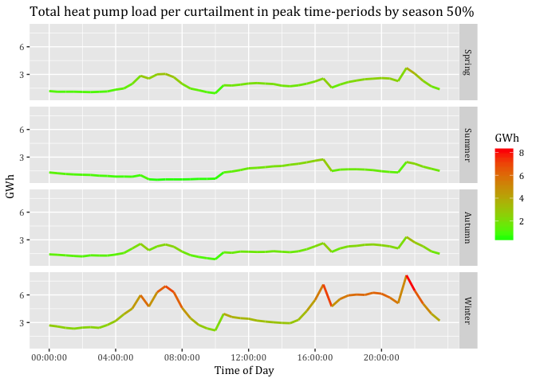<!-- -->

```r
#ggsave("Total heat pump 0.5 load curtailment in peak time-periods by season.jpeg",
    #  dpi=600) 
```
###Potential load curtailment based on percentage curtailed

```r
sc1data <- sc1data[, .(PotCur = sum(GWh)),
                   keyby = .(season, Period)]
sc1data
```

```
##     season       Period    PotCur
##  1: Spring Evening Peak 20.393788
##  2: Spring Morning Peak 18.054604
##  3: Spring   Off Peak 1 28.781280
##  4: Spring   Off Peak 2 25.614817
##  5: Summer Evening Peak 13.901786
##  6: Summer Morning Peak  5.402753
##  7: Summer   Off Peak 1 22.606967
##  8: Summer   Off Peak 2 26.180072
##  9: Autumn Evening Peak 20.115726
## 10: Autumn Morning Peak 15.004450
## 11: Autumn   Off Peak 1 29.615072
## 12: Autumn   Off Peak 2 23.811002
## 13: Winter Evening Peak 51.453388
## 14: Winter Morning Peak 39.572127
## 15: Winter   Off Peak 1 64.481887
## 16: Winter   Off Peak 2 49.773665
```
##Load shifting to prior periods: SC3


```r
sc1data <- heatPumpProfileDT
sc1data[, c("medianW", "obsHourMin", "meanW", "nObs", "sdW",
            "scaledMWmethod1", "EECApmMethod2"):=NULL] #Deleting unnecessary columns
```

```
## Warning in `[.data.table`(sc1data, , `:=`(c("medianW", "obsHourMin",
## "meanW", : Adding new column 'medianW' then assigning NULL (deleting it).
```

```
## Warning in `[.data.table`(sc1data, , `:=`(c("medianW", "obsHourMin",
## "meanW", : Adding new column 'obsHourMin' then assigning NULL (deleting
## it).
```

```
## Warning in `[.data.table`(sc1data, , `:=`(c("medianW", "obsHourMin",
## "meanW", : Adding new column 'meanW' then assigning NULL (deleting it).
```

```
## Warning in `[.data.table`(sc1data, , `:=`(c("medianW", "obsHourMin",
## "meanW", : Adding new column 'nObs' then assigning NULL (deleting it).
```

```
## Warning in `[.data.table`(sc1data, , `:=`(c("medianW", "obsHourMin",
## "meanW", : Adding new column 'sdW' then assigning NULL (deleting it).
```

```
## Warning in `[.data.table`(sc1data, , `:=`(c("medianW", "obsHourMin",
## "meanW", : Adding new column 'scaledMWmethod1' then assigning NULL
## (deleting it).
```

```
## Warning in `[.data.table`(sc1data, , `:=`(c("medianW", "obsHourMin",
## "meanW", : Adding new column 'EECApmMethod2' then assigning NULL (deleting
## it).
```

```r
sc1data <- sc1data[, .(GWhs1 = sum(scaledGWh)), 
                    keyby = .(season, obsHalfHour)]


#Defining peak and off-peak periods
sc1data <- sc1data[, Period := "Not Peak"]

sc1data <- sc1data[obsHalfHour >= MPS & 
                     obsHalfHour <= MPE,
                   Period := "Morning Peak"]

sc1data <- sc1data[obsHalfHour >= EPS & 
                     obsHalfHour <= EPE,
                   Period := "Evening Peak"]

sc1data <- sc1data[obsHalfHour >= OP1S & 
                     obsHalfHour <= OP1E,
                   Period := "Off Peak 1"]

sc1data <- sc1data[obsHalfHour >= OP12S & 
                     obsHalfHour <= OP12E,
                   Period := "Off Peak 1"]

sc1data <- sc1data[obsHalfHour >= OP2S & 
                     obsHalfHour <= OP2E,
                   Period := "Off Peak 2"]

#Building the sum of each peak period by season
AuMP <- sc1data[season == "Autumn" & Period == "Morning Peak",
                sum(GWhs1)]
WiMP <- sc1data[season == "Winter" & Period == "Morning Peak",
                sum(GWhs1)]
SpMP <- sc1data[season == "Spring" & Period == "Morning Peak",
                sum(GWhs1)]
SuMP <- sc1data[season == "Summer" & Period == "Morning Peak",
                sum(GWhs1)]

AuEP <- sc1data[season == "Autumn" & Period == "Evening Peak",
                sum(GWhs1)]
WiEP <- sc1data[season == "Winter" & Period == "Evening Peak",
                sum(GWhs1)]
SpEP <- sc1data[season == "Spring" & Period == "Evening Peak",
                sum(GWhs1)]
SuEP <- sc1data[season == "Summer" & Period == "Evening Peak",
                sum(GWhs1)]


#Counting number of rows that will be associated to spread the Morning Peak
AuMPHalfHours <- nrow(sc1data[season == "Autumn" &
                              Period == "Off Peak 1"])
WiMPHalfHours <- nrow(sc1data[season == "Winter" &
                              Period == "Off Peak 1"])
SpMPHalfHours <- nrow(sc1data[season == "Spring" &
                              Period == "Off Peak 1"])
SuMPHalfHours <- nrow(sc1data[season == "Summer" &
                              Period == "Off Peak 1"])

#Counting number of rows that will be associated to spread the Evening Peak
AuEPHalfHours <- nrow(sc1data[season == "Autumn" &
                              Period == "Off Peak 2"])
WiEPHalfHours <- nrow(sc1data[season == "Winter" &
                              Period == "Off Peak 2"])
SpEPHalfHours <- nrow(sc1data[season == "Spring" &
                              Period == "Off Peak 2"])
SuEPHalfHours <- nrow(sc1data[season == "Summer" &
                              Period == "Off Peak 2"])

#Calculating the proportion that each row will take on to spread the GWhs
distGWhOP1Au <- AuMP/AuMPHalfHours
distGWhOP1Wi <- WiMP/WiMPHalfHours
distGWhOP1Sp <- SpMP/SpMPHalfHours
distGWhOP1Su <- SuMP/SuMPHalfHours

distGWhOP2Au <- AuEP/AuEPHalfHours
distGWhOP2Wi <- WiEP/WiEPHalfHours
distGWhOP2Sp <- SpEP/SpEPHalfHours
distGWhOP2Su <- SuEP/SuEPHalfHours


#Adding amount of spreaded peak consumption to off-peak periods
sc1data <- sc1data[season == "Autumn" &
                     Period == "Off Peak 1", GWhs3 :=
                     GWhs1 + distGWhOP1Au]
sc1data <- sc1data[season == "Winter" &
                     Period == "Off Peak 1", GWhs3 :=
                     GWhs1 + distGWhOP1Wi]
sc1data <- sc1data[season == "Spring" &
                     Period == "Off Peak 1", GWhs3 :=
                     GWhs1 + distGWhOP1Sp]
sc1data <- sc1data[season == "Summer" &
                     Period == "Off Peak 1", GWhs3 :=
                     GWhs1 + distGWhOP1Su]


sc1data <- sc1data[season == "Autumn" &
                     Period == "Off Peak 2", GWhs3 :=
                     GWhs1 + distGWhOP2Au]
sc1data <- sc1data[season == "Winter" &
                     Period == "Off Peak 2", GWhs3 :=
                     GWhs1 + distGWhOP2Wi]
sc1data <- sc1data[season == "Spring" &
                     Period == "Off Peak 2", GWhs3 :=
                     GWhs1 + distGWhOP2Sp]
sc1data <- sc1data[season == "Summer" &
                     Period == "Off Peak 2", GWhs3 :=
                     GWhs1 + distGWhOP2Su]


#Setting missing values in peak periods to NULL
sc1data <- sc1data[, GWhs3:= ifelse(Period =="Morning Peak",
                                  0, GWhs3)]
sc1data <- sc1data[, GWhs3:= ifelse(Period =="Evening Peak",
                                  0, GWhs3)]


#Renaming GWhs3 into GWh to depict the right text in the colorbar
setnames(sc1data, old=c("GWhs3"), new=c("GWh"))

#Visualising only shifted consumption
#myPlot <- ggplot2::ggplot(sc1data, aes(x = obsHalfHour, color=GWh)) +
  #geom_line(aes(y=GWh), size=0.5) +
  #theme(text = element_text(family = "Cambria")) +
  #ggtitle("Total shifted New Zealand half hour heat pump energy consumption by season for 2015") +
  #facet_grid(season ~ .) +
  #labs(x='Time of Day', y='GWh') +
  #scale_y_continuous(breaks = c(4, 8, 12, 16)) +
  #scale_x_time(breaks = c(hms::as.hms("00:00:00"), hms::as.hms("03:00:00"), hms::as.hms("06:00:00"),       hms::as.hms("09:00:00"), hms::as.hms("12:00:00"), 
  #hms::as.hms("15:00:00"), hms::as.hms("18:00:00"), hms::as.hms("21:00:00"))) +
  #scale_colour_gradient(low= "green", high="red", guide = "colorbar")

#myPlot

#myPlot <- ggplot2::ggplot(sc1data, aes(x = obsHalfHour)) +
 # geom_line(aes(y=GWh, color=GWh), size=0.5) +
  #geom_line(aes(y=GWhs1, color=GWhs1), size=0.5) +
 # theme(text = element_text(family = "Cambria")) +
 # ggtitle("Original and shifted New Zealand half hour heat pump energy consumption by season for 2015") +
 # facet_grid(season ~ .) +
 # labs(x='Time of Day', y='GWh') +
 # scale_y_continuous(breaks = c(4, 8, 12, 16)) +
 # scale_x_time(breaks = c(hms::as.hms("00:00:00"), hms::as.hms("03:00:00"), hms::as.hms("06:00:00"),       hms::as.hms("09:00:00"), hms::as.hms("12:00:00"), 
 # hms::as.hms("15:00:00"), hms::as.hms("18:00:00"), hms::as.hms("21:00:00"))) +
 # scale_color_gradient(low= "green", high="red")

#myPlot

#Change the order in facet_grid()
sc1data$season <- factor(sc1data$season, levels = c("Spring","Summer",
                                                    "Autumn", "Winter"))

#Visualising shifted and original consumption with labels in different colours
myPlot <- ggplot2::ggplot(sc1data, aes(x = obsHalfHour)) +
  geom_line(aes(y=GWh, color="red"), size=0.5) +
  geom_line(aes(y=GWhs1, color="blue"), size=0.5) +
  theme(text = element_text(family = "Cambria")) +
  ggtitle("Original and shifted New Zealand per day half hour heat pump energy consumption by season for 2015") +
  scale_colour_manual(name = element_blank(), 
         values =c('red'='red','blue'='blue'), labels = c('Original consumption',
                  'Shifted consumption')) +
  facet_grid(season ~ .) +
  labs(x='Time of Day', y='GWh') +
# scale_y_continuous(breaks = c(4, 8, 12, 16)) +
 scale_x_time(breaks = c(hms::as.hms("00:00:00"), hms::as.hms("04:00:00"), hms::as.hms("08:00:00"),       hms::as.hms("12:00:00"), hms::as.hms("16:00:00"), 
  hms::as.hms("20:00:00")))  
  #scale_color_gradient(low= "green", high="red")

myPlot
```

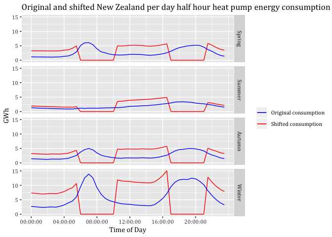<!-- -->

```r
#ggsave("Original and shifted New Zealand half hour heat pump energy consumption by season for 2015.jpeg",
     #  dpi=600)
```
#Technical potential of demand response: Scenarios for hot water data

## Loading data

This file is the pre-aggregated data for all hot water  circuits in the GREEN Grid data for April 2015 - March 2016 (check!)


```r
#ggParams$profilesFile <- paste0(ggParams$dataLoc, "Hot #Water_2015-04-01_2016-03-31_overallSeasonalProfiles.csv.gz")
```

In this section we load and describe the  data files from .


```r
#print(paste0("Trying to load: ", ggParams$profilesFile))
#hotWaterProfileDT <- data.table::as.data.table(readr::read_csv(ggParams$profilesFile))

HotwaterHCS <- data.table::as.data.table(
 readr::read_csv("/Volumes/hum-csafe/Research Projects/GREEN Grid/cleanData/safe/gridSpy/1min/dataExtracts/Hot Water_2015-04-01_2016-03-31_observations.csv.gz",
                       col_types = cols(
                       hhID = col_character(),
                       linkID = col_character(),
                       r_dateTime = col_datetime(format = ""),
                       circuit = col_character(),
                       powerW = col_double() # <- crucial otherwise readr infers integers for some reason
                     )
                 )
)

HotwaterObsDT <- data.table::as.data.table(HotwaterHCS)

HotwaterObsDT <- HotwaterObsDT[, year := lubridate::year(r_dateTime)]
HotwaterObsDT <- HotwaterObsDT[, obsHourMin := hms::as.hms(r_dateTime)]
HotwaterObsDT <- HotwaterObsDT[, month := lubridate::month(r_dateTime)]

HotwaterObsDT <- HotwaterObsDT[month >= 12 | month == 1 | month == 2, season := "Summer"]
HotwaterObsDT <- HotwaterObsDT[month >= 3 | month == 4 | month == 5, season := "Autumn"]
HotwaterObsDT <- HotwaterObsDT[month == 6 | month == 7 | month == 8, season := "Winter"]
HotwaterObsDT <- HotwaterObsDT[month == 9 | month == 10 | month == 11, season := "Spring"]

#Building daily average per season

hotWaterProfileDT <- HotwaterObsDT[, .(meanW = mean(powerW)), keyby = .(obsHourMin, season)]
```

##BRANZ vs. EECA comparison

```r
totalGWH <- 12727.99 * 0.2777777778 #Converting TJ (EECA 2015) into GWh
nzHH <- 1549890 #Based on Census 2013
nzHHhotWater <- nzHH * 0.88 #This is based on the BRANZ report HOT WATER OVER TIME– THE NEW ZEALAND EXPERIENCE (2008) No. 132; 88% of Hot Water Systems were electric in 2008

wToKw <- 1000
assumeDaysPerSeason <- 90

hotWaterProfileDT <- hotWaterProfileDT[, scaledGWh := (((meanW * nzHHhotWater)/wToKw)*(1/60)*assumeDaysPerSeason)/1000/1000] # <- convert mean W to kWh for all NZ hhs, then assumes 90 days per season and calculate GWh

sumbranzGWh <- hotWaterProfileDT[, sum(scaledGWh)]


diffbranzeeca <- 1-(sumbranzGWh/totalGWH)
```
I have used the 2015 EECA data because our load profiles data from the year 2015 as well. This given we identify that EECA assumes 3,535 GWh whereas the combination of BRANZ and Census 2013 calculates an amount of 3,313 GWh. EECA estimates therefore a 6% higher energy consumption of hot water systems in New Zealand using electricity fuel. In the following the BRANZ calculation will be used.

## Aggregation to half-hours and initial plot

So far we have used data at the 1 minute level. This makes for difficulties in comparison with standared electricity sector half-hourly tariff periods etc. This section takes each scaling method, aggregates to half-hours as appropriate and re-plots.

To do that we need to set a half-hour value from the observed time. We do this using truncate so that:

 * 13:18:00 -> 13:00:00
 * 13:40:00 -> 13:30 etc

> NB: This means any plots will be using the 1/2 hour value at the  _start_  of the period!


```r
# create a 'half hour' variable for aggregation
hotWaterProfileDT <- hotWaterProfileDT[, obsHalfHour := hms::trunc_hms(obsHourMin, 1800)] # <- this truncates the time to the previous half hour (hms works in seconds so 30 mins * 60 secs = 1800 secs). e.g. 13:18:00 -> 13:00:00 but 13:40:00 -> 13:30 etc

# This means any plots will be using the 1/2 hour value at the  -> start <-  of the period!

method2AggDT <- hotWaterProfileDT[, .(GWh = sum(scaledGWh)), 
                                  keyby = .(season, obsHalfHour)]#Building sum of half hours by season


# check
head(method2AggDT)
```

```
##    season obsHalfHour      GWh
## 1: Autumn    00:00:00 7.429713
## 2: Autumn    00:30:00 6.780614
## 3: Autumn    01:00:00 6.811152
## 4: Autumn    01:30:00 5.888405
## 5: Autumn    02:00:00 5.910528
## 6: Autumn    02:30:00 5.654303
```

```r
#Change the order in facet_grid()
method2AggDT$season <- factor(method2AggDT$season, levels = c("Spring","Summer",
                                                    "Autumn", "Winter"))


myPlot <- ggplot2::ggplot(method2AggDT, aes(x = obsHalfHour, color=GWh)) +
  geom_line(aes(y=GWh), size=0.5) +
  theme(text = element_text(family = "Cambria")) +
  ggtitle("Total New Zealand half hour hot water energy consumption by season for 2015") +
  facet_grid(season ~ .) +
  labs(x='Time of Day', y='GWh') +
  scale_y_continuous(breaks = c(10, 20, 30, 40)) +
  scale_x_time(breaks = c(hms::as.hms("00:00:00"), hms::as.hms("03:00:00"), hms::as.hms("06:00:00"),       hms::as.hms("09:00:00"), hms::as.hms("12:00:00"), 
  hms::as.hms("15:00:00"), hms::as.hms("18:00:00"), hms::as.hms("21:00:00"))) +
  scale_colour_gradient(low= "green", high="red", guide = "colorbar")

myPlot
```

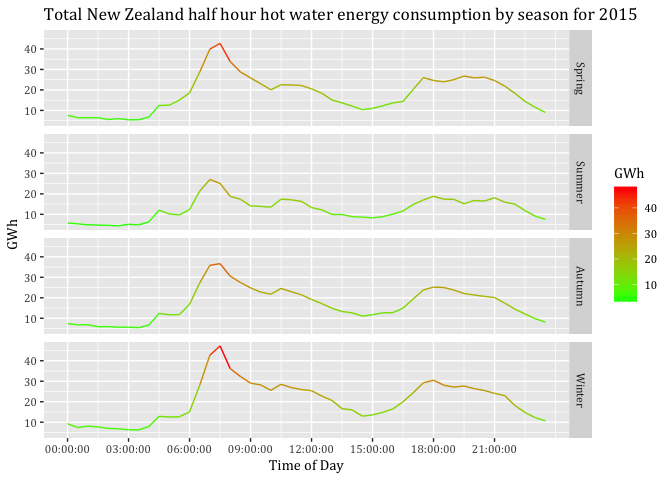<!-- -->

```r
#ggsave("Total New Zealand half hour hot water energy consumption by season for 2015.jpeg",
      # dpi = 600)
```
##Load curtailment to zero SC1


```r
#Defining peak and off-peak

sc2data <- method2AggDT

#sc2data <- sc2data[, .(GWh = sum(scaledGWh)), 
 #                   keyby = .(season, obsHalfHour)]

sc2data <- sc2data[, Period := "Not Peak"]

sc2data <- sc2data[obsHalfHour >= MPS & 
                     obsHalfHour <= MPE,
                   Period := "Morning Peak"]

sc2data <- sc2data[obsHalfHour >= EPS & 
                     obsHalfHour <= EPE,
                   Period := "Evening Peak"]

sc2data <- sc2data[obsHalfHour >= OP1S & 
                     obsHalfHour <= OP1E,
                   Period := "Off Peak 1"]

sc2data <- sc2data[obsHalfHour >= OP12S & 
                     obsHalfHour <= OP12E,
                   Period := "Off Peak 1"]

sc2data <- sc2data[obsHalfHour >= OP2S & 
                     obsHalfHour <= OP2E,
                   Period := "Off Peak 2"]

#Change the order in facet_grid()
sc2data$season <- factor(sc2data$season, levels = c("Spring","Summer",
                                                    "Autumn", "Winter"))
#setnames(sc2data, old=c("GWh"), new=c("MWh"))

#Visualisig peak periods

myPlot <- ggplot2::ggplot(sc2data, aes(x = obsHalfHour, color=Period)) +
  geom_point(aes(y=GWh), size=1, alpha = 1) +
  theme(text = element_text(family = "Cambria")) +
  ggtitle("Total New Zealand hot water energy consumption by time-period") +
  facet_grid(season ~ .) +
  labs(x='Time of Day', y='GWh') +
  scale_color_discrete(breaks=c("Off Peak 1", "Morning Peak", "Off Peak 2",
                                "Evening Peak")) +
  scale_y_continuous(breaks = c(10, 20, 30, 40)) +
  scale_x_time(breaks = c(hms::as.hms("00:00:00"), hms::as.hms("04:00:00"), hms::as.hms("08:00:00"),      hms::as.hms("12:00:00"), hms::as.hms("16:00:00"), 
  hms::as.hms("20:00:00")))  
  #scale_colour_gradient(low= "green", high="red", guide = "colorbar")

myPlot
```

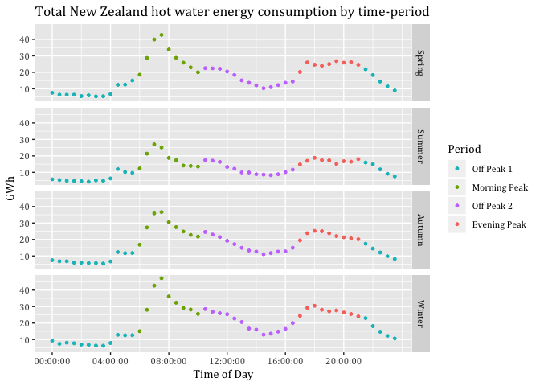<!-- -->

```r
#ggsave("Total New Zealand per day hot water energy consumption by time-period.jpeg",
#       dpi = 600)

#Potential load curtailment by season

sc2data <- sc2data[, .(PotCur = sum(GWh)),
                   keyby = .(season, Period)]
sc2data
```

```
##     season       Period   PotCur
##  1: Spring Evening Peak 223.2705
##  2: Spring Morning Peak 261.4715
##  3: Spring   Off Peak 1 171.1496
##  4: Spring   Off Peak 2 208.4891
##  5: Summer Evening Peak 151.8508
##  6: Summer Morning Peak 163.4540
##  7: Summer   Off Peak 1 137.4521
##  8: Summer   Off Peak 2 152.6129
##  9: Autumn Evening Peak 201.5304
## 10: Autumn Morning Peak 244.0416
## 11: Autumn   Off Peak 1 153.9915
## 12: Autumn   Off Peak 2 209.3414
## 13: Winter Evening Peak 242.9733
## 14: Winter Morning Peak 284.4167
## 15: Winter   Off Peak 1 183.5473
## 16: Winter   Off Peak 2 260.5546
```
###Visualising curtailed periods


```r
sc2data <- hotWaterProfileDT
sc2data[, c("medianW", "obsHourMin", "meanW", "nObs", "sdW",
            "scaledMWmethod1", "EECApmMethod2"):=NULL] #Deleting unnecessary columns
```

```
## Warning in `[.data.table`(sc2data, , `:=`(c("medianW", "obsHourMin",
## "meanW", : Adding new column 'medianW' then assigning NULL (deleting it).
```

```
## Warning in `[.data.table`(sc2data, , `:=`(c("medianW", "obsHourMin",
## "meanW", : Adding new column 'nObs' then assigning NULL (deleting it).
```

```
## Warning in `[.data.table`(sc2data, , `:=`(c("medianW", "obsHourMin",
## "meanW", : Adding new column 'sdW' then assigning NULL (deleting it).
```

```
## Warning in `[.data.table`(sc2data, , `:=`(c("medianW", "obsHourMin",
## "meanW", : Adding new column 'scaledMWmethod1' then assigning NULL
## (deleting it).
```

```
## Warning in `[.data.table`(sc2data, , `:=`(c("medianW", "obsHourMin",
## "meanW", : Adding new column 'EECApmMethod2' then assigning NULL (deleting
## it).
```

```r
sc2data <- sc2data[, .(GWhs2 = sum(scaledGWh)), 
                    keyby = .(season, obsHalfHour)]

sc2data <- sc2data[, Period := "Not Peak"]

sc2data <- sc2data[obsHalfHour >= MPS & 
                     obsHalfHour <= MPE,
                   Period := "Morning Peak"]

sc2data <- sc2data[obsHalfHour >= EPS & 
                     obsHalfHour <= EPE,
                   Period := "Evening Peak"]

sc2data <- sc2data[obsHalfHour >= OP1S & 
                     obsHalfHour <= OP1E,
                   Period := "Off Peak 1"]

sc2data <- sc2data[obsHalfHour >= OP12S & 
                     obsHalfHour <= OP12E,
                   Period := "Off Peak 1"]

sc2data <- sc2data[obsHalfHour >= OP2S & 
                     obsHalfHour <= OP2E,
                   Period := "Off Peak 2"]

sc2data <- sc2data[, GWh:=GWhs2] # Creating new column GWh based on GWhs2


sc2data <- sc2data[, GWh:= ifelse(Period == "Evening Peak", 0, GWh )] # If Period is Evening peak then make GWh zero
                   
sc2data <- sc2data[, GWh:= ifelse(Period == "Morning Peak", 0, GWh )]


#Change the order in facet_grid()
sc2data$season <- factor(sc2data$season, levels = c("Spring","Summer",
                                                    "Autumn", "Winter"))
#setnames(sc2data, old=c("GWh"), new=c("MWh"))

myPlot <- ggplot2::ggplot(sc2data, aes(x = obsHalfHour, y = GWh, color=GWh)) +
  geom_line(size=1) +
  theme(text = element_text(family = "Cambria")) +
  ggtitle("Total hot water load curtailment in peak time-periods by season") +
  facet_grid(season ~ .) +
  labs(x='Time of Day', y='GWh') +
  scale_y_continuous(breaks = c(10, 20, 30, 40)) +
  scale_x_time(breaks = c(hms::as.hms("00:00:00"), hms::as.hms("04:00:00"), hms::as.hms("08:00:00"),       hms::as.hms("12:00:00"), hms::as.hms("16:00:00"), 
  hms::as.hms("20:00:00"))) +
  scale_colour_gradient(low= "green", high="red", guide = "colorbar")

myPlot
```

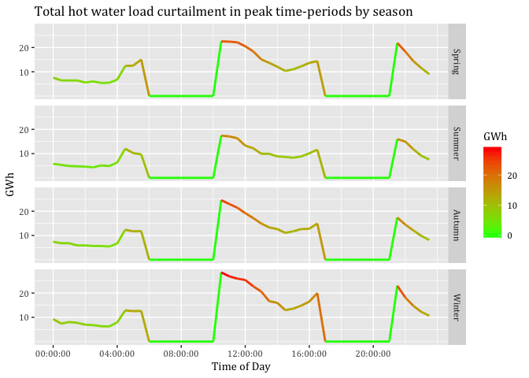<!-- -->

```r
 #ggsave("Total hot water load curtailment in peak time-periods by season.jpeg",
        #dpi = 600)
```
##Load curtailment of particular amount (50%): SC2


```r
sc2data <- hotWaterProfileDT
sc2data[, c("medianW", "obsHourMin", "meanW", "nObs", "sdW",
            "scaledMWmethod1", "EECApmMethod2"):=NULL] #Deleting unnecessary columns
```

```
## Warning in `[.data.table`(sc2data, , `:=`(c("medianW", "obsHourMin",
## "meanW", : Adding new column 'medianW' then assigning NULL (deleting it).
```

```
## Warning in `[.data.table`(sc2data, , `:=`(c("medianW", "obsHourMin",
## "meanW", : Adding new column 'obsHourMin' then assigning NULL (deleting
## it).
```

```
## Warning in `[.data.table`(sc2data, , `:=`(c("medianW", "obsHourMin",
## "meanW", : Adding new column 'meanW' then assigning NULL (deleting it).
```

```
## Warning in `[.data.table`(sc2data, , `:=`(c("medianW", "obsHourMin",
## "meanW", : Adding new column 'nObs' then assigning NULL (deleting it).
```

```
## Warning in `[.data.table`(sc2data, , `:=`(c("medianW", "obsHourMin",
## "meanW", : Adding new column 'sdW' then assigning NULL (deleting it).
```

```
## Warning in `[.data.table`(sc2data, , `:=`(c("medianW", "obsHourMin",
## "meanW", : Adding new column 'scaledMWmethod1' then assigning NULL
## (deleting it).
```

```
## Warning in `[.data.table`(sc2data, , `:=`(c("medianW", "obsHourMin",
## "meanW", : Adding new column 'EECApmMethod2' then assigning NULL (deleting
## it).
```

```r
sc2data <- sc2data[, .(GWhs2 = sum(scaledGWh)), 
                    keyby = .(season, obsHalfHour)]

sc2data <- sc2data[, Period := "Not Peak"]

sc2data <- sc2data[obsHalfHour >= MPS & 
                     obsHalfHour <= MPE,
                   Period := "Morning Peak"]

sc2data <- sc2data[obsHalfHour >= EPS & 
                     obsHalfHour <= EPE,
                   Period := "Evening Peak"]

sc2data <- sc2data[obsHalfHour >= OP1S & 
                     obsHalfHour <= OP1E,
                   Period := "Off Peak 1"]

sc2data <- sc2data[obsHalfHour >= OP12S & 
                     obsHalfHour <= OP12E,
                   Period := "Off Peak 1"]

sc2data <- sc2data[obsHalfHour >= OP2S & 
                     obsHalfHour <= OP2E,
                   Period := "Off Peak 2"]

sc2data <- sc2data[, GWh:=GWhs2] # Creating new column GWh based on GWhs2


sc2data <- sc2data[, GWh:= ifelse(Period == "Evening Peak", GWh * 0.5, GWh )] # If Period is Evening peak then make GWh zero
                   
sc2data <- sc2data[, GWh:= ifelse(Period == "Morning Peak", GWh * 0.5, GWh )]


#Change the order in facet_grid()
sc2data$season <- factor(sc2data$season, levels = c("Spring","Summer",
                                                    "Autumn", "Winter"))
#setnames(sc2data, old=c("GWh"), new=c("MWh"))

myPlot <- ggplot2::ggplot(sc2data, aes(x = obsHalfHour, y = GWh, color=GWh)) +
  geom_line(size=1) +
  theme(text = element_text(family = "Cambria")) +
  ggtitle("50 per cent per day hot water load curtailment at peak time-periods by season") +
  facet_grid(season ~ .) +
  labs(x='Time of Day', y='GWh') +
  scale_y_continuous(breaks = c(10, 20, 30, 40)) +
  scale_x_time(breaks = c(hms::as.hms("00:00:00"), hms::as.hms("04:00:00"), hms::as.hms("08:00:00"),       hms::as.hms("12:00:00"), hms::as.hms("16:00:00"), 
  hms::as.hms("20:00:00")))  +
  scale_colour_gradient(low= "green", high="red", guide = "colorbar")

myPlot
```

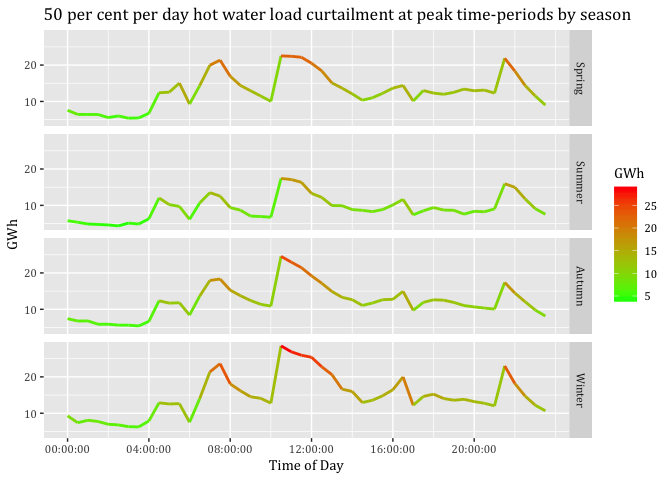<!-- -->

```r
#ggsave("50 per cent hot water load curtailment at peak time-periods by season.jpeg",
 #      dpi = 600)
```
###Potential load curtailment based on percentage


```r
sc2data <- sc2data[, .(PotCur = sum(GWh)),
                   keyby = .(season, Period)]
sc2data
```

```
##     season       Period    PotCur
##  1: Spring Evening Peak 111.63524
##  2: Spring Morning Peak 130.73577
##  3: Spring   Off Peak 1 171.14962
##  4: Spring   Off Peak 2 208.48912
##  5: Summer Evening Peak  75.92541
##  6: Summer Morning Peak  81.72698
##  7: Summer   Off Peak 1 137.45208
##  8: Summer   Off Peak 2 152.61293
##  9: Autumn Evening Peak 100.76520
## 10: Autumn Morning Peak 122.02079
## 11: Autumn   Off Peak 1 153.99151
## 12: Autumn   Off Peak 2 209.34144
## 13: Winter Evening Peak 121.48666
## 14: Winter Morning Peak 142.20837
## 15: Winter   Off Peak 1 183.54731
## 16: Winter   Off Peak 2 260.55460
```
##Load shifting to prior times: SC3


```r
#I had to insert a 2 and 4 respectively in order to allow comparisons between sc1data and sc2data. I can now run the whole script without affecting the variables associated to sc1data


sc2data <- hotWaterProfileDT
sc2data[, c("medianW", "obsHourMin", "meanW", "nObs", "sdW",
            "scaledMWmethod1", "EECApmMethod2"):=NULL] #Deleting unnecessary columns
```

```
## Warning in `[.data.table`(sc2data, , `:=`(c("medianW", "obsHourMin",
## "meanW", : Adding new column 'medianW' then assigning NULL (deleting it).
```

```
## Warning in `[.data.table`(sc2data, , `:=`(c("medianW", "obsHourMin",
## "meanW", : Adding new column 'obsHourMin' then assigning NULL (deleting
## it).
```

```
## Warning in `[.data.table`(sc2data, , `:=`(c("medianW", "obsHourMin",
## "meanW", : Adding new column 'meanW' then assigning NULL (deleting it).
```

```
## Warning in `[.data.table`(sc2data, , `:=`(c("medianW", "obsHourMin",
## "meanW", : Adding new column 'nObs' then assigning NULL (deleting it).
```

```
## Warning in `[.data.table`(sc2data, , `:=`(c("medianW", "obsHourMin",
## "meanW", : Adding new column 'sdW' then assigning NULL (deleting it).
```

```
## Warning in `[.data.table`(sc2data, , `:=`(c("medianW", "obsHourMin",
## "meanW", : Adding new column 'scaledMWmethod1' then assigning NULL
## (deleting it).
```

```
## Warning in `[.data.table`(sc2data, , `:=`(c("medianW", "obsHourMin",
## "meanW", : Adding new column 'EECApmMethod2' then assigning NULL (deleting
## it).
```

```r
  sc2data <- sc2data[, .(GWhs2 = sum(scaledGWh)), 
                    keyby = .(season, obsHalfHour)]


#Defining peak and off-peak periods
sc2data <- sc2data[, Period := "Not Peak"]

sc2data <- sc2data[obsHalfHour >= MPS & 
                     obsHalfHour <= MPE,
                   Period := "Morning Peak"]

sc2data <- sc2data[obsHalfHour >= EPS & 
                     obsHalfHour <= EPE,
                   Period := "Evening Peak"]

sc2data <- sc2data[obsHalfHour >= OP1S & 
                     obsHalfHour <= OP1E,
                   Period := "Off Peak 1"]

sc2data <- sc2data[obsHalfHour >= OP12S & 
                     obsHalfHour <= OP12E,
                   Period := "Off Peak 1"]

sc2data <- sc2data[obsHalfHour >= OP2S & 
                     obsHalfHour <= OP2E,
                   Period := "Off Peak 2"]

#Building the sum of each peak period by season
AuMP2 <- sc2data[season == "Autumn" & Period == "Morning Peak",
                sum(GWhs2)]
WiMP2 <- sc2data[season == "Winter" & Period == "Morning Peak",
                sum(GWhs2)]
SpMP2 <- sc2data[season == "Spring" & Period == "Morning Peak",
                sum(GWhs2)]
SuMP2 <- sc2data[season == "Summer" & Period == "Morning Peak",
                sum(GWhs2)]

AuEP2 <- sc2data[season == "Autumn" & Period == "Evening Peak",
                sum(GWhs2)]
WiEP2 <- sc2data[season == "Winter" & Period == "Evening Peak",
                sum(GWhs2)]
SpEP2 <- sc2data[season == "Spring" & Period == "Evening Peak",
                sum(GWhs2)]
SuEP2 <- sc2data[season == "Summer" & Period == "Evening Peak",
                sum(GWhs2)]


#Counting number of rows that will be associated to spread the Morning Peak
AuMPHalfHours2 <- nrow(sc2data[season == "Autumn" &
                              Period == "Off Peak 1"])
WiMPHalfHours2 <- nrow(sc2data[season == "Winter" &
                              Period == "Off Peak 1"])
SpMPHalfHours2 <- nrow(sc2data[season == "Spring" &
                              Period == "Off Peak 1"])
SuMPHalfHours2 <- nrow(sc2data[season == "Summer" &
                              Period == "Off Peak 1"])

#Counting number of rows that will be associated to spread the Evening Peak
AuEPHalfHours2 <- nrow(sc2data[season == "Autumn" &
                              Period == "Off Peak 2"])
WiEPHalfHours2 <- nrow(sc2data[season == "Winter" &
                              Period == "Off Peak 2"])
SpEPHalfHours2 <- nrow(sc2data[season == "Spring" &
                              Period == "Off Peak 2"])
SuEPHalfHours2 <- nrow(sc2data[season == "Summer" &
                              Period == "Off Peak 2"])

#Calculating the proportion that each row will take on to spread the GWhs
distGWhOP1Au2 <- AuMP2/AuMPHalfHours2
distGWhOP1Wi2 <- WiMP2/WiMPHalfHours2
distGWhOP1Sp2 <- SpMP2/SpMPHalfHours2
distGWhOP1Su2 <- SuMP2/SuMPHalfHours2

distGWhOP2Au2 <- AuEP2/AuEPHalfHours2
distGWhOP2Wi2 <- WiEP2/WiEPHalfHours2
distGWhOP2Sp2 <- SpEP2/SpEPHalfHours2
distGWhOP2Su2 <- SuEP2/SuEPHalfHours2


#Adding amount of spreaded peak consumption to off-peak periods
sc2data <- sc2data[season == "Autumn" &
                     Period == "Off Peak 1", GWhs4 :=
                     GWhs2 + distGWhOP1Au2]
sc2data <- sc2data[season == "Winter" &
                     Period == "Off Peak 1", GWhs4 :=
                     GWhs2 + distGWhOP1Wi2]
sc2data <- sc2data[season == "Spring" &
                     Period == "Off Peak 1", GWhs4 :=
                     GWhs2 + distGWhOP1Sp2]
sc2data <- sc2data[season == "Summer" &
                     Period == "Off Peak 1", GWhs4 :=
                     GWhs2 + distGWhOP1Su2]


sc2data <- sc2data[season == "Autumn" &
                     Period == "Off Peak 2", GWhs4 :=
                     GWhs2 + distGWhOP2Au2]
sc2data <- sc2data[season == "Winter" &
                     Period == "Off Peak 2", GWhs4 :=
                     GWhs2 + distGWhOP2Wi2]
sc2data <- sc2data[season == "Spring" &
                     Period == "Off Peak 2", GWhs4 :=
                     GWhs2 + distGWhOP2Sp2]
sc2data <- sc2data[season == "Summer" &
                     Period == "Off Peak 2", GWhs4 :=
                     GWhs2 + distGWhOP2Su2]


#Setting missing values in peak periods to NULL
sc2data <- sc2data[, GWhs4:= ifelse(Period =="Morning Peak",
                                  0, GWhs4)]
sc2data <- sc2data[, GWhs4:= ifelse(Period =="Evening Peak",
                                  0, GWhs4)]


#Renaming GWhs3 into GWh to depict the right text in the colorbar
setnames(sc2data, old=c("GWhs2"), new=c("GWh"))

#Visualising only shifted consumption
#myPlot <- ggplot2::ggplot(sc2data, aes(x = obsHalfHour, color=GWh)) +
  #geom_line(aes(y=GWh), size=0.5) +
  #theme(text = element_text(family = "Cambria")) +
  #ggtitle("Total shifted New Zealand half hour heat pump energy consumption by season for 2015") +
  #facet_grid(season ~ .) +
  #labs(x='Time of Day', y='GWh') +
  #scale_y_continuous(breaks = c(10, 20, 30, 40)) +
  #scale_x_time(breaks = c(hms::as.hms("00:00:00"), hms::as.hms("03:00:00"), hms::as.hms("06:00:00"),       hms::as.hms("09:00:00"), hms::as.hms("12:00:00"), 
  #hms::as.hms("15:00:00"), hms::as.hms("18:00:00"), hms::as.hms("21:00:00"))) +
  #scale_colour_gradient(low= "green", high="red", guide = "colorbar")

#myPlot

#Visualising shifted and original consumption
#myPlot <- ggplot2::ggplot(sc2data, aes(x = obsHalfHour)) +
 # geom_line(aes(y=GWh, color=GWh), size=0.5) +
 # geom_line(aes(y=GWhs4, color=GWhs4), size=0.5) +
 # theme(text = element_text(family = "Cambria")) +
 # ggtitle("Original and shifted New Zealand half hour heat pump energy consumption by season for 2015") +
#  facet_grid(season ~ .) +
#  labs(x='Time of Day', y='GWh') +
 # scale_y_continuous(breaks = c(10, 20, 30, 40)) +
#  scale_x_time(breaks = c(hms::as.hms("00:00:00"), hms::as.hms("03:00:00"), hms::as.hms("06:00:00"),       hms::as.hms("09:00:00"), hms::as.hms("12:00:00"), 
#  hms::as.hms("15:00:00"), hms::as.hms("18:00:00"), hms::as.hms("21:00:00"))) +
 # scale_color_gradient(low= "green", high="red")

#myPlot

sc2data$season <- factor(sc2data$season, levels = c("Spring","Summer",
                                                    "Autumn", "Winter"))

#Visualising shifted and original consumption two colours
  myPlot <- ggplot2::ggplot(sc2data, aes(x = obsHalfHour)) +
  geom_line(aes(y=GWh, color="red"), size=0.5) +
  geom_line(aes(y=GWhs4, color="blue"), size=0.5) +
  theme(text = element_text(family = "Cambria")) +
  ggtitle("Original and shifted New Zealand half hour heat pump energy consumption by season for 2015") +
  scale_colour_manual(name = element_blank(), 
         values =c('red'='red','blue'='blue'), labels = c('Original consumption',
                  'Shifted consumption')) +
  facet_grid(season ~ .) +
  labs(x='Time of Day', y='GWh') +
  scale_y_continuous(breaks = c(10, 20, 30, 40)) +
  scale_x_time(breaks = c(hms::as.hms("00:00:00"), hms::as.hms("04:00:00"), hms::as.hms("08:00:00"),       hms::as.hms("12:00:00"), hms::as.hms("16:00:00"), 
  hms::as.hms("20:00:00"))) 
 

myPlot
```

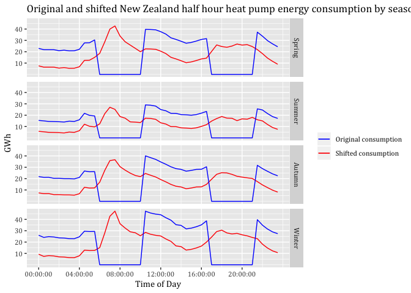<!-- -->

```r
#ggsave("Original and shifted New Zealand half hour hot water energy consumption by season for 2015.jpeg",
     #  dpi=600)
```
#Technical potential of demand response: Scenarios for refrigeration data

##Load curtailment to zero

```r
totalGWH<-2074 #EECA fro refrigeration in 2015
nzHouseholds <- 1004329 + 453135

refrigerationProfileDT <- copy(heatPumpProfileDT)
refrigerationProfileDT <- refrigerationProfileDT[, scaledGWh := 2074/.N]#Spreading GWh equally


sc5data <- refrigerationProfileDT

sc5data <- sc5data[, .(GWhREF = sum((scaledGWh)/90)*1000), 
                    keyby = .(season, obsHalfHour)]

sc5data <- sc5data[, Period := "Not Peak"]

sc5data <- sc5data[obsHalfHour >= MPS & 
                     obsHalfHour <= MPE,
                   Period := "Morning Peak"]

sc5data <- sc5data[obsHalfHour >= EPS & 
                     obsHalfHour <= EPE,
                   Period := "Evening Peak"]

sc5data <- sc5data[obsHalfHour >= OP1S & 
                     obsHalfHour <= OP1E,
                   Period := "Off Peak 1"]

sc5data <- sc5data[obsHalfHour >= OP12S & 
                     obsHalfHour <= OP12E,
                   Period := "Off Peak 1"]

sc5data <- sc5data[obsHalfHour >= OP2S & 
                     obsHalfHour <= OP2E,
                   Period := "Off Peak 2"]


sc5data$season <- factor(sc5data$season, levels = c("Spring","Summer",
                                                    "Autumn", "Winter"))

#Visualising peak ond off-peak
myPlot <- ggplot2::ggplot(sc5data, aes(x = obsHalfHour, color=Period)) +
  geom_point(aes(y=GWhREF), size=1, alpha = 1) +
  theme(text = element_text(family = "Cambria")) +
  ggtitle("Total consumption refrigeration by season") +
  facet_grid(season ~ .) +
  labs(x='Time of Day', y='GWh') +
 # scale_y_continuous(breaks = c(20, 40, 60, 80)) +
  scale_color_discrete(breaks=c("Off Peak 1", "Morning Peak", "Off Peak 2",
                                "Evening Peak")) +
  scale_x_time(breaks = c(hms::as.hms("00:00:00"), hms::as.hms("04:00:00"), hms::as.hms("08:00:00"),       hms::as.hms("12:00:00"), hms::as.hms("16:00:00"), 
  hms::as.hms("20:00:00"))) 
  #scale_colour_gradient(low= "green", high="red", guide = "colorbar")

myPlot
```

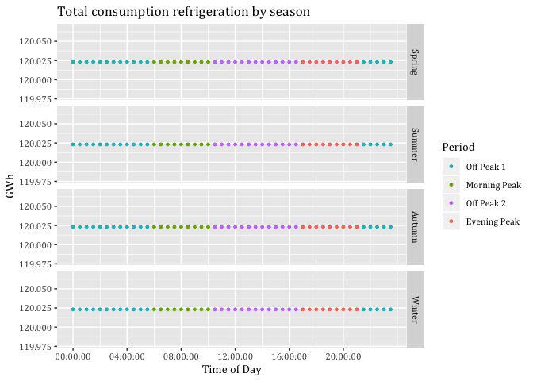<!-- -->

```r
#ggsave("Total consumption refrigeration by season.jpeg", dpi = 600)
```
###Potential load curtailment


```r
sc5data <- sc5data[, .(PotCur = sum(GWhREF)),
                   keyby = .(season, Period)]
sc5data
```

```
##     season       Period   PotCur
##  1: Spring Evening Peak 1080.208
##  2: Spring Morning Peak 1080.208
##  3: Spring   Off Peak 1 2040.394
##  4: Spring   Off Peak 2 1560.301
##  5: Summer Evening Peak 1080.208
##  6: Summer Morning Peak 1080.208
##  7: Summer   Off Peak 1 2040.394
##  8: Summer   Off Peak 2 1560.301
##  9: Autumn Evening Peak 1080.208
## 10: Autumn Morning Peak 1080.208
## 11: Autumn   Off Peak 1 2040.394
## 12: Autumn   Off Peak 2 1560.301
## 13: Winter Evening Peak 1080.208
## 14: Winter Morning Peak 1080.208
## 15: Winter   Off Peak 1 2040.394
## 16: Winter   Off Peak 2 1560.301
```


###Visualising curtailed periods


```r
#Defining peak and off-peak for heat pump and hot water seperately


sc5data <- refrigerationProfileDT

sc5data <- sc5data[, .(GWhREF = sum(scaledGWh)), 
                    keyby = .(season, obsHalfHour)]

sc5data <- sc5data[, Period := "Not Peak"]

sc5data <- sc5data[obsHalfHour >= MPS & 
                     obsHalfHour <= MPE,
                   Period := "Morning Peak"]

sc5data <- sc5data[obsHalfHour >= EPS & 
                     obsHalfHour <= EPE,
                   Period := "Evening Peak"]

sc5data <- sc5data[obsHalfHour >= OP1S & 
                     obsHalfHour <= OP1E,
                   Period := "Off Peak 1"]

sc5data <- sc5data[obsHalfHour >= OP12S & 
                     obsHalfHour <= OP12E,
                   Period := "Off Peak 1"]

sc5data <- sc5data[obsHalfHour >= OP2S & 
                     obsHalfHour <= OP2E,
                   Period := "Off Peak 2"]


sc5data <- sc5data[, GWhREF:= ifelse(Period == "Evening Peak"|Period== "Morning Peak"
                                     , 0, GWhREF )] # If Period is Evening peak then make GWh zero
                   


#Renaming PumpandWater to depict the right y in the colorbar
setnames(sc5data, old=c("GWhREF"), new=c("MWh"))

myPlot <- ggplot2::ggplot(sc5data, aes(x = obsHalfHour, y = MWh, color=MWh)) +
  geom_line(size=1) +
  theme(text = element_text(family = "Cambria")) +
  ggtitle("Total refrigeration load curtailment in peak time-periods by season") +
  facet_grid(season ~ .) +
  labs(x='Time of Day', y='GWh') +
  scale_y_continuous(breaks = c(3, 6, 9, 12)) +
  scale_x_time(breaks = c(hms::as.hms("00:00:00"), hms::as.hms("04:00:00"), hms::as.hms("08:00:00"),       hms::as.hms("12:00:00"), hms::as.hms("16:00:00"), 
  hms::as.hms("20:00:00"))) +
  scale_colour_gradient(low= "green", high="red", guide = "colorbar")

myPlot
```

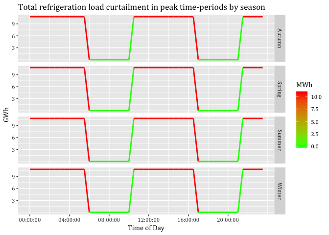<!-- -->

```r
#ggsave("Per_DayTotal refrigeration curtailment in peak time-periods by season.jpeg", dpi = 600)
```
##Load curtailment of particular amount

```r
#Defining peak and off-peak for heat pump and hot water seperately

sc5data <- refrigerationProfileDT

sc5data <- sc5data[, .(GWhREF = sum(scaledGWh)), 
                    keyby = .(season, obsHalfHour)]

sc5data <- sc5data[, Period := "Not Peak"]

sc5data <- sc5data[obsHalfHour >= MPS & 
                     obsHalfHour <= MPE,
                   Period := "Morning Peak"]

sc5data <- sc5data[obsHalfHour >= EPS & 
                     obsHalfHour <= EPE,
                   Period := "Evening Peak"]

sc5data <- sc5data[obsHalfHour >= OP1S & 
                     obsHalfHour <= OP1E,
                   Period := "Off Peak 1"]

sc5data <- sc5data[obsHalfHour >= OP12S & 
                     obsHalfHour <= OP12E,
                   Period := "Off Peak 1"]

sc5data <- sc5data[obsHalfHour >= OP2S & 
                     obsHalfHour <= OP2E,
                   Period := "Off Peak 2"]


sc5data <- sc5data[, GWhREF:= ifelse(Period == "Evening Peak", GWhREF*0.5, GWhREF )] # If Period is Evening peak then make GWh zero
                   
sc5data <- sc5data[, GWhREF:= ifelse(Period == "Morning Peak", GWhREF*0.5, GWhREF )]

#Renaming PumpandWater to depict the right y in the colorbar
setnames(sc5data, old=c("GWhREF"), new=c("GWh"))


sc5data$season <- factor(sc5data$season, levels = c("Spring","Summer",
                                                    "Autumn", "Winter"))

myPlot <- ggplot2::ggplot(sc5data, aes(x = obsHalfHour, y = GWh, color=GWh)) +
  geom_line(size=1) +
  theme(text = element_text(family = "Cambria")) +
  ggtitle("Total refrigeration 50 per cent load curtailment") +
  facet_grid(season ~ .) +
  labs(x='Time of Day', y='GWh') +
  #scale_y_continuous(breaks = c(2, 4, 6, 8)) +
 scale_x_time(breaks = c(hms::as.hms("00:00:00"), hms::as.hms("04:00:00"), hms::as.hms("08:00:00"),       hms::as.hms("12:00:00"), hms::as.hms("16:00:00"), 
  hms::as.hms("20:00:00")))  +
  scale_colour_gradient(low= "green", high="red", guide = "colorbar")

myPlot
```

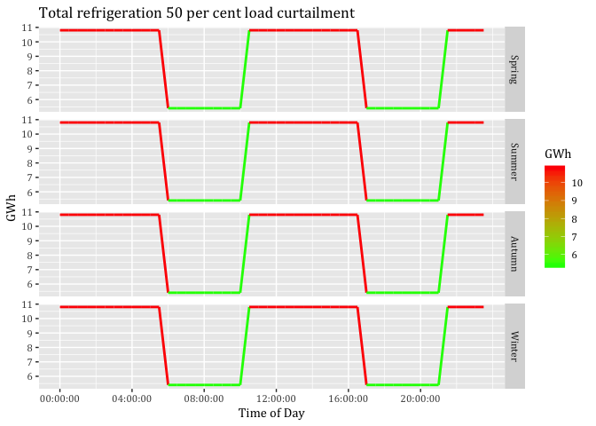<!-- -->

```r
ggsave("Total refrigeration 50 per cent load curtailment.jpeg", dpi = 600)
```

```
## Saving 7 x 5 in image
```
###Potential load curtailment heat pump and hot water based on percentage

```r
sc5data <- sc5data[, .(PotCur = sum(GWh)),
                   keyby = .(season, Period)]
sc5data
```

```
##     season       Period    PotCur
##  1: Spring Evening Peak  48.60938
##  2: Spring Morning Peak  48.60938
##  3: Spring   Off Peak 1 183.63542
##  4: Spring   Off Peak 2 140.42708
##  5: Summer Evening Peak  48.60938
##  6: Summer Morning Peak  48.60938
##  7: Summer   Off Peak 1 183.63542
##  8: Summer   Off Peak 2 140.42708
##  9: Autumn Evening Peak  48.60938
## 10: Autumn Morning Peak  48.60938
## 11: Autumn   Off Peak 1 183.63542
## 12: Autumn   Off Peak 2 140.42708
## 13: Winter Evening Peak  48.60938
## 14: Winter Morning Peak  48.60938
## 15: Winter   Off Peak 1 183.63542
## 16: Winter   Off Peak 2 140.42708
```
##Load shifting to prior times: SC3

```r
sc5data <- refrigerationProfileDT

sc5data <- sc5data[, .(GWhREF = sum(scaledGWh)), 
                    keyby = .(season, obsHalfHour)]

sc5data <- sc5data[, Period := "Not Peak"]

sc5data <- sc5data[obsHalfHour >= MPS & 
                     obsHalfHour <= MPE,
                   Period := "Morning Peak"]

sc5data <- sc5data[obsHalfHour >= EPS & 
                     obsHalfHour <= EPE,
                   Period := "Evening Peak"]

sc5data <- sc5data[obsHalfHour >= OP1S & 
                     obsHalfHour <= OP1E,
                   Period := "Off Peak 1"]

sc5data <- sc5data[obsHalfHour >= OP12S & 
                     obsHalfHour <= OP12E,
                   Period := "Off Peak 1"]

sc5data <- sc5data[obsHalfHour >= OP2S & 
                     obsHalfHour <= OP2E,
                   Period := "Off Peak 2"]


sc3data <- sc5data


#Building the sum of each peak period by season
AuMP3 <- sc3data[season == "Autumn" & Period == "Morning Peak",
                sum(GWhREF)]
WiMP3 <- sc3data[season == "Winter" & Period == "Morning Peak",
                sum(GWhREF)]
SpMP3 <- sc3data[season == "Spring" & Period == "Morning Peak",
                sum(GWhREF)]
SuMP3 <- sc3data[season == "Summer" & Period == "Morning Peak",
                sum(GWhREF)]

AuEP3 <- sc3data[season == "Autumn" & Period == "Evening Peak",
                sum(GWhREF)]
WiEP3 <- sc3data[season == "Winter" & Period == "Evening Peak",
                sum(GWhREF)]
SpEP3 <- sc3data[season == "Spring" & Period == "Evening Peak",
                sum(GWhREF)]
SuEP3 <- sc3data[season == "Summer" & Period == "Evening Peak",
                sum(GWhREF)]


#Counting number of rows that will be associated to spread the Morning Peak
AuMPHalfHours3 <- nrow(sc3data[season == "Autumn" &
                              Period == "Off Peak 1"])
WiMPHalfHours3 <- nrow(sc3data[season == "Winter" &
                              Period == "Off Peak 1"])
SpMPHalfHours3 <- nrow(sc3data[season == "Spring" &
                              Period == "Off Peak 1"])
SuMPHalfHours3 <- nrow(sc3data[season == "Summer" &
                              Period == "Off Peak 1"])

#Counting number of rows that will be associated to spread the Evening Peak
AuEPHalfHours3 <- nrow(sc3data[season == "Autumn" &
                              Period == "Off Peak 2"])
WiEPHalfHours3 <- nrow(sc3data[season == "Winter" &
                              Period == "Off Peak 2"])
SpEPHalfHours3 <- nrow(sc3data[season == "Spring" &
                              Period == "Off Peak 2"])
SuEPHalfHours3 <- nrow(sc3data[season == "Summer" &
                              Period == "Off Peak 2"])

#Calculating the proportion that each row will take on to spread the GWhs
distGWhOP1Au3 <- AuMP3/AuMPHalfHours3
distGWhOP1Wi3 <- WiMP3/WiMPHalfHours3
distGWhOP1Sp3 <- SpMP3/SpMPHalfHours3
distGWhOP1Su3 <- SuMP3/SuMPHalfHours3

distGWhOP2Au3 <- AuEP3/AuEPHalfHours3
distGWhOP2Wi3 <- WiEP3/WiEPHalfHours3
distGWhOP2Sp3 <- SpEP3/SpEPHalfHours3
distGWhOP2Su3 <- SuEP3/SuEPHalfHours3


#Adding amount of spreaded peak consumption to off-peak periods
sc3data <- sc3data[season == "Autumn" &
                     Period == "Off Peak 1", GWhs4 :=
                     GWhREF + distGWhOP1Au3]
sc3data <- sc3data[season == "Winter" &
                     Period == "Off Peak 1", GWhs4 :=
                     GWhREF + distGWhOP1Wi3]
sc3data <- sc3data[season == "Spring" &
                     Period == "Off Peak 1", GWhs4 :=
                     GWhREF + distGWhOP1Sp3]
sc3data <- sc3data[season == "Summer" &
                     Period == "Off Peak 1", GWhs4 :=
                     GWhREF + distGWhOP1Su3]


sc3data <- sc3data[season == "Autumn" &
                     Period == "Off Peak 2", GWhs4 :=
                     GWhREF + distGWhOP2Au3]
sc3data <- sc3data[season == "Winter" &
                     Period == "Off Peak 2", GWhs4 :=
                     GWhREF + distGWhOP2Wi3]
sc3data <- sc3data[season == "Spring" &
                     Period == "Off Peak 2", GWhs4 :=
                     GWhREF + distGWhOP2Sp3]
sc3data <- sc3data[season == "Summer" &
                     Period == "Off Peak 2", GWhs4 :=
                     GWhREF + distGWhOP2Su3]


#Setting missing values in peak periods to NULL
sc3data <- sc3data[, GWhs4:= ifelse(Period =="Morning Peak",
                                  0, GWhs4)]
sc3data <- sc3data[, GWhs4:= ifelse(Period =="Evening Peak",
                                  0, GWhs4)]


#Renaming GWhs3 into GWh to depict the right text in the colorbar
#setnames(sc2data, old=c("GWhs4"), new=c("GWh"))

#Visualising only shifted consumption
#myPlot <- ggplot2::ggplot(sc2data, aes(x = obsHalfHour, color=GWh)) +
  #geom_line(aes(y=GWh), size=0.5) +
  #theme(text = element_text(family = "Cambria")) +
  #ggtitle("Total shifted New Zealand half hour heat pump energy consumption by season for 2015") +
  #facet_grid(season ~ .) +
  #labs(x='Time of Day', y='GWh') +
  #scale_y_continuous(breaks = c(10, 20, 30, 40)) +
  #scale_x_time(breaks = c(hms::as.hms("00:00:00"), hms::as.hms("03:00:00"), hms::as.hms("06:00:00"),       hms::as.hms("09:00:00"), hms::as.hms("12:00:00"), 
  #hms::as.hms("15:00:00"), hms::as.hms("18:00:00"), hms::as.hms("21:00:00"))) +
  #scale_colour_gradient(low= "green", high="red", guide = "colorbar")

#myPlot

#Visualising shifted and original consumption
#myPlot <- ggplot2::ggplot(sc2data, aes(x = obsHalfHour)) +
 # geom_line(aes(y=GWh, color=GWh), size=0.5) +
 # geom_line(aes(y=GWhs4, color=GWhs4), size=0.5) +
 # theme(text = element_text(family = "Cambria")) +
 # ggtitle("Original and shifted New Zealand half hour heat pump energy consumption by season for 2015") +
#  facet_grid(season ~ .) +
#  labs(x='Time of Day', y='GWh') +
 # scale_y_continuous(breaks = c(10, 20, 30, 40)) +
#  scale_x_time(breaks = c(hms::as.hms("00:00:00"), hms::as.hms("03:00:00"), hms::as.hms("06:00:00"),       hms::as.hms("09:00:00"), hms::as.hms("12:00:00"), 
#  hms::as.hms("15:00:00"), hms::as.hms("18:00:00"), hms::as.hms("21:00:00"))) +
 # scale_color_gradient(low= "green", high="red")

#myPlot

#Change the order in facet_grid()
sc3data$season <- factor(sc3data$season, levels = c("Spring","Summer",
                                                    "Autumn", "Winter"))


#Visualising only winter 
  #myPlot <- ggplot2::ggplot(subset(sc5data, season %in% c("Winter")), aes(x = #obsHalfHour)) +
 # geom_line(aes(y=GWhREF, color="red"), size=0.5) +
  #geom_line(aes(y=GWhs4, color="blue"), size=0.5) +
 # theme(text = element_text(family = "Cambria")) +
  #ggtitle("Per day original and shifted New Zealand refrigeration energy #consumption by season for 2015") +
  #scale_colour_manual(name = element_blank(), 
         #values =c('red'='red','blue'='blue'), labels = c('Original consumption',
                  #'Shifted consumption')) +
  #facet_grid(season ~ .) +
 # labs(x='Time of Day', y='MWh') +
  #scale_y_continuous(breaks = c(10, 20, 30, 40)) +
  #scale_x_time(breaks = c(hms::as.hms("00:00:00"), hms::as.hms("04:00:00"), #hms::as.hms("08:00:00"),       hms::as.hms("12:00:00"), hms::as.hms("16:00:00"), 
  #hms::as.hms("20:00:00"))) 
 

#myPlot


# Orifginal plot, the one above depicts winter
#Visualising shifted and original consumption two colours
  myPlot <- ggplot2::ggplot(sc5data, aes(x = obsHalfHour)) +
  geom_line(aes(y=GWhREF, color="red"), size=0.5) +
  geom_line(aes(y=GWhs4, color="blue"), size=0.5) +
  theme(text = element_text(family = "Cambria")) +
  ggtitle("Per day original and shifted New Zealand refrigeration energy consumption by season for 2015") +
  scale_colour_manual(name = element_blank(), 
         values =c('red'='red','blue'='blue'), labels = c('Original consumption',
                 'Shifted consumption')) +
  facet_grid(season ~ .) +
  labs(x='Time of Day', y='GWh') +
scale_y_continuous(breaks = c(10, 20, 30, 40)) +
  scale_x_time(breaks = c(hms::as.hms("00:00:00"), hms::as.hms("04:00:00"), hms::as.hms("08:00:00"),       hms::as.hms("12:00:00"), hms::as.hms("16:00:00"), 
  hms::as.hms("20:00:00"))) 
 

myPlot
```

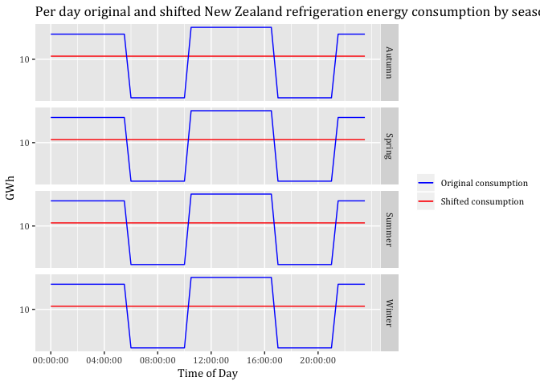<!-- -->

```r
#ggsave("Total shifted and original refrigeration in GWh.jpeg", dpi = 600)
```


#Both appliances together
##Load curtailment to zero: SC1
###Visualising peak time-periods

```r
#Defining peak and off-peak for heat pump and hot water seperately
sc3data <- heatPumpProfileDT


sc3data <- sc3data[, .(GWhHP = sum(scaledGWh)), 
                    keyby = .(season, obsHalfHour)]

sc3data <- sc3data[, Period := "Not Peak"]

sc3data <- sc3data[obsHalfHour >= MPS & 
                     obsHalfHour <= MPE,
                   Period := "Morning Peak"]

sc3data <- sc3data[obsHalfHour >= EPS & 
                     obsHalfHour <= EPE,
                   Period := "Evening Peak"]

sc3data <- sc3data[obsHalfHour >= OP1S & 
                     obsHalfHour <= OP1E,
                   Period := "Off Peak 1"]

sc3data <- sc3data[obsHalfHour >= OP12S & 
                     obsHalfHour <= OP12E,
                   Period := "Off Peak 1"]

sc3data <- sc3data[obsHalfHour >= OP2S & 
                     obsHalfHour <= OP2E,
                   Period := "Off Peak 2"]


sc32data <- hotWaterProfileDT

sc32data <- sc32data[, .(GWhHW = sum(scaledGWh)), 
                    keyby = .(season, obsHalfHour)]

sc32data <- sc32data[, Period := "Not Peak"]

sc32data <- sc32data[obsHalfHour >= MPS & 
                     obsHalfHour <= MPE,
                   Period := "Morning Peak"]

sc32data <- sc32data[obsHalfHour >= EPS & 
                     obsHalfHour <= EPE,
                   Period := "Evening Peak"]

sc32data <- sc32data[obsHalfHour >= OP1S & 
                     obsHalfHour <= OP1E,
                   Period := "Off Peak 1"]

sc32data <- sc32data[obsHalfHour >= OP12S & 
                     obsHalfHour <= OP12E,
                   Period := "Off Peak 1"]

sc32data <- sc32data[obsHalfHour >= OP2S & 
                     obsHalfHour <= OP2E,
                   Period := "Off Peak 2"]

#Copying hot water consumption column into heat pump data table
sc3data <- cbind(sc3data, sc32data[,"GWhHW"])

#Building sum of heat pump and hot water consumption
sc3data <- sc3data[, PumpandWater := GWhHP + GWhHW]

sc3data$season <- factor(sc3data$season, levels = c("Spring","Summer",
                                                    "Autumn", "Winter"))

#Visualising peak ond off-peak
myPlot <- ggplot2::ggplot(sc3data, aes(x = obsHalfHour, color=Period)) +
  geom_point(aes(y=PumpandWater), size=1, alpha = 1) +
  theme(text = element_text(family = "Cambria")) +
  ggtitle("Total consumption heat pump and hot water by season") +
  facet_grid(season ~ .) +
  labs(x='Time of Day', y='GWh') +
  scale_y_continuous(breaks = c(20, 40, 60, 80)) +
  scale_color_discrete(breaks=c("Off Peak 1", "Morning Peak", "Off Peak 2",
                                "Evening Peak")) +
  scale_x_time(breaks = c(hms::as.hms("00:00:00"), hms::as.hms("04:00:00"), hms::as.hms("08:00:00"),       hms::as.hms("12:00:00"), hms::as.hms("16:00:00"), 
  hms::as.hms("20:00:00"))) 
  #scale_colour_gradient(low= "green", high="red", guide = "colorbar")

myPlot
```

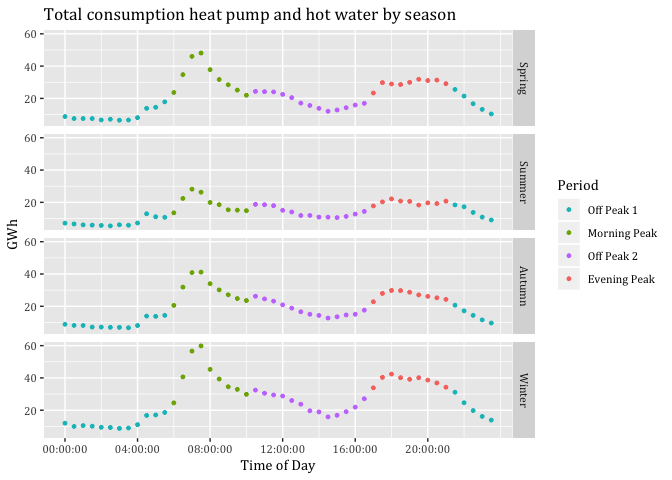<!-- -->

```r
#ggsave("Total consumption heat pump and hot water by season.jpeg", dpi = 600)
```

###Potential load curtailment


```r
sc3data <- sc3data[, .(PotCur = sum(PumpandWater)),
                   keyby = .(season, Period)]
sc3data
```

```
##     season       Period   PotCur
##  1: Spring Evening Peak 264.0581
##  2: Spring Morning Peak 297.5807
##  3: Spring   Off Peak 1 199.9309
##  4: Spring   Off Peak 2 234.1039
##  5: Summer Evening Peak 179.6544
##  6: Summer Morning Peak 174.2595
##  7: Summer   Off Peak 1 160.0590
##  8: Summer   Off Peak 2 178.7930
##  9: Autumn Evening Peak 241.7618
## 10: Autumn Morning Peak 274.0505
## 11: Autumn   Off Peak 1 183.6066
## 12: Autumn   Off Peak 2 233.1524
## 13: Winter Evening Peak 345.8801
## 14: Winter Morning Peak 363.5610
## 15: Winter   Off Peak 1 248.0292
## 16: Winter   Off Peak 2 310.3283
```

```r
#sc3data <- sc1data
#sc3data[, c("GWhs1"):=NULL] #Deleting unnecessary columns

#Copying the scaled GWh of hot water into the new data table
#sc3data <- cbind(sc3data, sc2data[,"GWhs4"])

#Building the sum of heat pump and hot water scaled numbers in a sepatrate variable
#sc3data <- sc3data[, PumpandWater := GWh + GWhs4]
```
###Visualising curtailed periods


```r
#Defining peak and off-peak for heat pump and hot water seperately
sc3data <- heatPumpProfileDT


sc3data <- sc3data[, .(GWhHP = sum(scaledGWh)), 
                    keyby = .(season, obsHalfHour)]

sc3data <- sc3data[, Period := "Not Peak"]

sc3data <- sc3data[obsHalfHour >= MPS & 
                     obsHalfHour <= MPE,
                   Period := "Morning Peak"]

sc3data <- sc3data[obsHalfHour >= EPS & 
                     obsHalfHour <= EPE,
                   Period := "Evening Peak"]

sc3data <- sc3data[obsHalfHour >= OP1S & 
                     obsHalfHour <= OP1E,
                   Period := "Off Peak 1"]

sc3data <- sc3data[obsHalfHour >= OP12S & 
                     obsHalfHour <= OP12E,
                   Period := "Off Peak 1"]

sc3data <- sc3data[obsHalfHour >= OP2S & 
                     obsHalfHour <= OP2E,
                   Period := "Off Peak 2"]


sc32data <- hotWaterProfileDT

sc32data <- sc32data[, .(GWhHW = sum(scaledGWh)), 
                    keyby = .(season, obsHalfHour)]

sc32data <- sc32data[, Period := "Not Peak"]

sc32data <- sc32data[obsHalfHour >= MPS & 
                     obsHalfHour <= MPE,
                   Period := "Morning Peak"]

sc32data <- sc32data[obsHalfHour >= EPS & 
                     obsHalfHour <= EPE,
                   Period := "Evening Peak"]

sc32data <- sc32data[obsHalfHour >= OP1S & 
                     obsHalfHour <= OP1E,
                   Period := "Off Peak 1"]

sc32data <- sc32data[obsHalfHour >= OP12S & 
                     obsHalfHour <= OP12E,
                   Period := "Off Peak 1"]

sc32data <- sc32data[obsHalfHour >= OP2S & 
                     obsHalfHour <= OP2E,
                   Period := "Off Peak 2"]

#Copying hot water consumption column into heat pump data table
sc3data <- cbind(sc3data, sc32data[,"GWhHW"])

#Building sum of heat pump and hot water consumption
sc3data <- sc3data[, PumpandWater := GWhHP + GWhHW]


sc3data <- sc3data[, PumpandWater:= ifelse(Period == "Evening Peak", 0, PumpandWater )] # If Period is Evening peak then make GWh zero
                   
sc3data <- sc3data[, PumpandWater:= ifelse(Period == "Morning Peak", 0, PumpandWater )]


sc3data$season <- factor(sc3data$season, levels = c("Spring","Summer",
                                                    "Autumn", "Winter"))


myPlot <- ggplot2::ggplot(sc3data, aes(x = obsHalfHour, y = PumpandWater, color=PumpandWater)) +
  geom_line(size=1) +
  theme(text = element_text(family = "Cambria")) +
  ggtitle("Total heat pump and hot water load curtailment in peak time-periods by season") +
  facet_grid(season ~ .) +
  labs(x='Time of Day', y='GWh') +
  scale_y_continuous(breaks = c(20, 40, 60, 80)) +
  scale_x_time(breaks = c(hms::as.hms("00:00:00"), hms::as.hms("04:00:00"), hms::as.hms("08:00:00"),       hms::as.hms("12:00:00"), hms::as.hms("16:00:00"), 
  hms::as.hms("20:00:00"))) +
  scale_colour_gradient(low= "green", high="red", guide = "colorbar")

myPlot
```

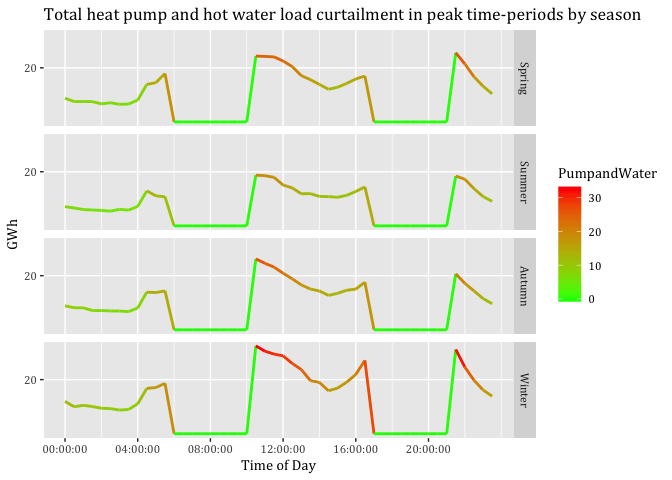<!-- -->

```r
#ggsave("Total heat pump and hot water load curtailment in peak time-periods by season.jpeg", dpi = 600)
```
##Load curtailment of particular amount 50%: SC2
###Visualising new load profile


```r
sc3data <- heatPumpProfileDT


sc3data <- sc3data[, .(GWhHP = sum(scaledGWh)), 
                    keyby = .(season, obsHalfHour)]

sc3data <- sc3data[, Period := "Not Peak"]

sc3data <- sc3data[obsHalfHour >= MPS & 
                     obsHalfHour <= MPE,
                   Period := "Morning Peak"]

sc3data <- sc3data[obsHalfHour >= EPS & 
                     obsHalfHour <= EPE,
                   Period := "Evening Peak"]


sc32data <- hotWaterProfileDT

sc32data <- sc32data[, .(GWhHW = sum(scaledGWh)), 
                    keyby = .(season, obsHalfHour)]

sc32data <- sc32data[, Period := "Not Peak"]

sc32data <- sc32data[obsHalfHour >= MPS & 
                     obsHalfHour <= MPE,
                   Period := "Morning Peak"]

sc32data <- sc32data[obsHalfHour >= EPS & 
                     obsHalfHour <= EPE,
                   Period := "Evening Peak"]

sc32data <- sc32data[obsHalfHour >= OP1S & 
                     obsHalfHour <= OP1E,
                   Period := "Off Peak 1"]

sc32data <- sc32data[obsHalfHour >= OP12S & 
                     obsHalfHour <= OP12E,
                   Period := "Off Peak 1"]

sc32data <- sc32data[obsHalfHour >= OP2S & 
                     obsHalfHour <= OP2E,
                   Period := "Off Peak 2"]

#Copying hot water consumption column into heat pump data table
sc3data <- cbind(sc3data, sc32data[,"GWhHW"])

#Building sum of heat pump and hot water consumption
sc3data <- sc3data[, PumpandWater := GWhHP + GWhHW]


sc3data <- sc3data[, PumpandWater:= ifelse(Period == "Evening Peak", PumpandWater*0.5, PumpandWater )] # If Period is Evening peak then make GWh zero
                   
sc3data <- sc3data[, PumpandWater:= ifelse(Period == "Morning Peak", PumpandWater*0.5, PumpandWater )]

#Renaming PumpandWater to depict the right y in the colorbar
setnames(sc3data, old=c("PumpandWater"), new=c("GWh"))

sc3data$season <- factor(sc3data$season, levels = c("Spring","Summer",
                                                    "Autumn", "Winter"))


myPlot <- ggplot2::ggplot(sc3data, aes(x = obsHalfHour, y = GWh, color=GWh)) +
  geom_line(size=1) +
  theme(text = element_text(family = "Cambria")) +
  ggtitle("Total per day heat pump and hot water 50 per cent load curtailment") +
  facet_grid(season ~ .) +
  labs(x='Time of Day', y='GWh') +
  scale_y_continuous(breaks = c(20, 40, 60, 80)) +
 scale_x_time(breaks = c(hms::as.hms("00:00:00"), hms::as.hms("04:00:00"), hms::as.hms("08:00:00"),       hms::as.hms("12:00:00"), hms::as.hms("16:00:00"), 
  hms::as.hms("20:00:00")))  +
  scale_colour_gradient(low= "green", high="red", guide = "colorbar")

myPlot
```

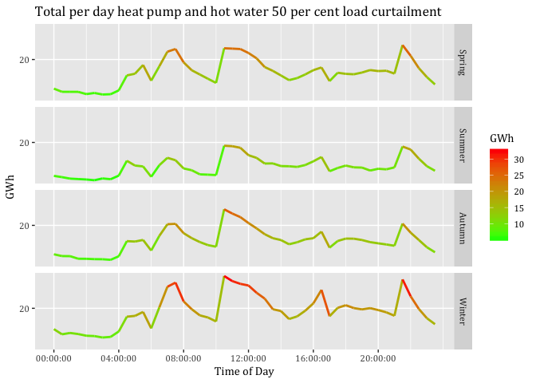<!-- -->

```r
#ggsave("Total heat pump and hot water 50 per cent load curtailment.jpeg", dpi = 600)
```

###Potential load curtailment heat pump and hot water based on percentage

```r
sc3data <- sc3data[, .(PotCur = sum(GWh)),
                   keyby = .(season, Period)]
sc3data
```

```
##     season       Period    PotCur
##  1: Spring Evening Peak 132.02903
##  2: Spring Morning Peak 148.79037
##  3: Spring     Not Peak 434.03483
##  4: Summer Evening Peak  89.82719
##  5: Summer Morning Peak  87.12973
##  6: Summer     Not Peak 338.85205
##  7: Autumn Evening Peak 120.88092
##  8: Autumn Morning Peak 137.02524
##  9: Autumn     Not Peak 416.75902
## 10: Winter Evening Peak 172.94005
## 11: Winter Morning Peak 181.78049
## 12: Winter     Not Peak 558.35746
```
##Load shifting to prior times: SC3

```r
sc3data <- heatPumpProfileDT
sc3data[, c("medianW", "obsHourMin", "meanW", "nObs", "sdW",
            "scaledMWmethod1", "EECApmMethod2"):=NULL] #Deleting unnecessary columns
```

```
## Warning in `[.data.table`(sc3data, , `:=`(c("medianW", "obsHourMin",
## "meanW", : Adding new column 'medianW' then assigning NULL (deleting it).
```

```
## Warning in `[.data.table`(sc3data, , `:=`(c("medianW", "obsHourMin",
## "meanW", : Adding new column 'obsHourMin' then assigning NULL (deleting
## it).
```

```
## Warning in `[.data.table`(sc3data, , `:=`(c("medianW", "obsHourMin",
## "meanW", : Adding new column 'meanW' then assigning NULL (deleting it).
```

```
## Warning in `[.data.table`(sc3data, , `:=`(c("medianW", "obsHourMin",
## "meanW", : Adding new column 'nObs' then assigning NULL (deleting it).
```

```
## Warning in `[.data.table`(sc3data, , `:=`(c("medianW", "obsHourMin",
## "meanW", : Adding new column 'sdW' then assigning NULL (deleting it).
```

```
## Warning in `[.data.table`(sc3data, , `:=`(c("medianW", "obsHourMin",
## "meanW", : Adding new column 'scaledMWmethod1' then assigning NULL
## (deleting it).
```

```
## Warning in `[.data.table`(sc3data, , `:=`(c("medianW", "obsHourMin",
## "meanW", : Adding new column 'EECApmMethod2' then assigning NULL (deleting
## it).
```

```r
  sc3data <- sc3data[, .(GWhHP = sum(scaledGWh)), 
                    keyby = .(season, obsHalfHour)]


#Defining peak and off-peak periods
sc3data <- sc3data[, Period := "Not Peak"]

sc3data <- sc3data[obsHalfHour >= MPS & 
                     obsHalfHour <= MPE,
                   Period := "Morning Peak"]

sc3data <- sc3data[obsHalfHour >= EPS & 
                     obsHalfHour <= EPE,
                   Period := "Evening Peak"]

sc3data <- sc3data[obsHalfHour >= OP1S & 
                     obsHalfHour <= OP1E,
                   Period := "Off Peak 1"]

sc3data <- sc3data[obsHalfHour >= OP12S & 
                     obsHalfHour <= OP12E,
                   Period := "Off Peak 1"]

sc3data <- sc3data[obsHalfHour >= OP2S & 
                     obsHalfHour <= OP2E,
                   Period := "Off Peak 2"]


sc4data <- hotWaterProfileDT

sc4data <- sc4data[, .(GWhHW = sum(scaledGWh)), 
                    keyby = .(season, obsHalfHour)]

sc4data <- sc4data[, Period := "Not Peak"]

sc4data <- sc4data[obsHalfHour >= MPS & 
                     obsHalfHour <= MPE,
                   Period := "Morning Peak"]

sc4data <- sc4data[obsHalfHour >= EPS & 
                     obsHalfHour <= EPE,
                   Period := "Evening Peak"]

sc4data <- sc4data[obsHalfHour >= OP1S & 
                     obsHalfHour <= OP1E,
                   Period := "Off Peak 1"]

sc4data <- sc4data[obsHalfHour >= OP12S & 
                     obsHalfHour <= OP12E,
                   Period := "Off Peak 1"]

sc4data <- sc4data[obsHalfHour >= OP2S & 
                     obsHalfHour <= OP2E,
                   Period := "Off Peak 2"]


sc3data <- cbind(sc3data, sc4data[,"GWhHW"])


sc3data <- sc3data[, PumpandWater := GWhHP + GWhHW]


#Building the sum of each peak period by season
AuMP3 <- sc3data[season == "Autumn" & Period == "Morning Peak",
                sum(PumpandWater)]
WiMP3 <- sc3data[season == "Winter" & Period == "Morning Peak",
                sum(PumpandWater)]
SpMP3 <- sc3data[season == "Spring" & Period == "Morning Peak",
                sum(PumpandWater)]
SuMP3 <- sc3data[season == "Summer" & Period == "Morning Peak",
                sum(PumpandWater)]

AuEP3 <- sc3data[season == "Autumn" & Period == "Evening Peak",
                sum(PumpandWater)]
WiEP3 <- sc3data[season == "Winter" & Period == "Evening Peak",
                sum(PumpandWater)]
SpEP3 <- sc3data[season == "Spring" & Period == "Evening Peak",
                sum(PumpandWater)]
SuEP3 <- sc3data[season == "Summer" & Period == "Evening Peak",
                sum(PumpandWater)]


#Counting number of rows that will be associated to spread the Morning Peak
AuMPHalfHours3 <- nrow(sc3data[season == "Autumn" &
                              Period == "Off Peak 1"])
WiMPHalfHours3 <- nrow(sc3data[season == "Winter" &
                              Period == "Off Peak 1"])
SpMPHalfHours3 <- nrow(sc3data[season == "Spring" &
                              Period == "Off Peak 1"])
SuMPHalfHours3 <- nrow(sc3data[season == "Summer" &
                              Period == "Off Peak 1"])

#Counting number of rows that will be associated to spread the Evening Peak
AuEPHalfHours3 <- nrow(sc3data[season == "Autumn" &
                              Period == "Off Peak 2"])
WiEPHalfHours3 <- nrow(sc3data[season == "Winter" &
                              Period == "Off Peak 2"])
SpEPHalfHours3 <- nrow(sc3data[season == "Spring" &
                              Period == "Off Peak 2"])
SuEPHalfHours3 <- nrow(sc3data[season == "Summer" &
                              Period == "Off Peak 2"])

#Calculating the proportion that each row will take on to spread the GWhs
distGWhOP1Au3 <- AuMP3/AuMPHalfHours3
distGWhOP1Wi3 <- WiMP3/WiMPHalfHours3
distGWhOP1Sp3 <- SpMP3/SpMPHalfHours3
distGWhOP1Su3 <- SuMP3/SuMPHalfHours3

distGWhOP2Au3 <- AuEP3/AuEPHalfHours3
distGWhOP2Wi3 <- WiEP3/WiEPHalfHours3
distGWhOP2Sp3 <- SpEP3/SpEPHalfHours3
distGWhOP2Su3 <- SuEP3/SuEPHalfHours3


#Adding amount of spreaded peak consumption to off-peak periods
sc3data <- sc3data[season == "Autumn" &
                     Period == "Off Peak 1", GWhs4 :=
                     PumpandWater + distGWhOP1Au3]
sc3data <- sc3data[season == "Winter" &
                     Period == "Off Peak 1", GWhs4 :=
                     PumpandWater + distGWhOP1Wi3]
sc3data <- sc3data[season == "Spring" &
                     Period == "Off Peak 1", GWhs4 :=
                     PumpandWater + distGWhOP1Sp3]
sc3data <- sc3data[season == "Summer" &
                     Period == "Off Peak 1", GWhs4 :=
                     PumpandWater + distGWhOP1Su3]


sc3data <- sc3data[season == "Autumn" &
                     Period == "Off Peak 2", GWhs4 :=
                     PumpandWater + distGWhOP2Au3]
sc3data <- sc3data[season == "Winter" &
                     Period == "Off Peak 2", GWhs4 :=
                     PumpandWater + distGWhOP2Wi3]
sc3data <- sc3data[season == "Spring" &
                     Period == "Off Peak 2", GWhs4 :=
                     PumpandWater + distGWhOP2Sp3]
sc3data <- sc3data[season == "Summer" &
                     Period == "Off Peak 2", GWhs4 :=
                     PumpandWater + distGWhOP2Su3]


#Setting missing values in peak periods to NULL
sc3data <- sc3data[, GWhs4:= ifelse(Period =="Morning Peak",
                                  0, GWhs4)]
sc3data <- sc3data[, GWhs4:= ifelse(Period =="Evening Peak",
                                  0, GWhs4)]


#Renaming GWhs3 into GWh to depict the right text in the colorbar
#setnames(sc2data, old=c("GWhs4"), new=c("GWh"))

#Visualising only shifted consumption
#myPlot <- ggplot2::ggplot(sc2data, aes(x = obsHalfHour, color=GWh)) +
  #geom_line(aes(y=GWh), size=0.5) +
  #theme(text = element_text(family = "Cambria")) +
  #ggtitle("Total shifted New Zealand half hour heat pump energy consumption by season for 2015") +
  #facet_grid(season ~ .) +
  #labs(x='Time of Day', y='GWh') +
  #scale_y_continuous(breaks = c(10, 20, 30, 40)) +
  #scale_x_time(breaks = c(hms::as.hms("00:00:00"), hms::as.hms("03:00:00"), hms::as.hms("06:00:00"),       hms::as.hms("09:00:00"), hms::as.hms("12:00:00"), 
  #hms::as.hms("15:00:00"), hms::as.hms("18:00:00"), hms::as.hms("21:00:00"))) +
  #scale_colour_gradient(low= "green", high="red", guide = "colorbar")

#myPlot

#Visualising shifted and original consumption
#myPlot <- ggplot2::ggplot(sc2data, aes(x = obsHalfHour)) +
 # geom_line(aes(y=GWh, color=GWh), size=0.5) +
 # geom_line(aes(y=GWhs4, color=GWhs4), size=0.5) +
 # theme(text = element_text(family = "Cambria")) +
 # ggtitle("Original and shifted New Zealand half hour heat pump energy consumption by season for 2015") +
#  facet_grid(season ~ .) +
#  labs(x='Time of Day', y='GWh') +
 # scale_y_continuous(breaks = c(10, 20, 30, 40)) +
#  scale_x_time(breaks = c(hms::as.hms("00:00:00"), hms::as.hms("03:00:00"), hms::as.hms("06:00:00"),       hms::as.hms("09:00:00"), hms::as.hms("12:00:00"), 
#  hms::as.hms("15:00:00"), hms::as.hms("18:00:00"), hms::as.hms("21:00:00"))) +
 # scale_color_gradient(low= "green", high="red")

#myPlot

#Change the order in facet_grid()
sc3data$season <- factor(sc3data$season, levels = c("Spring","Summer",
                                                    "Autumn", "Winter"))


#Visualising shifted and original consumption two colours
  myPlot <- ggplot2::ggplot(sc3data, aes(x = obsHalfHour)) +
  geom_line(aes(y=GWhs4, color="red"), size=0.5) +
  geom_line(aes(y=PumpandWater, color="blue"), size=0.5) +
  geom_line(aes(y=GWhHP, color="green"), size=0.5) + 
  geom_line(aes(y=GWhHW, color="black"), size=0.5) +
  theme(text = element_text(family = "Cambria")) +
  ggtitle("Heat pump and hot water appliances together in GWh") +
  scale_colour_manual(name = element_blank(), 
        values = c('red'='red','blue'='blue', 'green'='green', 'black'='black'), labels = c('Orig. HW', 'Orig. HP & HW', 'Orig. HP', 'Shif. HP & HW')) +
  facet_grid(season ~ .) +
  labs(x='Time of Day', y='GWh') +
  #scale_y_continuous(breaks = c(20, 40, 60, 80)) +
  scale_x_time(breaks = c(hms::as.hms("00:00:00"), hms::as.hms("04:00:00"), hms::as.hms("08:00:00"),       hms::as.hms("12:00:00"), hms::as.hms("16:00:00"), 
  hms::as.hms("20:00:00"))) 


myPlot
```

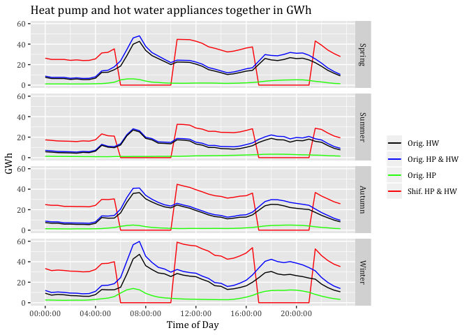<!-- -->

```r
#ggsave("Heat pump and hot water appliances together in GWh.jpeg", dpi = 600)
```
#All three appliances together
##Generating refrigeration profile

```r
totalGWH<-2074 #EECA fro refrigeration in 2015
nzHouseholds <- 1004329 + 453135

refrigerationProfileDT <- copy(heatPumpProfileDT)
refrigerationProfileDT <- refrigerationProfileDT[, scaledGWh := 2074/.N]#Spreading GWh equally

#myPlot <- ggplot2::ggplot(refrigerationProfileDT, aes(x = obsHalfHour, colour = season)) +
 # geom_point(aes(y = scaledGWh)) +
 # facet_grid(season ~ .) +
 #labs(x='Time of Day', y='GWh')

#myPlot
```
##Load curtailment to zero

```r
#Defining peak and off-peak for heat pump and hot water seperately
sc3data <- heatPumpProfileDT


sc3data <- sc3data[, .(GWhHP = sum(scaledGWh)), 
                    keyby = .(season, obsHalfHour)]

sc3data <- sc3data[, Period := "Not Peak"]

sc3data <- sc3data[obsHalfHour >= MPS & 
                     obsHalfHour <= MPE,
                   Period := "Morning Peak"]

sc3data <- sc3data[obsHalfHour >= EPS & 
                     obsHalfHour <= EPE,
                   Period := "Evening Peak"]

sc3data <- sc3data[obsHalfHour >= OP1S & 
                     obsHalfHour <= OP1E,
                   Period := "Off Peak 1"]

sc3data <- sc3data[obsHalfHour >= OP12S & 
                     obsHalfHour <= OP12E,
                   Period := "Off Peak 1"]

sc3data <- sc3data[obsHalfHour >= OP2S & 
                     obsHalfHour <= OP2E,
                   Period := "Off Peak 2"]


sc32data <- hotWaterProfileDT

sc32data <- sc32data[, .(GWhHW = sum(scaledGWh)), 
                    keyby = .(season, obsHalfHour)]

sc32data <- sc32data[, Period := "Not Peak"]

sc32data <- sc32data[obsHalfHour >= MPS & 
                     obsHalfHour <= MPE,
                   Period := "Morning Peak"]

sc32data <- sc32data[obsHalfHour >= EPS & 
                     obsHalfHour <= EPE,
                   Period := "Evening Peak"]

sc32data <- sc32data[obsHalfHour >= OP1S & 
                     obsHalfHour <= OP1E,
                   Period := "Off Peak 1"]

sc32data <- sc32data[obsHalfHour >= OP12S & 
                     obsHalfHour <= OP12E,
                   Period := "Off Peak 1"]

sc32data <- sc32data[obsHalfHour >= OP2S & 
                     obsHalfHour <= OP2E,
                   Period := "Off Peak 2"]


sc5data <- refrigerationProfileDT

sc5data <- sc5data[, .(GWhREF = sum(scaledGWh)), 
                    keyby = .(season, obsHalfHour)]

sc5data <- sc5data[, Period := "Not Peak"]

sc5data <- sc5data[obsHalfHour >= MPS & 
                     obsHalfHour <= MPE,
                   Period := "Morning Peak"]

sc5data <- sc5data[obsHalfHour >= EPS & 
                     obsHalfHour <= EPE,
                   Period := "Evening Peak"]

sc5data <- sc5data[obsHalfHour >= OP1S & 
                     obsHalfHour <= OP1E,
                   Period := "Off Peak 1"]

sc5data <- sc5data[obsHalfHour >= OP12S & 
                     obsHalfHour <= OP12E,
                   Period := "Off Peak 1"]

sc5data <- sc5data[obsHalfHour >= OP2S & 
                     obsHalfHour <= OP2E,
                   Period := "Off Peak 2"]

#Copying hot water consumption column into heat pump data table
sc3data <- cbind(sc3data, sc32data[,"GWhHW"], sc5data[,"GWhREF"])

#Building sum of heat pump and hot water consumption
sc3data <- sc3data[, PumpandWater := GWhHP + GWhHW + GWhREF]

sc3data$season <- factor(sc3data$season, levels = c("Spring","Summer",
                                                    "Autumn", "Winter"))

#Visualising peak ond off-peak
myPlot <- ggplot2::ggplot(sc3data, aes(x = obsHalfHour, color=Period)) +
  geom_point(aes(y=PumpandWater), size=1, alpha = 1) +
  theme(text = element_text(family = "Cambria")) +
  ggtitle("Total consumption heat pump, hot water, refrigeration by season") +
  facet_grid(season ~ .) +
  labs(x='Time of Day', y='GWh') +
 #scale_y_continuous(breaks = c(20, 40, 60, 80)) +
  scale_color_discrete(breaks=c("Off Peak 1", "Morning Peak", "Off Peak 2",
                                "Evening Peak")) +
  scale_x_time(breaks = c(hms::as.hms("00:00:00"), hms::as.hms("04:00:00"), hms::as.hms("08:00:00"),       hms::as.hms("12:00:00"), hms::as.hms("16:00:00"), 
  hms::as.hms("20:00:00"))) 
  #scale_colour_gradient(low= "green", high="red", guide = "colorbar")

myPlot
```

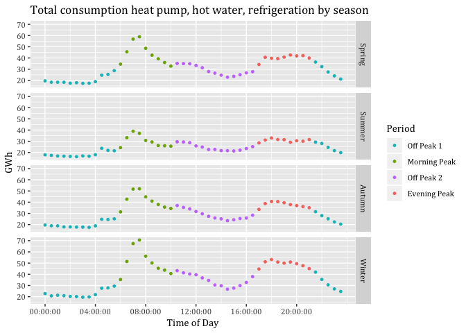<!-- -->

```r
#ggsave("Total consumption heat pump, hot water, refrigeration by season.jpeg", dpi = 600)
```
###Potential load curtailment


```r
sc3data <- sc3data[, .(PotCur = sum(PumpandWater)),
                   keyby = .(season, Period)]
sc3data
```

```
##     season       Period   PotCur
##  1: Spring Evening Peak 361.2768
##  2: Spring Morning Peak 394.7995
##  3: Spring   Off Peak 1 383.5663
##  4: Spring   Off Peak 2 374.5310
##  5: Summer Evening Peak 276.8731
##  6: Summer Morning Peak 271.4782
##  7: Summer   Off Peak 1 343.6945
##  8: Summer   Off Peak 2 319.2201
##  9: Autumn Evening Peak 338.9806
## 10: Autumn Morning Peak 371.2692
## 11: Autumn   Off Peak 1 367.2420
## 12: Autumn   Off Peak 2 373.5795
## 13: Winter Evening Peak 443.0988
## 14: Winter Morning Peak 460.7797
## 15: Winter   Off Peak 1 431.6646
## 16: Winter   Off Peak 2 450.7553
```
###Visualising curtailed periods


```r
#Defining peak and off-peak for heat pump and hot water seperately
sc3data <- heatPumpProfileDT


sc3data <- sc3data[, .(GWhHP = sum(scaledGWh)), 
                    keyby = .(season, obsHalfHour)]

sc3data <- sc3data[, Period := "Not Peak"]

sc3data <- sc3data[obsHalfHour >= MPS & 
                     obsHalfHour <= MPE,
                   Period := "Morning Peak"]

sc3data <- sc3data[obsHalfHour >= EPS & 
                     obsHalfHour <= EPE,
                   Period := "Evening Peak"]

sc3data <- sc3data[obsHalfHour >= OP1S & 
                     obsHalfHour <= OP1E,
                   Period := "Off Peak 1"]

sc3data <- sc3data[obsHalfHour >= OP12S & 
                     obsHalfHour <= OP12E,
                   Period := "Off Peak 1"]

sc3data <- sc3data[obsHalfHour >= OP2S & 
                     obsHalfHour <= OP2E,
                   Period := "Off Peak 2"]


sc32data <- hotWaterProfileDT

sc32data <- sc32data[, .(GWhHW = sum(scaledGWh)), 
                    keyby = .(season, obsHalfHour)]

sc32data <- sc32data[, Period := "Not Peak"]

sc32data <- sc32data[obsHalfHour >= MPS & 
                     obsHalfHour <= MPE,
                   Period := "Morning Peak"]

sc32data <- sc32data[obsHalfHour >= EPS & 
                     obsHalfHour <= EPE,
                   Period := "Evening Peak"]

sc32data <- sc32data[obsHalfHour >= OP1S & 
                     obsHalfHour <= OP1E,
                   Period := "Off Peak 1"]

sc32data <- sc32data[obsHalfHour >= OP12S & 
                     obsHalfHour <= OP12E,
                   Period := "Off Peak 1"]

sc32data <- sc32data[obsHalfHour >= OP2S & 
                     obsHalfHour <= OP2E,
                   Period := "Off Peak 2"]


sc5data <- refrigerationProfileDT

sc5data <- sc5data[, .(GWhREF = sum(scaledGWh)), 
                    keyby = .(season, obsHalfHour)]

sc5data <- sc5data[, Period := "Not Peak"]

sc5data <- sc5data[obsHalfHour >= MPS & 
                     obsHalfHour <= MPE,
                   Period := "Morning Peak"]

sc5data <- sc5data[obsHalfHour >= EPS & 
                     obsHalfHour <= EPE,
                   Period := "Evening Peak"]

sc5data <- sc5data[obsHalfHour >= OP1S & 
                     obsHalfHour <= OP1E,
                   Period := "Off Peak 1"]

sc5data <- sc5data[obsHalfHour >= OP12S & 
                     obsHalfHour <= OP12E,
                   Period := "Off Peak 1"]

sc5data <- sc5data[obsHalfHour >= OP2S & 
                     obsHalfHour <= OP2E,
                   Period := "Off Peak 2"]

#Copying hot water consumption column into heat pump data table
sc3data <- cbind(sc3data, sc32data[,"GWhHW"], sc5data[,"GWhREF"])

#Building sum of heat pump and hot water consumption
sc3data <- sc3data[, PumpandWater := GWhHP + GWhHW + GWhREF]


sc3data <- sc3data[, PumpandWater:= ifelse(Period == "Evening Peak", 0, PumpandWater )] # If Period is Evening peak then make GWh zero
                   
sc3data <- sc3data[, PumpandWater:= ifelse(Period == "Morning Peak", 0, PumpandWater )]


sc3data$season <- factor(sc3data$season, levels = c("Spring","Summer",
                                                    "Autumn", "Winter"))

#Renaming PumpandWater to depict the right y in the colorbar
setnames(sc3data, old=c("PumpandWater"), new=c("GWh"))

myPlot <- ggplot2::ggplot(sc3data, aes(x = obsHalfHour, y = GWh, color=GWh)) +
  geom_line(size=1) +
  theme(text = element_text(family = "Cambria")) +
  ggtitle("Total heat pump hot water, refrigeration load curtailment in peak time-periods by season") +
  facet_grid(season ~ .) +
  labs(x='Time of Day', y='GWh') +
 # scale_y_continuous(breaks = c(20, 40, 60, 80)) +
  scale_x_time(breaks = c(hms::as.hms("00:00:00"), hms::as.hms("04:00:00"), hms::as.hms("08:00:00"),       hms::as.hms("12:00:00"), hms::as.hms("16:00:00"), 
  hms::as.hms("20:00:00"))) +
  scale_colour_gradient(low= "green", high="red", guide = "colorbar")

myPlot
```

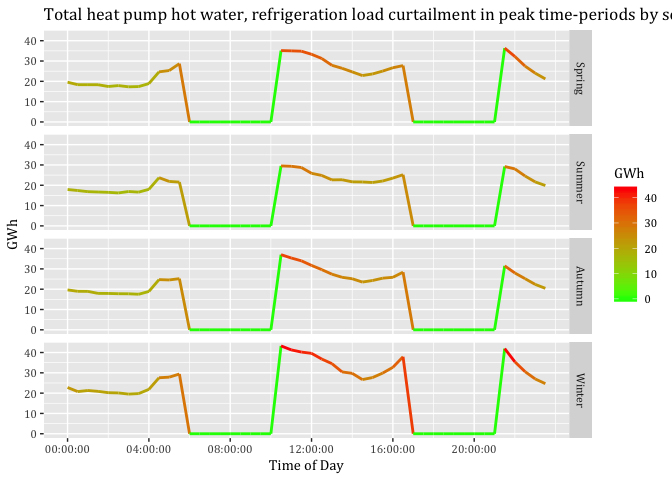<!-- -->

```r
#ggsave("Total heat pump, hot water load, refrigeration curtailment in peak time-periods by season.jpeg", dpi = 600)
```
##Load curtailment of particular amount

```r
#Defining peak and off-peak for heat pump and hot water seperately
sc3data <- heatPumpProfileDT


sc3data <- sc3data[, .(GWhHP = sum(scaledGWh)), 
                    keyby = .(season, obsHalfHour)]

sc3data <- sc3data[, Period := "Not Peak"]

sc3data <- sc3data[obsHalfHour >= MPS & 
                     obsHalfHour <= MPE,
                   Period := "Morning Peak"]

sc3data <- sc3data[obsHalfHour >= EPS & 
                     obsHalfHour <= EPE,
                   Period := "Evening Peak"]

sc3data <- sc3data[obsHalfHour >= OP1S & 
                     obsHalfHour <= OP1E,
                   Period := "Off Peak 1"]

sc3data <- sc3data[obsHalfHour >= OP12S & 
                     obsHalfHour <= OP12E,
                   Period := "Off Peak 1"]

sc3data <- sc3data[obsHalfHour >= OP2S & 
                     obsHalfHour <= OP2E,
                   Period := "Off Peak 2"]


sc32data <- hotWaterProfileDT

sc32data <- sc32data[, .(GWhHW = sum(scaledGWh)), 
                    keyby = .(season, obsHalfHour)]

sc32data <- sc32data[, Period := "Not Peak"]

sc32data <- sc32data[obsHalfHour >= MPS & 
                     obsHalfHour <= MPE,
                   Period := "Morning Peak"]

sc32data <- sc32data[obsHalfHour >= EPS & 
                     obsHalfHour <= EPE,
                   Period := "Evening Peak"]

sc32data <- sc32data[obsHalfHour >= OP1S & 
                     obsHalfHour <= OP1E,
                   Period := "Off Peak 1"]

sc32data <- sc32data[obsHalfHour >= OP12S & 
                     obsHalfHour <= OP12E,
                   Period := "Off Peak 1"]

sc32data <- sc32data[obsHalfHour >= OP2S & 
                     obsHalfHour <= OP2E,
                   Period := "Off Peak 2"]


sc5data <- refrigerationProfileDT

sc5data <- sc5data[, .(GWhREF = sum(scaledGWh)), 
                    keyby = .(season, obsHalfHour)]

sc5data <- sc5data[, Period := "Not Peak"]

sc5data <- sc5data[obsHalfHour >= MPS & 
                     obsHalfHour <= MPE,
                   Period := "Morning Peak"]

sc5data <- sc5data[obsHalfHour >= EPS & 
                     obsHalfHour <= EPE,
                   Period := "Evening Peak"]

sc5data <- sc5data[obsHalfHour >= OP1S & 
                     obsHalfHour <= OP1E,
                   Period := "Off Peak 1"]

sc5data <- sc5data[obsHalfHour >= OP12S & 
                     obsHalfHour <= OP12E,
                   Period := "Off Peak 1"]

sc5data <- sc5data[obsHalfHour >= OP2S & 
                     obsHalfHour <= OP2E,
                   Period := "Off Peak 2"]

#Copying hot water consumption column into heat pump data table
sc3data <- cbind(sc3data, sc32data[,"GWhHW"], sc5data[,"GWhREF"])

#Building sum of heat pump and hot water consumption
sc3data <- sc3data[, PumpandWater := GWhHP + GWhHW + GWhREF]

sc3data <- sc3data[, PumpandWater:= ifelse(Period == "Evening Peak", PumpandWater*0.5, PumpandWater )] # If Period is Evening peak then make GWh zero
                   
sc3data <- sc3data[, PumpandWater:= ifelse(Period == "Morning Peak", PumpandWater*0.5, PumpandWater )]

#Renaming PumpandWater to depict the right y in the colorbar
setnames(sc3data, old=c("PumpandWater"), new=c("GWh"))


sc3data$season <- factor(sc3data$season, levels = c("Spring","Summer",
                                                    "Autumn", "Winter"))

myPlot <- ggplot2::ggplot(sc3data, aes(x = obsHalfHour, y = GWh, color=GWh)) +
  geom_line(size=1) +
  theme(text = element_text(family = "Cambria")) +
  ggtitle("Total heat pump, hot water, refrigeration 50 per cent load curtailment") +
  facet_grid(season ~ .) +
  labs(x='Time of Day', y='GWh') +
 # scale_y_continuous(breaks = c(20, 40, 60, 80)) +
 scale_x_time(breaks = c(hms::as.hms("00:00:00"), hms::as.hms("04:00:00"), hms::as.hms("08:00:00"),       hms::as.hms("12:00:00"), hms::as.hms("16:00:00"), 
  hms::as.hms("20:00:00")))  +
  scale_colour_gradient(low= "green", high="red", guide = "colorbar")

myPlot
```

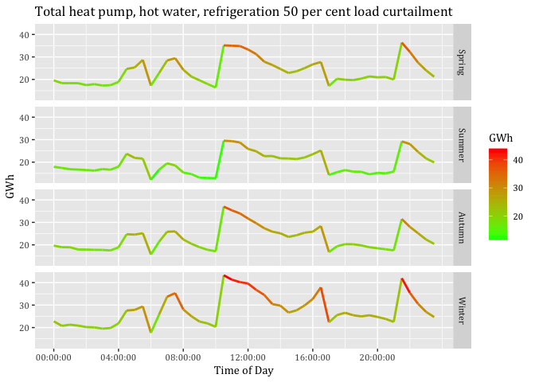<!-- -->

```r
#ggsave("Total heat pump, hot water, refrigeration 50 per cent load curtailment.jpeg", dpi = 600)
```
###Potential load curtailment heat pump and hot water based on percentage

```r
sc3data <- sc3data[, .(PotCur = sum(GWh)),
                   keyby = .(season, Period)]
sc3data
```

```
##     season       Period   PotCur
##  1: Spring Evening Peak 180.6384
##  2: Spring Morning Peak 197.3997
##  3: Spring   Off Peak 1 383.5663
##  4: Spring   Off Peak 2 374.5310
##  5: Summer Evening Peak 138.4366
##  6: Summer Morning Peak 135.7391
##  7: Summer   Off Peak 1 343.6945
##  8: Summer   Off Peak 2 319.2201
##  9: Autumn Evening Peak 169.4903
## 10: Autumn Morning Peak 185.6346
## 11: Autumn   Off Peak 1 367.2420
## 12: Autumn   Off Peak 2 373.5795
## 13: Winter Evening Peak 221.5494
## 14: Winter Morning Peak 230.3899
## 15: Winter   Off Peak 1 431.6646
## 16: Winter   Off Peak 2 450.7553
```
##Load shifting to prior times: SC3

```r
sc3data <- heatPumpProfileDT
sc3data[, c("medianW", "obsHourMin", "meanW", "nObs", "sdW",
            "scaledMWmethod1", "EECApmMethod2"):=NULL] #Deleting unnecessary columns
```

```
## Warning in `[.data.table`(sc3data, , `:=`(c("medianW", "obsHourMin",
## "meanW", : Adding new column 'medianW' then assigning NULL (deleting it).
```

```
## Warning in `[.data.table`(sc3data, , `:=`(c("medianW", "obsHourMin",
## "meanW", : Adding new column 'obsHourMin' then assigning NULL (deleting
## it).
```

```
## Warning in `[.data.table`(sc3data, , `:=`(c("medianW", "obsHourMin",
## "meanW", : Adding new column 'meanW' then assigning NULL (deleting it).
```

```
## Warning in `[.data.table`(sc3data, , `:=`(c("medianW", "obsHourMin",
## "meanW", : Adding new column 'nObs' then assigning NULL (deleting it).
```

```
## Warning in `[.data.table`(sc3data, , `:=`(c("medianW", "obsHourMin",
## "meanW", : Adding new column 'sdW' then assigning NULL (deleting it).
```

```
## Warning in `[.data.table`(sc3data, , `:=`(c("medianW", "obsHourMin",
## "meanW", : Adding new column 'scaledMWmethod1' then assigning NULL
## (deleting it).
```

```
## Warning in `[.data.table`(sc3data, , `:=`(c("medianW", "obsHourMin",
## "meanW", : Adding new column 'EECApmMethod2' then assigning NULL (deleting
## it).
```

```r
  sc3data <- sc3data[, .(GWhHP = sum(scaledGWh)), 
                    keyby = .(season, obsHalfHour)]


#Defining peak and off-peak periods
sc3data <- sc3data[, Period := "Not Peak"]

sc3data <- sc3data[obsHalfHour >= MPS & 
                     obsHalfHour <= MPE,
                   Period := "Morning Peak"]

sc3data <- sc3data[obsHalfHour >= EPS & 
                     obsHalfHour <= EPE,
                   Period := "Evening Peak"]

sc3data <- sc3data[obsHalfHour >= OP1S & 
                     obsHalfHour <= OP1E,
                   Period := "Off Peak 1"]

sc3data <- sc3data[obsHalfHour >= OP12S & 
                     obsHalfHour <= OP12E,
                   Period := "Off Peak 1"]

sc3data <- sc3data[obsHalfHour >= OP2S & 
                     obsHalfHour <= OP2E,
                   Period := "Off Peak 2"]


sc4data <- hotWaterProfileDT

sc4data <- sc4data[, .(GWhHW = sum(scaledGWh)), 
                    keyby = .(season, obsHalfHour)]

sc4data <- sc4data[, Period := "Not Peak"]

sc4data <- sc4data[obsHalfHour >= MPS & 
                     obsHalfHour <= MPE,
                   Period := "Morning Peak"]

sc4data <- sc4data[obsHalfHour >= EPS & 
                     obsHalfHour <= EPE,
                   Period := "Evening Peak"]

sc4data <- sc4data[obsHalfHour >= OP1S & 
                     obsHalfHour <= OP1E,
                   Period := "Off Peak 1"]

sc4data <- sc4data[obsHalfHour >= OP12S & 
                     obsHalfHour <= OP12E,
                   Period := "Off Peak 1"]

sc4data <- sc4data[obsHalfHour >= OP2S & 
                     obsHalfHour <= OP2E,
                   Period := "Off Peak 2"]


sc5data <- refrigerationProfileDT

sc5data <- sc5data[, .(GWhREF = sum(scaledGWh)), 
                    keyby = .(season, obsHalfHour)]

sc5data <- sc5data[, Period := "Not Peak"]

sc5data <- sc5data[obsHalfHour >= MPS & 
                     obsHalfHour <= MPE,
                   Period := "Morning Peak"]

sc5data <- sc5data[obsHalfHour >= EPS & 
                     obsHalfHour <= EPE,
                   Period := "Evening Peak"]

sc5data <- sc5data[obsHalfHour >= OP1S & 
                     obsHalfHour <= OP1E,
                   Period := "Off Peak 1"]

sc5data <- sc5data[obsHalfHour >= OP12S & 
                     obsHalfHour <= OP12E,
                   Period := "Off Peak 1"]

sc5data <- sc5data[obsHalfHour >= OP2S & 
                     obsHalfHour <= OP2E,
                   Period := "Off Peak 2"]


sc3data <- cbind(sc3data, sc4data[,"GWhHW"], sc5data[,"GWhREF"])


sc3data <- sc3data[, PumpandWater := GWhHP + GWhHW + GWhREF]


#Building the sum of each peak period by season
AuMP3 <- sc3data[season == "Autumn" & Period == "Morning Peak",
                sum(PumpandWater)]
WiMP3 <- sc3data[season == "Winter" & Period == "Morning Peak",
                sum(PumpandWater)]
SpMP3 <- sc3data[season == "Spring" & Period == "Morning Peak",
                sum(PumpandWater)]
SuMP3 <- sc3data[season == "Summer" & Period == "Morning Peak",
                sum(PumpandWater)]

AuEP3 <- sc3data[season == "Autumn" & Period == "Evening Peak",
                sum(PumpandWater)]
WiEP3 <- sc3data[season == "Winter" & Period == "Evening Peak",
                sum(PumpandWater)]
SpEP3 <- sc3data[season == "Spring" & Period == "Evening Peak",
                sum(PumpandWater)]
SuEP3 <- sc3data[season == "Summer" & Period == "Evening Peak",
                sum(PumpandWater)]


#Counting number of rows that will be associated to spread the Morning Peak
AuMPHalfHours3 <- nrow(sc3data[season == "Autumn" &
                              Period == "Off Peak 1"])
WiMPHalfHours3 <- nrow(sc3data[season == "Winter" &
                              Period == "Off Peak 1"])
SpMPHalfHours3 <- nrow(sc3data[season == "Spring" &
                              Period == "Off Peak 1"])
SuMPHalfHours3 <- nrow(sc3data[season == "Summer" &
                              Period == "Off Peak 1"])

#Counting number of rows that will be associated to spread the Evening Peak
AuEPHalfHours3 <- nrow(sc3data[season == "Autumn" &
                              Period == "Off Peak 2"])
WiEPHalfHours3 <- nrow(sc3data[season == "Winter" &
                              Period == "Off Peak 2"])
SpEPHalfHours3 <- nrow(sc3data[season == "Spring" &
                              Period == "Off Peak 2"])
SuEPHalfHours3 <- nrow(sc3data[season == "Summer" &
                              Period == "Off Peak 2"])

#Calculating the proportion that each row will take on to spread the GWhs
distGWhOP1Au3 <- AuMP3/AuMPHalfHours3
distGWhOP1Wi3 <- WiMP3/WiMPHalfHours3
distGWhOP1Sp3 <- SpMP3/SpMPHalfHours3
distGWhOP1Su3 <- SuMP3/SuMPHalfHours3

distGWhOP2Au3 <- AuEP3/AuEPHalfHours3
distGWhOP2Wi3 <- WiEP3/WiEPHalfHours3
distGWhOP2Sp3 <- SpEP3/SpEPHalfHours3
distGWhOP2Su3 <- SuEP3/SuEPHalfHours3


#Adding amount of spreaded peak consumption to off-peak periods
sc3data <- sc3data[season == "Autumn" &
                     Period == "Off Peak 1", GWhs4 :=
                     PumpandWater + distGWhOP1Au3]
sc3data <- sc3data[season == "Winter" &
                     Period == "Off Peak 1", GWhs4 :=
                     PumpandWater + distGWhOP1Wi3]
sc3data <- sc3data[season == "Spring" &
                     Period == "Off Peak 1", GWhs4 :=
                     PumpandWater + distGWhOP1Sp3]
sc3data <- sc3data[season == "Summer" &
                     Period == "Off Peak 1", GWhs4 :=
                     PumpandWater + distGWhOP1Su3]


sc3data <- sc3data[season == "Autumn" &
                     Period == "Off Peak 2", GWhs4 :=
                     PumpandWater + distGWhOP2Au3]
sc3data <- sc3data[season == "Winter" &
                     Period == "Off Peak 2", GWhs4 :=
                     PumpandWater + distGWhOP2Wi3]
sc3data <- sc3data[season == "Spring" &
                     Period == "Off Peak 2", GWhs4 :=
                     PumpandWater + distGWhOP2Sp3]
sc3data <- sc3data[season == "Summer" &
                     Period == "Off Peak 2", GWhs4 :=
                     PumpandWater + distGWhOP2Su3]


#Setting missing values in peak periods to NULL
sc3data <- sc3data[, GWhs4:= ifelse(Period =="Morning Peak",
                                  0, GWhs4)]
sc3data <- sc3data[, GWhs4:= ifelse(Period =="Evening Peak",
                                  0, GWhs4)]


#Renaming GWhs3 into GWh to depict the right text in the colorbar
#setnames(sc2data, old=c("GWhs4"), new=c("GWh"))

#Visualising only shifted consumption
#myPlot <- ggplot2::ggplot(sc2data, aes(x = obsHalfHour, color=GWh)) +
  #geom_line(aes(y=GWh), size=0.5) +
  #theme(text = element_text(family = "Cambria")) +
  #ggtitle("Total shifted New Zealand half hour heat pump energy consumption by season for 2015") +
  #facet_grid(season ~ .) +
  #labs(x='Time of Day', y='GWh') +
  #scale_y_continuous(breaks = c(10, 20, 30, 40)) +
  #scale_x_time(breaks = c(hms::as.hms("00:00:00"), hms::as.hms("03:00:00"), hms::as.hms("06:00:00"),       hms::as.hms("09:00:00"), hms::as.hms("12:00:00"), 
  #hms::as.hms("15:00:00"), hms::as.hms("18:00:00"), hms::as.hms("21:00:00"))) +
  #scale_colour_gradient(low= "green", high="red", guide = "colorbar")

#myPlot

#Visualising shifted and original consumption
#myPlot <- ggplot2::ggplot(sc2data, aes(x = obsHalfHour)) +
 # geom_line(aes(y=GWh, color=GWh), size=0.5) +
 # geom_line(aes(y=GWhs4, color=GWhs4), size=0.5) +
 # theme(text = element_text(family = "Cambria")) +
 # ggtitle("Original and shifted New Zealand half hour heat pump energy consumption by season for 2015") +
#  facet_grid(season ~ .) +
#  labs(x='Time of Day', y='GWh') +
 # scale_y_continuous(breaks = c(10, 20, 30, 40)) +
#  scale_x_time(breaks = c(hms::as.hms("00:00:00"), hms::as.hms("03:00:00"), hms::as.hms("06:00:00"),       hms::as.hms("09:00:00"), hms::as.hms("12:00:00"), 
#  hms::as.hms("15:00:00"), hms::as.hms("18:00:00"), hms::as.hms("21:00:00"))) +
 # scale_color_gradient(low= "green", high="red")

#myPlot

#Change the order in facet_grid()
sc3data$season <- factor(sc3data$season, levels = c("Spring","Summer",
                                                    "Autumn", "Winter"))


#Visualising shifted and original consumption two colours
  myPlot <- ggplot2::ggplot(sc3data, aes(x = obsHalfHour)) +
  geom_line(aes(y=GWhREF, color="orange"), size=0.5) +  
  geom_line(aes(y=GWhs4, color="red"), size=0.5) +
  geom_line(aes(y=PumpandWater, color="blue"), size=0.5) +
  geom_line(aes(y=GWhHP, color="green"), size=0.5) + 
  geom_line(aes(y=GWhHW, color="black"), size=0.5) +
  theme(text = element_text(family = "Cambria")) +
  ggtitle("Total heat pump, hot water, refrigeration appliances together in GWh") +
  scale_colour_manual(name = element_blank(), 
        values = c('orange'='orange', 'red'='red','blue'='blue', 'green'='green', 'black'='black'), labels = c('Orig. HW', 'Orig. HP|HW|REF', 'Orig. HP', 'Orig. REF', 'Shif. HP|HW|REF')) +
  facet_grid(season ~ .) +
  labs(x='Time of Day', y='GWh') +
  #scale_y_continuous(breaks = c(20, 40, 60, 80)) +
  scale_x_time(breaks = c(hms::as.hms("00:00:00"), hms::as.hms("04:00:00"), hms::as.hms("08:00:00"),       hms::as.hms("12:00:00"), hms::as.hms("16:00:00"), 
  hms::as.hms("20:00:00"))) 


myPlot
```

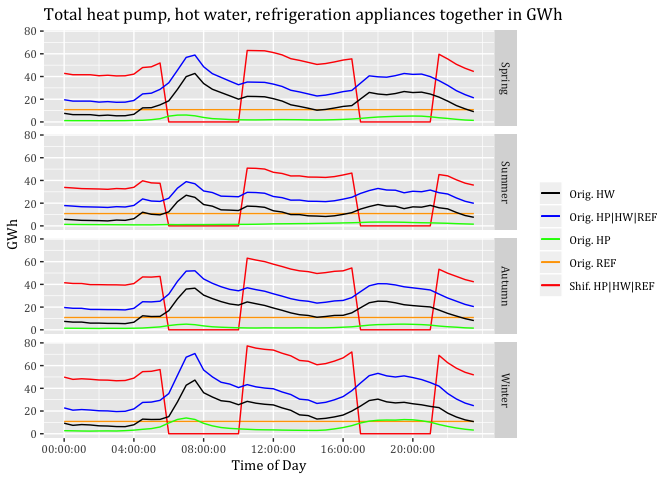<!-- -->

```r
#ggsave("Total heat pump, hot water, refrigeration appliances together in GWh.jpeg", dpi = 600)
```


#Economic analysis
## Reading original data

```r
WholesalePrices  <- "/Volumes/hum-csafe/Research Projects/GREEN Grid/externalData/EA_Wholesale_Prices/Wholesale_16-17_clean.csv"


print(paste0("Trying to load: ", WholesalePrices))
```

```
## [1] "Trying to load: /Volumes/hum-csafe/Research Projects/GREEN Grid/externalData/EA_Wholesale_Prices/Wholesale_16-17_clean.csv"
```

```r
PricesDT <- data.table::as.data.table(readr::read_csv(WholesalePrices)) # reading data
```

```
## Parsed with column specification:
## cols(
##   `Period start` = col_character(),
##   `Period end` = col_character(),
##   `Trading period` = col_integer(),
##   `Region ID` = col_character(),
##   Region = col_character(),
##   `Price ($/MWh)` = col_double()
## )
```

## Time adjustments

```r
PricesDT <- PricesDT[, dateTimeStartUTC := lubridate::dmy_hm(`Period start`)] # creating column based on orig. data
PricesDT <- PricesDT[, dateTimeStart := lubridate::force_tz(dateTimeStartUTC, tz = "Pacific/Auckland")] # changing time to NZST
PricesDT$dateTimeStartUTC <- NULL
PricesDT <- PricesDT[, dstFlag := lubridate::dst(dateTimeStart)]
#PricesDT[, .(n = .N), keyby = .(month = lubridate::month(dateTimeStart), dstFlag)]# Daylight saving test
```

## Defining seasons

```r
PricesDT <- PricesDT[, month := lubridate::month(dateTimeStart)]

PricesDT <- PricesDT[month >= 9 & month <= 11, season := "Spring"]
PricesDT <- PricesDT[month == 12 | month == 1 | month == 2, season := "Summer"]
PricesDT <- PricesDT[month == 3 | month == 4 | month == 5, season := "Autumn"]
PricesDT <- PricesDT[month == 6 | month == 7 | month == 8, season := "Winter"]
```

## Mean Price per MWh

```r
PricesDT <- PricesDT[, obsHalfHour := hms::as.hms(dateTimeStart)] # creating time column without date


SeasonAvgDT <- PricesDT[, .(meanprice = mean(`Price ($/MWh)`)), keyby = .(season, obsHalfHour, Region)]
```

### Visualisation

```r
SeasonAvgDT$season <- factor(SeasonAvgDT$season, levels = c("Spring","Summer",
                                                    "Autumn", "Winter"))

myPlot <- ggplot2::ggplot(SeasonAvgDT, aes(x = obsHalfHour)) +
  geom_line(aes(y=meanprice, color= Region), size=0.5) +
  theme(text = element_text(family = "Cambria")) +
  ggtitle("Wholesale electricity prices 01.09.2016-31.08.2017") +
  facet_grid(season ~ .) +
  labs(x='Time of Day', y='NZD/MWh') +
  scale_x_time(breaks = c(hms::as.hms("00:00:00"), hms::as.hms("04:00:00"), hms::as.hms("08:00:00"),
                          hms::as.hms("12:00:00"), hms::as.hms("16:00:00"),
                          hms::as.hms("20:00:00")))
myPlot
```

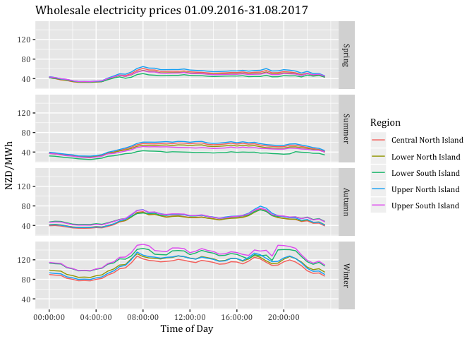<!-- -->

```r
#ggsave("Mean wholesale prices $ per MWh by season.jpeg", dpi = 600)
```

## Calculations
###Refrigeration economic value 
####Baseline value

```r
fac1000 <- 1000 # We need this conversion to display MWh as required by prices per MWh

sc0data <- refrigerationProfileDT
sc0data[, c("medianW", "obsHourMin", "meanW", "nObs", "sdW",
            "scaledMWmethod1", "EECApmMethod2"):=NULL] #Deleting unnecessary columns
```

```
## Warning in `[.data.table`(sc0data, , `:=`(c("medianW", "obsHourMin",
## "meanW", : Adding new column 'medianW' then assigning NULL (deleting it).
```

```
## Warning in `[.data.table`(sc0data, , `:=`(c("medianW", "obsHourMin",
## "meanW", : Adding new column 'obsHourMin' then assigning NULL (deleting
## it).
```

```
## Warning in `[.data.table`(sc0data, , `:=`(c("medianW", "obsHourMin",
## "meanW", : Adding new column 'meanW' then assigning NULL (deleting it).
```

```
## Warning in `[.data.table`(sc0data, , `:=`(c("medianW", "obsHourMin",
## "meanW", : Adding new column 'nObs' then assigning NULL (deleting it).
```

```
## Warning in `[.data.table`(sc0data, , `:=`(c("medianW", "obsHourMin",
## "meanW", : Adding new column 'sdW' then assigning NULL (deleting it).
```

```
## Warning in `[.data.table`(sc0data, , `:=`(c("medianW", "obsHourMin",
## "meanW", : Adding new column 'scaledMWmethod1' then assigning NULL
## (deleting it).
```

```
## Warning in `[.data.table`(sc0data, , `:=`(c("medianW", "obsHourMin",
## "meanW", : Adding new column 'EECApmMethod2' then assigning NULL (deleting
## it).
```

```r
sc0data <- sc0data[, .(GWhs1 = sum(scaledGWh)), 
                    keyby = .(season, obsHalfHour)]


#Defining peak and off-peak periods
sc0data <- sc0data[, Period := "Not Peak"]

sc0data <- sc0data[obsHalfHour >= MPS & 
                     obsHalfHour <= MPE,
                   Period := "Morning Peak"]

sc0data <- sc0data[obsHalfHour >= EPS & 
                     obsHalfHour <= EPE,
                   Period := "Evening Peak"]

sc0data <- sc0data[obsHalfHour >= OP1S & 
                     obsHalfHour <= OP1E,
                   Period := "Off Peak 1"]

sc0data <- sc0data[obsHalfHour >= OP12S & 
                     obsHalfHour <= OP12E,
                   Period := "Off Peak 1"]

sc0data <- sc0data[obsHalfHour >= OP2S & 
                     obsHalfHour <= OP2E,
                   Period := "Off Peak 2"]


#Economic evaluation begins
sc0data <- sc0data[, MWh:=GWhs1*fac1000] # Creating new column GWh based on GWhs1 in MWh


setkey(SeasonAvgDT, season, obsHalfHour)
setkey(sc0data, season, obsHalfHour)

Mergedsc0DT <- sc0data[SeasonAvgDT]

Mergedsc0DT <- Mergedsc0DT[, ecoValueHH := 0]

Mergedsc0DT <- Mergedsc0DT[, MWh := MWh/5]

Mergedsc0DT <- Mergedsc0DT[, ecoValueHH := MWh * (meanprice)/1000000, 
                           keyby = .(season, Region, obsHalfHour)]

#Change the order in facet_grid()
Mergedsc0DT$season <- factor(Mergedsc0DT$season, levels = c("Spring","Summer",
                                                    "Autumn", "Winter"))


#ggsave("Cost baseline scenario time of day.jpeg", dpi = 600)

#Building season sum by period
#Mergedsc0DT <- Mergedsc0DT[, .(EcoVal = sum(ecoValueHH)),
                   #keyby = .(season, Region, Period)]
```
####Load curtailment to zero SC1


```r
fac1000 <- 1000 # We need this conversion to display MWh as required by prices per MWh

sc1data <- refrigerationProfileDT
sc1data[, c("medianW", "obsHourMin", "meanW", "nObs", "sdW",
            "scaledMWmethod1", "EECApmMethod2"):=NULL] #Deleting unnecessary columns
```

```
## Warning in `[.data.table`(sc1data, , `:=`(c("medianW", "obsHourMin",
## "meanW", : Adding new column 'medianW' then assigning NULL (deleting it).
```

```
## Warning in `[.data.table`(sc1data, , `:=`(c("medianW", "obsHourMin",
## "meanW", : Adding new column 'obsHourMin' then assigning NULL (deleting
## it).
```

```
## Warning in `[.data.table`(sc1data, , `:=`(c("medianW", "obsHourMin",
## "meanW", : Adding new column 'meanW' then assigning NULL (deleting it).
```

```
## Warning in `[.data.table`(sc1data, , `:=`(c("medianW", "obsHourMin",
## "meanW", : Adding new column 'nObs' then assigning NULL (deleting it).
```

```
## Warning in `[.data.table`(sc1data, , `:=`(c("medianW", "obsHourMin",
## "meanW", : Adding new column 'sdW' then assigning NULL (deleting it).
```

```
## Warning in `[.data.table`(sc1data, , `:=`(c("medianW", "obsHourMin",
## "meanW", : Adding new column 'scaledMWmethod1' then assigning NULL
## (deleting it).
```

```
## Warning in `[.data.table`(sc1data, , `:=`(c("medianW", "obsHourMin",
## "meanW", : Adding new column 'EECApmMethod2' then assigning NULL (deleting
## it).
```

```r
sc1data <- sc1data[, .(GWhs1 = sum(scaledGWh)), 
                    keyby = .(season, obsHalfHour)]


#Defining peak and off-peak periods
sc1data <- sc1data[, Period := "Not Peak"]

sc1data <- sc1data[obsHalfHour >= MPS & 
                     obsHalfHour <= MPE,
                   Period := "Morning Peak"]

sc1data <- sc1data[obsHalfHour >= EPS & 
                     obsHalfHour <= EPE,
                   Period := "Evening Peak"]

sc1data <- sc1data[obsHalfHour >= OP1S & 
                     obsHalfHour <= OP1E,
                   Period := "Off Peak 1"]

sc1data <- sc1data[obsHalfHour >= OP12S & 
                     obsHalfHour <= OP12E,
                   Period := "Off Peak 1"]

sc1data <- sc1data[obsHalfHour >= OP2S & 
                     obsHalfHour <= OP2E,
                   Period := "Off Peak 2"]


#Economic evaluation begins
sc1data <- sc1data[, MWh:=GWhs1*fac1000] # Creating new column GWh based on GWhs1 in MWh


setkey(SeasonAvgDT, season, obsHalfHour)
setkey(sc1data, season, obsHalfHour)

Mergedsc1DT <- sc1data[SeasonAvgDT]

Mergedsc1DT <- Mergedsc1DT[, ecoValueHH := 0]
Mergedsc1DT <- Mergedsc1DT[, MWh := MWh / 5]

Mergedsc1DT <- Mergedsc1DT[, ecoValueHH := ifelse(Period == "Morning Peak" | 
                                                  Period == "Evening Peak",
                                                (`MWh` * (-meanprice)),
                                                (MWh * (meanprice))),
                           keyby = .(season, Region, obsHalfHour)] 


#Change the order in facet_grid()
Mergedsc1DT$season <- factor(Mergedsc1DT$season, levels = c("Spring","Summer",
                                                    "Autumn", "Winter"))


#Mergedsc1DT <- Mergedsc1DT[, .(EcoVal = sum(ecoValueHH)),
                   #keyby = .(Region, season, Period)]
```

####Load curtailment of particular amount: SC2


```r
fac1000 <- 1000 # We need this conversion to display MWh as required by prices per MWh

sc2data <- refrigerationProfileDT
sc2data[, c("medianW", "obsHourMin", "meanW", "nObs", "sdW",
            "scaledMWmethod1", "EECApmMethod2"):=NULL] #Deleting unnecessary columns
```

```
## Warning in `[.data.table`(sc2data, , `:=`(c("medianW", "obsHourMin",
## "meanW", : Adding new column 'medianW' then assigning NULL (deleting it).
```

```
## Warning in `[.data.table`(sc2data, , `:=`(c("medianW", "obsHourMin",
## "meanW", : Adding new column 'obsHourMin' then assigning NULL (deleting
## it).
```

```
## Warning in `[.data.table`(sc2data, , `:=`(c("medianW", "obsHourMin",
## "meanW", : Adding new column 'meanW' then assigning NULL (deleting it).
```

```
## Warning in `[.data.table`(sc2data, , `:=`(c("medianW", "obsHourMin",
## "meanW", : Adding new column 'nObs' then assigning NULL (deleting it).
```

```
## Warning in `[.data.table`(sc2data, , `:=`(c("medianW", "obsHourMin",
## "meanW", : Adding new column 'sdW' then assigning NULL (deleting it).
```

```
## Warning in `[.data.table`(sc2data, , `:=`(c("medianW", "obsHourMin",
## "meanW", : Adding new column 'scaledMWmethod1' then assigning NULL
## (deleting it).
```

```
## Warning in `[.data.table`(sc2data, , `:=`(c("medianW", "obsHourMin",
## "meanW", : Adding new column 'EECApmMethod2' then assigning NULL (deleting
## it).
```

```r
sc2data <- sc2data[, .(GWhs1 = sum(scaledGWh)), 
                    keyby = .(season, obsHalfHour)]


#Defining peak and off-peak periods
sc2data <- sc2data[, Period := "Not Peak"]

sc2data <- sc2data[obsHalfHour >= MPS & 
                     obsHalfHour <= MPE,
                   Period := "Morning Peak"]

sc2data <- sc2data[obsHalfHour >= EPS & 
                     obsHalfHour <= EPE,
                   Period := "Evening Peak"]

sc2data <- sc2data[obsHalfHour >= OP1S & 
                     obsHalfHour <= OP1E,
                   Period := "Off Peak 1"]

sc1data <- sc2data[obsHalfHour >= OP12S & 
                     obsHalfHour <= OP12E,
                   Period := "Off Peak 1"]

sc2data <- sc2data[obsHalfHour >= OP2S & 
                     obsHalfHour <= OP2E,
                   Period := "Off Peak 2"]

sc2data <- sc2data[, MWh:= ifelse(Period == "Morning Peak" |
                                    Period == "Evening Peak", GWhs1*1000*0.5, GWhs1*1000)] # Creating new column GWh based on GWhs1 in MWh


setkey(SeasonAvgDT, season, obsHalfHour)

setkey(sc2data, season, obsHalfHour)

Mergedsc2DT <- sc2data[SeasonAvgDT]

Mergedsc2DT <- Mergedsc2DT[, ecoValueHH := 0]
Mergedsc2DT <- Mergedsc2DT[, MWh := MWh / 5]

Mergedsc2DT <- Mergedsc2DT[, ecoValueHH := ifelse(Period == "Morning Peak" | 
                                                  Period == "Evening Peak",
                                                (`MWh` * (-meanprice)),
                                                MWh * (meanprice)),
                           keyby = .(season, Region, obsHalfHour)] 

#Change the order in facet_grid()
Mergedsc2DT$season <- factor(Mergedsc2DT$season, levels = c("Spring","Summer",
                                                    "Autumn", "Winter"))

#Visualising only shifted consumption
myPlot <- ggplot2::ggplot(Mergedsc2DT, aes(x = obsHalfHour)) +
  geom_point(aes(y=ecoValueHH, color= Region), size=1.5) +
  theme(text = element_text(family = "Cambria")) +
  ggtitle("Economic value of particular amount by region") +
  facet_grid(season ~ .) +
  labs(x='Time of Day', y='Economic value $/MWh') +
  scale_x_time(breaks = c(hms::as.hms("00:00:00"), hms::as.hms("03:00:00"), hms::as.hms("06:00:00"),
                          hms::as.hms("09:00:00"), hms::as.hms("12:00:00"),
                          hms::as.hms("15:00:00"), hms::as.hms("18:00:00"), hms::as.hms("21:00:00")))
myPlot
```

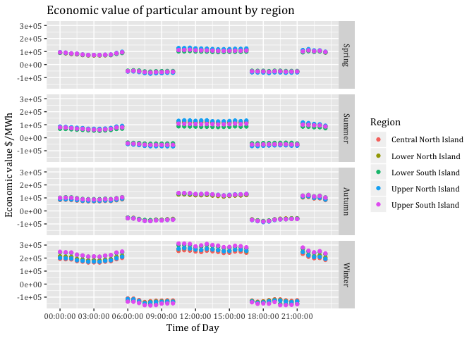<!-- -->

```r
#Mergedsc2DT <- Mergedsc2DT[, .(EcoVal = sum(ecoValueHH)),
                   #keyby = .(Region, season, Period)]
```

####Load shifting to prior time periods: SC3

```r
sc3data <- refrigerationProfileDT
sc3data[, c("medianW", "obsHourMin", "meanW", "nObs", "sdW",
            "scaledMWmethod1", "EECApmMethod2"):=NULL] #Deleting unnecessary columns
```

```
## Warning in `[.data.table`(sc3data, , `:=`(c("medianW", "obsHourMin",
## "meanW", : Adding new column 'medianW' then assigning NULL (deleting it).
```

```
## Warning in `[.data.table`(sc3data, , `:=`(c("medianW", "obsHourMin",
## "meanW", : Adding new column 'obsHourMin' then assigning NULL (deleting
## it).
```

```
## Warning in `[.data.table`(sc3data, , `:=`(c("medianW", "obsHourMin",
## "meanW", : Adding new column 'meanW' then assigning NULL (deleting it).
```

```
## Warning in `[.data.table`(sc3data, , `:=`(c("medianW", "obsHourMin",
## "meanW", : Adding new column 'nObs' then assigning NULL (deleting it).
```

```
## Warning in `[.data.table`(sc3data, , `:=`(c("medianW", "obsHourMin",
## "meanW", : Adding new column 'sdW' then assigning NULL (deleting it).
```

```
## Warning in `[.data.table`(sc3data, , `:=`(c("medianW", "obsHourMin",
## "meanW", : Adding new column 'scaledMWmethod1' then assigning NULL
## (deleting it).
```

```
## Warning in `[.data.table`(sc3data, , `:=`(c("medianW", "obsHourMin",
## "meanW", : Adding new column 'EECApmMethod2' then assigning NULL (deleting
## it).
```

```r
sc3data <- sc3data[, .(GWhs1 = sum(scaledGWh)), 
                    keyby = .(season, obsHalfHour)]


#Defining peak and off-peak periods
sc3data <- sc3data[, Period := "Not Peak"]

sc3data <- sc3data[obsHalfHour >= MPS & 
                     obsHalfHour <= MPE,
                   Period := "Morning Peak"]

sc3data <- sc3data[obsHalfHour >= EPS & 
                     obsHalfHour <= EPE,
                   Period := "Evening Peak"]

sc3data <- sc3data[obsHalfHour >= OP1S & 
                     obsHalfHour <= OP1E,
                   Period := "Off Peak 1"]

sc3data <- sc3data[obsHalfHour >= OP12S & 
                     obsHalfHour <= OP12E,
                   Period := "Off Peak 1"]

sc3data <- sc3data[obsHalfHour >= OP2S & 
                     obsHalfHour <= OP2E,
                   Period := "Off Peak 2"]

#Building the sum of each peak period by season
AuMP <- sc3data[season == "Autumn" & Period == "Morning Peak",
                sum(GWhs1)]
WiMP <- sc3data[season == "Winter" & Period == "Morning Peak",
                sum(GWhs1)]
SpMP <- sc3data[season == "Spring" & Period == "Morning Peak",
                sum(GWhs1)]
SuMP <- sc3data[season == "Summer" & Period == "Morning Peak",
                sum(GWhs1)]

AuEP <- sc3data[season == "Autumn" & Period == "Evening Peak",
                sum(GWhs1)]
WiEP <- sc3data[season == "Winter" & Period == "Evening Peak",
                sum(GWhs1)]
SpEP <- sc3data[season == "Spring" & Period == "Evening Peak",
                sum(GWhs1)]
SuEP <- sc3data[season == "Summer" & Period == "Evening Peak",
                sum(GWhs1)]


#Counting number of rows that will be associated to spread the Morning Peak
AuMPHalfHours <- nrow(sc3data[season == "Autumn" &
                              Period == "Off Peak 1"])
WiMPHalfHours <- nrow(sc3data[season == "Winter" &
                              Period == "Off Peak 1"])
SpMPHalfHours <- nrow(sc3data[season == "Spring" &
                              Period == "Off Peak 1"])
SuMPHalfHours <- nrow(sc3data[season == "Summer" &
                              Period == "Off Peak 1"])

#Counting number of rows that will be associated to spread the Evening Peak
AuEPHalfHours <- nrow(sc3data[season == "Autumn" &
                              Period == "Off Peak 2"])
WiEPHalfHours <- nrow(sc3data[season == "Winter" &
                              Period == "Off Peak 2"])
SpEPHalfHours <- nrow(sc3data[season == "Spring" &
                              Period == "Off Peak 2"])
SuEPHalfHours <- nrow(sc3data[season == "Summer" &
                              Period == "Off Peak 2"])

#Calculating the proportion that each row will take on to spread the GWhs
distGWhOP1Au <- AuMP/AuMPHalfHours
distGWhOP1Wi <- WiMP/WiMPHalfHours
distGWhOP1Sp <- SpMP/SpMPHalfHours
distGWhOP1Su <- SuMP/SuMPHalfHours

distGWhOP2Au <- AuEP/AuEPHalfHours
distGWhOP2Wi <- WiEP/WiEPHalfHours
distGWhOP2Sp <- SpEP/SpEPHalfHours
distGWhOP2Su <- SuEP/SuEPHalfHours


#Adding amount of spreaded peak consumption to off-peak periods
sc3data <- sc3data[season == "Autumn" &
                     Period == "Off Peak 1", GWhs3 :=
                     GWhs1 + distGWhOP1Au]
sc3data <- sc3data[season == "Winter" &
                     Period == "Off Peak 1", GWhs3 :=
                     GWhs1 + distGWhOP1Wi]
sc3data <- sc3data[season == "Spring" &
                     Period == "Off Peak 1", GWhs3 :=
                     GWhs1 + distGWhOP1Sp]
sc3data <- sc3data[season == "Summer" &
                     Period == "Off Peak 1", GWhs3 :=
                     GWhs1 + distGWhOP1Su]


sc3data <- sc3data[season == "Autumn" &
                     Period == "Off Peak 2", GWhs3 :=
                     GWhs1 + distGWhOP2Au]
sc3data <- sc3data[season == "Winter" &
                     Period == "Off Peak 2", GWhs3 :=
                     GWhs1 + distGWhOP2Wi]
sc3data <- sc3data[season == "Spring" &
                     Period == "Off Peak 2", GWhs3 :=
                     GWhs1 + distGWhOP2Sp]
sc3data <- sc3data[season == "Summer" &
                     Period == "Off Peak 2", GWhs3 :=
                     GWhs1 + distGWhOP2Su]


#Setting missing values in peak periods to NULL
sc3data <- sc3data[, GWhs3:= ifelse(Period =="Morning Peak",
                                  0, GWhs3)]
sc3data <- sc3data[, GWhs3:= ifelse(Period =="Evening Peak",
                                  0, GWhs3)]
#Economic value starts::

#Creating new column
sc3data <- sc3data[, DiffOrigMWh := 0]
#Calculating the amount added due to load shifting + converting to MWh
sc3data <- sc3data[, DiffOrigMWh := ifelse(GWhs3 > 0,
                                           (GWhs3-GWhs1) * 1000, (0-GWhs1 * 1000))]
#Preparation for merging DTs
setkey(SeasonAvgDT, season, obsHalfHour)
setkey(sc3data, season, obsHalfHour)

#Merging
Mergedsc3DT <- sc3data[SeasonAvgDT]
Mergedsc3DT <- Mergedsc3DT[, DiffOrigMWh := DiffOrigMWh / 5]
Mergedsc3DT <- Mergedsc3DT[, ecoValueHH := ifelse(Period == "Morning Peak" | 
                                                  Period == "Evening Peak",
                                                DiffOrigMWh * (meanprice),
                                                DiffOrigMWh * (meanprice)),
                           keyby = .(season, Region, obsHalfHour)]#WARNING DiffOrigMWh represents distinction between positive and negative already


#Change the order in facet_grid()
Mergedsc3DT$season <- factor(Mergedsc3DT$season, levels = c("Spring","Summer",
                                                    "Autumn", "Winter"))


#Putting all values together and check!
EcoVaHHDT <- copy(Mergedsc0DT)

setnames(EcoVaHHDT, old=c("ecoValueHH"), new=c("Baseline"))

EcoVaHHDT <- cbind(EcoVaHHDT, Mergedsc1DT[,"ecoValueHH"])
setnames(EcoVaHHDT, old=c("ecoValueHH"), new=c("EcoVaLc@Peak"))

EcoVaHHDT <- cbind(EcoVaHHDT, Mergedsc2DT[,"ecoValueHH"])
setnames(EcoVaHHDT, old=c("ecoValueHH"), new=c("EcoVaLc*0.5@Peak"))

EcoVaHHDT <- cbind(EcoVaHHDT, Mergedsc3DT[,"ecoValueHH"])
setnames(EcoVaHHDT, old=c("ecoValueHH"), new=c("EcoVaLs"))

EcoVaHHDT <- EcoVaHHDT[, c("GWhs1", "MWh") := NULL]

EcoVaHHDT <- EcoVaHHDT[, meanprice := meanprice + 0,
                 keyby = .(season, Region, obsHalfHour)]
```
####Visualisation refrigeration

```r
EcoVaSumDT <- copy(EcoVaHHDT)

EcoVaSumDT <- EcoVaSumDT[, Baseline := Baseline]# Converting to million $
EcoVaSumSC0DT <- EcoVaSumDT[, (Baseline = sum(Baseline)), keyby = .(Region, season, Period)]


EcoVaSumSC0DT$Period <- factor(EcoVaSumSC0DT$Period, levels = c("Off Peak 1","Morning Peak",
                                                    "Off Peak 2", "Evening Peak"))

#Analysis
CostBaseline <- sum(EcoVaSumDT$Baseline)

SavingsMillionNZD <- CostBaseline-CostBaseline
SavingsPercent <- 0#Compared to Baseline

SavingsMillionNZD
```

```
## [1] 0
```

```r
SavingsPercent
```

```
## [1] 0
```

```r
myPlot <- ggplot2::ggplot(EcoVaSumSC0DT, aes(x = Period, fill = Region)) +
  geom_bar(aes(y= V1), stat = "identity", position = "dodge") +
  #geom_line(aes(y= V1)) +
  theme(text = element_text(family = "Cambria")) +
  facet_grid(season ~ .) +
  ggtitle("Baseline scenario: Cost for heat pumps") +
  labs(x='Period', y='Cost in million NZD') 
  
myPlot 
```

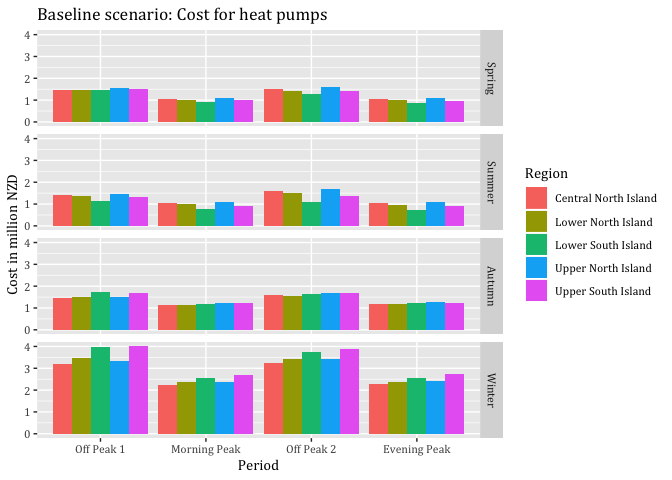<!-- -->

```r
#ggsave("Baseline scenario: Cost for heat pumps by period.jpeg", dpi = 600)

myPlot <- ggplot2::ggplot(subset(EcoVaSumSC0DT,
                                 season %in% c("Winter")), aes(x = Period, fill = Region)) +
  geom_bar(aes(y= V1), stat = "identity", position = "dodge") +
  #geom_line(aes(y= V1)) +
  theme(text = element_text(family = "Cambria")) +
  facet_grid(season ~ .) +
  ggtitle("Baseline scenario: Cost for heat pumps in winter") +
  labs(x='Period', y='Cost in million NZD') 
  
myPlot
```

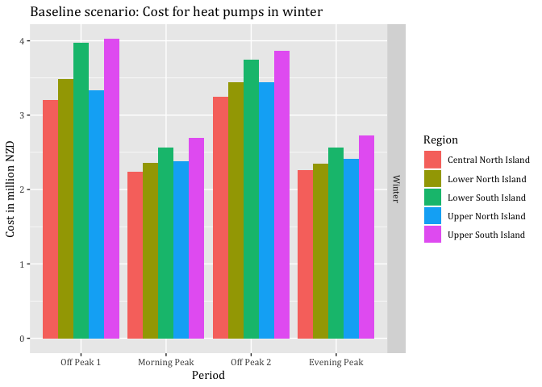<!-- -->

```r
#ggsave("Baseline scenario: Cost for heat pumps in winter by period.jpeg", dpi = 600)                        
```

```r
#Plots cost of load curtailment to zero, does not consider baseline
EcoVaSumDT <- copy(EcoVaHHDT)

EcoVaSumDT <- EcoVaSumDT[, `EcoVaLc@Peak` := ifelse(Period == "Morning Peak" |
                                                      Period == "Evening Peak", 0,
                                                    `EcoVaLc@Peak`)]
EcoVaSumDT <- EcoVaSumDT[, `EcoVaLc@Peak` := `EcoVaLc@Peak`/1000000]# Converting to million $
EcoVaSumSC1DT <- EcoVaSumDT[, (`EcoVaLc@Peak` = sum(`EcoVaLc@Peak`)), keyby = .(Region, season, Period)]

EcoVaSumSC1DT$Period <- factor(EcoVaSumSC1DT$Period, levels = c("Off Peak 1","Morning Peak",
                                                    "Off Peak 2", "Evening Peak"))

#Analysis
CostBaseline <- sum(EcoVaSumDT$Baseline)
`CostEcoVaLc@Peak` <- sum(EcoVaSumDT$`EcoVaLc@Peak`)

SavingsMillionNZD <- CostBaseline - `CostEcoVaLc@Peak`
SavingsPercent <- 1-(`CostEcoVaLc@Peak` / CostBaseline)

SavingsMillionNZD
```

```
## [1] 56.2045
```

```r
SavingsPercent
```

```
## [1] 0.4115818
```

```r
#Visualisation
myPlot <- ggplot2::ggplot(EcoVaSumSC1DT, aes(x = Period, fill = Region)) +
  geom_bar(aes(y= V1), stat = "identity", position = "dodge") +
  #geom_line(aes(y= V1)) +
  theme(text = element_text(family = "Cambria")) +
  facet_grid(season ~ .) +
  ggtitle("Load curtailment scenario: Cost for heat pumps") +
  labs(x='Period', y='Cost in million NZD') 
  
myPlot 
```

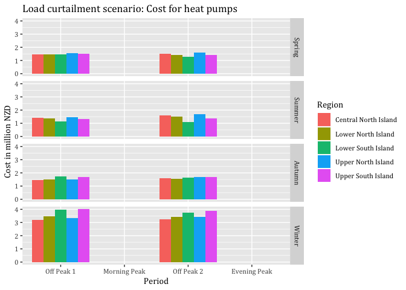<!-- -->

```r
#ggsave("Load curtailment scenario: Cost for heat pumps.jpeg", dpi = 600)

myPlot <- ggplot2::ggplot(subset(EcoVaSumSC1DT,
                                 season %in% c("Winter")), aes(x = Period, fill = Region)) +
  geom_bar(aes(y= V1), stat = "identity", position = "dodge") +
  #geom_line(aes(y= V1)) +
  theme(text = element_text(family = "Cambria")) +
  facet_grid(season ~ .) +
  ggtitle("Load curtailment scenario: Cost per day for heat pumps in winter") +
  labs(x='Period', y='Cost in million NZD') 
  
myPlot
```

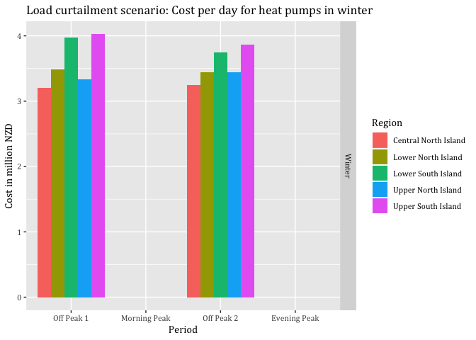<!-- -->

```r
#ggsave("Load curtailment scenario: Cost per day for heat pumps in winter.jpeg", dpi = 600)
```

```r
#Plots benefits when load is curtailed to zero 

EcoVaSumDT <- copy(EcoVaHHDT)

EcoVaSumSC1DT <- EcoVaSumDT
EcoVaSumSC1DT <- EcoVaSumSC1DT[, `EcoVaLc@Peak` := ifelse(Period == "Off Peak 1" |
                                                            Period == "Off Peak 2", 0,
                                                          `EcoVaLc@Peak`*(-1))]#We want to disply savings
EcoVaSumSC1DT <- EcoVaSumSC1DT[, `EcoVaLc@Peak` := `EcoVaLc@Peak`/1000000]# Converting to million $
EcoVaSumSC1DT <- EcoVaSumSC1DT[, (`EcoVaLc@Peak` = sum(`EcoVaLc@Peak`)), keyby = .(Region, season, Period)]


EcoVaSumSC1DT$Period <- factor(EcoVaSumSC1DT$Period, levels = c("Off Peak 1","Morning Peak",
                                                    "Off Peak 2", "Evening Peak"))

myPlot <- ggplot2::ggplot(EcoVaSumSC1DT, aes(x = Period, fill = Region)) +
  geom_bar(aes(y= V1), stat = "identity", position = "dodge") +
  #geom_line(aes(y= V1)) +
  theme(text = element_text(family = "Cambria")) +
  facet_grid(season ~ .) +
  ggtitle("Load curtailment scenario: Savings at peak time-periods for heat pumps") +
  labs(x='Period', y='Savings in million NZD') 
  
myPlot 
```

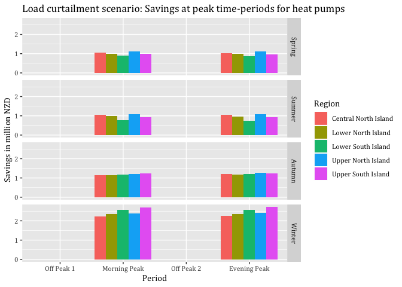<!-- -->

```r
#ggsave("Load curtailment scenario: Savings at peak time-periods for heat pumps.jpeg", dpi = 600)

myPlot <- ggplot2::ggplot(subset(EcoVaSumSC1DT,
                                 season %in% c("Winter")), aes(x = Period, fill = Region)) +
  geom_bar(aes(y= V1), stat = "identity", position = "dodge") +
  #geom_line(aes(y= V1)) +
  theme(text = element_text(family = "Cambria")) +
  facet_grid(season ~ .) +
  ggtitle("Load curtailment scenario: Savings at peak time-periods for heat pumps in winter") +
  labs(x='Period', y='Savings in million NZD') 
  
myPlot
```

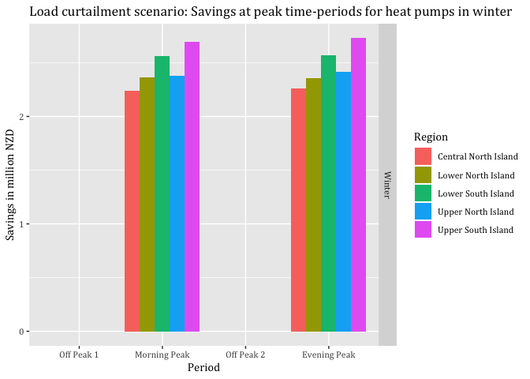<!-- -->

```r
#ggsave("Load curtailment scenario: Savings at peak time-periods for heat pumps in winter.jpeg", dpi = 600)
```

```r
#Plots cost and benefits of load curtailment to 0.5, does not consider baseline
EcoVaSumDT <- copy(EcoVaHHDT)

EcoVaSumDT <- EcoVaSumDT[, `EcoVaLc*0.5@Peak` := ifelse(Period == "Morning Peak" |
                                                          Period == "Evening Peak",
                                              (Baseline*0.5)*1000000,`EcoVaLc*0.5@Peak`)]

EcoVaSumDT <- EcoVaSumDT[, `EcoVaLc*0.5@Peak` := `EcoVaLc*0.5@Peak`/1000000]# Converting to million $
EcoVaSumSC2DT <- EcoVaSumDT[, (`EcoVaLc*0.5@Peak` = sum(`EcoVaLc*0.5@Peak`)), keyby = .(Region, season, Period)]

EcoVaSumSC2DT$Period <- factor(EcoVaSumSC2DT$Period, levels = c("Off Peak 1",
                                                                "Morning Peak",
                                                                "Off Peak 2",
                                                                "Evening Peak"))

#Analysis

`CostEcoVaLc*0.5@Peak` <- sum(EcoVaSumDT$`EcoVaLc*0.5@Peak`)

SavingsMillionNZD <- CostBaseline - `CostEcoVaLc*0.5@Peak`
SavingsPercent <- 1-(`CostEcoVaLc*0.5@Peak` / CostBaseline)

SavingsMillionNZD
```

```
## [1] 28.10225
```

```r
SavingsPercent
```

```
## [1] 0.2057909
```

```r
myPlot <- ggplot2::ggplot(EcoVaSumSC2DT, aes(x = Period, fill = Region)) +
  geom_bar(aes(y= V1), stat = "identity", position = "dodge") +
  #geom_line(aes(y= V1)) +
  theme(text = element_text(family = "Cambria")) +
  facet_grid(season ~ .) +
  ggtitle("Load curtailment 0.5 scenario: Cost for heat pumps") +
  labs(x='Period', y='Cost in million NZD') 
  
myPlot 
```

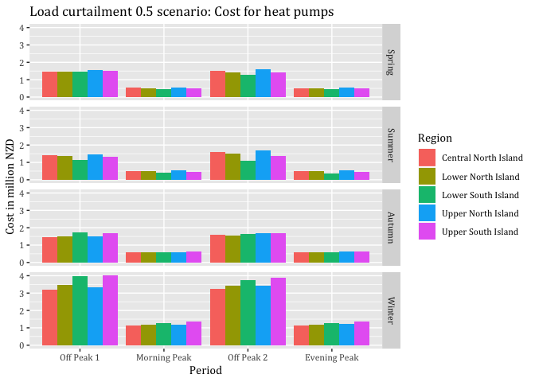<!-- -->

```r
#ggsave("Load curtailment 0.5 scenario: Cost for heat pumps.jpeg", dpi = 600)

myPlot <- ggplot2::ggplot(subset(EcoVaSumSC2DT,
                                 season %in% c("Winter")), aes(x = Period, fill = Region)) +
  geom_bar(aes(y= V1), stat = "identity", position = "dodge") +
  #geom_line(aes(y= V1)) +
  theme(text = element_text(family = "Cambria")) +
  facet_grid(season ~ .) +
  ggtitle("Load curtailment 0.5 scenario: Cost for heat pumps in winter") +
  labs(x='Period', y='Cost in million NZD') 
  
myPlot
```

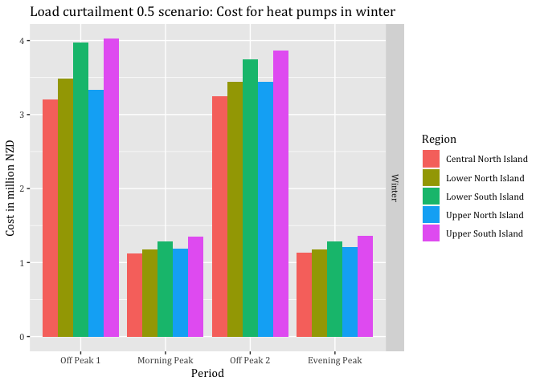<!-- -->

```r
#ggsave("Load curtailment 0.5 scenario: Cost for heat pumps in winter.jpeg", dpi = 600)
```

```r
#Plots benefits when load is curtailed to 0.5 

EcoVaSumDT <- copy(EcoVaHHDT)

EcoVaSumSC2DT <- EcoVaSumDT
EcoVaSumSC2DT <- EcoVaSumSC2DT[, `EcoVaLc*0.5@Peak` := ifelse(Period == "Off Peak 1"|
                                                            Period == "Off Peak 2",0,
                                 `EcoVaLc*0.5@Peak`*(-1))]#We want to disply savings


EcoVaSumSC2DT <- EcoVaSumSC2DT[, `EcoVaLc*0.5@Peak` := `EcoVaLc*0.5@Peak`/1000000]# Converting to million $
EcoVaSumSC2DT <- EcoVaSumSC2DT[, (`EcoVaLc*0.5@Peak` = sum(`EcoVaLc*0.5@Peak`)), keyby = .(Region, season, Period)]


EcoVaSumSC2DT$Period <- factor(EcoVaSumSC2DT$Period, levels = c("Off Peak 1","Morning Peak",
                                                    "Off Peak 2", "Evening Peak"))

myPlot <- ggplot2::ggplot(EcoVaSumSC2DT, aes(x = Period, fill = Region)) +
  geom_bar(aes(y= V1), stat = "identity", position = "dodge") +
  #geom_line(aes(y= V1)) +
  theme(text = element_text(family = "Cambria")) +
  facet_grid(season ~ .) +
  ggtitle("Load curtailment 0.5 scenario: Savings at peak time-periods for heat pumps") +
  labs(x='Period', y='Savings in million NZD') 
  
myPlot 
```

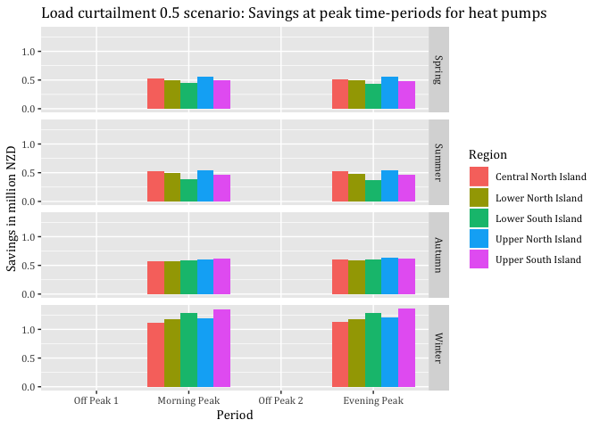<!-- -->

```r
#ggsave("Load curtailment 0.5 scenario: Savings at peak time-periods for heat pumps.jpeg", dpi = 600)

myPlot <- ggplot2::ggplot(subset(EcoVaSumSC2DT,
                                 season %in% c("Winter")), aes(x = Period, fill = Region)) +
  geom_bar(aes(y= V1), stat = "identity", position = "dodge") +
  #geom_line(aes(y= V1)) +
  theme(text = element_text(family = "Cambria")) +
  facet_grid(season ~ .) +
  ggtitle("Load curtailment 0.5 scenario: Savings at peak time-periods for heat pumps in winter") +
  labs(x='Period', y='Savings in million NZD') 
  
myPlot
```

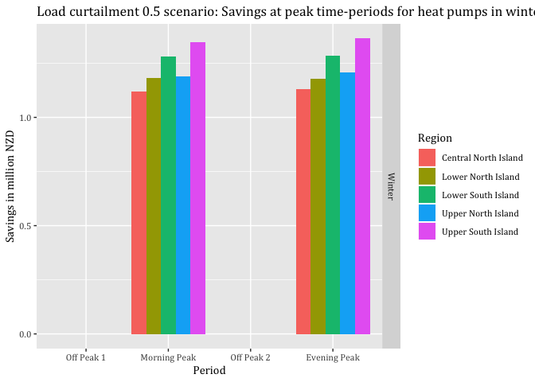<!-- -->

```r
#ggsave("Load curtailment 0.5 scenario: Savings at peak time-periods for heat pumps in winter.jpeg", dpi = 600)
```

```r
#Plots cost and benefits of load shifting, does not consider baseline but increases costs at off peaks
EcoVaSumDT <- copy(EcoVaHHDT)


EcoVaSumDT <- EcoVaSumDT[, EcoSummary := ifelse(Period == "Off Peak 1" |
                                               Period == "Off Peak 2",
                                             Baseline + (EcoVaLs/1000000), 0)]#It has to be zero 


#EcoVaSumDT <- EcoVaSumDT[, `EcoSummary` := `EcoSummary`/1000000]# Converting to million $
EcoVaSumSC3DT <- EcoVaSumDT[, (`EcoSummary` = sum(`EcoSummary`)), keyby = .(Region, season, Period)]

EcoVaSumSC3DT$Period <- factor(EcoVaSumSC3DT$Period, levels = c("Off Peak 1","Morning Peak",
                                                    "Off Peak 2", "Evening Peak"))


#Analysis
CostBaseline <- sum(EcoVaSumDT$Baseline)
`CostLoadShif` <- sum(EcoVaSumDT$`EcoSummary`)

SavingsMillionNZD <- CostBaseline - `CostLoadShif`
SavingsPercent <- 1-(`CostLoadShif` / CostBaseline)

SavingsMillionNZD
```

```
## [1] 7.089037
```

```r
SavingsPercent
```

```
## [1] 0.05191254
```

```r
myPlot <- ggplot2::ggplot(EcoVaSumSC3DT, aes(x = Period, fill = Region)) +
  geom_bar(aes(y= V1), stat = "identity", position = "dodge") +
  #geom_line(aes(y= V1)) +
  theme(text = element_text(family = "Cambria")) +
  facet_grid(season ~ .) +
  ggtitle("Load shifting scenario: Cost for heat pumps") +
  labs(x='Period', y='Cost in million NZD') 
  
myPlot 
```

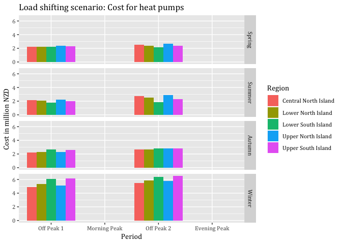<!-- -->

```r
#ggsave("Load shifting scenario: Cost for heat pumps.jpeg", dpi = 600)

myPlot <- ggplot2::ggplot(subset(EcoVaSumSC3DT,
                                 season %in% c("Winter")), aes(x = Period, fill = Region)) +
  geom_bar(aes(y= V1), stat = "identity", position = "dodge") +
  #geom_line(aes(y= V1)) +
  theme(text = element_text(family = "Cambria")) +
  facet_grid(season ~ .) +
  ggtitle("Load shifting scenario: Cost for heat pumps in winter") +
  labs(x='Period', y='Cost in million NZD') 
  
myPlot
```

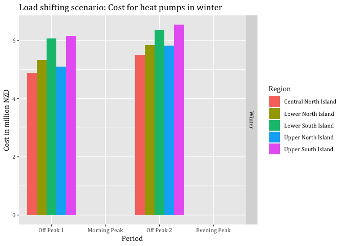<!-- -->

```r
#ggsave("Load shifting scenario: Cost for heat pumps in winter.jpeg", dpi = 600)
```
###Heat pump economic value 
####Baseline value

```r
fac1000 <- 1000 # We need this conversion to display MWh as required by prices per MWh

sc0data <- heatPumpProfileDT
sc0data[, c("medianW", "obsHourMin", "meanW", "nObs", "sdW",
            "scaledMWmethod1", "EECApmMethod2"):=NULL] #Deleting unnecessary columns
```

```
## Warning in `[.data.table`(sc0data, , `:=`(c("medianW", "obsHourMin",
## "meanW", : Adding new column 'medianW' then assigning NULL (deleting it).
```

```
## Warning in `[.data.table`(sc0data, , `:=`(c("medianW", "obsHourMin",
## "meanW", : Adding new column 'obsHourMin' then assigning NULL (deleting
## it).
```

```
## Warning in `[.data.table`(sc0data, , `:=`(c("medianW", "obsHourMin",
## "meanW", : Adding new column 'meanW' then assigning NULL (deleting it).
```

```
## Warning in `[.data.table`(sc0data, , `:=`(c("medianW", "obsHourMin",
## "meanW", : Adding new column 'nObs' then assigning NULL (deleting it).
```

```
## Warning in `[.data.table`(sc0data, , `:=`(c("medianW", "obsHourMin",
## "meanW", : Adding new column 'sdW' then assigning NULL (deleting it).
```

```
## Warning in `[.data.table`(sc0data, , `:=`(c("medianW", "obsHourMin",
## "meanW", : Adding new column 'scaledMWmethod1' then assigning NULL
## (deleting it).
```

```
## Warning in `[.data.table`(sc0data, , `:=`(c("medianW", "obsHourMin",
## "meanW", : Adding new column 'EECApmMethod2' then assigning NULL (deleting
## it).
```

```r
sc0data <- sc0data[, .(GWhs1 = sum(scaledGWh)), 
                    keyby = .(season, obsHalfHour)]


#Defining peak and off-peak periods
sc0data <- sc0data[, Period := "Not Peak"]

sc0data <- sc0data[obsHalfHour >= MPS & 
                     obsHalfHour <= MPE,
                   Period := "Morning Peak"]

sc0data <- sc0data[obsHalfHour >= EPS & 
                     obsHalfHour <= EPE,
                   Period := "Evening Peak"]

sc0data <- sc0data[obsHalfHour >= OP1S & 
                     obsHalfHour <= OP1E,
                   Period := "Off Peak 1"]

sc0data <- sc0data[obsHalfHour >= OP12S & 
                     obsHalfHour <= OP12E,
                   Period := "Off Peak 1"]

sc0data <- sc0data[obsHalfHour >= OP2S & 
                     obsHalfHour <= OP2E,
                   Period := "Off Peak 2"]


#Economic evaluation begins
sc0data <- sc0data[, MWh:=GWhs1*fac1000] # Creating new column GWh based on GWhs1 in MWh


setkey(SeasonAvgDT, season, obsHalfHour)
setkey(sc0data, season, obsHalfHour)

Mergedsc0DT <- sc0data[SeasonAvgDT]

Mergedsc0DT <- Mergedsc0DT[, ecoValueHH := 0]

Mergedsc0DT <- Mergedsc0DT[, MWh := MWh /5]

Mergedsc0DT <- Mergedsc0DT[, ecoValueHH := MWh * (meanprice)/1000000, 
                           keyby = .(season, Region, obsHalfHour)]

#Change the order in facet_grid()
Mergedsc0DT$season <- factor(Mergedsc0DT$season, levels = c("Spring","Summer",
                                                    "Autumn", "Winter"))

#Visualising
myPlot <- ggplot2::ggplot(Mergedsc0DT, aes(x = obsHalfHour)) +
  geom_point(aes(y=ecoValueHH, color= Region), size=1) +
  theme(text = element_text(family = "Cambria")) +
  ggtitle("Costs baseline scenario time of day") +
  facet_grid(season ~ .) +
  labs(x='Time of Day', y='Cost in million NZD') +
  scale_x_time(breaks = c(hms::as.hms("00:00:00"), hms::as.hms("04:00:00"), hms::as.hms("08:00:00"),
                          hms::as.hms("12:00:00"), hms::as.hms("16:00:00"),
                          hms::as.hms("20:00:00")))
myPlot
```

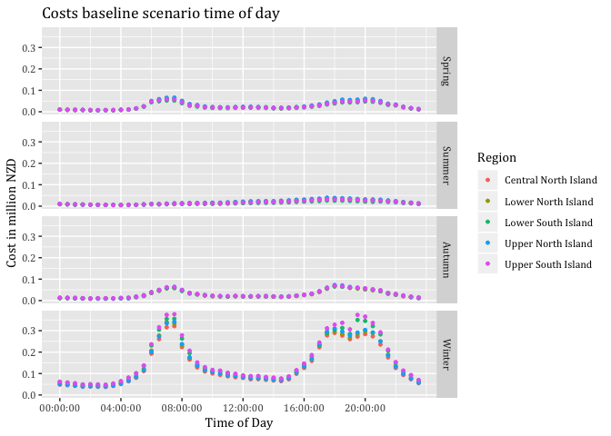<!-- -->

```r
#ggsave("Cost baseline scenario time of day.jpeg", dpi = 600)

#Building season sum by period
#Mergedsc0DT <- Mergedsc0DT[, .(EcoVal = sum(ecoValueHH)),
                   #keyby = .(season, Region, Period)]
```
####Load curtailment to zero SC1


```r
fac1000 <- 1000 # We need this conversion to display MWh as required by prices per MWh

sc1data <- heatPumpProfileDT
sc1data[, c("medianW", "obsHourMin", "meanW", "nObs", "sdW",
            "scaledMWmethod1", "EECApmMethod2"):=NULL] #Deleting unnecessary columns
```

```
## Warning in `[.data.table`(sc1data, , `:=`(c("medianW", "obsHourMin",
## "meanW", : Adding new column 'medianW' then assigning NULL (deleting it).
```

```
## Warning in `[.data.table`(sc1data, , `:=`(c("medianW", "obsHourMin",
## "meanW", : Adding new column 'obsHourMin' then assigning NULL (deleting
## it).
```

```
## Warning in `[.data.table`(sc1data, , `:=`(c("medianW", "obsHourMin",
## "meanW", : Adding new column 'meanW' then assigning NULL (deleting it).
```

```
## Warning in `[.data.table`(sc1data, , `:=`(c("medianW", "obsHourMin",
## "meanW", : Adding new column 'nObs' then assigning NULL (deleting it).
```

```
## Warning in `[.data.table`(sc1data, , `:=`(c("medianW", "obsHourMin",
## "meanW", : Adding new column 'sdW' then assigning NULL (deleting it).
```

```
## Warning in `[.data.table`(sc1data, , `:=`(c("medianW", "obsHourMin",
## "meanW", : Adding new column 'scaledMWmethod1' then assigning NULL
## (deleting it).
```

```
## Warning in `[.data.table`(sc1data, , `:=`(c("medianW", "obsHourMin",
## "meanW", : Adding new column 'EECApmMethod2' then assigning NULL (deleting
## it).
```

```r
sc1data <- sc1data[, .(GWhs1 = sum(scaledGWh)), 
                    keyby = .(season, obsHalfHour)]


#Defining peak and off-peak periods
sc1data <- sc1data[, Period := "Not Peak"]

sc1data <- sc1data[obsHalfHour >= MPS & 
                     obsHalfHour <= MPE,
                   Period := "Morning Peak"]

sc1data <- sc1data[obsHalfHour >= EPS & 
                     obsHalfHour <= EPE,
                   Period := "Evening Peak"]

sc1data <- sc1data[obsHalfHour >= OP1S & 
                     obsHalfHour <= OP1E,
                   Period := "Off Peak 1"]

sc1data <- sc1data[obsHalfHour >= OP12S & 
                     obsHalfHour <= OP12E,
                   Period := "Off Peak 1"]

sc1data <- sc1data[obsHalfHour >= OP2S & 
                     obsHalfHour <= OP2E,
                   Period := "Off Peak 2"]


#Economic evaluation begins
sc1data <- sc1data[, MWh:=GWhs1*fac1000] # Creating new column GWh based on GWhs1 in MWh


setkey(SeasonAvgDT, season, obsHalfHour)
setkey(sc1data, season, obsHalfHour)

Mergedsc1DT <- sc1data[SeasonAvgDT]

Mergedsc1DT <- Mergedsc1DT[, ecoValueHH := 0]
Mergedsc1DT <- Mergedsc1DT[, MWh := MWh /5]

Mergedsc1DT <- Mergedsc1DT[, ecoValueHH := ifelse(Period == "Morning Peak" | 
                                                  Period == "Evening Peak",
                                                (`MWh` * (-meanprice)),
                                                (MWh * (meanprice))),
                           keyby = .(season, Region, obsHalfHour)] 


#Change the order in facet_grid()
Mergedsc1DT$season <- factor(Mergedsc1DT$season, levels = c("Spring","Summer",
                                                    "Autumn", "Winter"))

#Visualising
myPlot <- ggplot2::ggplot(Mergedsc1DT, aes(x = obsHalfHour)) +
  geom_point(aes(y=ecoValueHH, color= Region), size=1.5) +
  theme(text = element_text(family = "Cambria")) +
  ggtitle("Economic value of load curtailment to zero by region") +
  facet_grid(season ~ .) +
  labs(x='Time of Day', y='Economic value $/MWh') +
  scale_x_time(breaks = c(hms::as.hms("00:00:00"), hms::as.hms("03:00:00"), hms::as.hms("06:00:00"),
                          hms::as.hms("09:00:00"), hms::as.hms("12:00:00"),
                          hms::as.hms("15:00:00"), hms::as.hms("18:00:00"), hms::as.hms("21:00:00")))
myPlot
```

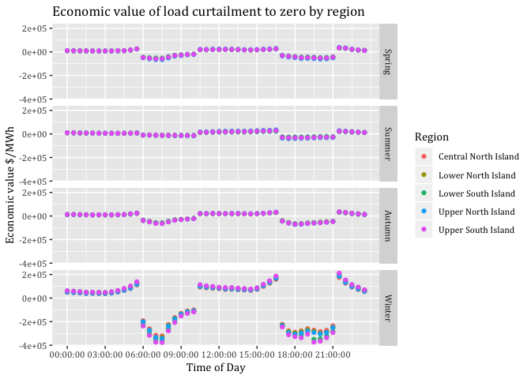<!-- -->

```r
#Mergedsc1DT <- Mergedsc1DT[, .(EcoVal = sum(ecoValueHH)),
                   #keyby = .(Region, season, Period)]
```

####Load curtailment of particular amount: SC2


```r
fac1000 <- 1000 # We need this conversion to display MWh as required by prices per MWh

sc2data <- heatPumpProfileDT
sc2data[, c("medianW", "obsHourMin", "meanW", "nObs", "sdW",
            "scaledMWmethod1", "EECApmMethod2"):=NULL] #Deleting unnecessary columns
```

```
## Warning in `[.data.table`(sc2data, , `:=`(c("medianW", "obsHourMin",
## "meanW", : Adding new column 'medianW' then assigning NULL (deleting it).
```

```
## Warning in `[.data.table`(sc2data, , `:=`(c("medianW", "obsHourMin",
## "meanW", : Adding new column 'obsHourMin' then assigning NULL (deleting
## it).
```

```
## Warning in `[.data.table`(sc2data, , `:=`(c("medianW", "obsHourMin",
## "meanW", : Adding new column 'meanW' then assigning NULL (deleting it).
```

```
## Warning in `[.data.table`(sc2data, , `:=`(c("medianW", "obsHourMin",
## "meanW", : Adding new column 'nObs' then assigning NULL (deleting it).
```

```
## Warning in `[.data.table`(sc2data, , `:=`(c("medianW", "obsHourMin",
## "meanW", : Adding new column 'sdW' then assigning NULL (deleting it).
```

```
## Warning in `[.data.table`(sc2data, , `:=`(c("medianW", "obsHourMin",
## "meanW", : Adding new column 'scaledMWmethod1' then assigning NULL
## (deleting it).
```

```
## Warning in `[.data.table`(sc2data, , `:=`(c("medianW", "obsHourMin",
## "meanW", : Adding new column 'EECApmMethod2' then assigning NULL (deleting
## it).
```

```r
sc2data <- sc2data[, .(GWhs1 = sum(scaledGWh)), 
                    keyby = .(season, obsHalfHour)]


#Defining peak and off-peak periods
sc2data <- sc2data[, Period := "Not Peak"]

sc2data <- sc2data[obsHalfHour >= MPS & 
                     obsHalfHour <= MPE,
                   Period := "Morning Peak"]

sc2data <- sc2data[obsHalfHour >= EPS & 
                     obsHalfHour <= EPE,
                   Period := "Evening Peak"]

sc2data <- sc2data[obsHalfHour >= OP1S & 
                     obsHalfHour <= OP1E,
                   Period := "Off Peak 1"]

sc1data <- sc2data[obsHalfHour >= OP12S & 
                     obsHalfHour <= OP12E,
                   Period := "Off Peak 1"]

sc2data <- sc2data[obsHalfHour >= OP2S & 
                     obsHalfHour <= OP2E,
                   Period := "Off Peak 2"]

sc2data <- sc2data[, MWh:= ifelse(Period == "Morning Peak" |
                                    Period == "Evening Peak", GWhs1*1000*0.5, GWhs1*1000)] # Creating new column GWh based on GWhs1 in MWh


setkey(SeasonAvgDT, season, obsHalfHour)

setkey(sc2data, season, obsHalfHour)

Mergedsc2DT <- sc2data[SeasonAvgDT]

Mergedsc2DT <- Mergedsc2DT[, ecoValueHH := 0]

Mergedsc2DT <- Mergedsc2DT[, MWh := MWh /5]

Mergedsc2DT <- Mergedsc2DT[, ecoValueHH := ifelse(Period == "Morning Peak" | 
                                                  Period == "Evening Peak",
                                                (`MWh` * (-meanprice)),
                                                MWh * (meanprice)),
                           keyby = .(season, Region, obsHalfHour)] 

#Change the order in facet_grid()
Mergedsc2DT$season <- factor(Mergedsc2DT$season, levels = c("Spring","Summer",
                                                    "Autumn", "Winter"))

#Visualising only shifted consumption
myPlot <- ggplot2::ggplot(Mergedsc2DT, aes(x = obsHalfHour)) +
  geom_point(aes(y=ecoValueHH, color= Region), size=1.5) +
  theme(text = element_text(family = "Cambria")) +
  ggtitle("Economic value of particular amount by region") +
  facet_grid(season ~ .) +
  labs(x='Time of Day', y='Economic value $/MWh') +
  scale_x_time(breaks = c(hms::as.hms("00:00:00"), hms::as.hms("03:00:00"), hms::as.hms("06:00:00"),
                          hms::as.hms("09:00:00"), hms::as.hms("12:00:00"),
                          hms::as.hms("15:00:00"), hms::as.hms("18:00:00"), hms::as.hms("21:00:00")))
myPlot
```

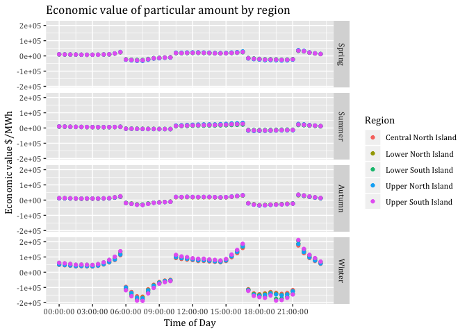<!-- -->

```r
#Mergedsc2DT <- Mergedsc2DT[, .(EcoVal = sum(ecoValueHH)),
                   #keyby = .(Region, season, Period)]
```

####Load shifting to prior time periods: SC3

```r
sc3data <- heatPumpProfileDT
sc3data[, c("medianW", "obsHourMin", "meanW", "nObs", "sdW",
            "scaledMWmethod1", "EECApmMethod2"):=NULL] #Deleting unnecessary columns
```

```
## Warning in `[.data.table`(sc3data, , `:=`(c("medianW", "obsHourMin",
## "meanW", : Adding new column 'medianW' then assigning NULL (deleting it).
```

```
## Warning in `[.data.table`(sc3data, , `:=`(c("medianW", "obsHourMin",
## "meanW", : Adding new column 'obsHourMin' then assigning NULL (deleting
## it).
```

```
## Warning in `[.data.table`(sc3data, , `:=`(c("medianW", "obsHourMin",
## "meanW", : Adding new column 'meanW' then assigning NULL (deleting it).
```

```
## Warning in `[.data.table`(sc3data, , `:=`(c("medianW", "obsHourMin",
## "meanW", : Adding new column 'nObs' then assigning NULL (deleting it).
```

```
## Warning in `[.data.table`(sc3data, , `:=`(c("medianW", "obsHourMin",
## "meanW", : Adding new column 'sdW' then assigning NULL (deleting it).
```

```
## Warning in `[.data.table`(sc3data, , `:=`(c("medianW", "obsHourMin",
## "meanW", : Adding new column 'scaledMWmethod1' then assigning NULL
## (deleting it).
```

```
## Warning in `[.data.table`(sc3data, , `:=`(c("medianW", "obsHourMin",
## "meanW", : Adding new column 'EECApmMethod2' then assigning NULL (deleting
## it).
```

```r
sc3data <- sc3data[, .(GWhs1 = sum(scaledGWh)), 
                    keyby = .(season, obsHalfHour)]


#Defining peak and off-peak periods
sc3data <- sc3data[, Period := "Not Peak"]

sc3data <- sc3data[obsHalfHour >= MPS & 
                     obsHalfHour <= MPE,
                   Period := "Morning Peak"]

sc3data <- sc3data[obsHalfHour >= EPS & 
                     obsHalfHour <= EPE,
                   Period := "Evening Peak"]

sc3data <- sc3data[obsHalfHour >= OP1S & 
                     obsHalfHour <= OP1E,
                   Period := "Off Peak 1"]

sc3data <- sc3data[obsHalfHour >= OP12S & 
                     obsHalfHour <= OP12E,
                   Period := "Off Peak 1"]

sc3data <- sc3data[obsHalfHour >= OP2S & 
                     obsHalfHour <= OP2E,
                   Period := "Off Peak 2"]

#Building the sum of each peak period by season
AuMP <- sc3data[season == "Autumn" & Period == "Morning Peak",
                sum(GWhs1)]
WiMP <- sc3data[season == "Winter" & Period == "Morning Peak",
                sum(GWhs1)]
SpMP <- sc3data[season == "Spring" & Period == "Morning Peak",
                sum(GWhs1)]
SuMP <- sc3data[season == "Summer" & Period == "Morning Peak",
                sum(GWhs1)]

AuEP <- sc3data[season == "Autumn" & Period == "Evening Peak",
                sum(GWhs1)]
WiEP <- sc3data[season == "Winter" & Period == "Evening Peak",
                sum(GWhs1)]
SpEP <- sc3data[season == "Spring" & Period == "Evening Peak",
                sum(GWhs1)]
SuEP <- sc3data[season == "Summer" & Period == "Evening Peak",
                sum(GWhs1)]


#Counting number of rows that will be associated to spread the Morning Peak
AuMPHalfHours <- nrow(sc3data[season == "Autumn" &
                              Period == "Off Peak 1"])
WiMPHalfHours <- nrow(sc3data[season == "Winter" &
                              Period == "Off Peak 1"])
SpMPHalfHours <- nrow(sc3data[season == "Spring" &
                              Period == "Off Peak 1"])
SuMPHalfHours <- nrow(sc3data[season == "Summer" &
                              Period == "Off Peak 1"])

#Counting number of rows that will be associated to spread the Evening Peak
AuEPHalfHours <- nrow(sc3data[season == "Autumn" &
                              Period == "Off Peak 2"])
WiEPHalfHours <- nrow(sc3data[season == "Winter" &
                              Period == "Off Peak 2"])
SpEPHalfHours <- nrow(sc3data[season == "Spring" &
                              Period == "Off Peak 2"])
SuEPHalfHours <- nrow(sc3data[season == "Summer" &
                              Period == "Off Peak 2"])

#Calculating the proportion that each row will take on to spread the GWhs
distGWhOP1Au <- AuMP/AuMPHalfHours
distGWhOP1Wi <- WiMP/WiMPHalfHours
distGWhOP1Sp <- SpMP/SpMPHalfHours
distGWhOP1Su <- SuMP/SuMPHalfHours

distGWhOP2Au <- AuEP/AuEPHalfHours
distGWhOP2Wi <- WiEP/WiEPHalfHours
distGWhOP2Sp <- SpEP/SpEPHalfHours
distGWhOP2Su <- SuEP/SuEPHalfHours


#Adding amount of spreaded peak consumption to off-peak periods
sc3data <- sc3data[season == "Autumn" &
                     Period == "Off Peak 1", GWhs3 :=
                     GWhs1 + distGWhOP1Au]
sc3data <- sc3data[season == "Winter" &
                     Period == "Off Peak 1", GWhs3 :=
                     GWhs1 + distGWhOP1Wi]
sc3data <- sc3data[season == "Spring" &
                     Period == "Off Peak 1", GWhs3 :=
                     GWhs1 + distGWhOP1Sp]
sc3data <- sc3data[season == "Summer" &
                     Period == "Off Peak 1", GWhs3 :=
                     GWhs1 + distGWhOP1Su]


sc3data <- sc3data[season == "Autumn" &
                     Period == "Off Peak 2", GWhs3 :=
                     GWhs1 + distGWhOP2Au]
sc3data <- sc3data[season == "Winter" &
                     Period == "Off Peak 2", GWhs3 :=
                     GWhs1 + distGWhOP2Wi]
sc3data <- sc3data[season == "Spring" &
                     Period == "Off Peak 2", GWhs3 :=
                     GWhs1 + distGWhOP2Sp]
sc3data <- sc3data[season == "Summer" &
                     Period == "Off Peak 2", GWhs3 :=
                     GWhs1 + distGWhOP2Su]


#Setting missing values in peak periods to NULL
sc3data <- sc3data[, GWhs3:= ifelse(Period =="Morning Peak",
                                  0, GWhs3)]
sc3data <- sc3data[, GWhs3:= ifelse(Period =="Evening Peak",
                                  0, GWhs3)]
#Economic value starts::

#Creating new column
sc3data <- sc3data[, DiffOrigMWh := 0]
#Calculating the amount added due to load shifting + converting to MWh
sc3data <- sc3data[, DiffOrigMWh := ifelse(GWhs3 > 0,
                                           (GWhs3-GWhs1) * 1000, (0-GWhs1 * 1000))]
#Preparation for merging DTs
setkey(SeasonAvgDT, season, obsHalfHour)
setkey(sc3data, season, obsHalfHour)

#Merging
Mergedsc3DT <- sc3data[SeasonAvgDT]
Mergedsc3DT <- Mergedsc3DT[, DiffOrigMWh := DiffOrigMWh /5]

Mergedsc3DT <- Mergedsc3DT[, ecoValueHH := ifelse(Period == "Morning Peak" | 
                                                  Period == "Evening Peak",
                                                DiffOrigMWh * (meanprice),
                                                DiffOrigMWh * (meanprice)),
                           keyby = .(season, Region, obsHalfHour)]#WARNING DiffOrigMWh represents distinction between positive and negative already


#Change the order in facet_grid()
Mergedsc3DT$season <- factor(Mergedsc3DT$season, levels = c("Spring","Summer",
                                                    "Autumn", "Winter"))


#Putting all values together and check!
EcoVaHHDT <- copy(Mergedsc0DT)

setnames(EcoVaHHDT, old=c("ecoValueHH"), new=c("Baseline"))

EcoVaHHDT <- cbind(EcoVaHHDT, Mergedsc1DT[,"ecoValueHH"])
setnames(EcoVaHHDT, old=c("ecoValueHH"), new=c("EcoVaLc@Peak"))

EcoVaHHDT <- cbind(EcoVaHHDT, Mergedsc2DT[,"ecoValueHH"])
setnames(EcoVaHHDT, old=c("ecoValueHH"), new=c("EcoVaLc*0.5@Peak"))

EcoVaHHDT <- cbind(EcoVaHHDT, Mergedsc3DT[,"ecoValueHH"])
setnames(EcoVaHHDT, old=c("ecoValueHH"), new=c("EcoVaLs"))

EcoVaHHDT <- EcoVaHHDT[, c("GWhs1", "MWh") := NULL]

EcoVaHHDT <- EcoVaHHDT[, meanprice := meanprice + 0,
                 keyby = .(season, Region, obsHalfHour)]
```
####Visualisation heat pump

```r
EcoVaSumDT <- copy(EcoVaHHDT)

EcoVaSumDT <- EcoVaSumDT[, Baseline := Baseline]# Converting to million $
EcoVaSumSC0DT <- EcoVaSumDT[, (Baseline = sum(Baseline)), keyby = .(Region, season, Period)]


EcoVaSumSC0DT$Period <- factor(EcoVaSumSC0DT$Period, levels = c("Off Peak 1","Morning Peak",
                                                    "Off Peak 2", "Evening Peak"))

#Analysis
CostBaseline <- sum(EcoVaSumDT$Baseline)

SavingsMillionNZD <- CostBaseline-CostBaseline
SavingsPercent <- 0#Compared to Baseline

SavingsMillionNZD
```

```
## [1] 0
```

```r
SavingsPercent
```

```
## [1] 0
```

```r
myPlot <- ggplot2::ggplot(EcoVaSumSC0DT, aes(x = Period, fill = Region)) +
  geom_bar(aes(y= V1), stat = "identity", position = "dodge") +
  #geom_line(aes(y= V1)) +
  theme(text = element_text(family = "Cambria")) +
  facet_grid(season ~ .) +
  ggtitle("Baseline scenario: Cost for heat pumps") +
  labs(x='Period', y='Cost in million NZD') 
  
myPlot 
```

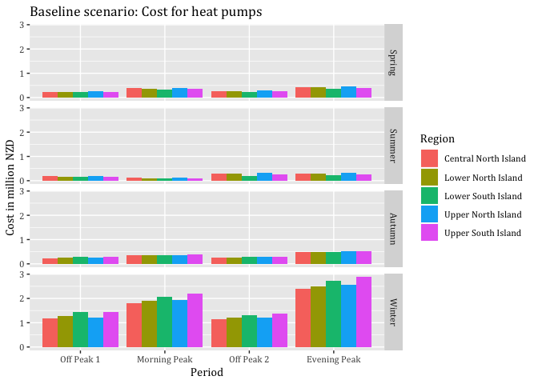<!-- -->

```r
#ggsave("Baseline scenario: Cost for heat pumps by period.jpeg", dpi = 600)

myPlot <- ggplot2::ggplot(subset(EcoVaSumSC0DT,
                                 season %in% c("Winter")), aes(x = Period, fill = Region)) +
  geom_bar(aes(y= V1), stat = "identity", position = "dodge") +
  #geom_line(aes(y= V1)) +
  theme(text = element_text(family = "Cambria")) +
  facet_grid(season ~ .) +
  ggtitle("Baseline scenario: Cost for heat pumps in winter") +
  labs(x='Period', y='Cost in million NZD') 
  
myPlot
```

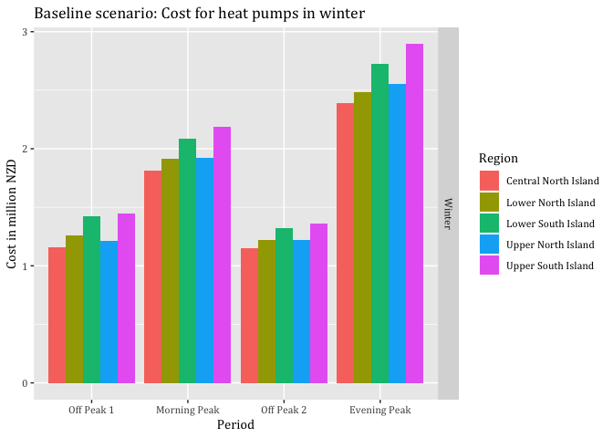<!-- -->

```r
#ggsave("Baseline scenario: Cost for heat pumps in winter by period.jpeg", dpi = 600)                        
```

```r
#Plots cost of load curtailment to zero, does not consider baseline
EcoVaSumDT <- copy(EcoVaHHDT)

EcoVaSumDT <- EcoVaSumDT[, `EcoVaLc@Peak` := ifelse(Period == "Morning Peak" |
                                                      Period == "Evening Peak", 0,
                                                    `EcoVaLc@Peak`)]
EcoVaSumDT <- EcoVaSumDT[, `EcoVaLc@Peak` := `EcoVaLc@Peak`/1000000]# Converting to million $
EcoVaSumSC1DT <- EcoVaSumDT[, (`EcoVaLc@Peak` = sum(`EcoVaLc@Peak`)), keyby = .(Region, season, Period)]

EcoVaSumSC1DT$Period <- factor(EcoVaSumSC1DT$Period, levels = c("Off Peak 1","Morning Peak",
                                                    "Off Peak 2", "Evening Peak"))

#Analysis
CostBaseline <- sum(EcoVaSumDT$Baseline)
`CostEcoVaLc@Peak` <- sum(EcoVaSumDT$`EcoVaLc@Peak`)

SavingsMillionNZD <- CostBaseline - `CostEcoVaLc@Peak`
SavingsPercent <- 1-(`CostEcoVaLc@Peak` / CostBaseline)

SavingsMillionNZD
```

```
## [1] 33.14745
```

```r
SavingsPercent
```

```
## [1] 0.6210158
```

```r
#Visualisation
myPlot <- ggplot2::ggplot(EcoVaSumSC1DT, aes(x = Period, fill = Region)) +
  geom_bar(aes(y= V1), stat = "identity", position = "dodge") +
  #geom_line(aes(y= V1)) +
  theme(text = element_text(family = "Cambria")) +
  facet_grid(season ~ .) +
  ggtitle("Load curtailment scenario: Cost for heat pumps") +
  labs(x='Period', y='Cost in million NZD') 
  
myPlot 
```

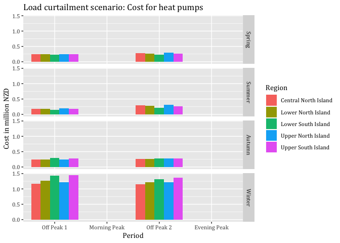<!-- -->

```r
#ggsave("Load curtailment scenario: Cost for heat pumps.jpeg", dpi = 600)

myPlot <- ggplot2::ggplot(subset(EcoVaSumSC1DT,
                                 season %in% c("Winter")), aes(x = Period, fill = Region)) +
  geom_bar(aes(y= V1), stat = "identity", position = "dodge") +
  #geom_line(aes(y= V1)) +
  theme(text = element_text(family = "Cambria")) +
  facet_grid(season ~ .) +
  ggtitle("Load curtailment scenario: Cost per day for heat pumps in winter") +
  labs(x='Period', y='Cost in million NZD') 
  
myPlot
```

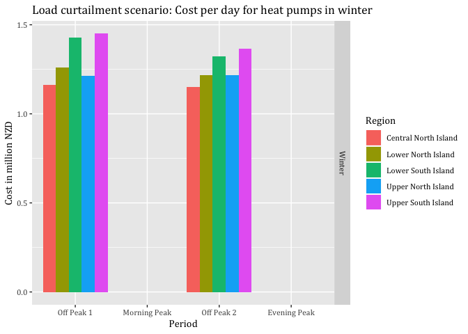<!-- -->

```r
#ggsave("Load curtailment scenario: Cost per day for heat pumps in winter.jpeg", dpi = 600)
```

```r
#Plots benefits when load is curtailed to zero 

EcoVaSumDT <- copy(EcoVaHHDT)

EcoVaSumSC1DT <- EcoVaSumDT
EcoVaSumSC1DT <- EcoVaSumSC1DT[, `EcoVaLc@Peak` := ifelse(Period == "Off Peak 1" |
                                                            Period == "Off Peak 2", 0,
                                                          `EcoVaLc@Peak`*(-1))]#We want to disply savings
EcoVaSumSC1DT <- EcoVaSumSC1DT[, `EcoVaLc@Peak` := `EcoVaLc@Peak`/1000000]# Converting to million $
EcoVaSumSC1DT <- EcoVaSumSC1DT[, (`EcoVaLc@Peak` = sum(`EcoVaLc@Peak`)), keyby = .(Region, season, Period)]


EcoVaSumSC1DT$Period <- factor(EcoVaSumSC1DT$Period, levels = c("Off Peak 1","Morning Peak",
                                                    "Off Peak 2", "Evening Peak"))

myPlot <- ggplot2::ggplot(EcoVaSumSC1DT, aes(x = Period, fill = Region)) +
  geom_bar(aes(y= V1), stat = "identity", position = "dodge") +
  #geom_line(aes(y= V1)) +
  theme(text = element_text(family = "Cambria")) +
  facet_grid(season ~ .) +
  ggtitle("Load curtailment scenario: Savings at peak time-periods for heat pumps") +
  labs(x='Period', y='Savings in million NZD') 
  
myPlot 
```

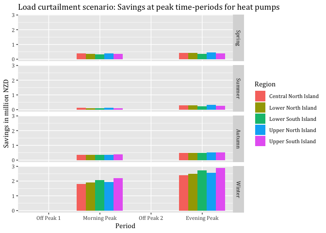<!-- -->

```r
#ggsave("Load curtailment scenario: Savings at peak time-periods for heat pumps.jpeg", dpi = 600)

myPlot <- ggplot2::ggplot(subset(EcoVaSumSC1DT,
                                 season %in% c("Winter")), aes(x = Period, fill = Region)) +
  geom_bar(aes(y= V1), stat = "identity", position = "dodge") +
  #geom_line(aes(y= V1)) +
  theme(text = element_text(family = "Cambria")) +
  facet_grid(season ~ .) +
  ggtitle("Load curtailment scenario: Savings at peak time-periods for heat pumps in winter") +
  labs(x='Period', y='Savings in million NZD') 
  
myPlot
```

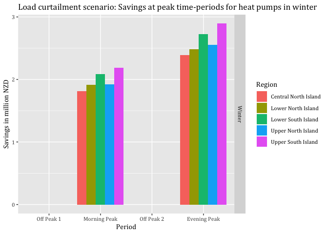<!-- -->

```r
#ggsave("Load curtailment scenario: Savings at peak time-periods for heat pumps in winter.jpeg", dpi = 600)
```

```r
#Plots cost and benefits of load curtailment to 0.5, does not consider baseline
EcoVaSumDT <- copy(EcoVaHHDT)

EcoVaSumDT <- EcoVaSumDT[, `EcoVaLc*0.5@Peak` := ifelse(Period == "Morning Peak" |
                                                          Period == "Evening Peak",
                                              (Baseline*0.5)*1000000,`EcoVaLc*0.5@Peak`)]

EcoVaSumDT <- EcoVaSumDT[, `EcoVaLc*0.5@Peak` := `EcoVaLc*0.5@Peak`/1000000]# Converting to million $
EcoVaSumSC2DT <- EcoVaSumDT[, (`EcoVaLc*0.5@Peak` = sum(`EcoVaLc*0.5@Peak`)), keyby = .(Region, season, Period)]

EcoVaSumSC2DT$Period <- factor(EcoVaSumSC2DT$Period, levels = c("Off Peak 1",
                                                                "Morning Peak",
                                                                "Off Peak 2",
                                                                "Evening Peak"))

#Analysis

`CostEcoVaLc*0.5@Peak` <- sum(EcoVaSumDT$`EcoVaLc*0.5@Peak`)

SavingsMillionNZD <- CostBaseline - `CostEcoVaLc*0.5@Peak`
SavingsPercent <- 1-(`CostEcoVaLc*0.5@Peak` / CostBaseline)

SavingsMillionNZD
```

```
## [1] 16.57373
```

```r
SavingsPercent
```

```
## [1] 0.3105079
```

```r
myPlot <- ggplot2::ggplot(EcoVaSumSC2DT, aes(x = Period, fill = Region)) +
  geom_bar(aes(y= V1), stat = "identity", position = "dodge") +
  #geom_line(aes(y= V1)) +
  theme(text = element_text(family = "Cambria")) +
  facet_grid(season ~ .) +
  ggtitle("Load curtailment 0.5 scenario: Cost for heat pumps") +
  labs(x='Period', y='Cost in million NZD') 
  
myPlot 
```

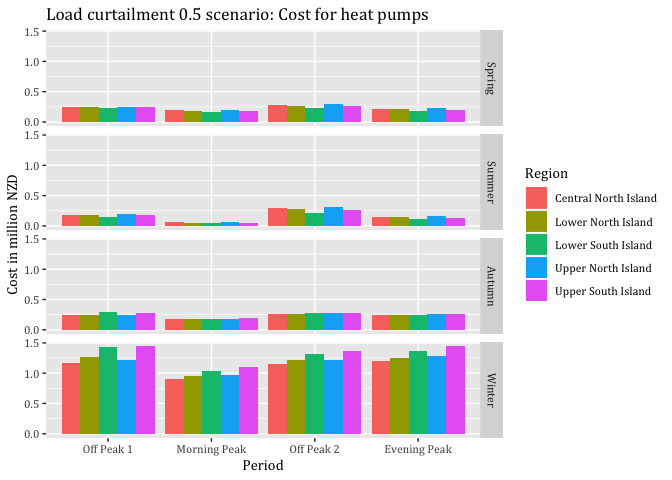<!-- -->

```r
#ggsave("Load curtailment 0.5 scenario: Cost for heat pumps.jpeg", dpi = 600)

myPlot <- ggplot2::ggplot(subset(EcoVaSumSC2DT,
                                 season %in% c("Winter")), aes(x = Period, fill = Region)) +
  geom_bar(aes(y= V1), stat = "identity", position = "dodge") +
  #geom_line(aes(y= V1)) +
  theme(text = element_text(family = "Cambria")) +
  facet_grid(season ~ .) +
  ggtitle("Load curtailment 0.5 scenario: Cost for heat pumps in winter") +
  labs(x='Period', y='Cost in million NZD') 
  
myPlot
```

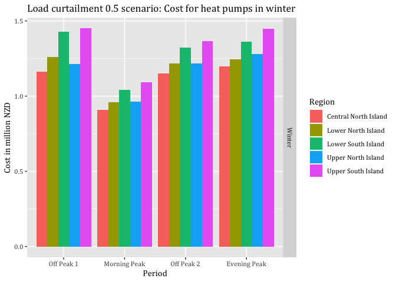<!-- -->

```r
#ggsave("Load curtailment 0.5 scenario: Cost for heat pumps in winter.jpeg", dpi = 600)
```

```r
#Plots benefits when load is curtailed to 0.5 

EcoVaSumDT <- copy(EcoVaHHDT)

EcoVaSumSC2DT <- EcoVaSumDT
EcoVaSumSC2DT <- EcoVaSumSC2DT[, `EcoVaLc*0.5@Peak` := ifelse(Period == "Off Peak 1"|
                                                            Period == "Off Peak 2",0,
                                 `EcoVaLc*0.5@Peak`*(-1))]#We want to disply savings


EcoVaSumSC2DT <- EcoVaSumSC2DT[, `EcoVaLc*0.5@Peak` := `EcoVaLc*0.5@Peak`/1000000]# Converting to million $
EcoVaSumSC2DT <- EcoVaSumSC2DT[, (`EcoVaLc*0.5@Peak` = sum(`EcoVaLc*0.5@Peak`)), keyby = .(Region, season, Period)]


EcoVaSumSC2DT$Period <- factor(EcoVaSumSC2DT$Period, levels = c("Off Peak 1","Morning Peak",
                                                    "Off Peak 2", "Evening Peak"))

myPlot <- ggplot2::ggplot(EcoVaSumSC2DT, aes(x = Period, fill = Region)) +
  geom_bar(aes(y= V1), stat = "identity", position = "dodge") +
  #geom_line(aes(y= V1)) +
  theme(text = element_text(family = "Cambria")) +
  facet_grid(season ~ .) +
  ggtitle("Load curtailment 0.5 scenario: Savings at peak time-periods for heat pumps") +
  labs(x='Period', y='Savings in million NZD') 
  
myPlot 
```

<!-- -->

```r
#ggsave("Load curtailment 0.5 scenario: Savings at peak time-periods for heat pumps.jpeg", dpi = 600)

myPlot <- ggplot2::ggplot(subset(EcoVaSumSC2DT,
                                 season %in% c("Winter")), aes(x = Period, fill = Region)) +
  geom_bar(aes(y= V1), stat = "identity", position = "dodge") +
  #geom_line(aes(y= V1)) +
  theme(text = element_text(family = "Cambria")) +
  facet_grid(season ~ .) +
  ggtitle("Load curtailment 0.5 scenario: Savings at peak time-periods for heat pumps in winter") +
  labs(x='Period', y='Savings in million NZD') 
  
myPlot
```

<!-- -->

```r
#ggsave("Load curtailment 0.5 scenario: Savings at peak time-periods for heat pumps in winter.jpeg", dpi = 600)
```

```r
#Plots cost and benefits of load shifting, does not consider baseline but increases costs at off peaks
EcoVaSumDT <- copy(EcoVaHHDT)


EcoVaSumDT <- EcoVaSumDT[, EcoSummary := ifelse(Period == "Off Peak 1" |
                                               Period == "Off Peak 2",
                                             Baseline + (EcoVaLs/1000000), 0)]#It has to be zero 


#EcoVaSumDT <- EcoVaSumDT[, `EcoSummary` := `EcoSummary`/1000000]# Converting to million $
EcoVaSumSC3DT <- EcoVaSumDT[, (`EcoSummary` = sum(`EcoSummary`)), keyby = .(Region, season, Period)]

EcoVaSumSC3DT$Period <- factor(EcoVaSumSC3DT$Period, levels = c("Off Peak 1","Morning Peak",
                                                    "Off Peak 2", "Evening Peak"))


#Analysis
CostBaseline <- sum(EcoVaSumDT$Baseline)
`CostLoadShif` <- sum(EcoVaSumDT$`EcoSummary`)

SavingsMillionNZD <- CostBaseline - `CostLoadShif`
SavingsPercent <- 1-(`CostLoadShif` / CostBaseline)

SavingsMillionNZD
```

```
## [1] 3.375802
```

```r
SavingsPercent
```

```
## [1] 0.06324547
```

```r
myPlot <- ggplot2::ggplot(EcoVaSumSC3DT, aes(x = Period, fill = Region)) +
  geom_bar(aes(y= V1), stat = "identity", position = "dodge") +
  #geom_line(aes(y= V1)) +
  theme(text = element_text(family = "Cambria")) +
  facet_grid(season ~ .) +
  ggtitle("Load shifting scenario: Cost for heat pumps") +
  labs(x='Period', y='Cost in million NZD') 
  
myPlot 
```

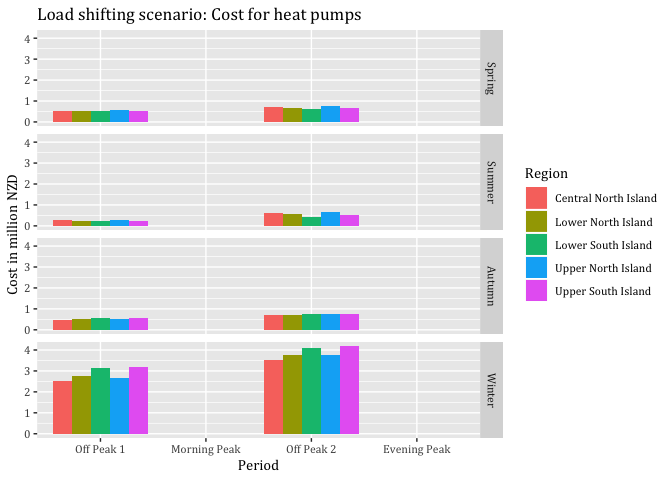<!-- -->

```r
#ggsave("Load shifting scenario: Cost for heat pumps.jpeg", dpi = 600)

myPlot <- ggplot2::ggplot(subset(EcoVaSumSC3DT,
                                 season %in% c("Winter")), aes(x = Period, fill = Region)) +
  geom_bar(aes(y= V1), stat = "identity", position = "dodge") +
  #geom_line(aes(y= V1)) +
  theme(text = element_text(family = "Cambria")) +
  facet_grid(season ~ .) +
  ggtitle("Load shifting scenario: Cost for heat pumps in winter") +
  labs(x='Period', y='Cost in million NZD') 
  
myPlot
```

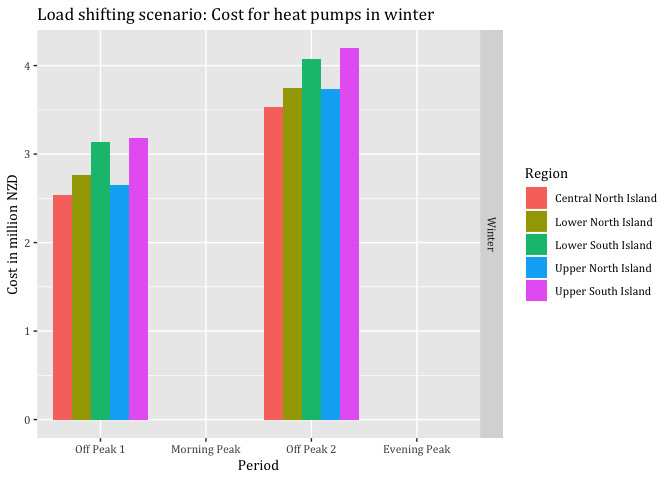<!-- -->

```r
#ggsave("Load shifting scenario: Cost for heat pumps in winter.jpeg", dpi = 600)
```
###Hot water economic value
####Baseline

```r
fac1000 <- 1000 # We need this conversion to display MWh as required by prices per MWh

sc0data <- hotWaterProfileDT
sc0data[, c("medianW", "obsHourMin", "meanW", "nObs", "sdW",
            "scaledMWmethod1", "EECApmMethod2"):=NULL] #Deleting unnecessary columns
```

```
## Warning in `[.data.table`(sc0data, , `:=`(c("medianW", "obsHourMin",
## "meanW", : Adding new column 'medianW' then assigning NULL (deleting it).
```

```
## Warning in `[.data.table`(sc0data, , `:=`(c("medianW", "obsHourMin",
## "meanW", : Adding new column 'obsHourMin' then assigning NULL (deleting
## it).
```

```
## Warning in `[.data.table`(sc0data, , `:=`(c("medianW", "obsHourMin",
## "meanW", : Adding new column 'meanW' then assigning NULL (deleting it).
```

```
## Warning in `[.data.table`(sc0data, , `:=`(c("medianW", "obsHourMin",
## "meanW", : Adding new column 'nObs' then assigning NULL (deleting it).
```

```
## Warning in `[.data.table`(sc0data, , `:=`(c("medianW", "obsHourMin",
## "meanW", : Adding new column 'sdW' then assigning NULL (deleting it).
```

```
## Warning in `[.data.table`(sc0data, , `:=`(c("medianW", "obsHourMin",
## "meanW", : Adding new column 'scaledMWmethod1' then assigning NULL
## (deleting it).
```

```
## Warning in `[.data.table`(sc0data, , `:=`(c("medianW", "obsHourMin",
## "meanW", : Adding new column 'EECApmMethod2' then assigning NULL (deleting
## it).
```

```r
sc0data <- sc0data[, .(GWhs1 = sum(scaledGWh)), 
                    keyby = .(season, obsHalfHour)]


#Defining peak and off-peak periods
sc0data <- sc0data[, Period := "Not Peak"]

sc0data <- sc0data[obsHalfHour >= MPS & 
                     obsHalfHour <= MPE,
                   Period := "Morning Peak"]

sc0data <- sc0data[obsHalfHour >= EPS & 
                     obsHalfHour <= EPE,
                   Period := "Evening Peak"]

sc0data <- sc0data[obsHalfHour >= OP1S & 
                     obsHalfHour <= OP1E,
                   Period := "Off Peak 1"]

sc0data <- sc0data[obsHalfHour >= OP12S & 
                     obsHalfHour <= OP12E,
                   Period := "Off Peak 1"]

sc0data <- sc0data[obsHalfHour >= OP2S & 
                     obsHalfHour <= OP2E,
                   Period := "Off Peak 2"]


#Economic evaluation begins
sc0data <- sc0data[, MWh:=GWhs1*fac1000] # Creating new column GWh based on GWhs1 in MWh


setkey(SeasonAvgDT, season, obsHalfHour)
setkey(sc0data, season, obsHalfHour)

Mergedsc0DT <- sc0data[SeasonAvgDT]

Mergedsc0DT <- Mergedsc0DT[, ecoValueHH := 0]

Mergedsc0DT <- Mergedsc0DT[, MWh := MWh / 5]

Mergedsc0DT <- Mergedsc0DT[, ecoValueHH := (MWh * (meanprice)/1000000), 
                           keyby = .(season, Region, obsHalfHour)]

#Change the order in facet_grid()
Mergedsc0DT$season <- factor(Mergedsc0DT$season, levels = c("Spring","Summer",
                                                    "Autumn", "Winter"))

#Visualising
myPlot <- ggplot2::ggplot(Mergedsc0DT, aes(x = obsHalfHour)) +
  geom_point(aes(y=ecoValueHH, color= Region), size=1) +
  theme(text = element_text(family = "Cambria")) +
  ggtitle("Costs baseline scenario time of day for hot water") +
  facet_grid(season ~ .) +
  labs(x='Time of Day', y='Cost in million NZD') +
  scale_x_time(breaks = c(hms::as.hms("00:00:00"), hms::as.hms("04:00:00"), hms::as.hms("08:00:00"),
                          hms::as.hms("12:00:00"), hms::as.hms("16:00:00"),
                          hms::as.hms("20:00:00")))
myPlot
```

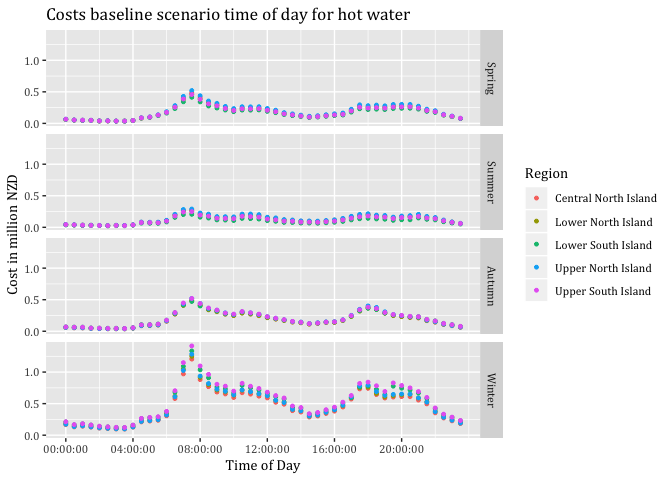<!-- -->

```r
#ggsave("Cost per day baseline scenario time of day.jpeg", dpi = 600)

#Building season sum by period
#Mergedsc0DT <- Mergedsc0DT[, .(EcoVal = sum(ecoValueHH)),
                  # keyby = .(season, Region, Period)]
```
####Load curtailment to zero SC1


```r
fac1000 <- 1000 # We need this conversion to display MWh as required by prices per MWh

sc1data <- hotWaterProfileDT
sc1data[, c("medianW", "obsHourMin", "meanW", "nObs", "sdW",
            "scaledMWmethod1", "EECApmMethod2"):=NULL] #Deleting unnecessary columns
```

```
## Warning in `[.data.table`(sc1data, , `:=`(c("medianW", "obsHourMin",
## "meanW", : Adding new column 'medianW' then assigning NULL (deleting it).
```

```
## Warning in `[.data.table`(sc1data, , `:=`(c("medianW", "obsHourMin",
## "meanW", : Adding new column 'obsHourMin' then assigning NULL (deleting
## it).
```

```
## Warning in `[.data.table`(sc1data, , `:=`(c("medianW", "obsHourMin",
## "meanW", : Adding new column 'meanW' then assigning NULL (deleting it).
```

```
## Warning in `[.data.table`(sc1data, , `:=`(c("medianW", "obsHourMin",
## "meanW", : Adding new column 'nObs' then assigning NULL (deleting it).
```

```
## Warning in `[.data.table`(sc1data, , `:=`(c("medianW", "obsHourMin",
## "meanW", : Adding new column 'sdW' then assigning NULL (deleting it).
```

```
## Warning in `[.data.table`(sc1data, , `:=`(c("medianW", "obsHourMin",
## "meanW", : Adding new column 'scaledMWmethod1' then assigning NULL
## (deleting it).
```

```
## Warning in `[.data.table`(sc1data, , `:=`(c("medianW", "obsHourMin",
## "meanW", : Adding new column 'EECApmMethod2' then assigning NULL (deleting
## it).
```

```r
sc1data <- sc1data[, .(GWhs1 = sum(scaledGWh)), 
                    keyby = .(season, obsHalfHour)]


#Defining peak and off-peak periods
sc1data <- sc1data[, Period := "Not Peak"]

sc1data <- sc1data[obsHalfHour >= MPS & 
                     obsHalfHour <= MPE,
                   Period := "Morning Peak"]

sc1data <- sc1data[obsHalfHour >= EPS & 
                     obsHalfHour <= EPE,
                   Period := "Evening Peak"]

sc1data <- sc1data[obsHalfHour >= OP1S & 
                     obsHalfHour <= OP1E,
                   Period := "Off Peak 1"]

sc1data <- sc1data[obsHalfHour >= OP12S & 
                     obsHalfHour <= OP12E,
                   Period := "Off Peak 1"]

sc1data <- sc1data[obsHalfHour >= OP2S & 
                     obsHalfHour <= OP2E,
                   Period := "Off Peak 2"]


#Economic evaluation begins
sc1data <- sc1data[, MWh:=GWhs1*fac1000] # Creating new column GWh based on GWhs1 in MWh


setkey(SeasonAvgDT, season, obsHalfHour)
setkey(sc1data, season, obsHalfHour)

Mergedsc1DT <- sc1data[SeasonAvgDT]

Mergedsc1DT <- Mergedsc1DT[, ecoValueHH := 0]

Mergedsc1DT <- Mergedsc1DT[, MWh := MWh / 5]

Mergedsc1DT <- Mergedsc1DT[, ecoValueHH := ifelse(Period == "Morning Peak" | 
                                                  Period == "Evening Peak",
                                                (`MWh` * (-meanprice)),
                                                (MWh * (meanprice))),
                           keyby = .(season, Region, obsHalfHour)] 


#Change the order in facet_grid()
Mergedsc1DT$season <- factor(Mergedsc1DT$season, levels = c("Spring","Summer",
                                                    "Autumn", "Winter"))

#Visualising
#myPlot <- ggplot2::ggplot(Mergedsc1DT, aes(x = obsHalfHour)) +
#  geom_point(aes(y=ecoValueHH, color= Region), size=1.5) +
#  theme(text = element_text(family = "Cambria")) +
#  ggtitle("Economic value of load curtailment to zero by region") +
#  facet_grid(season ~ .) +
#  labs(x='Time of Day', y='Economic value $/MWh') +
#  scale_x_time(breaks = c(hms::as.hms("00:00:00"), hms::as.hms("03:00:00"), hms::as.hms("06:00:00"),
                        #  hms::as.hms("09:00:00"), hms::as.hms("12:00:00"),
                        #  hms::as.hms("15:00:00"), hms::as.hms("18:00:00"), hms::as.hms("21:00:00")))
#myPlot

#Mergedsc1DT <- Mergedsc1DT[, .(EcoVal = sum(ecoValueHH)),
                   #keyby = .(Region, season, Period)]
```
####Load curtailment of particular amount SC2

```r
fac1000 <- 1000 # We need this conversion to display MWh as required by prices per MWh

sc2data <- hotWaterProfileDT
sc2data[, c("medianW", "obsHourMin", "meanW", "nObs", "sdW",
            "scaledMWmethod1", "EECApmMethod2"):=NULL] #Deleting unnecessary columns
```

```
## Warning in `[.data.table`(sc2data, , `:=`(c("medianW", "obsHourMin",
## "meanW", : Adding new column 'medianW' then assigning NULL (deleting it).
```

```
## Warning in `[.data.table`(sc2data, , `:=`(c("medianW", "obsHourMin",
## "meanW", : Adding new column 'obsHourMin' then assigning NULL (deleting
## it).
```

```
## Warning in `[.data.table`(sc2data, , `:=`(c("medianW", "obsHourMin",
## "meanW", : Adding new column 'meanW' then assigning NULL (deleting it).
```

```
## Warning in `[.data.table`(sc2data, , `:=`(c("medianW", "obsHourMin",
## "meanW", : Adding new column 'nObs' then assigning NULL (deleting it).
```

```
## Warning in `[.data.table`(sc2data, , `:=`(c("medianW", "obsHourMin",
## "meanW", : Adding new column 'sdW' then assigning NULL (deleting it).
```

```
## Warning in `[.data.table`(sc2data, , `:=`(c("medianW", "obsHourMin",
## "meanW", : Adding new column 'scaledMWmethod1' then assigning NULL
## (deleting it).
```

```
## Warning in `[.data.table`(sc2data, , `:=`(c("medianW", "obsHourMin",
## "meanW", : Adding new column 'EECApmMethod2' then assigning NULL (deleting
## it).
```

```r
sc2data <- sc2data[, .(GWhs1 = sum(scaledGWh)), 
                    keyby = .(season, obsHalfHour)]


#Defining peak and off-peak periods
sc2data <- sc2data[, Period := "Not Peak"]

sc2data <- sc2data[obsHalfHour >= MPS & 
                     obsHalfHour <= MPE,
                   Period := "Morning Peak"]

sc2data <- sc2data[obsHalfHour >= EPS & 
                     obsHalfHour <= EPE,
                   Period := "Evening Peak"]

sc2data <- sc2data[obsHalfHour >= OP1S & 
                     obsHalfHour <= OP1E,
                   Period := "Off Peak 1"]

sc2data <- sc2data[obsHalfHour >= OP12S & 
                     obsHalfHour <= OP12E,
                   Period := "Off Peak 1"]

sc2data <- sc2data[obsHalfHour >= OP2S & 
                     obsHalfHour <= OP2E,
                   Period := "Off Peak 2"]

sc2data <- sc2data[, MWh:= ifelse(Period == "Morning Peak" |
                                    Period == "Evening Peak", GWhs1*1000*0.5, GWhs1*1000)] # Creating new column GWh based on GWhs1 in MWh


setkey(SeasonAvgDT, season, obsHalfHour)

setkey(sc2data, season, obsHalfHour)

Mergedsc2DT <- sc2data[SeasonAvgDT]

Mergedsc2DT <- Mergedsc2DT[, ecoValueHH := 0]

Mergedsc2DT <- Mergedsc2DT[, MWh := MWh / 5]

Mergedsc2DT <- Mergedsc2DT[, ecoValueHH := ifelse(Period == "Morning Peak" | 
                                                  Period == "Evening Peak",
                                                (`MWh` * (-meanprice)),
                                                MWh * (meanprice)),
                           keyby = .(season, Region, obsHalfHour)] 

#Change the order in facet_grid()
Mergedsc2DT$season <- factor(Mergedsc2DT$season, levels = c("Spring","Summer",
                                                    "Autumn", "Winter"))

#Visualising only shifted consumption
#myPlot <- ggplot2::ggplot(Mergedsc2DT, aes(x = obsHalfHour)) +
 # geom_point(aes(y=ecoValueHH, color= Region), size=1.5) +
 # theme(text = element_text(family = "Cambria")) +
 # ggtitle("Economic value of particular amount by region") +
 # facet_grid(season ~ .) +
 # labs(x='Time of Day', y='Economic value $/MWh') +
 # scale_x_time(breaks = c(hms::as.hms("00:00:00"), hms::as.hms("03:00:00"), hms::as.hms("06:00:00"),
                         # hms::as.hms("09:00:00"), hms::as.hms("12:00:00"),
                         # hms::as.hms("15:00:00"), hms::as.hms("18:00:00"), hms::as.hms("21:00:00")))
#myPlot

#Mergedsc2DT <- Mergedsc2DT[, .(EcoVal = sum(ecoValueHH)),
                   #keyby = .(Region, season, Period)]
```
####Load shifting to prior time periods: SC3

```r
sc3data <- hotWaterProfileDT
sc3data[, c("medianW", "obsHourMin", "meanW", "nObs", "sdW",
            "scaledMWmethod1", "EECApmMethod2"):=NULL] #Deleting unnecessary columns
```

```
## Warning in `[.data.table`(sc3data, , `:=`(c("medianW", "obsHourMin",
## "meanW", : Adding new column 'medianW' then assigning NULL (deleting it).
```

```
## Warning in `[.data.table`(sc3data, , `:=`(c("medianW", "obsHourMin",
## "meanW", : Adding new column 'obsHourMin' then assigning NULL (deleting
## it).
```

```
## Warning in `[.data.table`(sc3data, , `:=`(c("medianW", "obsHourMin",
## "meanW", : Adding new column 'meanW' then assigning NULL (deleting it).
```

```
## Warning in `[.data.table`(sc3data, , `:=`(c("medianW", "obsHourMin",
## "meanW", : Adding new column 'nObs' then assigning NULL (deleting it).
```

```
## Warning in `[.data.table`(sc3data, , `:=`(c("medianW", "obsHourMin",
## "meanW", : Adding new column 'sdW' then assigning NULL (deleting it).
```

```
## Warning in `[.data.table`(sc3data, , `:=`(c("medianW", "obsHourMin",
## "meanW", : Adding new column 'scaledMWmethod1' then assigning NULL
## (deleting it).
```

```
## Warning in `[.data.table`(sc3data, , `:=`(c("medianW", "obsHourMin",
## "meanW", : Adding new column 'EECApmMethod2' then assigning NULL (deleting
## it).
```

```r
sc3data <- sc3data[, .(GWhs1 = sum(scaledGWh)), 
                    keyby = .(season, obsHalfHour)]


#Defining peak and off-peak periods
sc3data <- sc3data[, Period := "Not Peak"]

sc3data <- sc3data[obsHalfHour >= MPS & 
                     obsHalfHour <= MPE,
                   Period := "Morning Peak"]

sc3data <- sc3data[obsHalfHour >= EPS & 
                     obsHalfHour <= EPE,
                   Period := "Evening Peak"]

sc3data <- sc3data[obsHalfHour >= OP1S & 
                     obsHalfHour <= OP1E,
                   Period := "Off Peak 1"]

sc3data <- sc3data[obsHalfHour >= OP12S & 
                     obsHalfHour <= OP12E,
                   Period := "Off Peak 1"]

sc3data <- sc3data[obsHalfHour >= OP2S & 
                     obsHalfHour <= OP2E,
                   Period := "Off Peak 2"]

#Building the sum of each peak period by season
AuMP <- sc3data[season == "Autumn" & Period == "Morning Peak",
                sum(GWhs1)]
WiMP <- sc3data[season == "Winter" & Period == "Morning Peak",
                sum(GWhs1)]
SpMP <- sc3data[season == "Spring" & Period == "Morning Peak",
                sum(GWhs1)]
SuMP <- sc3data[season == "Summer" & Period == "Morning Peak",
                sum(GWhs1)]

AuEP <- sc3data[season == "Autumn" & Period == "Evening Peak",
                sum(GWhs1)]
WiEP <- sc3data[season == "Winter" & Period == "Evening Peak",
                sum(GWhs1)]
SpEP <- sc3data[season == "Spring" & Period == "Evening Peak",
                sum(GWhs1)]
SuEP <- sc3data[season == "Summer" & Period == "Evening Peak",
                sum(GWhs1)]


#Counting number of rows that will be associated to spread the Morning Peak
AuMPHalfHours <- nrow(sc3data[season == "Autumn" &
                              Period == "Off Peak 1"])
WiMPHalfHours <- nrow(sc3data[season == "Winter" &
                              Period == "Off Peak 1"])
SpMPHalfHours <- nrow(sc3data[season == "Spring" &
                              Period == "Off Peak 1"])
SuMPHalfHours <- nrow(sc3data[season == "Summer" &
                              Period == "Off Peak 1"])

#Counting number of rows that will be associated to spread the Evening Peak
AuEPHalfHours <- nrow(sc3data[season == "Autumn" &
                              Period == "Off Peak 2"])
WiEPHalfHours <- nrow(sc3data[season == "Winter" &
                              Period == "Off Peak 2"])
SpEPHalfHours <- nrow(sc3data[season == "Spring" &
                              Period == "Off Peak 2"])
SuEPHalfHours <- nrow(sc3data[season == "Summer" &
                              Period == "Off Peak 2"])

#Calculating the proportion that each row will take on to spread the GWhs
distGWhOP1Au <- AuMP/AuMPHalfHours
distGWhOP1Wi <- WiMP/WiMPHalfHours
distGWhOP1Sp <- SpMP/SpMPHalfHours
distGWhOP1Su <- SuMP/SuMPHalfHours

distGWhOP2Au <- AuEP/AuEPHalfHours
distGWhOP2Wi <- WiEP/WiEPHalfHours
distGWhOP2Sp <- SpEP/SpEPHalfHours
distGWhOP2Su <- SuEP/SuEPHalfHours


#Adding amount of spreaded peak consumption to off-peak periods
sc3data <- sc3data[season == "Autumn" &
                     Period == "Off Peak 1", GWhs3 :=
                     GWhs1 + distGWhOP1Au]
sc3data <- sc3data[season == "Winter" &
                     Period == "Off Peak 1", GWhs3 :=
                     GWhs1 + distGWhOP1Wi]
sc3data <- sc3data[season == "Spring" &
                     Period == "Off Peak 1", GWhs3 :=
                     GWhs1 + distGWhOP1Sp]
sc3data <- sc3data[season == "Summer" &
                     Period == "Off Peak 1", GWhs3 :=
                     GWhs1 + distGWhOP1Su]


sc3data <- sc3data[season == "Autumn" &
                     Period == "Off Peak 2", GWhs3 :=
                     GWhs1 + distGWhOP2Au]
sc3data <- sc3data[season == "Winter" &
                     Period == "Off Peak 2", GWhs3 :=
                     GWhs1 + distGWhOP2Wi]
sc3data <- sc3data[season == "Spring" &
                     Period == "Off Peak 2", GWhs3 :=
                     GWhs1 + distGWhOP2Sp]
sc3data <- sc3data[season == "Summer" &
                     Period == "Off Peak 2", GWhs3 :=
                     GWhs1 + distGWhOP2Su]


#Setting missing values in peak periods to NULL
sc3data <- sc3data[, GWhs3:= ifelse(Period =="Morning Peak",
                                  0, GWhs3)]
sc3data <- sc3data[, GWhs3:= ifelse(Period =="Evening Peak",
                                  0, GWhs3)]
#Economic value starts::

#Creating new column
sc3data <- sc3data[, DiffOrigMWh := 0]
#Calculating the amount added due to load shifting + converting to MWh
sc3data <- sc3data[, DiffOrigMWh := ifelse(GWhs3 > 0,
                                           (GWhs3-GWhs1) * 1000, (0-GWhs1 * 1000))]
#Preparation for merging DTs
setkey(SeasonAvgDT, season, obsHalfHour)
setkey(sc3data, season, obsHalfHour)

#Merging
Mergedsc3DT <- sc3data[SeasonAvgDT]

Mergedsc3DT <- Mergedsc3DT[, DiffOrigMWh := DiffOrigMWh / 5]

Mergedsc3DT <- Mergedsc3DT[, ecoValueHH := ifelse(Period == "Morning Peak" | 
                                                  Period == "Evening Peak",
                                                DiffOrigMWh * (meanprice),
                                                DiffOrigMWh * (meanprice)),
                           keyby = .(season, Region, obsHalfHour)]#WARNING DiffOrigMWh represents distinction between positive and negative already


#Change the order in facet_grid()
Mergedsc3DT$season <- factor(Mergedsc3DT$season, levels = c("Spring","Summer",
                                                    "Autumn", "Winter"))


#Putting all values together and check!
EcoVaHHDT <- copy(Mergedsc0DT)

setnames(EcoVaHHDT, old=c("ecoValueHH"), new=c("Baseline"))

EcoVaHHDT <- cbind(EcoVaHHDT, Mergedsc1DT[,"ecoValueHH"])
setnames(EcoVaHHDT, old=c("ecoValueHH"), new=c("EcoVaLc@Peak"))

EcoVaHHDT <- cbind(EcoVaHHDT, Mergedsc2DT[,"ecoValueHH"])
setnames(EcoVaHHDT, old=c("ecoValueHH"), new=c("EcoVaLc*0.5@Peak"))

EcoVaHHDT <- cbind(EcoVaHHDT, Mergedsc3DT[,"ecoValueHH"])
setnames(EcoVaHHDT, old=c("ecoValueHH"), new=c("EcoVaLs"))

EcoVaHHDT <- EcoVaHHDT[, c("GWhs1", "MWh") := NULL]

EcoVaHHDT <- EcoVaHHDT[, meanprice := meanprice + 0,
                 keyby = .(season, Region, obsHalfHour)]
```
####Visualisation hot water

```r
EcoVaSumDT <- copy(EcoVaHHDT)

EcoVaSumDT <- EcoVaSumDT[, Baseline := Baseline]# Converting to million $
EcoVaSumSC0DT <- EcoVaSumDT[, (Baseline = sum(Baseline)), keyby = .(Region, season, Period)]


EcoVaSumSC0DT$Period <- factor(EcoVaSumSC0DT$Period, levels = c("Off Peak 1","Morning Peak",
                                                    "Off Peak 2", "Evening Peak"))

#Analysis
CostBaseline <- sum(EcoVaSumDT$Baseline)

SavingsMillionNZD <- CostBaseline-CostBaseline
SavingsPercent <- 0#Compared to Baseline

SavingsMillionNZD
```

```
## [1] 0
```

```r
SavingsPercent
```

```
## [1] 0
```

```r
myPlot <- ggplot2::ggplot(EcoVaSumSC0DT, aes(x = Period, fill = Region)) +
  geom_bar(aes(y= V1), stat = "identity", position = "dodge") +
  #geom_line(aes(y= V1)) +
  theme(text = element_text(family = "Cambria")) +
  facet_grid(season ~ .) +
  ggtitle("Baseline scenario: Cost for hot water") +
  labs(x='Period', y='Cost in million NZD') 
  
myPlot 
```

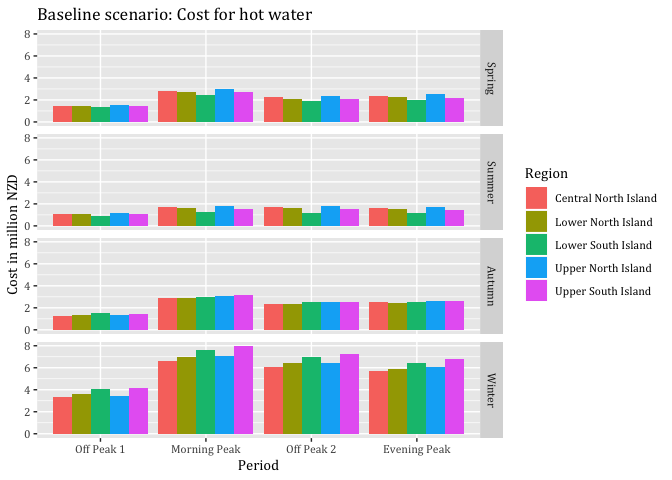<!-- -->

```r
#ggsave("Baseline scenario: Cost for hot water by period.jpeg", dpi = 600)

myPlot <- ggplot2::ggplot(subset(EcoVaSumSC0DT,
                                 season %in% c("Winter")), aes(x = Period, fill = Region)) +
  geom_bar(aes(y= V1), stat = "identity", position = "dodge") +
  #geom_line(aes(y= V1)) +
  theme(text = element_text(family = "Cambria")) +
  facet_grid(season ~ .) +
  ggtitle("Baseline scenario: Cost for hot water in winter") +
  labs(x='Period', y='Cost in million NZD') 
  
myPlot
```

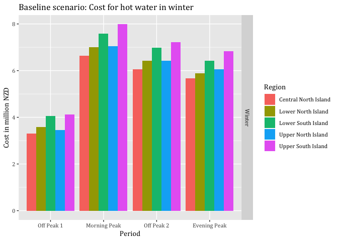<!-- -->

```r
#ggsave("Baseline scenario: Cost for hot water in winter by period.jpeg", dpi = 600)                        
```

```r
#Plots cost of load curtailment to zero, does not consider baseline
EcoVaSumDT <- copy(EcoVaHHDT)

EcoVaSumDT <- EcoVaSumDT[, `EcoVaLc@Peak` := ifelse(Period == "Morning Peak" |
                                                      Period == "Evening Peak", 0,
                                                    `EcoVaLc@Peak`)]
EcoVaSumDT <- EcoVaSumDT[, `EcoVaLc@Peak` := `EcoVaLc@Peak`/1000000]# Converting to million $
EcoVaSumSC1DT <- EcoVaSumDT[, (`EcoVaLc@Peak` = sum(`EcoVaLc@Peak`)), keyby = .(Region, season, Period)]

EcoVaSumSC1DT$Period <- factor(EcoVaSumSC1DT$Period, levels = c("Off Peak 1","Morning Peak",
                                                    "Off Peak 2", "Evening Peak"))

#Analysis
CostBaseline <- sum(EcoVaSumDT$Baseline)
`CostEcoVaLc@Peak` <- sum(EcoVaSumDT$`EcoVaLc@Peak`)

SavingsMillionNZD <- CostBaseline - `CostEcoVaLc@Peak`
SavingsPercent <- 1-(`CostEcoVaLc@Peak` / CostBaseline)

SavingsMillionNZD
```

```
## [1] 135.4888
```

```r
SavingsPercent
```

```
## [1] 0.5705792
```

```r
#Visualisation
myPlot <- ggplot2::ggplot(EcoVaSumSC1DT, aes(x = Period, fill = Region)) +
  geom_bar(aes(y= V1), stat = "identity", position = "dodge") +
  #geom_line(aes(y= V1)) +
  theme(text = element_text(family = "Cambria")) +
  facet_grid(season ~ .) +
  ggtitle("Load curtailment scenario: Cost for hot water") +
  labs(x='Period', y='Cost in million NZD') 
  
myPlot 
```

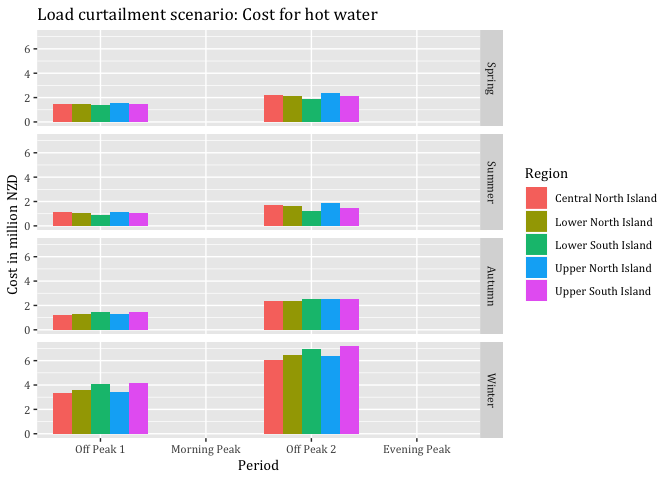<!-- -->

```r
#ggsave("Load curtailment scenario: Cost for hot water.jpeg", dpi = 600)

myPlot <- ggplot2::ggplot(subset(EcoVaSumSC1DT,
                                 season %in% c("Winter")), aes(x = Period, fill = Region)) +
  geom_bar(aes(y= V1), stat = "identity", position = "dodge") +
  #geom_line(aes(y= V1)) +
  theme(text = element_text(family = "Cambria")) +
  facet_grid(season ~ .) +
  ggtitle("Load curtailment scenario: Cost for hot water in winter") +
  labs(x='Period', y='Cost in million NZD') 
  
myPlot
```

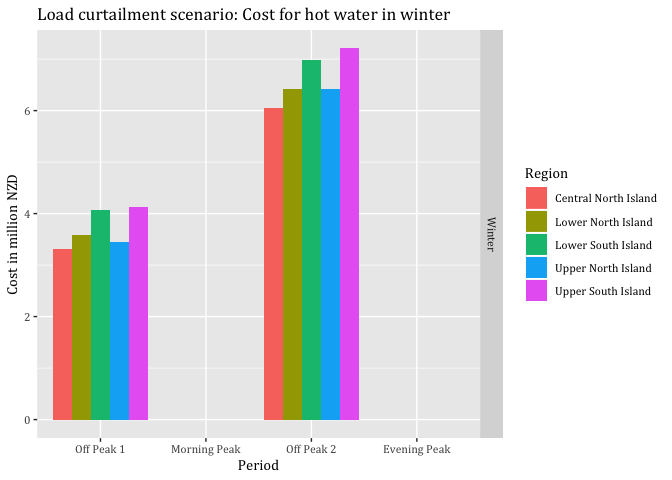<!-- -->

```r
#ggsave("Load curtailment scenario: Cost for hot water in winter.jpeg", dpi = 600)
```


```r
#Plots benefits when load is curtailed to zero 

EcoVaSumDT <- copy(EcoVaHHDT)

EcoVaSumSC1DT <- EcoVaSumDT
EcoVaSumSC1DT <- EcoVaSumSC1DT[, `EcoVaLc@Peak` := ifelse(Period == "Off Peak 1" |
                                                            Period == "Off Peak 2", 0,
                                                          `EcoVaLc@Peak`*(-1))]#We want to disply savings
EcoVaSumSC1DT <- EcoVaSumSC1DT[, `EcoVaLc@Peak` := `EcoVaLc@Peak`/1000000]# Converting to million $
EcoVaSumSC1DT <- EcoVaSumSC1DT[, (`EcoVaLc@Peak` = sum(`EcoVaLc@Peak`)), keyby = .(Region, season, Period)]


EcoVaSumSC1DT$Period <- factor(EcoVaSumSC1DT$Period, levels = c("Off Peak 1","Morning Peak",
                                                    "Off Peak 2", "Evening Peak"))

myPlot <- ggplot2::ggplot(EcoVaSumSC1DT, aes(x = Period, fill = Region)) +
  geom_bar(aes(y= V1), stat = "identity", position = "dodge") +
  #geom_line(aes(y= V1)) +
  theme(text = element_text(family = "Cambria")) +
  facet_grid(season ~ .) +
  ggtitle("Load curtailment scenario: Savings at peak time-periods for hot water") +
  labs(x='Period', y='Savings in million NZD') 
  
myPlot 
```

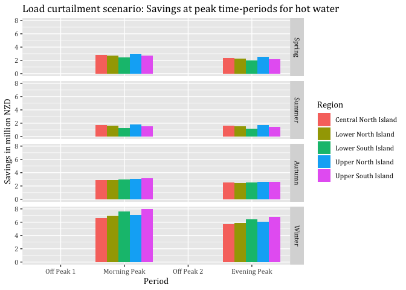<!-- -->

```r
#ggsave("Load curtailment scenario: Savings at peak time-periods for hot water.jpeg", dpi = 600)

myPlot <- ggplot2::ggplot(subset(EcoVaSumSC1DT,
                                 season %in% c("Winter")), aes(x = Period, fill = Region)) +
  geom_bar(aes(y= V1), stat = "identity", position = "dodge") +
  #geom_line(aes(y= V1)) +
  theme(text = element_text(family = "Cambria")) +
  facet_grid(season ~ .) +
  ggtitle("Load curtailment scenario: Savings at peak time-periods for hot water in winter") +
  labs(x='Period', y='Savings in million NZD') 
  
myPlot
```

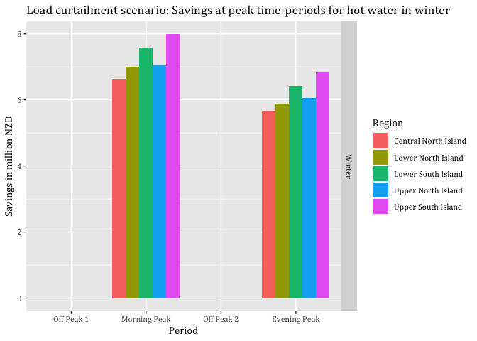<!-- -->

```r
#ggsave("Load curtailment scenario: Savings at peak time-periods for hot water in winter.jpeg", dpi = 600)
```

```r
#Plots cost and benefits of load curtailment to 0.5, does not consider baseline
EcoVaSumDT <- copy(EcoVaHHDT)

EcoVaSumDT <- EcoVaSumDT[, `EcoVaLc*0.5@Peak` := ifelse(Period == "Morning Peak" |
                                                          Period == "Evening Peak",
                                             ((Baseline*0.5)*1000000),`EcoVaLc*0.5@Peak`)]

EcoVaSumDT <- EcoVaSumDT[, `EcoVaLc*0.5@Peak` := `EcoVaLc*0.5@Peak`/1000000]# Converting to million $
EcoVaSumSC2DT <- EcoVaSumDT[, (`EcoVaLc*0.5@Peak` = sum(`EcoVaLc*0.5@Peak`)), keyby = .(Region, season, Period)]

EcoVaSumSC2DT$Period <- factor(EcoVaSumSC2DT$Period, levels = c("Off Peak 1",
                                                                "Morning Peak",
                                                                "Off Peak 2",
                                                                "Evening Peak"))

#Analysis
CostBaseline <- sum(EcoVaSumDT$Baseline)
`CostEcoVaLc*0.5@Peak` <- sum(EcoVaSumDT$`EcoVaLc*0.5@Peak`)

SavingsMillionNZD <- CostBaseline - `CostEcoVaLc*0.5@Peak`
SavingsPercent <- 1-(`CostEcoVaLc*0.5@Peak` / CostBaseline)

SavingsMillionNZD
```

```
## [1] 67.7444
```

```r
SavingsPercent
```

```
## [1] 0.2852896
```

```r
myPlot <- ggplot2::ggplot(EcoVaSumSC2DT, aes(x = Period, fill = Region)) +
  geom_bar(aes(y= V1), stat = "identity", position = "dodge") +
  #geom_line(aes(y= V1)) +
  theme(text = element_text(family = "Cambria")) +
  facet_grid(season ~ .) +
  ggtitle("Load curtailment 0.5 scenario: Cost for hot water") +
  labs(x='Period', y='Cost in million NZD') 
  
myPlot 
```

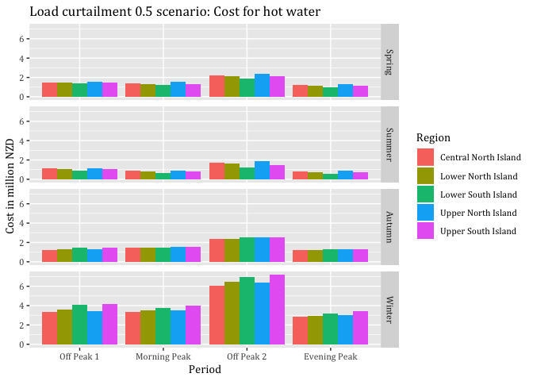<!-- -->

```r
#ggsave("Load curtailment 0.5 scenario: Cost for hot water.jpeg", dpi = 600)

myPlot <- ggplot2::ggplot(subset(EcoVaSumSC2DT,
                                 season %in% c("Winter")), aes(x = Period, fill = Region)) +
  geom_bar(aes(y= V1), stat = "identity", position = "dodge") +
  #geom_line(aes(y= V1)) +
  theme(text = element_text(family = "Cambria")) +
  facet_grid(season ~ .) +
  ggtitle("Load curtailment 0.5 scenario: Cost for hot water in winter") +
  labs(x='Period', y='Cost in million NZD') 
  
myPlot
```

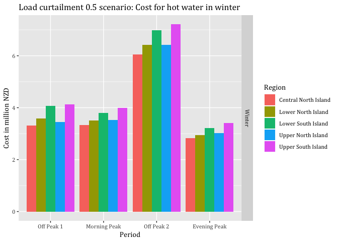<!-- -->

```r
#ggsave("Load curtailment 0.5 scenario: Cost for hot water in winter.jpeg", dpi = 600)
```


```r
#Plots benefits when load is curtailed to 0.5 

EcoVaSumDT <- copy(EcoVaHHDT)

EcoVaSumSC2DT <- EcoVaSumDT
EcoVaSumSC2DT <- EcoVaSumSC2DT[, `EcoVaLc*0.5@Peak` := ifelse(Period == "Off Peak 1"|
                                                            Period == "Off Peak 2",0,
                                 `EcoVaLc*0.5@Peak`*(-1))]#We want to disply savings


EcoVaSumSC2DT <- EcoVaSumSC2DT[, `EcoVaLc*0.5@Peak` := `EcoVaLc*0.5@Peak`/1000000]# Converting to million $
EcoVaSumSC2DT <- EcoVaSumSC2DT[, (`EcoVaLc*0.5@Peak` = sum(`EcoVaLc*0.5@Peak`)), keyby = .(Region, season, Period)]


EcoVaSumSC2DT$Period <- factor(EcoVaSumSC2DT$Period, levels = c("Off Peak 1","Morning Peak",
                                                    "Off Peak 2", "Evening Peak"))

myPlot <- ggplot2::ggplot(EcoVaSumSC2DT, aes(x = Period, fill = Region)) +
  geom_bar(aes(y= V1), stat = "identity", position = "dodge") +
  #geom_line(aes(y= V1)) +
  theme(text = element_text(family = "Cambria")) +
  facet_grid(season ~ .) +
  ggtitle("Load curtailment 0.5 scenario: Savings at peak time-periods for hot water") +
  labs(x='Period', y='Savings in million NZD') 
  
myPlot 
```

<!-- -->

```r
#ggsave("Load curtailment 0.5 scenario: Savings at peak time-periods for hot water.jpeg", dpi = 600)

myPlot <- ggplot2::ggplot(subset(EcoVaSumSC2DT,
                                 season %in% c("Winter")), aes(x = Period, fill = Region)) +
  geom_bar(aes(y= V1), stat = "identity", position = "dodge") +
  #geom_line(aes(y= V1)) +
  theme(text = element_text(family = "Cambria")) +
  facet_grid(season ~ .) +
  ggtitle("Load curtailment 0.5 scenario: Savings at peak time-periods for hot water in winter") +
  labs(x='Period', y='Savings in million NZD') 
  
myPlot
```

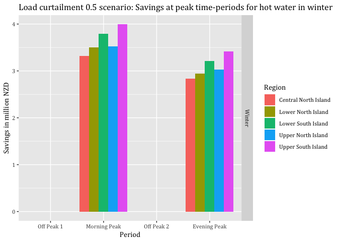<!-- -->

```r
#ggsave("Load curtailment 0.5 scenario: Savings at peak time-periods for hot water in winter.jpeg", dpi = 600)
```

```r
#Plots cost and benefits of load shifting, does not consider baseline but increases costs at off peaks
EcoVaSumDT <- copy(EcoVaHHDT)


EcoVaSumDT <- EcoVaSumDT[, EcoSummary := ifelse(Period == "Off Peak 1" |
                                               Period == "Off Peak 2",
                                             (Baseline*1000000) + EcoVaLs, 0)]#It has to be zero 


EcoVaSumDT <- EcoVaSumDT[, `EcoSummary` := `EcoSummary`/1000000]# Converting to million $
EcoVaSumSC3DT <- EcoVaSumDT[, (`EcoSummary` = sum(`EcoSummary`)), keyby = .(Region, season, Period)]

EcoVaSumSC3DT$Period <- factor(EcoVaSumSC3DT$Period, levels = c("Off Peak 1","Morning Peak",
                                                    "Off Peak 2", "Evening Peak"))


#Analysis
CostBaseline <- sum(EcoVaSumDT$Baseline)
`CostLoadShif` <- sum(EcoVaSumDT$`EcoSummary`)

SavingsMillionNZD <- CostBaseline - `CostLoadShif`
SavingsPercent <- 1-(`CostLoadShif` / CostBaseline)

SavingsMillionNZD
```

```
## [1] 18.91147
```

```r
SavingsPercent
```

```
## [1] 0.0796412
```

```r
myPlot <- ggplot2::ggplot(EcoVaSumSC3DT, aes(x = Period, fill = Region)) +
  geom_bar(aes(y= V1), stat = "identity", position = "dodge") +
  #geom_line(aes(y= V1)) +
  theme(text = element_text(family = "Cambria")) +
  facet_grid(season ~ .) +
  ggtitle("Load shifting scenario: Cost for hot water") +
  labs(x='Period', y='Cost in million NZD') 
  
myPlot 
```

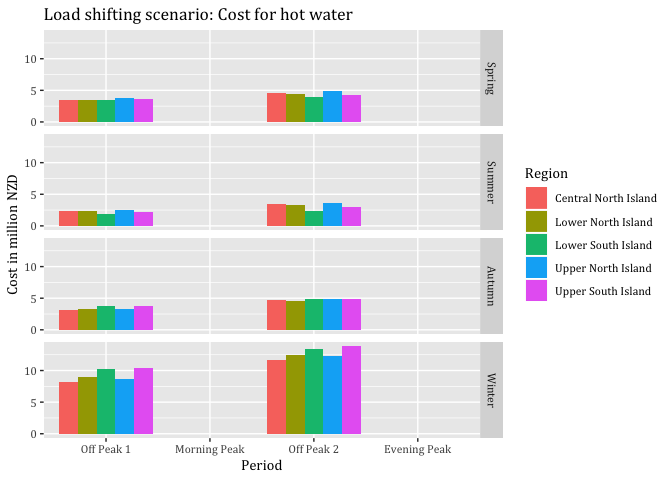<!-- -->

```r
#ggsave("Load shifting scenario: Cost for hot water.jpeg", dpi = 600)

myPlot <- ggplot2::ggplot(subset(EcoVaSumSC3DT,
                                 season %in% c("Winter")), aes(x = Period, fill = Region)) +
  geom_bar(aes(y= V1), stat = "identity", position = "dodge") +
  #geom_line(aes(y= V1)) +
  theme(text = element_text(family = "Cambria")) +
  facet_grid(season ~ .) +
  ggtitle("Load shifting scenario: Cost for hot water in winter") +
  labs(x='Period', y='Cost in million NZD') 
  
myPlot
```

<!-- -->

```r
#ggsave("Load shifting scenario: Cost for hot water in winter.jpeg", dpi = 600)
```
###Both appliances together

```r
#Defining peak and off-peak for heat pump and hot water seperately
sc3data <- heatPumpProfileDT

sc3data <- sc3data[, .(GWhHP = sum(scaledGWh)), 
                    keyby = .(season, obsHalfHour)]

#Defining peak and off-peak periods
sc3data <- sc3data[, Period := "Not Peak"]

sc3data <- sc3data[obsHalfHour >= MPS & 
                     obsHalfHour <= MPE,
                   Period := "Morning Peak"]

sc3data <- sc3data[obsHalfHour >= EPS & 
                     obsHalfHour <= EPE,
                   Period := "Evening Peak"]

sc3data <- sc3data[obsHalfHour >= OP1S & 
                     obsHalfHour <= OP1E,
                   Period := "Off Peak 1"]

sc3data <- sc3data[obsHalfHour >= OP12S & 
                     obsHalfHour <= OP12E,
                   Period := "Off Peak 1"]

sc3data <- sc3data[obsHalfHour >= OP2S & 
                     obsHalfHour <= OP2E,
                   Period := "Off Peak 2"]


sc32data <- hotWaterProfileDT

sc32data <- sc32data[, .(GWhHW = sum(scaledGWh)), 
                    keyby = .(season, obsHalfHour)]

#Defining peak and off-peak periods

sc32data <- sc32data[obsHalfHour >= MPS & 
                     obsHalfHour <= MPE,
                   Period := "Morning Peak"]

sc32data <- sc32data[obsHalfHour >= EPS & 
                     obsHalfHour <= EPE,
                   Period := "Evening Peak"]

sc32data <- sc32data[obsHalfHour >= OP1S & 
                     obsHalfHour <= OP1E,
                   Period := "Off Peak 1"]

sc32data <- sc32data[obsHalfHour >= OP12S & 
                     obsHalfHour <= OP12E,
                   Period := "Off Peak 1"]

sc32data <- sc32data[obsHalfHour >= OP2S & 
                     obsHalfHour <= OP2E,
                   Period := "Off Peak 2"]

#Copying hot water consumption column into heat pump data table
sc3data <- cbind(sc3data, sc32data[,"GWhHW"])

#Building sum of heat pump and hot water consumption
sc3data <- sc3data[, PumpandWater := GWhHP + GWhHW]
```
####Baseline

```r
#Economic evaluation begins
sc3data <- sc3data[, MWh:=PumpandWater*fac1000] # Creating new column MWh


setkey(SeasonAvgDT, season, obsHalfHour)
setkey(sc3data, season, obsHalfHour)

Mergedsc0DT <- sc3data[SeasonAvgDT]

Mergedsc0DT <- Mergedsc0DT[, ecoValueHH := 0]

Mergedsc0DT <- Mergedsc0DT[, MWh := MWh /5]

Mergedsc0DT <- Mergedsc0DT[, ecoValueHH := (MWh * (meanprice)/1000000), 
                           keyby = .(season, Region, obsHalfHour)]

#Change the order in facet_grid()
Mergedsc0DT$season <- factor(Mergedsc0DT$season, levels = c("Spring","Summer",
                                                    "Autumn", "Winter"))

#Visualising
myPlot <- ggplot2::ggplot(Mergedsc0DT, aes(x = obsHalfHour)) +
  geom_point(aes(y=ecoValueHH, color= Region), size=1) +
  theme(text = element_text(family = "Cambria")) +
  ggtitle("Costs baseline scenario time of day for heat pump and hot water") +
  facet_grid(season ~ .) +
  labs(x='Time of Day', y='Cost in million NZD') +
  scale_x_time(breaks = c(hms::as.hms("00:00:00"), hms::as.hms("04:00:00"), hms::as.hms("08:00:00"),       hms::as.hms("12:00:00"), hms::as.hms("16:00:00"), 
  hms::as.hms("20:00:00"))) 
myPlot
```

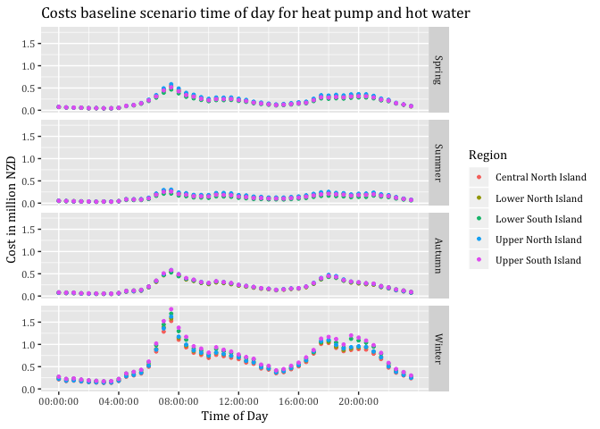<!-- -->

```r
#ggsave("Cost baseline scenario time of day.jpeg", dpi = 600)

#Building season sum by period
#Mergedsc0DT <- Mergedsc0DT[, .(EcoVal = sum(ecoValueHH)),
                  # keyby = .(season, Region, Period)]
```
####Load curtailment to zero SC1


```r
fac1000 <- 1000 # We need this conversion to display MWh as required by prices per MWh

sc1data <- sc3data#WARNING PREVIOUS SECTION MUST BE EXECUTED TO REPRESENT CORRECT VALUES HERE WARNING


sc1data[, c("medianW", "obsHourMin", "meanW", "nObs", "sdW",
            "scaledMWmethod1", "EECApmMethod2"):=NULL] #Deleting unnecessary columns
```

```
## Warning in `[.data.table`(sc1data, , `:=`(c("medianW", "obsHourMin",
## "meanW", : Adding new column 'medianW' then assigning NULL (deleting it).
```

```
## Warning in `[.data.table`(sc1data, , `:=`(c("medianW", "obsHourMin",
## "meanW", : Adding new column 'obsHourMin' then assigning NULL (deleting
## it).
```

```
## Warning in `[.data.table`(sc1data, , `:=`(c("medianW", "obsHourMin",
## "meanW", : Adding new column 'meanW' then assigning NULL (deleting it).
```

```
## Warning in `[.data.table`(sc1data, , `:=`(c("medianW", "obsHourMin",
## "meanW", : Adding new column 'nObs' then assigning NULL (deleting it).
```

```
## Warning in `[.data.table`(sc1data, , `:=`(c("medianW", "obsHourMin",
## "meanW", : Adding new column 'sdW' then assigning NULL (deleting it).
```

```
## Warning in `[.data.table`(sc1data, , `:=`(c("medianW", "obsHourMin",
## "meanW", : Adding new column 'scaledMWmethod1' then assigning NULL
## (deleting it).
```

```
## Warning in `[.data.table`(sc1data, , `:=`(c("medianW", "obsHourMin",
## "meanW", : Adding new column 'EECApmMethod2' then assigning NULL (deleting
## it).
```

```r
sc1data <- sc1data[, .(GWhs1 = sum(PumpandWater)), 
                    keyby = .(season, obsHalfHour)]


#Defining peak and off-peak periods
sc1data <- sc1data[, Period := "Not Peak"]

sc1data <- sc1data[obsHalfHour >= MPS & 
                     obsHalfHour <= MPE,
                   Period := "Morning Peak"]

sc1data <- sc1data[obsHalfHour >= EPS & 
                     obsHalfHour <= EPE,
                   Period := "Evening Peak"]

sc1data <- sc1data[obsHalfHour >= OP1S & 
                     obsHalfHour <= OP1E,
                   Period := "Off Peak 1"]

sc1data <- sc1data[obsHalfHour >= OP12S & 
                     obsHalfHour <= OP12E,
                   Period := "Off Peak 1"]

sc1data <- sc1data[obsHalfHour >= OP2S & 
                     obsHalfHour <= OP2E,
                   Period := "Off Peak 2"]


#Economic evaluation begins
sc1data <- sc1data[, MWh:=GWhs1*fac1000] # Creating new column GWh based on GWhs1 in MWh


setkey(SeasonAvgDT, season, obsHalfHour)
setkey(sc1data, season, obsHalfHour)

Mergedsc1DT <- sc1data[SeasonAvgDT]

Mergedsc1DT <- Mergedsc1DT[, ecoValueHH := 0]

Mergedsc1DT <- Mergedsc1DT[, MWh := MWh / 5]

Mergedsc1DT <- Mergedsc1DT[, ecoValueHH := ifelse(Period == "Morning Peak" | 
                                                  Period == "Evening Peak",
                                                (`MWh` * (-meanprice)),
                                                (MWh * (meanprice))),
                           keyby = .(season, Region, obsHalfHour)] 


#Change the order in facet_grid()
Mergedsc1DT$season <- factor(Mergedsc1DT$season, levels = c("Spring","Summer",
                                                    "Autumn", "Winter"))

#Visualising
myPlot <- ggplot2::ggplot(Mergedsc1DT, aes(x = obsHalfHour)) +
  geom_point(aes(y=ecoValueHH, color= Region), size=1.5) +
  theme(text = element_text(family = "Cambria")) +
  ggtitle("Economic value of load curtailment to zero by region") +
  facet_grid(season ~ .) +
  labs(x='Time of Day', y='Economic value $/MWh') +
  scale_x_time(breaks = c(hms::as.hms("00:00:00"), hms::as.hms("03:00:00"), hms::as.hms("06:00:00"),
                          hms::as.hms("09:00:00"), hms::as.hms("12:00:00"),
                          hms::as.hms("15:00:00"), hms::as.hms("18:00:00"), hms::as.hms("21:00:00")))
myPlot
```

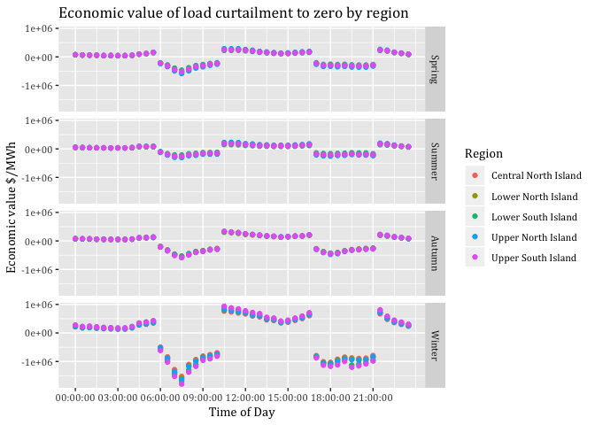<!-- -->

```r
#Mergedsc1DT <- Mergedsc1DT[, .(EcoVal = sum(ecoValueHH)),
                   #keyby = .(Region, season, Period)]
```
####Load curtailment of particular amount: SC2


```r
fac1000 <- 1000 # We need this conversion to display MWh as required by prices per MWh

sc2data <- sc3data#WARNING PREVIOUS TWO CHUNKS MUST BE EXECUTED TO WORK PROPERLY HERE WARNING
sc2data[, c("medianW", "obsHourMin", "meanW", "nObs", "sdW",
            "scaledMWmethod1", "EECApmMethod2"):=NULL] #Deleting unnecessary columns
```

```
## Warning in `[.data.table`(sc2data, , `:=`(c("medianW", "obsHourMin",
## "meanW", : Adding new column 'medianW' then assigning NULL (deleting it).
```

```
## Warning in `[.data.table`(sc2data, , `:=`(c("medianW", "obsHourMin",
## "meanW", : Adding new column 'obsHourMin' then assigning NULL (deleting
## it).
```

```
## Warning in `[.data.table`(sc2data, , `:=`(c("medianW", "obsHourMin",
## "meanW", : Adding new column 'meanW' then assigning NULL (deleting it).
```

```
## Warning in `[.data.table`(sc2data, , `:=`(c("medianW", "obsHourMin",
## "meanW", : Adding new column 'nObs' then assigning NULL (deleting it).
```

```
## Warning in `[.data.table`(sc2data, , `:=`(c("medianW", "obsHourMin",
## "meanW", : Adding new column 'sdW' then assigning NULL (deleting it).
```

```
## Warning in `[.data.table`(sc2data, , `:=`(c("medianW", "obsHourMin",
## "meanW", : Adding new column 'scaledMWmethod1' then assigning NULL
## (deleting it).
```

```
## Warning in `[.data.table`(sc2data, , `:=`(c("medianW", "obsHourMin",
## "meanW", : Adding new column 'EECApmMethod2' then assigning NULL (deleting
## it).
```

```r
sc2data <- sc2data[, .(GWhs1 = sum(PumpandWater)), 
                    keyby = .(season, obsHalfHour)]


#Defining peak and off-peak periods
sc2data <- sc2data[, Period := "Not Peak"]

sc2data <- sc2data[obsHalfHour >= MPS & 
                     obsHalfHour <= MPE,
                   Period := "Morning Peak"]

sc2data <- sc2data[obsHalfHour >= EPS & 
                     obsHalfHour <= EPE,
                   Period := "Evening Peak"]

sc2data <- sc2data[obsHalfHour >= OP1S & 
                     obsHalfHour <= OP1E,
                   Period := "Off Peak 1"]

sc1data <- sc2data[obsHalfHour >= OP12S & 
                     obsHalfHour <= OP12E,
                   Period := "Off Peak 1"]

sc2data <- sc2data[obsHalfHour >= OP2S & 
                     obsHalfHour <= OP2E,
                   Period := "Off Peak 2"]

sc2data <- sc2data[, MWh:= ifelse(Period == "Morning Peak" |
                                    Period == "Evening Peak", GWhs1*1000*0.5, GWhs1*1000)] # Creating new column GWh based on GWhs1 in MWh
sc2data <- sc2data[, MWh:= MWh /5]

setkey(SeasonAvgDT, season, obsHalfHour)

setkey(sc2data, season, obsHalfHour)

Mergedsc2DT <- sc2data[SeasonAvgDT]

Mergedsc2DT <- Mergedsc2DT[, ecoValueHH := 0]

Mergedsc2DT <- Mergedsc2DT[, ecoValueHH := ifelse(Period == "Morning Peak" | 
                                                  Period == "Evening Peak",
                                                (`MWh` * (-meanprice)),
                                                MWh * (meanprice)),
                           keyby = .(season, Region, obsHalfHour)] 

#Change the order in facet_grid()
Mergedsc2DT$season <- factor(Mergedsc2DT$season, levels = c("Spring","Summer",
                                                    "Autumn", "Winter"))

#Visualising only shifted consumption
myPlot <- ggplot2::ggplot(Mergedsc2DT, aes(x = obsHalfHour)) +
  geom_point(aes(y=ecoValueHH, color= Region), size=1.5) +
  theme(text = element_text(family = "Cambria")) +
  ggtitle("Economic value of particular amount by region") +
  facet_grid(season ~ .) +
  labs(x='Time of Day', y='Economic value $/MWh') +
  scale_x_time(breaks = c(hms::as.hms("00:00:00"), hms::as.hms("03:00:00"), hms::as.hms("06:00:00"),
                          hms::as.hms("09:00:00"), hms::as.hms("12:00:00"),
                          hms::as.hms("15:00:00"), hms::as.hms("18:00:00"), hms::as.hms("21:00:00")))
myPlot
```

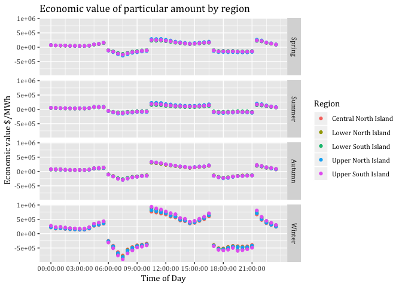<!-- -->

```r
#Mergedsc2DT <- Mergedsc2DT[, .(EcoVal = sum(ecoValueHH)),
                   #keyby = .(Region, season, Period)]
```
####Load shifting to prior time periods: SC3

```r
sc3data[, c("medianW", "obsHourMin", "meanW", "nObs", "sdW",
            "scaledMWmethod1", "EECApmMethod2"):=NULL] #Deleting unnecessary columns
```

```
## Warning in `[.data.table`(sc3data, , `:=`(c("medianW", "obsHourMin",
## "meanW", : Adding new column 'medianW' then assigning NULL (deleting it).
```

```
## Warning in `[.data.table`(sc3data, , `:=`(c("medianW", "obsHourMin",
## "meanW", : Adding new column 'obsHourMin' then assigning NULL (deleting
## it).
```

```
## Warning in `[.data.table`(sc3data, , `:=`(c("medianW", "obsHourMin",
## "meanW", : Adding new column 'meanW' then assigning NULL (deleting it).
```

```
## Warning in `[.data.table`(sc3data, , `:=`(c("medianW", "obsHourMin",
## "meanW", : Adding new column 'nObs' then assigning NULL (deleting it).
```

```
## Warning in `[.data.table`(sc3data, , `:=`(c("medianW", "obsHourMin",
## "meanW", : Adding new column 'sdW' then assigning NULL (deleting it).
```

```
## Warning in `[.data.table`(sc3data, , `:=`(c("medianW", "obsHourMin",
## "meanW", : Adding new column 'scaledMWmethod1' then assigning NULL
## (deleting it).
```

```
## Warning in `[.data.table`(sc3data, , `:=`(c("medianW", "obsHourMin",
## "meanW", : Adding new column 'EECApmMethod2' then assigning NULL (deleting
## it).
```

```r
sc3data <- sc3data[, .(GWhs1 = sum(PumpandWater)), 
                    keyby = .(season, obsHalfHour)]


#Defining peak and off-peak periods
sc3data <- sc3data[, Period := "Not Peak"]

sc3data <- sc3data[obsHalfHour >= MPS & 
                     obsHalfHour <= MPE,
                   Period := "Morning Peak"]

sc3data <- sc3data[obsHalfHour >= EPS & 
                     obsHalfHour <= EPE,
                   Period := "Evening Peak"]

sc3data <- sc3data[obsHalfHour >= OP1S & 
                     obsHalfHour <= OP1E,
                   Period := "Off Peak 1"]

sc3data <- sc3data[obsHalfHour >= OP12S & 
                     obsHalfHour <= OP12E,
                   Period := "Off Peak 1"]

sc3data <- sc3data[obsHalfHour >= OP2S & 
                     obsHalfHour <= OP2E,
                   Period := "Off Peak 2"]

#Building the sum of each peak period by season
AuMP <- sc3data[season == "Autumn" & Period == "Morning Peak",
                sum(GWhs1)]
WiMP <- sc3data[season == "Winter" & Period == "Morning Peak",
                sum(GWhs1)]
SpMP <- sc3data[season == "Spring" & Period == "Morning Peak",
                sum(GWhs1)]
SuMP <- sc3data[season == "Summer" & Period == "Morning Peak",
                sum(GWhs1)]

AuEP <- sc3data[season == "Autumn" & Period == "Evening Peak",
                sum(GWhs1)]
WiEP <- sc3data[season == "Winter" & Period == "Evening Peak",
                sum(GWhs1)]
SpEP <- sc3data[season == "Spring" & Period == "Evening Peak",
                sum(GWhs1)]
SuEP <- sc3data[season == "Summer" & Period == "Evening Peak",
                sum(GWhs1)]


#Counting number of rows that will be associated to spread the Morning Peak
AuMPHalfHours <- nrow(sc3data[season == "Autumn" &
                              Period == "Off Peak 1"])
WiMPHalfHours <- nrow(sc3data[season == "Winter" &
                              Period == "Off Peak 1"])
SpMPHalfHours <- nrow(sc3data[season == "Spring" &
                              Period == "Off Peak 1"])
SuMPHalfHours <- nrow(sc3data[season == "Summer" &
                              Period == "Off Peak 1"])

#Counting number of rows that will be associated to spread the Evening Peak
AuEPHalfHours <- nrow(sc3data[season == "Autumn" &
                              Period == "Off Peak 2"])
WiEPHalfHours <- nrow(sc3data[season == "Winter" &
                              Period == "Off Peak 2"])
SpEPHalfHours <- nrow(sc3data[season == "Spring" &
                              Period == "Off Peak 2"])
SuEPHalfHours <- nrow(sc3data[season == "Summer" &
                              Period == "Off Peak 2"])

#Calculating the proportion that each row will take on to spread the GWhs
distGWhOP1Au <- AuMP/AuMPHalfHours
distGWhOP1Wi <- WiMP/WiMPHalfHours
distGWhOP1Sp <- SpMP/SpMPHalfHours
distGWhOP1Su <- SuMP/SuMPHalfHours

distGWhOP2Au <- AuEP/AuEPHalfHours
distGWhOP2Wi <- WiEP/WiEPHalfHours
distGWhOP2Sp <- SpEP/SpEPHalfHours
distGWhOP2Su <- SuEP/SuEPHalfHours


#Adding amount of spreaded peak consumption to off-peak periods
sc3data <- sc3data[season == "Autumn" &
                     Period == "Off Peak 1", GWhs3 :=
                     GWhs1 + distGWhOP1Au]
sc3data <- sc3data[season == "Winter" &
                     Period == "Off Peak 1", GWhs3 :=
                     GWhs1 + distGWhOP1Wi]
sc3data <- sc3data[season == "Spring" &
                     Period == "Off Peak 1", GWhs3 :=
                     GWhs1 + distGWhOP1Sp]
sc3data <- sc3data[season == "Summer" &
                     Period == "Off Peak 1", GWhs3 :=
                     GWhs1 + distGWhOP1Su]


sc3data <- sc3data[season == "Autumn" &
                     Period == "Off Peak 2", GWhs3 :=
                     GWhs1 + distGWhOP2Au]
sc3data <- sc3data[season == "Winter" &
                     Period == "Off Peak 2", GWhs3 :=
                     GWhs1 + distGWhOP2Wi]
sc3data <- sc3data[season == "Spring" &
                     Period == "Off Peak 2", GWhs3 :=
                     GWhs1 + distGWhOP2Sp]
sc3data <- sc3data[season == "Summer" &
                     Period == "Off Peak 2", GWhs3 :=
                     GWhs1 + distGWhOP2Su]


#Setting missing values in peak periods to NULL
sc3data <- sc3data[, GWhs3:= ifelse(Period =="Morning Peak",
                                  0, GWhs3)]
sc3data <- sc3data[, GWhs3:= ifelse(Period =="Evening Peak",
                                  0, GWhs3)]
#Economic value starts::

#Creating new column
sc3data <- sc3data[, DiffOrigMWh := 0]
#Calculating the amount added due to load shifting + converting to MWh
sc3data <- sc3data[, DiffOrigMWh := ifelse(GWhs3 > 0,
                                           (GWhs3-GWhs1) * 1000, (0-GWhs1 * 1000))]

sc3data <- sc3data[, DiffOrigMWh := DiffOrigMWh / 5]
                     
#Preparation for merging DTs
setkey(SeasonAvgDT, season, obsHalfHour)
setkey(sc3data, season, obsHalfHour)

#Merging
Mergedsc3DT <- sc3data[SeasonAvgDT]

Mergedsc3DT <- Mergedsc3DT[, ecoValueHH := ifelse(Period == "Morning Peak" | 
                                                  Period == "Evening Peak",
                                                DiffOrigMWh * (meanprice),
                                                DiffOrigMWh * (meanprice)),
                           keyby = .(season, Region, obsHalfHour)]#WARNING DiffOrigMWh represents distinction between positive and negative already


#Change the order in facet_grid()
Mergedsc3DT$season <- factor(Mergedsc3DT$season, levels = c("Spring","Summer",
                                                    "Autumn", "Winter"))


#Putting all values together and check!
EcoVaHHDT <- copy(Mergedsc0DT)

setnames(EcoVaHHDT, old=c("ecoValueHH"), new=c("Baseline"))

EcoVaHHDT <- cbind(EcoVaHHDT, Mergedsc1DT[,"ecoValueHH"])
setnames(EcoVaHHDT, old=c("ecoValueHH"), new=c("EcoVaLc@Peak"))

EcoVaHHDT <- cbind(EcoVaHHDT, Mergedsc2DT[,"ecoValueHH"])
setnames(EcoVaHHDT, old=c("ecoValueHH"), new=c("EcoVaLc*0.5@Peak"))

EcoVaHHDT <- cbind(EcoVaHHDT, Mergedsc3DT[,"ecoValueHH"])
setnames(EcoVaHHDT, old=c("ecoValueHH"), new=c("EcoVaLs"))

EcoVaHHDT <- EcoVaHHDT[, c("GWhs1", "MWh") := NULL]
```

```
## Warning in `[.data.table`(EcoVaHHDT, , `:=`(c("GWhs1", "MWh"), NULL)):
## Adding new column 'GWhs1' then assigning NULL (deleting it).
```

```r
EcoVaHHDT <- EcoVaHHDT[, meanprice := meanprice + 0,
                 keyby = .(season, Region, obsHalfHour)]
```
####Visualisation both aplliances

```r
EcoVaSumDT <- copy(EcoVaHHDT)

EcoVaSumDT <- EcoVaSumDT[, Baseline := Baseline]# Converting to million $
EcoVaSumSC0DT <- EcoVaSumDT[, (Baseline = sum(Baseline)), keyby = .(Region, season, Period)]


EcoVaSumSC0DT$Period <- factor(EcoVaSumSC0DT$Period, levels = c("Off Peak 1","Morning Peak",
                                                    "Off Peak 2", "Evening Peak"))

#Analysis
CostBaseline <- sum(EcoVaSumDT$Baseline)

SavingsMillionNZD <- CostBaseline-CostBaseline
SavingsPercent <- 0#Compared to Baseline

SavingsMillionNZD
```

```
## [1] 0
```

```r
SavingsPercent
```

```
## [1] 0
```

```r
myPlot <- ggplot2::ggplot(EcoVaSumSC0DT, aes(x = Period, fill = Region)) +
  geom_bar(aes(y= V1), stat = "identity", position = "dodge") +
  #geom_line(aes(y= V1)) +
  theme(text = element_text(family = "Cambria")) +
  facet_grid(season ~ .) +
  ggtitle("Baseline scenario: Cost for HP & HW") +
  labs(x='Period', y='Cost in million NZD') 
  
myPlot 
```

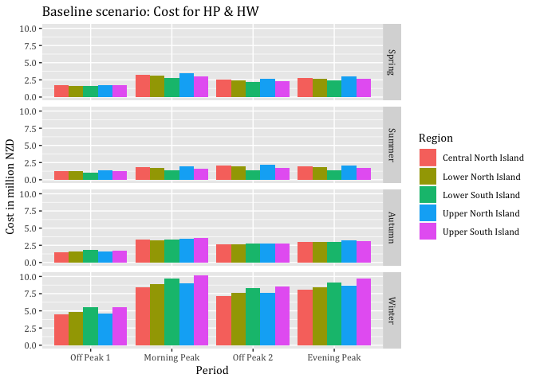<!-- -->

```r
#ggsave("Baseline scenario: Cost for HP & HW by period.jpeg", dpi = 600)

myPlot <- ggplot2::ggplot(subset(EcoVaSumSC0DT,
                                 season %in% c("Winter")), aes(x = Period, fill = Region)) +
  geom_bar(aes(y= V1), stat = "identity", position = "dodge") +
  #geom_line(aes(y= V1)) +
  theme(text = element_text(family = "Cambria")) +
  facet_grid(season ~ .) +
  ggtitle("Baseline scenario: Cost for HP & HW in winter") +
  labs(x='Period', y='Cost in million NZD') 
  
myPlot
```

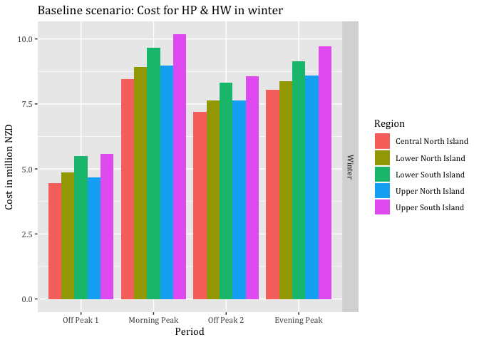<!-- -->

```r
#ggsave("Baseline scenario: Cost for HP & HW in winter by period.jpeg", dpi = 600)                        
```

```r
#Plots cost of load curtailment to zero, does not consider baseline
EcoVaSumDT <- copy(EcoVaHHDT)

EcoVaSumDT <- EcoVaSumDT[, `EcoVaLc@Peak` := ifelse(Period == "Morning Peak" |
                                                      Period == "Evening Peak", 0,
                                                    `EcoVaLc@Peak`)]
EcoVaSumDT <- EcoVaSumDT[, `EcoVaLc@Peak` := `EcoVaLc@Peak`/1000000]# Converting to million $
EcoVaSumSC1DT <- EcoVaSumDT[, (`EcoVaLc@Peak` = sum(`EcoVaLc@Peak`)), keyby = .(Region, season, Period)]

EcoVaSumSC1DT$Period <- factor(EcoVaSumSC1DT$Period, levels = c("Off Peak 1","Morning Peak",
                                                    "Off Peak 2", "Evening Peak"))

#Analysis
CostBaseline <- sum(EcoVaSumDT$Baseline)
`CostEcoVaLc@Peak` <- sum(EcoVaSumDT$`EcoVaLc@Peak`)

SavingsMillionNZD <- CostBaseline - `CostEcoVaLc@Peak`
SavingsPercent <- 1-(`CostEcoVaLc@Peak` / CostBaseline)

SavingsMillionNZD
```

```
## [1] 168.6363
```

```r
SavingsPercent
```

```
## [1] 0.5798358
```

```r
#Visualisation
myPlot <- ggplot2::ggplot(EcoVaSumSC1DT, aes(x = Period, fill = Region)) +
  geom_bar(aes(y= V1), stat = "identity", position = "dodge") +
  #geom_line(aes(y= V1)) +
  theme(text = element_text(family = "Cambria")) +
  facet_grid(season ~ .) +
  ggtitle("Load curtailment scenario: Cost for HP & HW") +
  labs(x='Period', y='Cost in million NZD') 
  
myPlot 
```

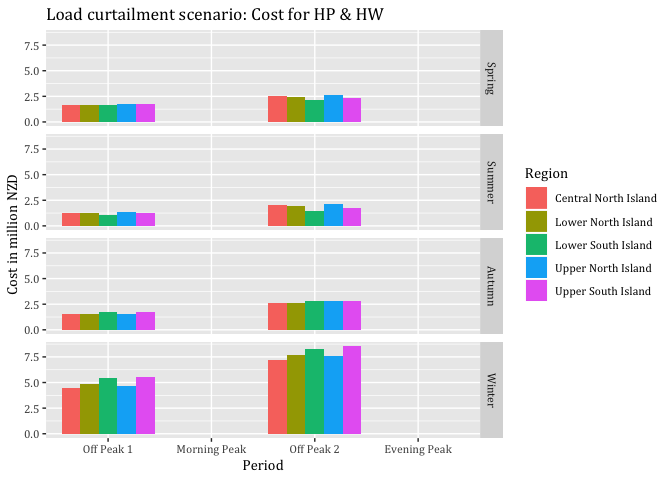<!-- -->

```r
#ggsave("Load curtailment scenario: Cost for HP & HW.jpeg", dpi = 600)

myPlot <- ggplot2::ggplot(subset(EcoVaSumSC1DT,
                                 season %in% c("Winter")), aes(x = Period, fill = Region)) +
  geom_bar(aes(y= V1), stat = "identity", position = "dodge") +
  #geom_line(aes(y= V1)) +
  theme(text = element_text(family = "Cambria")) +
  facet_grid(season ~ .) +
  ggtitle("Load curtailment scenario: Cost for HP & HW in winter") +
  labs(x='Period', y='Cost in million NZD') 
  
myPlot
```

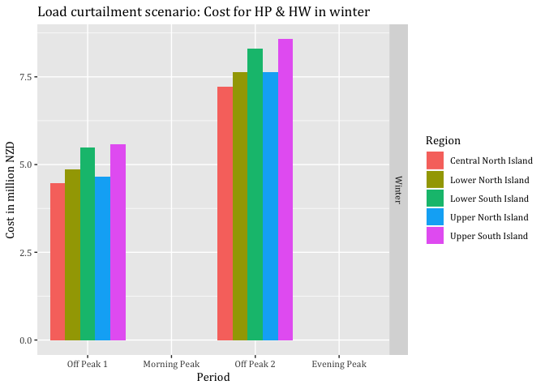<!-- -->

```r
#ggsave("Load curtailment scenario: Cost for HP & HW in winter.jpeg", dpi = 600)
```

```r
#Plots benefits when load is curtailed to zero 

EcoVaSumDT <- copy(EcoVaHHDT)

EcoVaSumSC1DT <- EcoVaSumDT
EcoVaSumSC1DT <- EcoVaSumSC1DT[, `EcoVaLc@Peak` := ifelse(Period == "Off Peak 1" |
                                                            Period == "Off Peak 2", 0,
                                                          `EcoVaLc@Peak`*(-1))]#We want to disply savings
EcoVaSumSC1DT <- EcoVaSumSC1DT[, `EcoVaLc@Peak` := `EcoVaLc@Peak`/1000000]# Converting to million $
EcoVaSumSC1DT <- EcoVaSumSC1DT[, (`EcoVaLc@Peak` = sum(`EcoVaLc@Peak`)), keyby = .(Region, season, Period)]


EcoVaSumSC1DT$Period <- factor(EcoVaSumSC1DT$Period, levels = c("Off Peak 1","Morning Peak",
                                                    "Off Peak 2", "Evening Peak"))

myPlot <- ggplot2::ggplot(EcoVaSumSC1DT, aes(x = Period, fill = Region)) +
  geom_bar(aes(y= V1), stat = "identity", position = "dodge") +
  #geom_line(aes(y= V1)) +
  theme(text = element_text(family = "Cambria")) +
  facet_grid(season ~ .) +
  ggtitle("Load curtailment scenario: Savings at peak time-periods for HP & HW") +
  labs(x='Period', y='Savings in million NZD') 
  
myPlot 
```

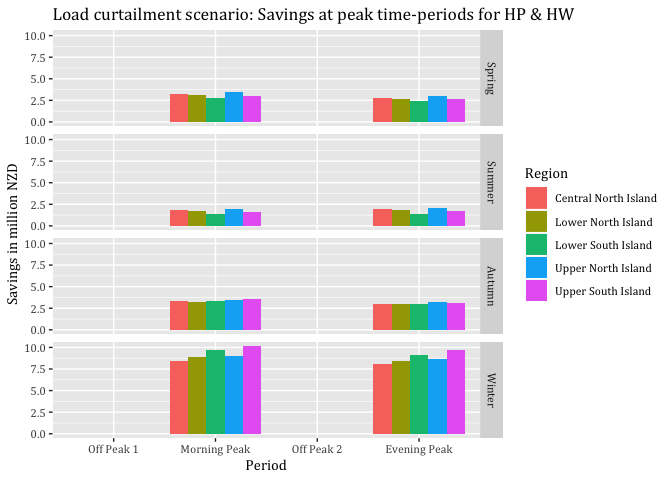<!-- -->

```r
#ggsave("Load curtailment scenario: Savings at peak time-periods for HP & HW.jpeg", dpi = 600)

myPlot <- ggplot2::ggplot(subset(EcoVaSumSC1DT,
                                 season %in% c("Winter")), aes(x = Period, fill = Region)) +
  geom_bar(aes(y= V1), stat = "identity", position = "dodge") +
  #geom_line(aes(y= V1)) +
  theme(text = element_text(family = "Cambria")) +
  facet_grid(season ~ .) +
  ggtitle("Load curtailment scenario: Savings at peak time-periods for HP & HW in winter") +
  labs(x='Period', y='Savings in million NZD') 
  
myPlot
```

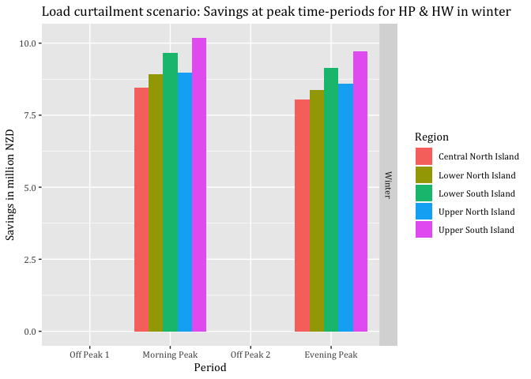<!-- -->

```r
#ggsave("Load curtailment scenario: Savings at peak time-periods for HP & HW in winter.jpeg", dpi = 600)
```


```r
#Plots cost and benefits of load curtailment to 0.5, does not consider baseline
EcoVaSumDT <- copy(EcoVaHHDT)

EcoVaSumDT <- EcoVaSumDT[, `EcoVaLc*0.5@Peak` := ifelse(Period == "Morning Peak" |
                                                          Period == "Evening Peak",
                                              ((Baseline*0.5)*1000000), `EcoVaLc*0.5@Peak`)]

EcoVaSumDT <- EcoVaSumDT[, `EcoVaLc*0.5@Peak` := `EcoVaLc*0.5@Peak`/1000000]# Converting to million $
EcoVaSumSC2DT <- EcoVaSumDT[, (`EcoVaLc*0.5@Peak` = sum(`EcoVaLc*0.5@Peak`)), keyby = .(Region, season, Period)]

EcoVaSumSC2DT$Period <- factor(EcoVaSumSC2DT$Period, levels = c("Off Peak 1",
                                                                "Morning Peak",
                                                                "Off Peak 2",
                                                                "Evening Peak"))

#Analysis
CostBaseline <- sum(EcoVaSumDT$Baseline)
`CostEcoVaLc*0.5@Peak` <- sum(EcoVaSumDT$`EcoVaLc*0.5@Peak`)

SavingsMillionNZD <- CostBaseline - `CostEcoVaLc*0.5@Peak`
SavingsPercent <- 1-(`CostEcoVaLc*0.5@Peak` / CostBaseline)

SavingsMillionNZD
```

```
## [1] 84.31813
```

```r
SavingsPercent
```

```
## [1] 0.2899179
```

```r
myPlot <- ggplot2::ggplot(EcoVaSumSC2DT, aes(x = Period, fill = Region)) +
  geom_bar(aes(y= V1), stat = "identity", position = "dodge") +
  #geom_line(aes(y= V1)) +
  theme(text = element_text(family = "Cambria")) +
  facet_grid(season ~ .) +
  ggtitle("Load curtailment 0.5 scenario: Cost for HP & HW") +
  labs(x='Period', y='Cost in million NZD') 
  
myPlot 
```

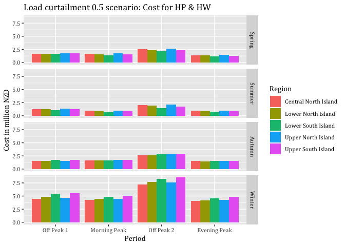<!-- -->

```r
#ggsave("Load curtailment 0.5 scenario: Cost for HP & HW.jpeg", dpi = 600)

myPlot <- ggplot2::ggplot(subset(EcoVaSumSC2DT,
                                 season %in% c("Winter")), aes(x = Period, fill = Region)) +
  geom_bar(aes(y= V1), stat = "identity", position = "dodge") +
  #geom_line(aes(y= V1)) +
  theme(text = element_text(family = "Cambria")) +
  facet_grid(season ~ .) +
  ggtitle("Load curtailment 0.5 scenario: Cost for HP & HW in winter") +
  labs(x='Period', y='Cost in million NZD') 
  
myPlot
```

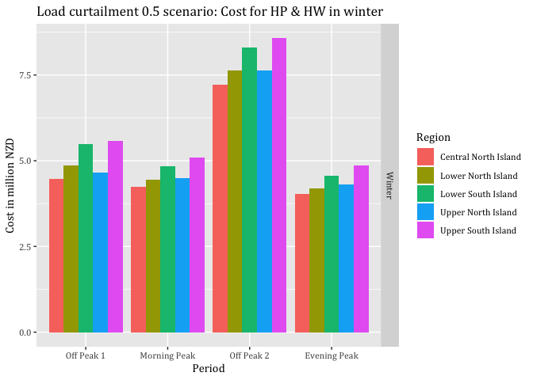<!-- -->

```r
#ggsave("Load curtailment 0.5 scenario: Cost for HP & HW in winter.jpeg", dpi = 600)
```


```r
#Plots benefits when load is curtailed to 0.5 

EcoVaSumDT <- copy(EcoVaHHDT)

EcoVaSumSC2DT <- EcoVaSumDT
EcoVaSumSC2DT <- EcoVaSumSC2DT[, `EcoVaLc*0.5@Peak` := ifelse(Period == "Off Peak 1"|
                                                            Period == "Off Peak 2",0,
                                 `EcoVaLc*0.5@Peak`*(-1))]#We want to disply savings


EcoVaSumSC2DT <- EcoVaSumSC2DT[, `EcoVaLc*0.5@Peak` := `EcoVaLc*0.5@Peak`/1000000]# Converting to million $
EcoVaSumSC2DT <- EcoVaSumSC2DT[, (`EcoVaLc*0.5@Peak` = sum(`EcoVaLc*0.5@Peak`)), keyby = .(Region, season, Period)]


EcoVaSumSC2DT$Period <- factor(EcoVaSumSC2DT$Period, levels = c("Off Peak 1","Morning Peak",
                                                    "Off Peak 2", "Evening Peak"))

myPlot <- ggplot2::ggplot(EcoVaSumSC2DT, aes(x = Period, fill = Region)) +
  geom_bar(aes(y= V1), stat = "identity", position = "dodge") +
  #geom_line(aes(y= V1)) +
  theme(text = element_text(family = "Cambria")) +
  facet_grid(season ~ .) +
  ggtitle("Load curtailment 0.5 scenario: Savings at peak time-periods for HP & HW") +
  labs(x='Period', y='Savings in million NZD') 
  
myPlot 
```

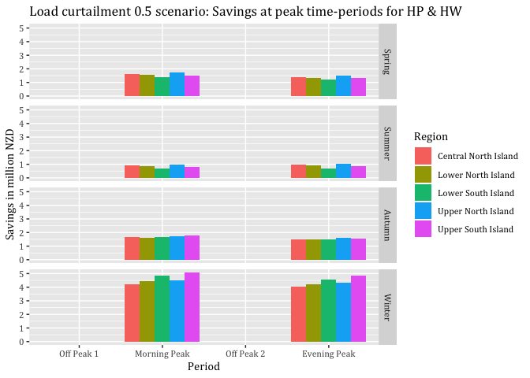<!-- -->

```r
#ggsave("Load curtailment 0.5 scenario: Savings at peak time-periods for HP & HW.jpeg", dpi = 600)

myPlot <- ggplot2::ggplot(subset(EcoVaSumSC2DT,
                                 season %in% c("Winter")), aes(x = Period, fill = Region)) +
  geom_bar(aes(y= V1), stat = "identity", position = "dodge") +
  #geom_line(aes(y= V1)) +
  theme(text = element_text(family = "Cambria")) +
  facet_grid(season ~ .) +
  ggtitle("Load curtailment 0.5 scenario: Savings at peak time-periods for HP & HW in winter") +
  labs(x='Period', y='Savings in million NZD') 
  
myPlot
```

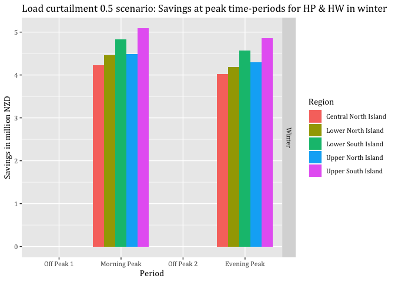<!-- -->

```r
#ggsave("Load curtailment 0.5 scenario: Savings at peak time-periods for HP & HW in winter.jpeg", dpi = 600)
```


```r
#Plots cost and benefits of load shifting, does not consider baseline but increases costs at off peaks
EcoVaSumDT <- copy(EcoVaHHDT)


EcoVaSumDT <- EcoVaSumDT[, EcoSummary := ifelse(Period == "Off Peak 1" |
                                               Period == "Off Peak 2",
                                             (Baseline*1000000) + EcoVaLs, 0)]#It has to be zero 


EcoVaSumDT <- EcoVaSumDT[, `EcoSummary` := `EcoSummary`/1000000]# Converting to million $
EcoVaSumSC3DT <- EcoVaSumDT[, (`EcoSummary` = sum(`EcoSummary`)), keyby = .(Region, season, Period)]

EcoVaSumSC3DT$Period <- factor(EcoVaSumSC3DT$Period, levels = c("Off Peak 1","Morning Peak",
                                                    "Off Peak 2", "Evening Peak"))


#Analysis
CostBaseline <- sum(EcoVaSumDT$Baseline)
`CostLoadShif` <- sum(EcoVaSumDT$`EcoSummary`)

SavingsMillionNZD <- CostBaseline - `CostLoadShif`
SavingsPercent <- 1-(`CostLoadShif` / CostBaseline)

SavingsMillionNZD
```

```
## [1] 22.28727
```

```r
SavingsPercent
```

```
## [1] 0.07663213
```

```r
myPlot <- ggplot2::ggplot(EcoVaSumSC3DT, aes(x = Period, fill = Region)) +
  geom_bar(aes(y= V1), stat = "identity", position = "dodge") +
  #geom_line(aes(y= V1)) +
  theme(text = element_text(family = "Cambria")) +
  facet_grid(season ~ .) +
  ggtitle("Load shifting scenario: Cost for HP & HW") +
  labs(x='Period', y='Cost in million NZD') 
  
myPlot 
```

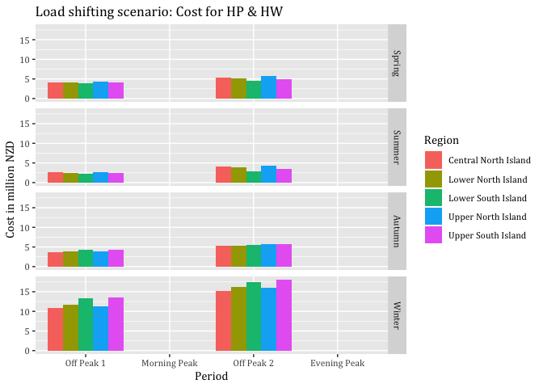<!-- -->

```r
#ggsave("Load shifting scenario: Cost for HP & HW.jpeg", dpi = 600)

myPlot <- ggplot2::ggplot(subset(EcoVaSumSC3DT,
                                 season %in% c("Winter")), aes(x = Period, fill = Region)) +
  geom_bar(aes(y= V1), stat = "identity", position = "dodge") +
  #geom_line(aes(y= V1)) +
  theme(text = element_text(family = "Cambria")) +
  facet_grid(season ~ .) +
  ggtitle("Load shifting scenario: Cost for HP & HW in winter") +
  labs(x='Period', y='Cost in million NZD') 
  
myPlot
```

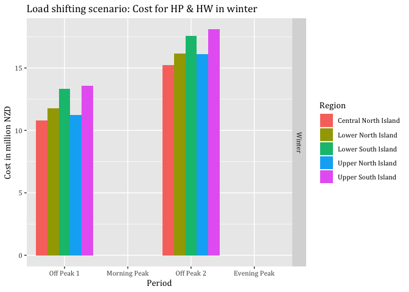<!-- -->

```r
#ggsave("Load shifting scenario: Cost for HP & HW in winter.jpeg", dpi = 600)
```
###All three applainces togetehr

```r
#Defining peak and off-peak for heat pump and hot water seperately
sc3data <- heatPumpProfileDT

sc3data <- sc3data[, .(GWhHP = sum(scaledGWh)), 
                    keyby = .(season, obsHalfHour)]

#Defining peak and off-peak periods
sc3data <- sc3data[, Period := "Not Peak"]

sc3data <- sc3data[obsHalfHour >= MPS & 
                     obsHalfHour <= MPE,
                   Period := "Morning Peak"]

sc3data <- sc3data[obsHalfHour >= EPS & 
                     obsHalfHour <= EPE,
                   Period := "Evening Peak"]

sc3data <- sc3data[obsHalfHour >= OP1S & 
                     obsHalfHour <= OP1E,
                   Period := "Off Peak 1"]

sc3data <- sc3data[obsHalfHour >= OP12S & 
                     obsHalfHour <= OP12E,
                   Period := "Off Peak 1"]

sc3data <- sc3data[obsHalfHour >= OP2S & 
                     obsHalfHour <= OP2E,
                   Period := "Off Peak 2"]


sc32data <- hotWaterProfileDT

sc32data <- sc32data[, .(GWhHW = sum(scaledGWh)), 
                    keyby = .(season, obsHalfHour)]

#Defining peak and off-peak periods

sc32data <- sc32data[obsHalfHour >= MPS & 
                     obsHalfHour <= MPE,
                   Period := "Morning Peak"]

sc32data <- sc32data[obsHalfHour >= EPS & 
                     obsHalfHour <= EPE,
                   Period := "Evening Peak"]

sc32data <- sc32data[obsHalfHour >= OP1S & 
                     obsHalfHour <= OP1E,
                   Period := "Off Peak 1"]

sc32data <- sc32data[obsHalfHour >= OP12S & 
                     obsHalfHour <= OP12E,
                   Period := "Off Peak 1"]

sc32data <- sc32data[obsHalfHour >= OP2S & 
                     obsHalfHour <= OP2E,
                   Period := "Off Peak 2"]


sc5data <- refrigerationProfileDT

sc5data <- sc5data[, .(GWhREF = sum(scaledGWh)), 
                    keyby = .(season, obsHalfHour)]

#Defining peak and off-peak periods

sc5data <- sc5data[obsHalfHour >= MPS & 
                     obsHalfHour <= MPE,
                   Period := "Morning Peak"]

sc5data <- sc5data[obsHalfHour >= EPS & 
                     obsHalfHour <= EPE,
                   Period := "Evening Peak"]

sc5data <- sc5data[obsHalfHour >= OP1S & 
                     obsHalfHour <= OP1E,
                   Period := "Off Peak 1"]

sc5data <- sc5data[obsHalfHour >= OP12S & 
                     obsHalfHour <= OP12E,
                   Period := "Off Peak 1"]

sc5data <- sc5data[obsHalfHour >= OP2S & 
                     obsHalfHour <= OP2E,
                   Period := "Off Peak 2"]

#Copying hot water consumption column into heat pump data table
sc3data <- cbind(sc3data, sc32data[,"GWhHW"], sc5data[, "GWhREF"])

#Building sum of heat pump and hot water consumption
sc3data <- sc3data[, PumpandWater := GWhHP + GWhHW + GWhREF]
```
####Baseline

```r
#Economic evaluation begins
sc3data <- sc3data[, MWh:=(PumpandWater*fac1000)] # Creating new column MWh


setkey(SeasonAvgDT, season, obsHalfHour)
setkey(sc3data, season, obsHalfHour)

Mergedsc0DT <- sc3data[SeasonAvgDT]

Mergedsc0DT <- Mergedsc0DT[, MWh:= MWh]
Mergedsc0DT <- Mergedsc0DT[, ecoValueHH := 0]
#Mergedsc0DT <- Mergedsc0DT[, avgregion := sum((meanprice)/5),
                          #keyby = .(season, obsHalfHour)]

Mergedsc0DT <- Mergedsc0DT[, MWh := MWh /5]

Mergedsc0DT <- Mergedsc0DT[, ecoValueHH := (MWh * meanprice), 
                           keyby = .(season, obsHalfHour)]

#Change the order in facet_grid()
Mergedsc0DT$season <- factor(Mergedsc0DT$season, levels = c("Spring","Summer",
                                                    "Autumn", "Winter"))


#Visualising
myPlot <- ggplot2::ggplot(subset(Mergedsc0DT, Region %in% c("Central North Island")), aes(x = obsHalfHour)) +
  geom_point(aes(y=ecoValueHH), size=1) +
  theme(text = element_text(family = "Cambria")) +
  ggtitle("Costs baseline scenario time of day for heat pump and hot water") +
  facet_grid(season ~ .) +
  labs(x='Time of Day', y='Cost in NZD') +
  scale_x_time(breaks = c(hms::as.hms("00:00:00"), hms::as.hms("04:00:00"), hms::as.hms("08:00:00"),       hms::as.hms("12:00:00"), hms::as.hms("16:00:00"), 
  hms::as.hms("20:00:00"))) 
myPlot
```

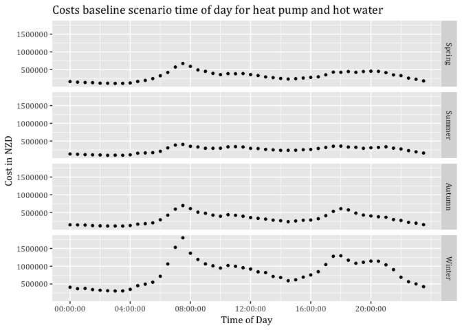<!-- -->

```r
ggsave("ALLTHREE_PerDayCost baseline scenario time of day all three.jpeg", dpi = 600)
```

```
## Saving 7 x 5 in image
```

```r
#Building season sum by period
#Mergedsc0DT <- Mergedsc0DT[, .(EcoVal = sum(ecoValueHH)),
                  # keyby = .(season, Region, Period)]
```
####Load curtailment to zero SC1


```r
fac1000 <- 1000 # We need this conversion to display MWh as required by prices per MWh

sc1data <- sc3data#WARNING PREVIOUS SECTION MUST BE EXECUTED TO REPRESENT CORRECT VALUES HERE WARNING


sc1data[, c("medianW", "obsHourMin", "meanW", "nObs", "sdW",
            "scaledMWmethod1", "EECApmMethod2"):=NULL] #Deleting unnecessary columns
```

```
## Warning in `[.data.table`(sc1data, , `:=`(c("medianW", "obsHourMin",
## "meanW", : Adding new column 'medianW' then assigning NULL (deleting it).
```

```
## Warning in `[.data.table`(sc1data, , `:=`(c("medianW", "obsHourMin",
## "meanW", : Adding new column 'obsHourMin' then assigning NULL (deleting
## it).
```

```
## Warning in `[.data.table`(sc1data, , `:=`(c("medianW", "obsHourMin",
## "meanW", : Adding new column 'meanW' then assigning NULL (deleting it).
```

```
## Warning in `[.data.table`(sc1data, , `:=`(c("medianW", "obsHourMin",
## "meanW", : Adding new column 'nObs' then assigning NULL (deleting it).
```

```
## Warning in `[.data.table`(sc1data, , `:=`(c("medianW", "obsHourMin",
## "meanW", : Adding new column 'sdW' then assigning NULL (deleting it).
```

```
## Warning in `[.data.table`(sc1data, , `:=`(c("medianW", "obsHourMin",
## "meanW", : Adding new column 'scaledMWmethod1' then assigning NULL
## (deleting it).
```

```
## Warning in `[.data.table`(sc1data, , `:=`(c("medianW", "obsHourMin",
## "meanW", : Adding new column 'EECApmMethod2' then assigning NULL (deleting
## it).
```

```r
sc1data <- sc1data[, .(GWhs1 = sum(PumpandWater)), 
                    keyby = .(season, obsHalfHour)]


#Defining peak and off-peak periods
sc1data <- sc1data[, Period := "Not Peak"]

sc1data <- sc1data[obsHalfHour >= MPS & 
                     obsHalfHour <= MPE,
                   Period := "Morning Peak"]

sc1data <- sc1data[obsHalfHour >= EPS & 
                     obsHalfHour <= EPE,
                   Period := "Evening Peak"]

sc1data <- sc1data[obsHalfHour >= OP1S & 
                     obsHalfHour <= OP1E,
                   Period := "Off Peak 1"]

sc1data <- sc1data[obsHalfHour >= OP12S & 
                     obsHalfHour <= OP12E,
                   Period := "Off Peak 1"]

sc1data <- sc1data[obsHalfHour >= OP2S & 
                     obsHalfHour <= OP2E,
                   Period := "Off Peak 2"]


#Economic evaluation begins
sc1data <- sc1data[, MWh:=GWhs1*fac1000] # Creating new column GWh based on GWhs1 in MWh


setkey(SeasonAvgDT, season, obsHalfHour)
setkey(sc1data, season, obsHalfHour)

Mergedsc1DT <- sc1data[SeasonAvgDT]

Mergedsc1DT <- Mergedsc1DT[, ecoValueHH := 0]

Mergedsc1DT <- Mergedsc1DT[, MWh := MWh / 5]

Mergedsc1DT <- Mergedsc1DT[, ecoValueHH := ifelse(Period == "Morning Peak" | 
                                                  Period == "Evening Peak",
                                                (`MWh` * (-meanprice)),
                                                (MWh * (meanprice))),
                           keyby = .(season, Region, obsHalfHour)] 


#Change the order in facet_grid()
Mergedsc1DT$season <- factor(Mergedsc1DT$season, levels = c("Spring","Summer",
                                                    "Autumn", "Winter"))

#Visualising
myPlot <- ggplot2::ggplot(Mergedsc1DT, aes(x = obsHalfHour)) +
  geom_point(aes(y=ecoValueHH, color= Region), size=1.5) +
  theme(text = element_text(family = "Cambria")) +
  ggtitle("Economic value of load curtailment to zero by region") +
  facet_grid(season ~ .) +
  labs(x='Time of Day', y='Economic value $/MWh') +
  scale_x_time(breaks = c(hms::as.hms("00:00:00"), hms::as.hms("03:00:00"), hms::as.hms("06:00:00"),
                          hms::as.hms("09:00:00"), hms::as.hms("12:00:00"),
                          hms::as.hms("15:00:00"), hms::as.hms("18:00:00"), hms::as.hms("21:00:00")))
myPlot
```

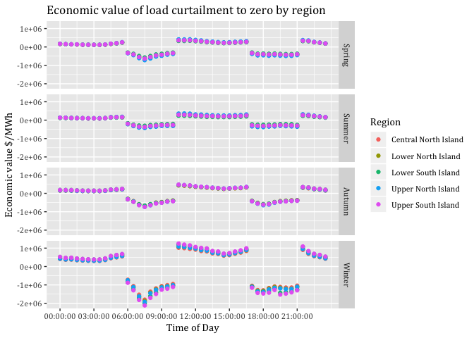<!-- -->

```r
#Mergedsc1DT <- Mergedsc1DT[, .(EcoVal = sum(ecoValueHH)),
                   #keyby = .(Region, season, Period)]
```
####Load curtailment of particular amount: SC2


```r
fac1000 <- 1000 # We need this conversion to display MWh as required by prices per MWh

sc2data <- sc3data#WARNING PREVIOUS TWO CHUNKS MUST BE EXECUTED TO WORK PROPERLY HERE WARNING
sc2data[, c("medianW", "obsHourMin", "meanW", "nObs", "sdW",
            "scaledMWmethod1", "EECApmMethod2"):=NULL] #Deleting unnecessary columns
```

```
## Warning in `[.data.table`(sc2data, , `:=`(c("medianW", "obsHourMin",
## "meanW", : Adding new column 'medianW' then assigning NULL (deleting it).
```

```
## Warning in `[.data.table`(sc2data, , `:=`(c("medianW", "obsHourMin",
## "meanW", : Adding new column 'obsHourMin' then assigning NULL (deleting
## it).
```

```
## Warning in `[.data.table`(sc2data, , `:=`(c("medianW", "obsHourMin",
## "meanW", : Adding new column 'meanW' then assigning NULL (deleting it).
```

```
## Warning in `[.data.table`(sc2data, , `:=`(c("medianW", "obsHourMin",
## "meanW", : Adding new column 'nObs' then assigning NULL (deleting it).
```

```
## Warning in `[.data.table`(sc2data, , `:=`(c("medianW", "obsHourMin",
## "meanW", : Adding new column 'sdW' then assigning NULL (deleting it).
```

```
## Warning in `[.data.table`(sc2data, , `:=`(c("medianW", "obsHourMin",
## "meanW", : Adding new column 'scaledMWmethod1' then assigning NULL
## (deleting it).
```

```
## Warning in `[.data.table`(sc2data, , `:=`(c("medianW", "obsHourMin",
## "meanW", : Adding new column 'EECApmMethod2' then assigning NULL (deleting
## it).
```

```r
sc2data <- sc2data[, .(GWhs1 = sum(PumpandWater)), 
                    keyby = .(season, obsHalfHour)]


#Defining peak and off-peak periods
sc2data <- sc2data[, Period := "Not Peak"]

sc2data <- sc2data[obsHalfHour >= MPS & 
                     obsHalfHour <= MPE,
                   Period := "Morning Peak"]

sc2data <- sc2data[obsHalfHour >= EPS & 
                     obsHalfHour <= EPE,
                   Period := "Evening Peak"]

sc2data <- sc2data[obsHalfHour >= OP1S & 
                     obsHalfHour <= OP1E,
                   Period := "Off Peak 1"]

sc1data <- sc2data[obsHalfHour >= OP12S & 
                     obsHalfHour <= OP12E,
                   Period := "Off Peak 1"]

sc2data <- sc2data[obsHalfHour >= OP2S & 
                     obsHalfHour <= OP2E,
                   Period := "Off Peak 2"]

sc2data <- sc2data[, MWh:= ifelse(Period == "Morning Peak" |
                                    Period == "Evening Peak", GWhs1*1000*0.5, GWhs1*1000)] # Creating new column GWh based on GWhs1 in MWh
sc2data <- sc2data[, MWh:= MWh /5]

setkey(SeasonAvgDT, season, obsHalfHour)

setkey(sc2data, season, obsHalfHour)

Mergedsc2DT <- sc2data[SeasonAvgDT]

Mergedsc2DT <- Mergedsc2DT[, ecoValueHH := 0]

Mergedsc2DT <- Mergedsc2DT[, ecoValueHH := ifelse(Period == "Morning Peak" | 
                                                  Period == "Evening Peak",
                                                (`MWh` * (-meanprice)),
                                                MWh * (meanprice)),
                           keyby = .(season, Region, obsHalfHour)] 

#Change the order in facet_grid()
Mergedsc2DT$season <- factor(Mergedsc2DT$season, levels = c("Spring","Summer",
                                                    "Autumn", "Winter"))

#Visualising only shifted consumption
myPlot <- ggplot2::ggplot(Mergedsc2DT, aes(x = obsHalfHour)) +
  geom_point(aes(y=ecoValueHH, color= Region), size=1.5) +
  theme(text = element_text(family = "Cambria")) +
  ggtitle("Economic value of particular amount by region") +
  facet_grid(season ~ .) +
  labs(x='Time of Day', y='Economic value $/MWh') +
  scale_x_time(breaks = c(hms::as.hms("00:00:00"), hms::as.hms("03:00:00"), hms::as.hms("06:00:00"),
                          hms::as.hms("09:00:00"), hms::as.hms("12:00:00"),
                          hms::as.hms("15:00:00"), hms::as.hms("18:00:00"), hms::as.hms("21:00:00")))
myPlot
```

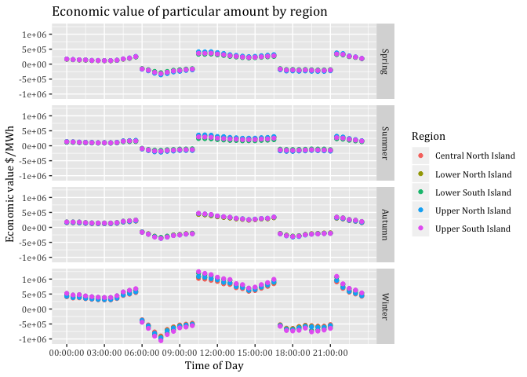<!-- -->

```r
#Mergedsc2DT <- Mergedsc2DT[, .(EcoVal = sum(ecoValueHH)),
                   #keyby = .(Region, season, Period)]
```
####Load shifting to prior time periods: SC3

```r
sc3data[, c("medianW", "obsHourMin", "meanW", "nObs", "sdW",
            "scaledMWmethod1", "EECApmMethod2"):=NULL] #Deleting unnecessary columns
```

```
## Warning in `[.data.table`(sc3data, , `:=`(c("medianW", "obsHourMin",
## "meanW", : Adding new column 'medianW' then assigning NULL (deleting it).
```

```
## Warning in `[.data.table`(sc3data, , `:=`(c("medianW", "obsHourMin",
## "meanW", : Adding new column 'obsHourMin' then assigning NULL (deleting
## it).
```

```
## Warning in `[.data.table`(sc3data, , `:=`(c("medianW", "obsHourMin",
## "meanW", : Adding new column 'meanW' then assigning NULL (deleting it).
```

```
## Warning in `[.data.table`(sc3data, , `:=`(c("medianW", "obsHourMin",
## "meanW", : Adding new column 'nObs' then assigning NULL (deleting it).
```

```
## Warning in `[.data.table`(sc3data, , `:=`(c("medianW", "obsHourMin",
## "meanW", : Adding new column 'sdW' then assigning NULL (deleting it).
```

```
## Warning in `[.data.table`(sc3data, , `:=`(c("medianW", "obsHourMin",
## "meanW", : Adding new column 'scaledMWmethod1' then assigning NULL
## (deleting it).
```

```
## Warning in `[.data.table`(sc3data, , `:=`(c("medianW", "obsHourMin",
## "meanW", : Adding new column 'EECApmMethod2' then assigning NULL (deleting
## it).
```

```r
sc3data <- sc3data[, .(GWhs1 = sum(PumpandWater)), 
                    keyby = .(season, obsHalfHour)]


#Defining peak and off-peak periods
sc3data <- sc3data[, Period := "Not Peak"]

sc3data <- sc3data[obsHalfHour >= MPS & 
                     obsHalfHour <= MPE,
                   Period := "Morning Peak"]

sc3data <- sc3data[obsHalfHour >= EPS & 
                     obsHalfHour <= EPE,
                   Period := "Evening Peak"]

sc3data <- sc3data[obsHalfHour >= OP1S & 
                     obsHalfHour <= OP1E,
                   Period := "Off Peak 1"]

sc3data <- sc3data[obsHalfHour >= OP12S & 
                     obsHalfHour <= OP12E,
                   Period := "Off Peak 1"]

sc3data <- sc3data[obsHalfHour >= OP2S & 
                     obsHalfHour <= OP2E,
                   Period := "Off Peak 2"]

#Building the sum of each peak period by season
AuMP <- sc3data[season == "Autumn" & Period == "Morning Peak",
                sum(GWhs1)]
WiMP <- sc3data[season == "Winter" & Period == "Morning Peak",
                sum(GWhs1)]
SpMP <- sc3data[season == "Spring" & Period == "Morning Peak",
                sum(GWhs1)]
SuMP <- sc3data[season == "Summer" & Period == "Morning Peak",
                sum(GWhs1)]

AuEP <- sc3data[season == "Autumn" & Period == "Evening Peak",
                sum(GWhs1)]
WiEP <- sc3data[season == "Winter" & Period == "Evening Peak",
                sum(GWhs1)]
SpEP <- sc3data[season == "Spring" & Period == "Evening Peak",
                sum(GWhs1)]
SuEP <- sc3data[season == "Summer" & Period == "Evening Peak",
                sum(GWhs1)]


#Counting number of rows that will be associated to spread the Morning Peak
AuMPHalfHours <- nrow(sc3data[season == "Autumn" &
                              Period == "Off Peak 1"])
WiMPHalfHours <- nrow(sc3data[season == "Winter" &
                              Period == "Off Peak 1"])
SpMPHalfHours <- nrow(sc3data[season == "Spring" &
                              Period == "Off Peak 1"])
SuMPHalfHours <- nrow(sc3data[season == "Summer" &
                              Period == "Off Peak 1"])

#Counting number of rows that will be associated to spread the Evening Peak
AuEPHalfHours <- nrow(sc3data[season == "Autumn" &
                              Period == "Off Peak 2"])
WiEPHalfHours <- nrow(sc3data[season == "Winter" &
                              Period == "Off Peak 2"])
SpEPHalfHours <- nrow(sc3data[season == "Spring" &
                              Period == "Off Peak 2"])
SuEPHalfHours <- nrow(sc3data[season == "Summer" &
                              Period == "Off Peak 2"])

#Calculating the proportion that each row will take on to spread the GWhs
distGWhOP1Au <- AuMP/AuMPHalfHours
distGWhOP1Wi <- WiMP/WiMPHalfHours
distGWhOP1Sp <- SpMP/SpMPHalfHours
distGWhOP1Su <- SuMP/SuMPHalfHours

distGWhOP2Au <- AuEP/AuEPHalfHours
distGWhOP2Wi <- WiEP/WiEPHalfHours
distGWhOP2Sp <- SpEP/SpEPHalfHours
distGWhOP2Su <- SuEP/SuEPHalfHours


#Adding amount of spreaded peak consumption to off-peak periods
sc3data <- sc3data[season == "Autumn" &
                     Period == "Off Peak 1", GWhs3 :=
                     GWhs1 + distGWhOP1Au]
sc3data <- sc3data[season == "Winter" &
                     Period == "Off Peak 1", GWhs3 :=
                     GWhs1 + distGWhOP1Wi]
sc3data <- sc3data[season == "Spring" &
                     Period == "Off Peak 1", GWhs3 :=
                     GWhs1 + distGWhOP1Sp]
sc3data <- sc3data[season == "Summer" &
                     Period == "Off Peak 1", GWhs3 :=
                     GWhs1 + distGWhOP1Su]


sc3data <- sc3data[season == "Autumn" &
                     Period == "Off Peak 2", GWhs3 :=
                     GWhs1 + distGWhOP2Au]
sc3data <- sc3data[season == "Winter" &
                     Period == "Off Peak 2", GWhs3 :=
                     GWhs1 + distGWhOP2Wi]
sc3data <- sc3data[season == "Spring" &
                     Period == "Off Peak 2", GWhs3 :=
                     GWhs1 + distGWhOP2Sp]
sc3data <- sc3data[season == "Summer" &
                     Period == "Off Peak 2", GWhs3 :=
                     GWhs1 + distGWhOP2Su]


#Setting missing values in peak periods to NULL
sc3data <- sc3data[, GWhs3:= ifelse(Period =="Morning Peak",
                                  0, GWhs3)]
sc3data <- sc3data[, GWhs3:= ifelse(Period =="Evening Peak",
                                  0, GWhs3)]
#Economic value starts::

#Creating new column
sc3data <- sc3data[, DiffOrigMWh := 0]
#Calculating the amount added due to load shifting + converting to MWh
sc3data <- sc3data[, DiffOrigMWh := ifelse(GWhs3 > 0,
                                           (GWhs3-GWhs1) * 1000, (0-GWhs1 * 1000))]

sc3data <- sc3data[, DiffOrigMWh := DiffOrigMWh /5]
                     
#Preparation for merging DTs
setkey(SeasonAvgDT, season, obsHalfHour)
setkey(sc3data, season, obsHalfHour)

#Merging
Mergedsc3DT <- sc3data[SeasonAvgDT]

Mergedsc3DT <- Mergedsc3DT[, ecoValueHH := ifelse(Period == "Morning Peak" | 
                                                  Period == "Evening Peak",
                                                DiffOrigMWh * (meanprice),
                                                DiffOrigMWh * (meanprice)),
                           keyby = .(season, Region, obsHalfHour)]#WARNING DiffOrigMWh represents distinction between positive and negative already


#Change the order in facet_grid()
Mergedsc3DT$season <- factor(Mergedsc3DT$season, levels = c("Spring","Summer",
                                                    "Autumn", "Winter"))


#Putting all values together and check!
EcoVaHHDT <- copy(Mergedsc0DT)

setnames(EcoVaHHDT, old=c("ecoValueHH"), new=c("Baseline"))

EcoVaHHDT <- cbind(EcoVaHHDT, Mergedsc1DT[,"ecoValueHH"])
setnames(EcoVaHHDT, old=c("ecoValueHH"), new=c("EcoVaLc@Peak"))

EcoVaHHDT <- cbind(EcoVaHHDT, Mergedsc2DT[,"ecoValueHH"])
setnames(EcoVaHHDT, old=c("ecoValueHH"), new=c("EcoVaLc*0.5@Peak"))

EcoVaHHDT <- cbind(EcoVaHHDT, Mergedsc3DT[,"ecoValueHH"])
setnames(EcoVaHHDT, old=c("ecoValueHH"), new=c("EcoVaLs"))

EcoVaHHDT <- EcoVaHHDT[, c("GWhs1", "MWh") := NULL]
```

```
## Warning in `[.data.table`(EcoVaHHDT, , `:=`(c("GWhs1", "MWh"), NULL)):
## Adding new column 'GWhs1' then assigning NULL (deleting it).
```

```r
EcoVaHHDT <- EcoVaHHDT[, meanprice := meanprice + 0,
                 keyby = .(season, Region, obsHalfHour)]
```
####Visualisation all three aplliances

```r
EcoVaSumDT <- copy(EcoVaHHDT)

EcoVaSumDT <- EcoVaSumDT[, Baseline := Baseline]# Converting to million $
EcoVaSumSC0DT <- EcoVaSumDT[, (Baseline = sum(Baseline)), keyby = .(Region, season, Period)]


EcoVaSumSC0DT$Period <- factor(EcoVaSumSC0DT$Period, levels = c("Off Peak 1","Morning Peak",
                                                    "Off Peak 2", "Evening Peak"))

#Analysis
CostBaseline <- sum(EcoVaSumDT$Baseline)

SavingsMillionNZD <- CostBaseline-CostBaseline
SavingsPercent <- 0#Compared to Baseline

SavingsMillionNZD
```

```
## [1] 0
```

```r
SavingsPercent
```

```
## [1] 0
```

```r
myPlot <- ggplot2::ggplot(EcoVaSumSC0DT, aes(x = Period, fill = Region)) +
  geom_bar(aes(y= V1), stat = "identity", position = "dodge") +
  #geom_line(aes(y= V1)) +
  theme(text = element_text(family = "Cambria")) +
  facet_grid(season ~ .) +
  ggtitle("Baseline scenario: Cost for HP & HW") +
  labs(x='Period', y='Cost in million NZD') 
  
myPlot 
```

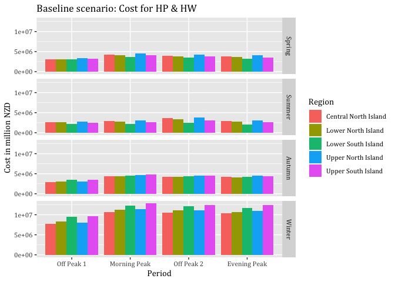<!-- -->

```r
#ggsave("Baseline scenario: Cost for HP & HW by period.jpeg", dpi = 600)

myPlot <- ggplot2::ggplot(subset(EcoVaSumSC0DT,
                                 season %in% c("Winter")), aes(x = Period, fill = Region)) +
  geom_bar(aes(y= V1), stat = "identity", position = "dodge") +
  #geom_line(aes(y= V1)) +
  theme(text = element_text(family = "Cambria")) +
  facet_grid(season ~ .) +
  ggtitle("Baseline scenario: Cost for HP & HW in winter") +
  labs(x='Period', y='Cost in million NZD') 
  
myPlot
```

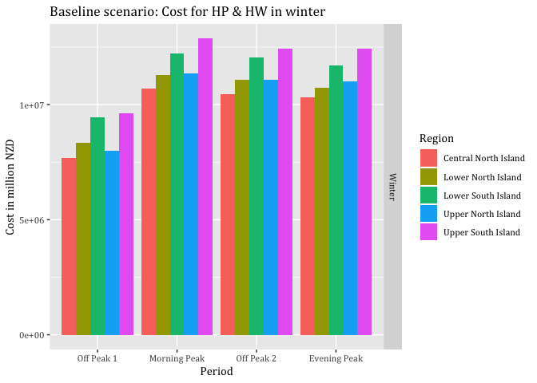<!-- -->

```r
#ggsave("Baseline scenario: Cost for HP & HW in winter by period.jpeg", dpi = 600)                        
```

```r
#Plots cost of load curtailment to zero, does not consider baseline
EcoVaSumDT <- copy(EcoVaHHDT)

EcoVaSumDT <- EcoVaSumDT[, `EcoVaLc@Peak` := ifelse(Period == "Morning Peak" |
                                                      Period == "Evening Peak", 0,
                                                    `EcoVaLc@Peak`)]
EcoVaSumDT <- EcoVaSumDT[, `EcoVaLc@Peak` := `EcoVaLc@Peak`/1000000]# Converting to million $
EcoVaSumSC1DT <- EcoVaSumDT[, (`EcoVaLc@Peak` = sum(`EcoVaLc@Peak`)), keyby = .(Region, season, Period)]

EcoVaSumSC1DT$Period <- factor(EcoVaSumSC1DT$Period, levels = c("Off Peak 1","Morning Peak",
                                                    "Off Peak 2", "Evening Peak"))

#Analysis
CostBaseline <- sum(EcoVaSumDT$Baseline)
`CostEcoVaLc@Peak` <- sum(EcoVaSumDT$`EcoVaLc@Peak`)

SavingsMillionNZD <- CostBaseline - `CostEcoVaLc@Peak`
SavingsPercent <- 1-(`CostEcoVaLc@Peak` / CostBaseline)

SavingsMillionNZD
```

```
## [1] 427391825
```

```r
SavingsPercent
```

```
## [1] 1
```

```r
#Visualisation
myPlot <- ggplot2::ggplot(EcoVaSumSC1DT, aes(x = Period, fill = Region)) +
  geom_bar(aes(y= V1), stat = "identity", position = "dodge") +
  #geom_line(aes(y= V1)) +
  theme(text = element_text(family = "Cambria")) +
  facet_grid(season ~ .) +
  ggtitle("Load curtailment scenario: Cost for HP & HW") +
  labs(x='Period', y='Cost in million NZD') 
  
myPlot 
```

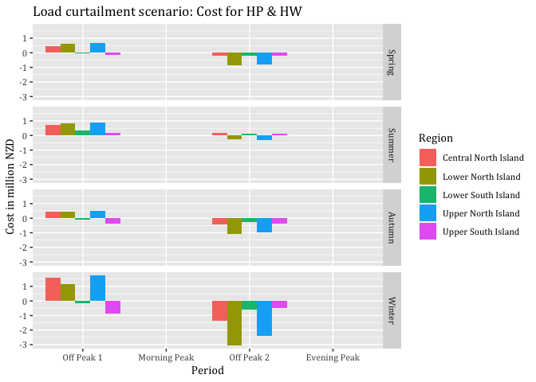<!-- -->

```r
#ggsave("Load curtailment scenario: Cost for HP & HW.jpeg", dpi = 600)

myPlot <- ggplot2::ggplot(subset(EcoVaSumSC1DT,
                                 season %in% c("Winter")), aes(x = Period, fill = Region)) +
  geom_bar(aes(y= V1), stat = "identity", position = "dodge") +
  #geom_line(aes(y= V1)) +
  theme(text = element_text(family = "Cambria")) +
  facet_grid(season ~ .) +
  ggtitle("Load curtailment scenario: Cost for HP & HW in winter") +
  labs(x='Period', y='Cost in million NZD') 
  
myPlot
```

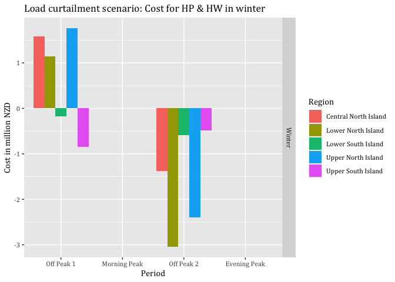<!-- -->

```r
#ggsave("Load curtailment scenario: Cost for HP & HW in winter.jpeg", dpi = 600)
```

```r
#Plots benefits when load is curtailed to zero 

EcoVaSumDT <- copy(EcoVaHHDT)

EcoVaSumSC1DT <- EcoVaSumDT
EcoVaSumSC1DT <- EcoVaSumSC1DT[, `EcoVaLc@Peak` := ifelse(Period == "Off Peak 1" |
                                                            Period == "Off Peak 2", 0,
                                                          `EcoVaLc@Peak`*(-1))]#We want to disply savings
EcoVaSumSC1DT <- EcoVaSumSC1DT[, `EcoVaLc@Peak` := `EcoVaLc@Peak`/1000000]# Converting to million $
EcoVaSumSC1DT <- EcoVaSumSC1DT[, (`EcoVaLc@Peak` = sum(`EcoVaLc@Peak`)), keyby = .(Region, season, Period)]


EcoVaSumSC1DT$Period <- factor(EcoVaSumSC1DT$Period, levels = c("Off Peak 1","Morning Peak",
                                                    "Off Peak 2", "Evening Peak"))

myPlot <- ggplot2::ggplot(EcoVaSumSC1DT, aes(x = Period, fill = Region)) +
  geom_bar(aes(y= V1), stat = "identity", position = "dodge") +
  #geom_line(aes(y= V1)) +
  theme(text = element_text(family = "Cambria")) +
  facet_grid(season ~ .) +
  ggtitle("Load curtailment scenario: Savings at peak time-periods for HP & HW") +
  labs(x='Period', y='Savings in million NZD') 
  
myPlot 
```

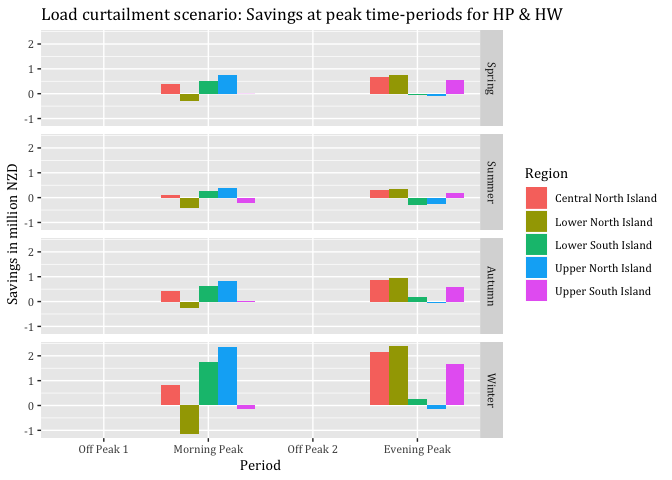<!-- -->

```r
#ggsave("Load curtailment scenario: Savings at peak time-periods for HP & HW.jpeg", dpi = 600)

myPlot <- ggplot2::ggplot(subset(EcoVaSumSC1DT,
                                 season %in% c("Winter")), aes(x = Period, fill = Region)) +
  geom_bar(aes(y= V1), stat = "identity", position = "dodge") +
  #geom_line(aes(y= V1)) +
  theme(text = element_text(family = "Cambria")) +
  facet_grid(season ~ .) +
  ggtitle("Load curtailment scenario: Savings at peak time-periods for HP & HW in winter") +
  labs(x='Period', y='Savings in million NZD') 
  
myPlot
```

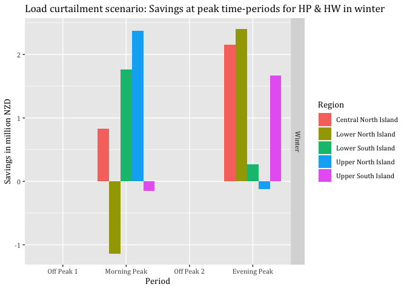<!-- -->

```r
#ggsave("Load curtailment scenario: Savings at peak time-periods for HP & HW in winter.jpeg", dpi = 600)
```


```r
#Plots cost and benefits of load curtailment to 0.5, does not consider baseline
EcoVaSumDT <- copy(EcoVaHHDT)

EcoVaSumDT <- EcoVaSumDT[, `EcoVaLc*0.5@Peak` := ifelse(Period == "Morning Peak" |
                                                          Period == "Evening Peak",
                                              ((Baseline*0.5)*1000000), `EcoVaLc*0.5@Peak`)]

EcoVaSumDT <- EcoVaSumDT[, `EcoVaLc*0.5@Peak` := `EcoVaLc*0.5@Peak`/1000000]# Converting to million $
EcoVaSumSC2DT <- EcoVaSumDT[, (`EcoVaLc*0.5@Peak` = sum(`EcoVaLc*0.5@Peak`)), keyby = .(Region, season, Period)]

EcoVaSumSC2DT$Period <- factor(EcoVaSumSC2DT$Period, levels = c("Off Peak 1",
                                                                "Morning Peak",
                                                                "Off Peak 2",
                                                                "Evening Peak"))

#Analysis
CostBaseline <- sum(EcoVaSumDT$Baseline)
`CostEcoVaLc*0.5@Peak` <- sum(EcoVaSumDT$`EcoVaLc*0.5@Peak`)

SavingsMillionNZD <- CostBaseline - `CostEcoVaLc*0.5@Peak`
SavingsPercent <- 1-(`CostEcoVaLc*0.5@Peak` / CostBaseline)

SavingsMillionNZD
```

```
## [1] 314971383
```

```r
SavingsPercent
```

```
## [1] 0.7369617
```

```r
myPlot <- ggplot2::ggplot(EcoVaSumSC2DT, aes(x = Period, fill = Region)) +
  geom_bar(aes(y= V1), stat = "identity", position = "dodge") +
  #geom_line(aes(y= V1)) +
  theme(text = element_text(family = "Cambria")) +
  facet_grid(season ~ .) +
  ggtitle("Load curtailment 0.5 scenario: Cost for HP & HW") +
  labs(x='Period', y='Cost in million NZD') 
  
myPlot 
```

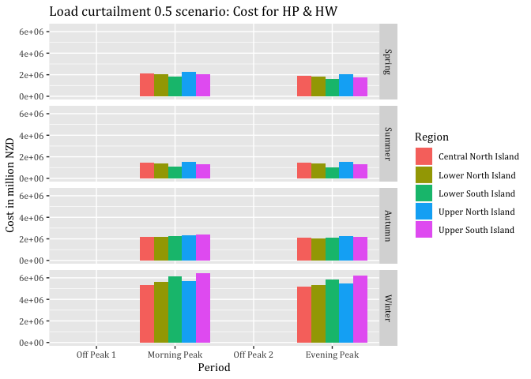<!-- -->

```r
#ggsave("Load curtailment 0.5 scenario: Cost for HP & HW.jpeg", dpi = 600)

myPlot <- ggplot2::ggplot(subset(EcoVaSumSC2DT,
                                 season %in% c("Winter")), aes(x = Period, fill = Region)) +
  geom_bar(aes(y= V1), stat = "identity", position = "dodge") +
  #geom_line(aes(y= V1)) +
  theme(text = element_text(family = "Cambria")) +
  facet_grid(season ~ .) +
  ggtitle("Load curtailment 0.5 scenario: Cost for HP & HW in winter") +
  labs(x='Period', y='Cost in million NZD') 
  
myPlot
```

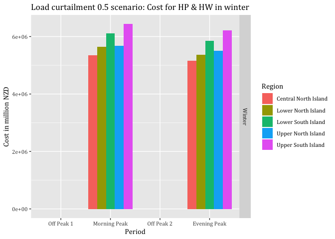<!-- -->

```r
#ggsave("Load curtailment 0.5 scenario: Cost for HP & HW in winter.jpeg", dpi = 600)
```


```r
#Plots benefits when load is curtailed to 0.5 

EcoVaSumDT <- copy(EcoVaHHDT)

EcoVaSumSC2DT <- EcoVaSumDT
EcoVaSumSC2DT <- EcoVaSumSC2DT[, `EcoVaLc*0.5@Peak` := ifelse(Period == "Off Peak 1"|
                                                            Period == "Off Peak 2",0,
                                 `EcoVaLc*0.5@Peak`*(-1))]#We want to disply savings


EcoVaSumSC2DT <- EcoVaSumSC2DT[, `EcoVaLc*0.5@Peak` := `EcoVaLc*0.5@Peak`/1000000]# Converting to million $
EcoVaSumSC2DT <- EcoVaSumSC2DT[, (`EcoVaLc*0.5@Peak` = sum(`EcoVaLc*0.5@Peak`)), keyby = .(Region, season, Period)]


EcoVaSumSC2DT$Period <- factor(EcoVaSumSC2DT$Period, levels = c("Off Peak 1","Morning Peak",
                                                    "Off Peak 2", "Evening Peak"))

myPlot <- ggplot2::ggplot(EcoVaSumSC2DT, aes(x = Period, fill = Region)) +
  geom_bar(aes(y= V1), stat = "identity", position = "dodge") +
  #geom_line(aes(y= V1)) +
  theme(text = element_text(family = "Cambria")) +
  facet_grid(season ~ .) +
  ggtitle("Load curtailment 0.5 scenario: Savings at peak time-periods for HP & HW") +
  labs(x='Period', y='Savings in million NZD') 
  
myPlot 
```

<!-- -->

```r
#ggsave("Load curtailment 0.5 scenario: Savings at peak time-periods for HP & HW.jpeg", dpi = 600)

myPlot <- ggplot2::ggplot(subset(EcoVaSumSC2DT,
                                 season %in% c("Winter")), aes(x = Period, fill = Region)) +
  geom_bar(aes(y= V1), stat = "identity", position = "dodge") +
  #geom_line(aes(y= V1)) +
  theme(text = element_text(family = "Cambria")) +
  facet_grid(season ~ .) +
  ggtitle("Load curtailment 0.5 scenario: Savings at peak time-periods for HP & HW in winter") +
  labs(x='Period', y='Savings in million NZD') 
  
myPlot
```

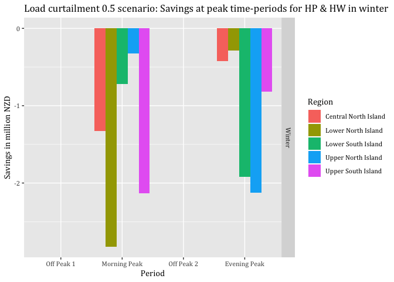<!-- -->

```r
#ggsave("Load curtailment 0.5 scenario: Savings at peak time-periods for HP & HW in winter.jpeg", dpi = 600)
```


```r
#Plots cost and benefits of load shifting, does not consider baseline but increases costs at off peaks
EcoVaSumDT <- copy(EcoVaHHDT)


EcoVaSumDT <- EcoVaSumDT[, EcoSummary := ifelse(Period == "Off Peak 1" |
                                               Period == "Off Peak 2",
                                             (Baseline*1000000) + EcoVaLs, 0)]#It has to be zero 


EcoVaSumDT <- EcoVaSumDT[, `EcoSummary` := `EcoSummary`/1000000]# Converting to million $
EcoVaSumSC3DT <- EcoVaSumDT[, (`EcoSummary` = sum(`EcoSummary`)), keyby = .(Region, season, Period)]

EcoVaSumSC3DT$Period <- factor(EcoVaSumSC3DT$Period, levels = c("Off Peak 1","Morning Peak",
                                                    "Off Peak 2", "Evening Peak"))


#Analysis
CostBaseline <- sum(EcoVaSumDT$Baseline)
`CostLoadShif` <- sum(EcoVaSumDT$`EcoSummary`)

SavingsMillionNZD <- CostBaseline - `CostLoadShif`
SavingsPercent <- 1-(`CostLoadShif` / CostBaseline)

SavingsMillionNZD
```

```
## [1] 224840761
```

```r
SavingsPercent
```

```
## [1] 0.5260764
```

```r
myPlot <- ggplot2::ggplot(EcoVaSumSC3DT, aes(x = Period, fill = Region)) +
  geom_bar(aes(y= V1), stat = "identity", position = "dodge") +
  #geom_line(aes(y= V1)) +
  theme(text = element_text(family = "Cambria")) +
  facet_grid(season ~ .) +
  ggtitle("Load shifting scenario: Cost for HP & HW") +
  labs(x='Period', y='Cost in million NZD') 
  
myPlot 
```

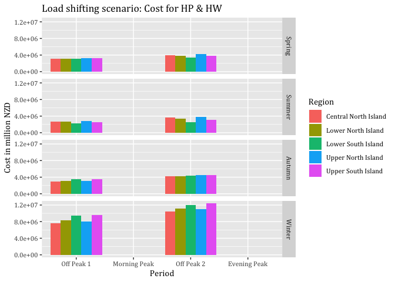<!-- -->

```r
#ggsave("ALLTHREE_Seasonal_Load shifting scenario: Cost for HP & HW.jpeg", dpi = 600)

myPlot <- ggplot2::ggplot(subset(EcoVaSumSC3DT,
                                 season %in% c("Winter")), aes(x = Period, fill = Region)) +
  geom_bar(aes(y= V1), stat = "identity", position = "dodge") +
  #geom_line(aes(y= V1)) +
  theme(text = element_text(family = "Cambria")) +
  facet_grid(season ~ .) +
  ggtitle("Load shifting scenario: Cost for HP & HW in winter") +
  labs(x='Period', y='Cost in million NZD') 
  
myPlot
```

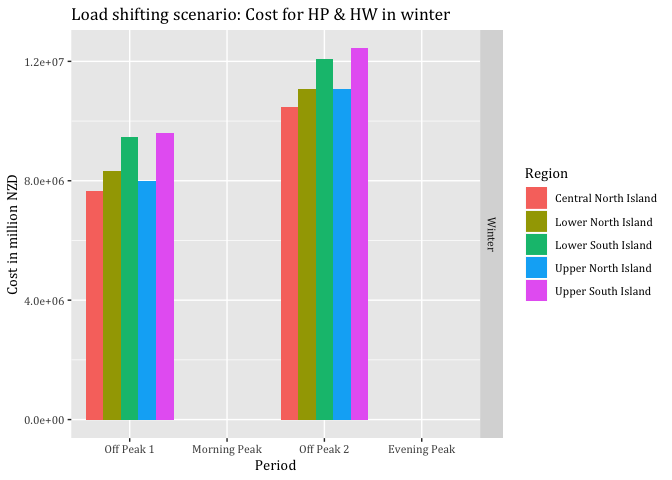<!-- -->

```r
#ggsave("ALLTHREE_Seasonal_Load shifting scenario: Cost for HP & HW in winter.jpeg", dpi = 600)
```


###CPD analysis

```r
#Hot water
#Loading data
CpdMinOrig12  <- read.csv("/Volumes/hum-csafe/Research Projects/GREEN Grid/externalData/Aurora_CPD/Edited_2012.csv")
CpdMinOrig13  <- read.csv("/Volumes/hum-csafe/Research Projects/GREEN Grid/externalData/Aurora_CPD/Edited_2013.csv")
CpdMinOrig14  <-read.csv("/Volumes/hum-csafe/Research Projects/GREEN Grid/externalData/Aurora_CPD/Edited_2014.csv")
CpdMinOrig15  <- read.csv("/Volumes/hum-csafe/Research Projects/GREEN Grid/externalData/Aurora_CPD/Edited_2015.csv")
CpdMinOrig16  <- read.csv("/Volumes/hum-csafe/Research Projects/GREEN Grid/externalData/Aurora_CPD/Edited_2016.csv")


#Binding data
CpdMinAll <- rbind(CpdMinOrig12, CpdMinOrig13, CpdMinOrig14, CpdMinOrig15, CpdMinOrig16)


#Time and month adjustments
CpdMinAll <- data.table::as.data.table(CpdMinAll)
CpdMinAll <- CpdMinAll[, dateTime := lubridate::dmy_hm(DateTime, tz = "Pacific/Auckland")]
CpdMinAll <- CpdMinAll[, year := lubridate::year(dateTime)]
CpdMinAll <- CpdMinAll[, obsHalfHour := hms::as.hms(dateTime)]
CpdMinAll <- CpdMinAll[, month := lubridate::month(dateTime)]
CpdMinAll <- CpdMinAll[month >= 5 & month <= 5, season := "Autumn"]
CpdMinAll <- CpdMinAll[month == 6 | month == 7 | month == 8, season := "Winter"]


#Loading and scaling hot water load
HWprofileDT <- hotWaterProfileDT[ !(season %in% c("Spring", "Summer"))]
HWprofileDT <- HWprofileDT[, .(sumGWhperHalfHour = sum(scaledGWh)),
                           keyby = .(season, obsHalfHour)]
HWprofileDT <- HWprofileDT[, kWperHh := (((sumGWhperHalfHour *
                                                2)*1000*1000)/nzHHhotWater)/90]#kW per household and half hour for the whole 90 day season

#Calculating Probability
CpdSumDT <- CpdMinAll[, .(SumMins = sum(CPDmin)/5), keyby = .(season, obsHalfHour)]
CpdSumDT <- CpdSumDT[, totalMins := sum(SumMins)]
                          

CpdSumDT <- CpdSumDT[, Probability := SumMins / totalMins]

#Preparing for merging
setkey(CpdSumDT, season, obsHalfHour)
setkey(HWprofileDT, season, obsHalfHour)
CpdMergedHWDT <- HWprofileDT[CpdSumDT]

#Calculating average kW at congestion periods per household
CpdMergedHWDT <- CpdMergedHWDT[, AvgDemCPD := kWperHh * Probability]
AvgHWCpdDem <- sum(CpdMergedHWDT$AvgDemCPD)

#Introducing prices #Using Frankton GXP of Aurora CPD pricing (lowest charges)
PS1 <- 0.3079
PS2 <- 0.3387
PS3 <- 0.3616
PS4 <- 0.4698

#Adding prices to DT
CpdSumDT <- CpdSumDT[, PS1 := PS1]
CpdSumDT <- CpdSumDT[, PS2 := PS2]
CpdSumDT <- CpdSumDT[, PS3 := PS3]
CpdSumDT <- CpdSumDT[, PS4 := PS4]

#Preparing for merging
setkey(CpdSumDT, season, obsHalfHour)
setkey(CpdMergedHWDT, season, obsHalfHour)
CpdMergedHWDT <- CpdMergedHWDT[CpdSumDT]

#Claculating annual charges hot water for one household
sumPS1HW <- AvgHWCpdDem * PS1 * 365
sumPS2HW <- AvgHWCpdDem * PS2 * 365
sumPS3HW <- AvgHWCpdDem * PS3 * 365
sumPS4HW <- AvgHWCpdDem * PS4 * 365


#Visualising CPD by season
  myPlot <- ggplot2::ggplot(CpdSumDT, aes(x = obsHalfHour)) +
  geom_line(aes(y=Probability, colour = season), size=1) +
  theme(text = element_text(family = "Cambria")) +
  ggtitle("Probability of congestion time-periods by season") +
  labs(x='Time of Day', y='Probability') +
  facet_grid(season ~ .) +
 # scale_y_continuous(breaks = c(20, 40, 60, 80)) +
  scale_x_time(breaks = c(hms::as.hms("00:00:00"),hms::as.hms("04:00:00"), hms::as.hms("08:00:00"),
                          hms::as.hms("12:00:00"), hms::as.hms("16:00:00"), hms::as.hms("20:00:00")))

  
  myPlot
```

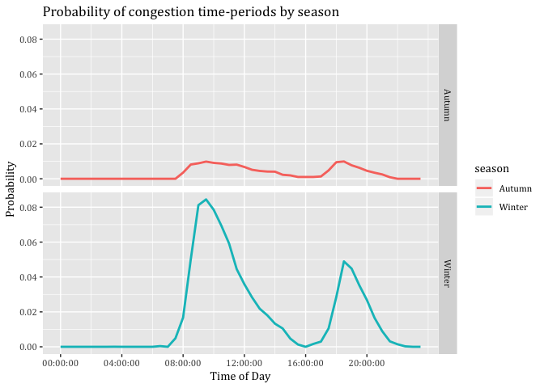<!-- -->

```r
 #ggsave("Probability of congestion time-periods by season.jpeg", dpi = 600)


  
  
  
  
  
  #Heat pump
  #Loading and scaling hot water load
HPprofileDT <- heatPumpProfileDT[ !(season %in% c("Spring", "Summer"))]
HPprofileDT <- HPprofileDT[, .(sumGWhperHalfHour = sum(scaledGWh)),
                           keyby = .(season, obsHalfHour)]
HPprofileDT <- HPprofileDT[, kWperHh := (((sumGWhperHalfHour *
                                                2)*1000*1000)/nzHHheatPumps)/90]#kW per household and half hour for the whole 90 day season

#Calculating Probability
CpdSumDT <- CpdMinAll[, .(SumMins = sum(CPDmin)/5), keyby = .(season, obsHalfHour)]
CpdSumDT <- CpdSumDT[, totalMins := sum(SumMins)]
                          

CpdSumDT <- CpdSumDT[, Probability := SumMins / totalMins]

#Preparing for merging
setkey(CpdSumDT, season, obsHalfHour)
setkey(HPprofileDT, season, obsHalfHour)
CpdMergedHPDT <- HPprofileDT[CpdSumDT]

#Calculating average kW at congestion periods per household
CpdMergedHPDT <- CpdMergedHPDT[, AvgDemCPD := kWperHh * Probability]
AvgHPCpdDem <- sum(CpdMergedHPDT$AvgDemCPD)
  

#Claculating annual charges hot water for one household
sumPS1HP <- AvgHPCpdDem * PS1 * 365
sumPS2HP <- AvgHPCpdDem * PS2 * 365
sumPS3HP <- AvgHPCpdDem * PS3 * 365
sumPS4HP <- AvgHPCpdDem * PS4 * 365


#Refrigeration
#Loading and scaling hot refrigeration load
REFprofileDT <- refrigerationProfileDT[ !(season %in% c("Spring", "Summer"))]
REFprofileDT <- REFprofileDT[, .(sumGWhperHalfHour = sum(scaledGWh)),
                           keyby = .(season, obsHalfHour)]
REFprofileDT <- REFprofileDT[, kWperHh := (((sumGWhperHalfHour *
                                                2)*1000*1000))/nzHouseholds/90]#kW per household and half hour for the whole 90 day season

#Calculating Probability
CpdSumDT <- CpdMinAll[, .(SumMins = sum(CPDmin)/5), keyby = .(season, obsHalfHour)]
CpdSumDT <- CpdSumDT[, totalMins := sum(SumMins)]
                          

CpdSumDT <- CpdSumDT[, Probability := SumMins / totalMins]

#Preparing for merging
setkey(CpdSumDT, season, obsHalfHour)
setkey(REFprofileDT, season, obsHalfHour)
CpdMergedREFDT <- REFprofileDT[CpdSumDT]

#Calculating average kW at congestion periods per household
CpdMergedREFDT <- CpdMergedREFDT[, AvgDemCPD := kWperHh * Probability]
AvgREFCpdDem <- sum(CpdMergedREFDT$AvgDemCPD)
  

#Claculating annual charges hot water for one household
sumPS1REF <- AvgREFCpdDem * PS1 * 365
sumPS2REF <- AvgREFCpdDem * PS2 * 365
sumPS3REF <- AvgREFCpdDem * PS3 * 365
sumPS4REF <- AvgREFCpdDem * PS4 * 365


#ALl three appliances together

HPprofileDT <- heatPumpProfileDT[ !(season %in% c("Spring", "Summer"))]
HPprofileDT <- HPprofileDT[, .(sumGWhperHalfHour = sum(scaledGWh)),
                           keyby = .(season, obsHalfHour)]
HPprofileDT <- HPprofileDT[, kWperHh := (((sumGWhperHalfHour *
                                                2)*1000*1000)/nzHHheatPumps)/90]#kW per household and half hour for the whole 90 day season

HWprofileDT <- hotWaterProfileDT[ !(season %in% c("Spring", "Summer"))]
HWprofileDT <- HWprofileDT[, .(sumGWhperHalfHour = sum(scaledGWh)),
                           keyby = .(season, obsHalfHour)]
HWprofileDT <- HWprofileDT[, kWperHh := (((sumGWhperHalfHour *
                                                2)*1000*1000)/nzHHhotWater)/90]#kW per household and half hour for the whole 90 day season


#Loading and scaling hot refrigeration load
REFprofileDT <- refrigerationProfileDT[ !(season %in% c("Spring", "Summer"))]
REFprofileDT <- REFprofileDT[, .(sumGWhperHalfHour = sum(scaledGWh)),
                           keyby = .(season, obsHalfHour)]
REFprofileDT <- REFprofileDT[, kWperHh := (((sumGWhperHalfHour *
                                                2)*1000*1000)/nzHouseholds)/90]#kW per household and half hour for the whole 90 day season


HPHWREFprofileDT <- copy(HWprofileDT)
HPHWREFprofileDT <- HPHWREFprofileDT[, kWperHhSum := kWperHh + (HPprofileDT$kWperHh) +
                                       (REFprofileDT$kWperHh)]

#Calculating Probability
CpdSumDT <- CpdMinAll[, .(SumMins = sum(CPDmin)/5), keyby = .(season, obsHalfHour)]
CpdSumDT <- CpdSumDT[, totalMins := sum(SumMins)]
                          

CpdSumDT <- CpdSumDT[, Probability := SumMins / totalMins]

#Preparing for merging
setkey(CpdSumDT, season, obsHalfHour)
setkey(HPHWREFprofileDT, season, obsHalfHour)
CpdMergedHPHWREFDT <- HPHWREFprofileDT[CpdSumDT]

#Calculating average kW at congestion periods per household
CpdMergedHPHWREFDT <- CpdMergedHPHWREFDT[, AvgDemCPD := kWperHhSum * Probability]
AvgHPHWREFCpdDem <- sum(CpdMergedHPHWREFDT$AvgDemCPD)
  

#Claculating annual charges hot water for one household
sumPS1HPHWREF <- AvgHPHWREFCpdDem * PS1 * 365
sumPS2HPHWREF <- AvgHPHWREFCpdDem * PS2 * 365
sumPS3HPHWREF <- AvgHPHWREFCpdDem * PS3 * 365
sumPS4HPHWREF <- AvgHPHWREFCpdDem * PS4 * 365


#Both appliances together

HPprofileDT <- heatPumpProfileDT[ !(season %in% c("Spring", "Summer"))]
HPprofileDT <- HPprofileDT[, .(sumGWhperHalfHour = sum(scaledGWh)),
                           keyby = .(season, obsHalfHour)]
HPprofileDT <- HPprofileDT[, kWperHh := (((sumGWhperHalfHour *
                                                2)*1000*1000)/nzHHheatPumps)/90]#kW per household and half hour for the whole 90 day season

HWprofileDT <- hotWaterProfileDT[ !(season %in% c("Spring", "Summer"))]
HWprofileDT <- HWprofileDT[, .(sumGWhperHalfHour = sum(scaledGWh)),
                           keyby = .(season, obsHalfHour)]
HWprofileDT <- HWprofileDT[, kWperHh := (((sumGWhperHalfHour *
                                                2)*1000*1000)/nzHHhotWater)/90]#kW per household and half hour for the whole 90 day season

HPHWprofileDT <- copy(HWprofileDT)
HPHWprofileDT <- HPHWprofileDT[, kWperHhSum := kWperHh + (HPprofileDT$kWperHh)]

#Calculating Probability
CpdSumDT <- CpdMinAll[, .(SumMins = sum(CPDmin)/5), keyby = .(season, obsHalfHour)]
CpdSumDT <- CpdSumDT[, totalMins := sum(SumMins)]
                          

CpdSumDT <- CpdSumDT[, Probability := SumMins / totalMins]

#Preparing for merging
setkey(CpdSumDT, season, obsHalfHour)
setkey(HPHWprofileDT, season, obsHalfHour)
CpdMergedHPHWDT <- HPHWprofileDT[CpdSumDT]

#Calculating average kW at congestion periods per household
CpdMergedHPHWDT <- CpdMergedHPHWDT[, AvgDemCPD := kWperHhSum * Probability]
AvgHPHWCpdDem <- sum(CpdMergedHPHWDT$AvgDemCPD)
  

#Claculating annual charges hot water for one household
sumPS1HPHW <- AvgHPHWCpdDem * PS1 * 365
sumPS2HPHW <- AvgHPHWCpdDem * PS2 * 365
sumPS3HPHW <- AvgHPHWCpdDem * PS3 * 365
sumPS4HPHW <- AvgHPHWCpdDem * PS4 * 365


#------------------------------------------------------------------------------

#Total New Zealand number: Must be run seperately to the previous one. Same variable names in results


#Hot water
#Loading data
CpdMinOrig12  <- read.csv("/Volumes/hum-csafe/Research Projects/GREEN Grid/externalData/Aurora_CPD/Edited_2012.csv")
CpdMinOrig13  <- read.csv("/Volumes/hum-csafe/Research Projects/GREEN Grid/externalData/Aurora_CPD/Edited_2013.csv")
CpdMinOrig14  <-read.csv("/Volumes/hum-csafe/Research Projects/GREEN Grid/externalData/Aurora_CPD/Edited_2014.csv")
CpdMinOrig15  <- read.csv("/Volumes/hum-csafe/Research Projects/GREEN Grid/externalData/Aurora_CPD/Edited_2015.csv")
CpdMinOrig16  <- read.csv("/Volumes/hum-csafe/Research Projects/GREEN Grid/externalData/Aurora_CPD/Edited_2016.csv")


#Binding data
CpdMinAll <- rbind(CpdMinOrig12, CpdMinOrig13, CpdMinOrig14, CpdMinOrig15, CpdMinOrig16)


#Time and month adjustments
CpdMinAll <- data.table::as.data.table(CpdMinAll)
CpdMinAll <- CpdMinAll[, dateTime := lubridate::dmy_hm(DateTime, tz = "Pacific/Auckland")]
CpdMinAll <- CpdMinAll[, year := lubridate::year(dateTime)]
CpdMinAll <- CpdMinAll[, obsHalfHour := hms::as.hms(dateTime)]
CpdMinAll <- CpdMinAll[, month := lubridate::month(dateTime)]
CpdMinAll <- CpdMinAll[month >= 5 & month <= 5, season := "Autumn"]
CpdMinAll <- CpdMinAll[month == 6 | month == 7 | month == 8, season := "Winter"]


#Loading and scaling hot water load
HWprofileDT <- hotWaterProfileDT[ !(season %in% c("Spring", "Summer"))]
HWprofileDT <- HWprofileDT[, .(sumGWhperHalfHour = sum(scaledGWh)),
                           keyby = .(season, obsHalfHour)]
HWprofileDT <- HWprofileDT[, kWperHh := (((sumGWhperHalfHour *
                                                2)*1000*1000))/90]#kW per household and half hour for the whole 90 day season

#Calculating Probability
CpdSumDT <- CpdMinAll[, .(SumMins = sum(CPDmin)/5), keyby = .(season, obsHalfHour)]
CpdSumDT <- CpdSumDT[, totalMins := sum(SumMins)]
                          

CpdSumDT <- CpdSumDT[, Probability := SumMins / totalMins]

#Preparing for merging
setkey(CpdSumDT, season, obsHalfHour)
setkey(HWprofileDT, season, obsHalfHour)
CpdMergedHWDT <- HWprofileDT[CpdSumDT]

#Calculating average kW at congestion periods per household
CpdMergedHWDT <- CpdMergedHWDT[, AvgDemCPD := kWperHh * Probability]
AvgHWCpdDem <- sum(CpdMergedHWDT$AvgDemCPD)

#Introducing prices
PS1 <- 0.3079
PS2 <- 0.3387
PS3 <- 0.3616
PS4 <- 0.4698

#Adding prices to DT
CpdSumDT <- CpdSumDT[, PS1 := PS1]
CpdSumDT <- CpdSumDT[, PS2 := PS2]
CpdSumDT <- CpdSumDT[, PS3 := PS3]
CpdSumDT <- CpdSumDT[, PS4 := PS4]

#Preparing for merging
setkey(CpdSumDT, season, obsHalfHour)
setkey(CpdMergedHWDT, season, obsHalfHour)
CpdMergedHWDT <- CpdMergedHWDT[CpdSumDT]

#Claculating annual charges hot water for one household
sumPS1HW <- AvgHWCpdDem * PS1 * 365/1000000
sumPS2HW <- AvgHWCpdDem * PS2 * 365/1000000
sumPS3HW <- AvgHWCpdDem * PS3 * 365/1000000
sumPS4HW <- AvgHWCpdDem * PS4 * 365/1000000


  
  
  
  
  
  #Heat pump
  #Loading and scaling hot water load
HPprofileDT <- heatPumpProfileDT[ !(season %in% c("Spring", "Summer"))]
HPprofileDT <- HPprofileDT[, .(sumGWhperHalfHour = sum(scaledGWh)),
                           keyby = .(season, obsHalfHour)]
HPprofileDT <- HPprofileDT[, kWperHh := (((sumGWhperHalfHour *
                                                2)*1000*1000))/90]#kW per household and half hour for the whole 90 day season

#Calculating Probability
CpdSumDT <- CpdMinAll[, .(SumMins = sum(CPDmin)/5), keyby = .(season, obsHalfHour)]
CpdSumDT <- CpdSumDT[, totalMins := sum(SumMins)]
                          

CpdSumDT <- CpdSumDT[, Probability := SumMins / totalMins]

#Preparing for merging
setkey(CpdSumDT, season, obsHalfHour)
setkey(HPprofileDT, season, obsHalfHour)
CpdMergedHPDT <- HPprofileDT[CpdSumDT]

#Calculating average kW at congestion periods per household
CpdMergedHPDT <- CpdMergedHPDT[, AvgDemCPD := kWperHh * Probability]
AvgHPCpdDem <- sum(CpdMergedHPDT$AvgDemCPD)
  

#Claculating annual charges hot water for one household
sumPS1HP <- AvgHPCpdDem * PS1 * 365/1000000
sumPS2HP <- AvgHPCpdDem * PS2 * 365/1000000
sumPS3HP <- AvgHPCpdDem * PS3 * 365/1000000
sumPS4HP <- AvgHPCpdDem * PS4 * 365/1000000


#Both appliances together

HPprofileDT <- heatPumpProfileDT[ !(season %in% c("Spring", "Summer"))]
HPprofileDT <- HPprofileDT[, .(sumGWhperHalfHour = sum(scaledGWh)),
                           keyby = .(season, obsHalfHour)]
HPprofileDT <- HPprofileDT[, kWperHh := (((sumGWhperHalfHour *
                                                2)*1000*1000))/90]#kW per household and half hour for the whole 90 day season

HWprofileDT <- hotWaterProfileDT[ !(season %in% c("Spring", "Summer"))]
HWprofileDT <- HWprofileDT[, .(sumGWhperHalfHour = sum(scaledGWh)),
                           keyby = .(season, obsHalfHour)]
HWprofileDT <- HWprofileDT[, kWperHh := (((sumGWhperHalfHour *
                                                2)*1000*1000))/90]#kW per household and half hour for the whole 90 day season

HPHWprofileDT <- copy(HWprofileDT)
HPHWprofileDT <- HPHWprofileDT[, kWperHhSum := kWperHh + (HPprofileDT$kWperHh)]

#Calculating Probability
CpdSumDT <- CpdMinAll[, .(SumMins = sum(CPDmin)/5), keyby = .(season, obsHalfHour)]
CpdSumDT <- CpdSumDT[, totalMins := sum(SumMins)]
                          

CpdSumDT <- CpdSumDT[, Probability := SumMins / totalMins]

#Preparing for merging
setkey(CpdSumDT, season, obsHalfHour)
setkey(HPHWprofileDT, season, obsHalfHour)
CpdMergedHPHWDT <- HPHWprofileDT[CpdSumDT]

#Calculating average kW at congestion periods per household
CpdMergedHPHWDT <- CpdMergedHPHWDT[, AvgDemCPD := kWperHhSum * Probability]
AvgHPHWCpdDem <- sum(CpdMergedHPHWDT$AvgDemCPD)
  

#Claculating annual charges hot water for one household
sumPS1HPHW <- AvgHPHWCpdDem * PS1 * 365/1000000
sumPS2HPHW <- AvgHPHWCpdDem * PS2 * 365/1000000
sumPS3HPHW <- AvgHPHWCpdDem * PS3 * 365/1000000
sumPS4HPHW <- AvgHPHWCpdDem * PS4 * 365/1000000


#Further visualisation

 CPDVisual <- copy(CpdSumDT)
 CPDVisual <- CPDVisual[, SumMins := (SumMins)/60]
 
 #Visualising CPD by season
  myPlot <- ggplot2::ggplot(CPDVisual, aes(x = obsHalfHour, fill = season)) +
  geom_bar(aes(y=SumMins), stat = "identity", position = "dodge") +
  theme(text = element_text(family = "Cambria")) +
  ggtitle("Sum of average amount of congestion time-periods by season") + 
  #How many hours per half hour during 2012-2016 average
  labs(x='Time of Day', y='Hours ') +
  facet_grid(season ~ .) +
  scale_x_time(breaks = c(hms::as.hms("00:00:00"),hms::as.hms("04:00:00"), hms::as.hms("08:00:00"),
                          hms::as.hms("12:00:00"), hms::as.hms("16:00:00"), hms::as.hms("20:00:00")))

  
  myPlot
```

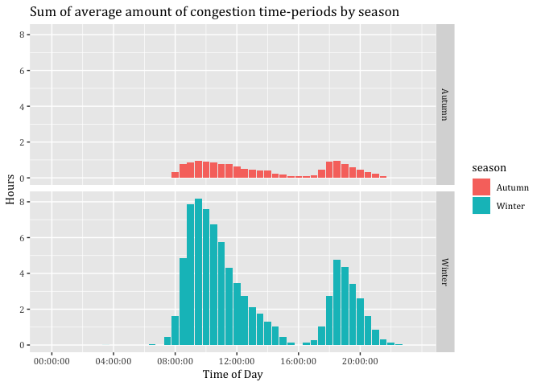<!-- -->

```r
  #ggsave("Sum of average amount of congestion time-periods by season.jpeg", dpi = 600)
  
 CPDVisual <- copy(CpdSumDT)
 CPDVisual <- CPDVisual[, SumHours := ifelse(season == "Autumn" |
                                                  season == "Winter", sum(SumMins)/60,0),
                        keyby = .(season)]
 CPDVisual$SumHours
```

```
##  [1] 14.274 14.274 14.274 14.274 14.274 14.274 14.274 14.274 14.274 14.274
## [11] 14.274 14.274 14.274 14.274 14.274 14.274 14.274 14.274 14.274 14.274
## [21] 14.274 14.274 14.274 14.274 14.274 14.274 14.274 14.274 14.274 14.274
## [31] 14.274 14.274 14.274 14.274 14.274 14.274 14.274 14.274 14.274 14.274
## [41] 14.274 14.274 14.274 14.274 14.274 14.274 14.274 14.274 82.718 82.718
## [51] 82.718 82.718 82.718 82.718 82.718 82.718 82.718 82.718 82.718 82.718
## [61] 82.718 82.718 82.718 82.718 82.718 82.718 82.718 82.718 82.718 82.718
## [71] 82.718 82.718 82.718 82.718 82.718 82.718 82.718 82.718 82.718 82.718
## [81] 82.718 82.718 82.718 82.718 82.718 82.718 82.718 82.718 82.718 82.718
## [91] 82.718 82.718 82.718 82.718 82.718 82.718
```


```r
#Heat Pump

#SC1 per household

 #Heat pump
  #Loading and scaling hot water load
HPprofileDT <- heatPumpProfileDT[ !(season %in% c("Spring", "Summer"))]
HPprofileDT <- HPprofileDT[, .(sumGWhperHalfHour = sum(scaledGWh)),
                           keyby = .(season, obsHalfHour)]
HPprofileDT <- HPprofileDT[, kWperHh := (((sumGWhperHalfHour *
                                                2)*1000*1000))/nzHHheatPumps/90]#kW per household and half hour for the whole 90 day season

#Calculating Probability
CpdSumDT <- CpdMinAll[, .(SumMins = sum(CPDmin)/5), keyby = .(season, obsHalfHour)]
CpdSumDT <- CpdSumDT[, totalMins := sum(SumMins)]
                          

CpdSumDT <- CpdSumDT[, Probability := SumMins / totalMins]

#Calculating average kW at congestion periods per household
HPprofileDT <- HPprofileDT[, Period := "Not Peak"]

HPprofileDT <- HPprofileDT[obsHalfHour >= MPS & 
                     obsHalfHour <= MPE,
                   Period := "Morning Peak"]

HPprofileDT <- HPprofileDT[obsHalfHour >= EPS & 
                     obsHalfHour <= EPE,
                   Period := "Evening Peak"]

HPprofileDT <- HPprofileDT[obsHalfHour >= OP1S & 
                     obsHalfHour <= OP1E,
                   Period := "Off Peak 1"]

HPprofileDT <- HPprofileDT[obsHalfHour >= OP12S & 
                     obsHalfHour <= OP12E,
                   Period := "Off Peak 1"]

HPprofileDT <- HPprofileDT[obsHalfHour >= OP2S & 
                     obsHalfHour <= OP2E,
                   Period := "Off Peak 2"]
HPprofileDT <- HPprofileDT[, kWperHhSC1 := ifelse(Period == "Morning Peak" | Period == "Evening Peak",
                                             kWperHh*0, kWperHh)]
#Preparing for merging
setkey(CpdSumDT, season, obsHalfHour)
setkey(HPprofileDT, season, obsHalfHour)

CpdMergedHPDT <- HPprofileDT[CpdSumDT]
CpdMergedHPDT <- CpdMergedHPDT[, AvgDemCPD := kWperHhSC1 * Probability]
AvgHPCpdDemSC1 <- sum(CpdMergedHPDT$AvgDemCPD)


#Claculating annual charges hot water for one household
sumPS1HP <- AvgHPCpdDemSC1 * PS1 * 365
sumPS2HP <- AvgHPCpdDemSC1 * PS2 * 365
sumPS3HP <- AvgHPCpdDemSC1 * PS3 * 365
sumPS4HP <- AvgHPCpdDemSC1 * PS4 * 365

#______________________________________________________________________

#SC1 total NZ

 #Heat pump
  #Loading and scaling hot water load
HPprofileDT <- heatPumpProfileDT[ !(season %in% c("Spring", "Summer"))]
HPprofileDT <- HPprofileDT[, .(sumGWhperHalfHour = sum(scaledGWh)),
                           keyby = .(season, obsHalfHour)]
HPprofileDT <- HPprofileDT[, kWperHh := (((sumGWhperHalfHour *
                                                2)*1000*1000))/90]#kW per household and half hour for the whole 90 day season

#Calculating Probability
CpdSumDT <- CpdMinAll[, .(SumMins = sum(CPDmin)/5), keyby = .(season, obsHalfHour)]
CpdSumDT <- CpdSumDT[, totalMins := sum(SumMins)]
                          

CpdSumDT <- CpdSumDT[, Probability := SumMins / totalMins]

#Calculating average kW at congestion periods per household
HPprofileDT <- HPprofileDT[, Period := "Not Peak"]

HPprofileDT <- HPprofileDT[obsHalfHour >= MPS & 
                     obsHalfHour <= MPE,
                   Period := "Morning Peak"]

HPprofileDT <- HPprofileDT[obsHalfHour >= EPS & 
                     obsHalfHour <= EPE,
                   Period := "Evening Peak"]

HPprofileDT <- HPprofileDT[obsHalfHour >= OP1S & 
                     obsHalfHour <= OP1E,
                   Period := "Off Peak 1"]

HPprofileDT <- HPprofileDT[obsHalfHour >= OP12S & 
                     obsHalfHour <= OP12E,
                   Period := "Off Peak 1"]

HPprofileDT <- HPprofileDT[obsHalfHour >= OP2S & 
                     obsHalfHour <= OP2E,
                   Period := "Off Peak 2"]
HPprofileDT <- HPprofileDT[, kWperHhSC1 := ifelse(Period == "Morning Peak" | Period == "Evening Peak",
                                             kWperHh*0, kWperHh)]
#Preparing for merging
setkey(CpdSumDT, season, obsHalfHour)
setkey(HPprofileDT, season, obsHalfHour)

CpdMergedHPDT <- HPprofileDT[CpdSumDT]
CpdMergedHPDT <- CpdMergedHPDT[, AvgDemCPD := kWperHhSC1 * Probability]
AvgHPCpdDemSC1 <- sum(CpdMergedHPDT$AvgDemCPD)


#Claculating annual charges hot water for one household
sumPS1HP <- AvgHPCpdDemSC1 * PS1 * 365/1000000
sumPS2HP <- AvgHPCpdDemSC1 * PS2 * 365/1000000
sumPS3HP <- AvgHPCpdDemSC1 * PS3 * 365/1000000
sumPS4HP <- AvgHPCpdDemSC1 * PS4 * 365/1000000

#______________________________________________________________________-

#Heat Pump

#SC2 per household

 #Heat pump
  #Loading and scaling hot water load
HPprofileDT <- heatPumpProfileDT[ !(season %in% c("Spring", "Summer"))]
HPprofileDT <- HPprofileDT[, .(sumGWhperHalfHour = sum(scaledGWh)),
                           keyby = .(season, obsHalfHour)]
HPprofileDT <- HPprofileDT[, kWperHh := (((sumGWhperHalfHour *
                                                2)*1000*1000))/nzHHheatPumps/90]#kW per household and half hour for the whole 90 day season

#Calculating Probability
CpdSumDT <- CpdMinAll[, .(SumMins = sum(CPDmin)/5), keyby = .(season, obsHalfHour)]
CpdSumDT <- CpdSumDT[, totalMins := sum(SumMins)]
                          

CpdSumDT <- CpdSumDT[, Probability := SumMins / totalMins]

#Calculating average kW at congestion periods per household
HPprofileDT <- HPprofileDT[, Period := "Not Peak"]

HPprofileDT <- HPprofileDT[obsHalfHour >= MPS & 
                     obsHalfHour <= MPE,
                   Period := "Morning Peak"]

HPprofileDT <- HPprofileDT[obsHalfHour >= EPS & 
                     obsHalfHour <= EPE,
                   Period := "Evening Peak"]

HPprofileDT <- HPprofileDT[obsHalfHour >= OP1S & 
                     obsHalfHour <= OP1E,
                   Period := "Off Peak 1"]

HPprofileDT <- HPprofileDT[obsHalfHour >= OP12S & 
                     obsHalfHour <= OP12E,
                   Period := "Off Peak 1"]

HPprofileDT <- HPprofileDT[obsHalfHour >= OP2S & 
                     obsHalfHour <= OP2E,
                   Period := "Off Peak 2"]
HPprofileDT <- HPprofileDT[, kWperHhSC2 := ifelse(Period == "Morning Peak" | Period == "Evening Peak",
                                             kWperHh*0.5, kWperHh)]
#Preparing for merging
setkey(CpdSumDT, season, obsHalfHour)
setkey(HPprofileDT, season, obsHalfHour)

CpdMergedHPDT <- HPprofileDT[CpdSumDT]
CpdMergedHPDT <- CpdMergedHPDT[, AvgDemCPD := kWperHhSC2 * Probability]
AvgHPCpdDemSC2 <- sum(CpdMergedHPDT$AvgDemCPD)


#Claculating annual charges hot water for one household
sumPS1HP <- AvgHPCpdDemSC2 * PS1 * 365
sumPS2HP <- AvgHPCpdDemSC2 * PS2 * 365
sumPS3HP <- AvgHPCpdDemSC2 * PS3 * 365
sumPS4HP <- AvgHPCpdDemSC2 * PS4 * 365


#______________________________________________________________________

#SC2 total NZ

 #Heat pump
  #Loading and scaling hot water load
HPprofileDT <- heatPumpProfileDT[ !(season %in% c("Spring", "Summer"))]
HPprofileDT <- HPprofileDT[, .(sumGWhperHalfHour = sum(scaledGWh)),
                           keyby = .(season, obsHalfHour)]
HPprofileDT <- HPprofileDT[, kWperHh := (((sumGWhperHalfHour *
                                                2)*1000*1000))/90]#kW per household and half hour for the whole 90 day season

#Calculating Probability
CpdSumDT <- CpdMinAll[, .(SumMins = sum(CPDmin)/5), keyby = .(season, obsHalfHour)]
CpdSumDT <- CpdSumDT[, totalMins := sum(SumMins)]
                          

CpdSumDT <- CpdSumDT[, Probability := SumMins / totalMins]

#Calculating average kW at congestion periods per household
HPprofileDT <- HPprofileDT[, Period := "Not Peak"]

HPprofileDT <- HPprofileDT[obsHalfHour >= MPS & 
                     obsHalfHour <= MPE,
                   Period := "Morning Peak"]

HPprofileDT <- HPprofileDT[obsHalfHour >= EPS & 
                     obsHalfHour <= EPE,
                   Period := "Evening Peak"]

HPprofileDT <- HPprofileDT[obsHalfHour >= OP1S & 
                     obsHalfHour <= OP1E,
                   Period := "Off Peak 1"]

HPprofileDT <- HPprofileDT[obsHalfHour >= OP12S & 
                     obsHalfHour <= OP12E,
                   Period := "Off Peak 1"]

HPprofileDT <- HPprofileDT[obsHalfHour >= OP2S & 
                     obsHalfHour <= OP2E,
                   Period := "Off Peak 2"]
HPprofileDT <- HPprofileDT[, kWperHhSC2 := ifelse(Period == "Morning Peak" | Period == "Evening Peak",
                                             kWperHh*0.5, kWperHh)]
#Preparing for merging
setkey(CpdSumDT, season, obsHalfHour)
setkey(HPprofileDT, season, obsHalfHour)

CpdMergedHPDT <- HPprofileDT[CpdSumDT]
CpdMergedHPDT <- CpdMergedHPDT[, AvgDemCPD := kWperHhSC2 * Probability]
AvgHPCpdDemSC2 <- sum(CpdMergedHPDT$AvgDemCPD)


#Claculating annual charges hot water for one household
sumPS1HP <- AvgHPCpdDemSC2 * PS1 * 365/1000000
sumPS2HP <- AvgHPCpdDemSC2 * PS2 * 365/1000000
sumPS3HP <- AvgHPCpdDemSC2 * PS3 * 365/1000000
sumPS4HP <- AvgHPCpdDemSC2 * PS4 * 365/1000000

#____________________________________________________________________________________


#SC3 per household & total (just adjust line 4461 to get the individual or total charge)

 #Heat pump
  #Loading and scaling hot water load
HPprofileDT <- heatPumpProfileDT[ !(season %in% c("Spring", "Summer"))]
HPprofileDT <- HPprofileDT[, .(sumGWhperHalfHour = sum(scaledGWh)),
                           keyby = .(season, obsHalfHour)]
HPprofileDT <- HPprofileDT[, kWperHh := (((sumGWhperHalfHour *
                                                2)*1000*1000)/nzHHheatPumps)/90]#kW per household and half hour for the whole 90 day season

#Calculating Probability
CpdSumDT <- CpdMinAll[, .(SumMins = sum(CPDmin)/5), keyby = .(season, obsHalfHour)]
CpdSumDT <- CpdSumDT[, totalMins := sum(SumMins)]
                          

CpdSumDT <- CpdSumDT[, Probability := SumMins / totalMins]

#Calculating average kW at congestion periods per household

#Defining peak and off-peak periods

HPprofileDT <- HPprofileDT[, Period := "Not Peak"]

HPprofileDT <- HPprofileDT[obsHalfHour >= MPS & 
                     obsHalfHour <= MPE,
                   Period := "Morning Peak"]

HPprofileDT <- HPprofileDT[obsHalfHour >= EPS & 
                     obsHalfHour <= EPE,
                   Period := "Evening Peak"]

HPprofileDT <- HPprofileDT[obsHalfHour >= OP1S & 
                     obsHalfHour <= OP1E,
                   Period := "Off Peak 1"]

HPprofileDT <- HPprofileDT[obsHalfHour >= OP12S & 
                     obsHalfHour <= OP12E,
                   Period := "Off Peak 1"]

HPprofileDT <- HPprofileDT[obsHalfHour >= OP2S & 
                     obsHalfHour <= OP2E,
                   Period := "Off Peak 2"]

#Building the sum of each peak period by season
AuMP <- HPprofileDT[season == "Autumn" & Period == "Morning Peak",
                sum(kWperHh)]
WiMP <- HPprofileDT[season == "Winter" & Period == "Morning Peak",
                sum(kWperHh)]


AuEP <- HPprofileDT[season == "Autumn" & Period == "Evening Peak",
                sum(kWperHh)]
WiEP <- HPprofileDT[season == "Winter" & Period == "Evening Peak",
                sum(kWperHh)]

        


#Counting number of rows that will be associated to spread the Morning Peak
AuMPHalfHours <- nrow(HPprofileDT[season == "Autumn" &
                              Period == "Off Peak 1"])
WiMPHalfHours <- nrow(HPprofileDT[season == "Winter" &
                              Period == "Off Peak 1"])


#Counting number of rows that will be associated to spread the Evening Peak
AuEPHalfHours <- nrow(HPprofileDT[season == "Autumn" &
                              Period == "Off Peak 2"])
WiEPHalfHours <- nrow(HPprofileDT[season == "Winter" &
                              Period == "Off Peak 2"])


#Calculating the proportion that each row will take on to spread the GWhs
distGWhOP1Au <- AuMP/AuMPHalfHours
distGWhOP1Wi <- WiMP/WiMPHalfHours


distGWhOP2Au <- AuEP/AuEPHalfHours
distGWhOP2Wi <- WiEP/WiEPHalfHours


#Adding amount of spreaded peak consumption to off-peak periods
HPprofileDT <- HPprofileDT[season == "Autumn" &
                     Period == "Off Peak 1", GWhs3 :=
                     kWperHh + distGWhOP1Au]
HPprofileDT <- HPprofileDT[season == "Winter" &
                     Period == "Off Peak 1", GWhs3 :=
                     kWperHh + distGWhOP1Wi]


HPprofileDT <- HPprofileDT[season == "Autumn" &
                     Period == "Off Peak 2", GWhs3 :=
                     kWperHh + distGWhOP2Au]
HPprofileDT <- HPprofileDT[season == "Winter" &
                     Period == "Off Peak 2", GWhs3 :=
                     kWperHh + distGWhOP2Wi]


#Setting missing values in peak periods to NULL
HPprofileDT <- HPprofileDT[, kWperHhSC3:= ifelse(Period =="Morning Peak" |
                                                   Period == "Evening Peak",
                                  0, GWhs3)]


#Preparing for merging
setkey(CpdSumDT, season, obsHalfHour)
setkey(HPprofileDT, season, obsHalfHour)

CpdMergedHPDT <- HPprofileDT[CpdSumDT]
CpdMergedHPDT <- CpdMergedHPDT[, AvgDemCPD := kWperHhSC3 * Probability]
AvgHPCpdDemSC3 <- sum(CpdMergedHPDT$AvgDemCPD)


#Claculating annual charges hot water for one household
sumPS1HP <- AvgHPCpdDemSC3 * PS1 * 365
sumPS2HP <- AvgHPCpdDemSC3 * PS2 * 365
sumPS3HP <- AvgHPCpdDemSC3 * PS3 * 365
sumPS4HP <- AvgHPCpdDemSC3 * PS4 * 365
```


```r
#Hot water

#SC1 per household

 #Hot water
  #Loading and scaling hot water load
HWprofileDT <- hotWaterProfileDT[ !(season %in% c("Spring", "Summer"))]
HWprofileDT <- HWprofileDT[, .(sumGWhperHalfHour = sum(scaledGWh)),
                           keyby = .(season, obsHalfHour)]
HWprofileDT <- HWprofileDT[, kWperHh := (((sumGWhperHalfHour *
                                                2)*1000*1000)/nzHHhotWater)/90]#kW per household and half hour for the whole 90 day season

#Calculating Probability
CpdSumDT <- CpdMinAll[, .(SumMins = sum(CPDmin)/5), keyby = .(season, obsHalfHour)]
CpdSumDT <- CpdSumDT[, totalMins := sum(SumMins)]
                          

CpdSumDT <- CpdSumDT[, Probability := SumMins / totalMins]

#Calculating average kW at congestion periods per household
HWprofileDT <- HWprofileDT[, Period := "Not Peak"]

HWprofileDT <- HWprofileDT[obsHalfHour >= MPS & 
                     obsHalfHour <= MPE,
                   Period := "Morning Peak"]

HWprofileDT <- HWprofileDT[obsHalfHour >= EPS & 
                     obsHalfHour <= EPE,
                   Period := "Evening Peak"]

HWprofileDT <- HWprofileDT[obsHalfHour >= OP1S & 
                     obsHalfHour <= OP1E,
                   Period := "Off Peak 1"]

HWprofileDT <- HWprofileDT[obsHalfHour >= OP12S & 
                     obsHalfHour <= OP12E,
                   Period := "Off Peak 1"]

HWprofileDT <- HWprofileDT[obsHalfHour >= OP2S & 
                     obsHalfHour <= OP2E,
                   Period := "Off Peak 2"]
HWprofileDT <- HWprofileDT[, kWperHhSC1 := ifelse(Period == "Morning Peak" | Period == "Evening Peak",
                                             kWperHh*0, kWperHh)]
#Preparing for merging
setkey(CpdSumDT, season, obsHalfHour)
setkey(HWprofileDT, season, obsHalfHour)

CpdMergedHWDT <- HWprofileDT[CpdSumDT]
CpdMergedHWDT <- CpdMergedHWDT[, AvgDemCPD := kWperHhSC1 * Probability]
AvgHWCpdDemSC1 <- sum(CpdMergedHWDT$AvgDemCPD)


#Claculating annual charges hot water for one household
sumPS1HW <- AvgHWCpdDemSC1 * PS1 * 365
sumPS2HW <- AvgHWCpdDemSC1 * PS2 * 365
sumPS3HW <- AvgHWCpdDemSC1 * PS3 * 365
sumPS4HW <- AvgHWCpdDemSC1 * PS4 * 365

#______________________________________________________________________

#SC1 total NZ

 #Hot water
  #Loading and scaling hot water load
HWprofileDT <- hotWaterProfileDT[ !(season %in% c("Spring", "Summer"))]
HWprofileDT <- HWprofileDT[, .(sumGWhperHalfHour = sum(scaledGWh)),
                           keyby = .(season, obsHalfHour)]
HWprofileDT <- HWprofileDT[, kWperHh := (((sumGWhperHalfHour *
                                                2)*1000*1000))/90]#kW per household and half hour for the whole 90 day season

#Calculating Probability
CpdSumDT <- CpdMinAll[, .(SumMins = sum(CPDmin)/5), keyby = .(season, obsHalfHour)]
CpdSumDT <- CpdSumDT[, totalMins := sum(SumMins)]
                          

CpdSumDT <- CpdSumDT[, Probability := SumMins / totalMins]

#Calculating average kW at congestion periods per household
HWprofileDT <- HWprofileDT[, Period := "Not Peak"]

HWprofileDT <- HWprofileDT[obsHalfHour >= MPS & 
                     obsHalfHour <= MPE,
                   Period := "Morning Peak"]

HWprofileDT <- HWprofileDT[obsHalfHour >= EPS & 
                     obsHalfHour <= EPE,
                   Period := "Evening Peak"]

HWprofileDT <- HWprofileDT[obsHalfHour >= OP1S & 
                     obsHalfHour <= OP1E,
                   Period := "Off Peak 1"]

HWprofileDT <- HWprofileDT[obsHalfHour >= OP12S & 
                     obsHalfHour <= OP12E,
                   Period := "Off Peak 1"]

HWprofileDT <- HWprofileDT[obsHalfHour >= OP2S & 
                     obsHalfHour <= OP2E,
                   Period := "Off Peak 2"]
HWprofileDT <- HWprofileDT[, kWperHhSC1 := ifelse(Period == "Morning Peak" | Period == "Evening Peak",
                                             kWperHh*0, kWperHh)]
#Preparing for merging
setkey(CpdSumDT, season, obsHalfHour)
setkey(HWprofileDT, season, obsHalfHour)

CpdMergedHWDT <- HWprofileDT[CpdSumDT]
CpdMergedHWDT <- CpdMergedHWDT[, AvgDemCPD := kWperHhSC1 * Probability]
AvgHWCpdDemSC1 <- sum(CpdMergedHWDT$AvgDemCPD)


#Claculating annual charges hot water for one household
sumPS1HW <- AvgHWCpdDemSC1 * PS1 * 365/1000000
sumPS2HW <- AvgHWCpdDemSC1 * PS2 * 365/1000000
sumPS3HW <- AvgHWCpdDemSC1 * PS3 * 365/1000000
sumPS4HW <- AvgHWCpdDemSC1 * PS4 * 365/1000000


#___________________________________________________________________

#Hot water

#SC2 (per household)adjust /nzHeatpumps and /1000000 further down for total number

 #Hot water
  #Loading and scaling hot water load
HWprofileDT <- hotWaterProfileDT[ !(season %in% c("Spring", "Summer"))]
HWprofileDT <- HWprofileDT[, .(sumGWhperHalfHour = sum(scaledGWh)),
                           keyby = .(season, obsHalfHour)]
HWprofileDT <- HWprofileDT[, kWperHh := (((sumGWhperHalfHour *
                                                2)*1000*1000)/nzHHhotWater)/90]#kW per household and half hour for the whole 90 day season

#Calculating Probability
CpdSumDT <- CpdMinAll[, .(SumMins = sum(CPDmin)/5), keyby = .(season, obsHalfHour)]
CpdSumDT <- CpdSumDT[, totalMins := sum(SumMins)]
                          

CpdSumDT <- CpdSumDT[, Probability := SumMins / totalMins]

#Calculating average kW at congestion periods per household
HWprofileDT <- HWprofileDT[, Period := "Not Peak"]

HWprofileDT <- HWprofileDT[obsHalfHour >= MPS & 
                     obsHalfHour <= MPE,
                   Period := "Morning Peak"]

HWprofileDT <- HWprofileDT[obsHalfHour >= EPS & 
                     obsHalfHour <= EPE,
                   Period := "Evening Peak"]

HWprofileDT <- HWprofileDT[obsHalfHour >= OP1S & 
                     obsHalfHour <= OP1E,
                   Period := "Off Peak 1"]

HWprofileDT <- HWprofileDT[obsHalfHour >= OP12S & 
                     obsHalfHour <= OP12E,
                   Period := "Off Peak 1"]

HWprofileDT <- HWprofileDT[obsHalfHour >= OP2S & 
                     obsHalfHour <= OP2E,
                   Period := "Off Peak 2"]
HWprofileDT <- HWprofileDT[, kWperHhSC1 := ifelse(Period == "Morning Peak" | Period == "Evening Peak",
                                             kWperHh*0.5, kWperHh)]
#Preparing for merging
setkey(CpdSumDT, season, obsHalfHour)
setkey(HWprofileDT, season, obsHalfHour)

CpdMergedHWDT <- HWprofileDT[CpdSumDT]
CpdMergedHWDT <- CpdMergedHWDT[, AvgDemCPD := kWperHhSC1 * Probability]
AvgHWCpdDemSC2 <- sum(CpdMergedHWDT$AvgDemCPD)


#Claculating annual charges hot water for one household
sumPS1HW <- AvgHWCpdDemSC2 * PS1 * 365
sumPS2HW <- AvgHWCpdDemSC2 * PS2 * 365
sumPS3HW <- AvgHWCpdDemSC2 * PS3 * 365
sumPS4HW <- AvgHWCpdDemSC2 * PS4 * 365

#________________________________________________________________________


# SC3 hot water (adjust number of hot water installations and /1000000 further down)

 #Hot water
  #Loading and scaling hot water load
HWprofileDT <- hotWaterProfileDT[ !(season %in% c("Spring", "Summer"))]
HWprofileDT <- HWprofileDT[, .(sumGWhperHalfHour = sum(scaledGWh)),
                           keyby = .(season, obsHalfHour)]
HWprofileDT <- HWprofileDT[, kWperHh := (((sumGWhperHalfHour *
                                                2)*1000*1000)/nzHHhotWater)/90]#kW per household and half hour for the whole 90 day season

#Calculating Probability
CpdSumDT <- CpdMinAll[, .(SumMins = sum(CPDmin)/5), keyby = .(season, obsHalfHour)]
CpdSumDT <- CpdSumDT[, totalMins := sum(SumMins)]
                          

CpdSumDT <- CpdSumDT[, Probability := SumMins / totalMins]

#Calculating average kW at congestion periods per household


#Defining peak and off-peak periods
HWprofileDT <- HWprofileDT[, Period := "Not Peak"]

HWprofileDT <- HWprofileDT[obsHalfHour >= MPS & 
                     obsHalfHour <= MPE,
                   Period := "Morning Peak"]

HWprofileDT <- HWprofileDT[obsHalfHour >= EPS & 
                     obsHalfHour <= EPE,
                   Period := "Evening Peak"]

HWprofileDT <- HWprofileDT[obsHalfHour >= OP1S & 
                     obsHalfHour <= OP1E,
                   Period := "Off Peak 1"]

HWprofileDT <- HWprofileDT[obsHalfHour >= OP12S & 
                     obsHalfHour <= OP12E,
                   Period := "Off Peak 1"]

HWprofileDT <- HWprofileDT[obsHalfHour >= OP2S & 
                     obsHalfHour <= OP2E,
                   Period := "Off Peak 2"]

#Building the sum of each peak period by season
AuMP2 <- HWprofileDT[season == "Autumn" & Period == "Morning Peak",
                sum(kWperHh)]
WiMP2 <- HWprofileDT[season == "Winter" & Period == "Morning Peak",
                sum(kWperHh)]


AuEP2 <- HWprofileDT[season == "Autumn" & Period == "Evening Peak",
                sum(kWperHh)]
WiEP2 <- HWprofileDT[season == "Winter" & Period == "Evening Peak",
                sum(kWperHh)]


#Counting number of rows that will be associated to spread the Morning Peak
AuMPHalfHours2 <- nrow(HWprofileDT[season == "Autumn" &
                              Period == "Off Peak 1"])
WiMPHalfHours2 <- nrow(HWprofileDT[season == "Winter" &
                              Period == "Off Peak 1"])


#Counting number of rows that will be associated to spread the Evening Peak
AuEPHalfHours2 <- nrow(HWprofileDT[season == "Autumn" &
                              Period == "Off Peak 2"])
WiEPHalfHours2 <- nrow(HWprofileDT[season == "Winter" &
                              Period == "Off Peak 2"])


#Calculating the proportion that each row will take on to spread the GWhs
distGWhOP1Au2 <- AuMP2/AuMPHalfHours2
distGWhOP1Wi2 <- WiMP2/WiMPHalfHours2


distGWhOP2Au2 <- AuEP2/AuEPHalfHours2
distGWhOP2Wi2 <- WiEP2/WiEPHalfHours2


#Adding amount of spreaded peak consumption to off-peak periods
HWprofileDT <- HWprofileDT[season == "Autumn" &
                     Period == "Off Peak 1", GWhs4 :=
                     kWperHh + distGWhOP1Au2]
HWprofileDT <- HWprofileDT[season == "Winter" &
                     Period == "Off Peak 1", GWhs4 :=
                     kWperHh + distGWhOP1Wi2]


HWprofileDT <- HWprofileDT[season == "Autumn" &
                     Period == "Off Peak 2", GWhs4 :=
                     kWperHh + distGWhOP2Au2]
HWprofileDT <- HWprofileDT[season == "Winter" &
                     Period == "Off Peak 2", GWhs4 :=
                     kWperHh + distGWhOP2Wi2]


#Setting missing values in peak periods to NULL
HWprofileDT <- HWprofileDT[, GWhs4:= ifelse(Period =="Morning Peak",
                                  0, GWhs4)]
HWprofileDT <- HWprofileDT[, GWhs4:= ifelse(Period =="Evening Peak",
                                  0, GWhs4)]

#Preparing for merging
setkey(CpdSumDT, season, obsHalfHour)
setkey(HWprofileDT, season, obsHalfHour)

CpdMergedHWDT <- HWprofileDT[CpdSumDT]
CpdMergedHWDT <- CpdMergedHWDT[, AvgDemCPD := GWhs4 * Probability]
AvgHWCpdDemSC2 <- sum(CpdMergedHWDT$AvgDemCPD)


#Claculating annual charges hot water for one household
sumPS1HW <- AvgHWCpdDemSC2 * PS1 * 365
sumPS2HW <- AvgHWCpdDemSC2 * PS2 * 365
sumPS3HW <- AvgHWCpdDemSC2 * PS3 * 365
sumPS4HW <- AvgHWCpdDemSC2 * PS4 * 365
```


```r
#Refrigeration

#SC1 per household

 #Refrigeration
  #Loading and scaling hot water load
HWprofileDT <- refrigerationProfileDT[ !(season %in% c("Spring", "Summer"))]
HWprofileDT <- HWprofileDT[, .(sumGWhperHalfHour = sum(scaledGWh)),
                           keyby = .(season, obsHalfHour)]
HWprofileDT <- HWprofileDT[, kWperHh := (((sumGWhperHalfHour *
                                                2)*1000*1000)/nzHouseholds)/90]#kW per household and half hour for the whole 90 day season

#Calculating Probability
CpdSumDT <- CpdMinAll[, .(SumMins = sum(CPDmin)/5), keyby = .(season, obsHalfHour)]
CpdSumDT <- CpdSumDT[, totalMins := sum(SumMins)]
                          

CpdSumDT <- CpdSumDT[, Probability := SumMins / totalMins]

#Calculating average kW at congestion periods per household
HWprofileDT <- HWprofileDT[, Period := "Not Peak"]

HWprofileDT <- HWprofileDT[obsHalfHour >= MPS & 
                     obsHalfHour <= MPE,
                   Period := "Morning Peak"]

HWprofileDT <- HWprofileDT[obsHalfHour >= EPS & 
                     obsHalfHour <= EPE,
                   Period := "Evening Peak"]

HWprofileDT <- HWprofileDT[obsHalfHour >= OP1S & 
                     obsHalfHour <= OP1E,
                   Period := "Off Peak 1"]

HWprofileDT <- HWprofileDT[obsHalfHour >= OP12S & 
                     obsHalfHour <= OP12E,
                   Period := "Off Peak 1"]

HWprofileDT <- HWprofileDT[obsHalfHour >= OP2S & 
                     obsHalfHour <= OP2E,
                   Period := "Off Peak 2"]
HWprofileDT <- HWprofileDT[, kWperHhSC1 := ifelse(Period == "Morning Peak" | Period == "Evening Peak",
                                             kWperHh*0, kWperHh)]
#Preparing for merging
setkey(CpdSumDT, season, obsHalfHour)
setkey(HWprofileDT, season, obsHalfHour)

CpdMergedHWDT <- HWprofileDT[CpdSumDT]
CpdMergedHWDT <- CpdMergedHWDT[, AvgDemCPD := kWperHhSC1 * Probability]
AvgHWCpdDemSC1 <- sum(CpdMergedHWDT$AvgDemCPD)


#Claculating annual charges hot water for one household
sumPS1HW <- AvgHWCpdDemSC1 * PS1 * 365
sumPS2HW <- AvgHWCpdDemSC1 * PS2 * 365
sumPS3HW <- AvgHWCpdDemSC1 * PS3 * 365
sumPS4HW <- AvgHWCpdDemSC1 * PS4 * 365

#______________________________________________________________________

#SC1 total NZ

 #Hot water
  #Loading and scaling hot water load
HWprofileDT <- refrigerationProfileDT[ !(season %in% c("Spring", "Summer"))]
HWprofileDT <- HWprofileDT[, .(sumGWhperHalfHour = sum(scaledGWh)),
                           keyby = .(season, obsHalfHour)]
HWprofileDT <- HWprofileDT[, kWperHh := (((sumGWhperHalfHour *
                                                2)*1000*1000))/90]#kW per household and half hour for the whole 90 day season

#Calculating Probability
CpdSumDT <- CpdMinAll[, .(SumMins = sum(CPDmin)/5), keyby = .(season, obsHalfHour)]
CpdSumDT <- CpdSumDT[, totalMins := sum(SumMins)]
                          

CpdSumDT <- CpdSumDT[, Probability := SumMins / totalMins]

#Calculating average kW at congestion periods per household
HWprofileDT <- HWprofileDT[, Period := "Not Peak"]

HWprofileDT <- HWprofileDT[obsHalfHour >= MPS & 
                     obsHalfHour <= MPE,
                   Period := "Morning Peak"]

HWprofileDT <- HWprofileDT[obsHalfHour >= EPS & 
                     obsHalfHour <= EPE,
                   Period := "Evening Peak"]

HWprofileDT <- HWprofileDT[obsHalfHour >= OP1S & 
                     obsHalfHour <= OP1E,
                   Period := "Off Peak 1"]

HWprofileDT <- HWprofileDT[obsHalfHour >= OP12S & 
                     obsHalfHour <= OP12E,
                   Period := "Off Peak 1"]

HWprofileDT <- HWprofileDT[obsHalfHour >= OP2S & 
                     obsHalfHour <= OP2E,
                   Period := "Off Peak 2"]
HWprofileDT <- HWprofileDT[, kWperHhSC1 := ifelse(Period == "Morning Peak" | Period == "Evening Peak",
                                             kWperHh*0, kWperHh)]
#Preparing for merging
setkey(CpdSumDT, season, obsHalfHour)
setkey(HWprofileDT, season, obsHalfHour)

CpdMergedHWDT <- HWprofileDT[CpdSumDT]
CpdMergedHWDT <- CpdMergedHWDT[, AvgDemCPD := kWperHhSC1 * Probability]
AvgHWCpdDemSC1 <- sum(CpdMergedHWDT$AvgDemCPD)


#Claculating annual charges hot water for one household
sumPS1HW <- AvgHWCpdDemSC1 * PS1 * 365/1000000
sumPS2HW <- AvgHWCpdDemSC1 * PS2 * 365/1000000
sumPS3HW <- AvgHWCpdDemSC1 * PS3 * 365/1000000
sumPS4HW <- AvgHWCpdDemSC1 * PS4 * 365/1000000


#___________________________________________________________________

#Refrigeration

#SC2 (per household)adjust /nzHeatpumps and /1000000 further down for total number

 #Refrigeration
  #Loading and scaling hot water load
HWprofileDT <- refrigerationProfileDT[ !(season %in% c("Spring", "Summer"))]
HWprofileDT <- HWprofileDT[, .(sumGWhperHalfHour = sum(scaledGWh)),
                           keyby = .(season, obsHalfHour)]
HWprofileDT <- HWprofileDT[, kWperHh := (((sumGWhperHalfHour *
                                                2)*1000*1000)/nzHouseholds)/90]#kW per household and half hour for the whole 90 day season

#Calculating Probability
CpdSumDT <- CpdMinAll[, .(SumMins = sum(CPDmin)/5), keyby = .(season, obsHalfHour)]
CpdSumDT <- CpdSumDT[, totalMins := sum(SumMins)]
                          

CpdSumDT <- CpdSumDT[, Probability := SumMins / totalMins]

#Calculating average kW at congestion periods per household
HWprofileDT <- HWprofileDT[, Period := "Not Peak"]

HWprofileDT <- HWprofileDT[obsHalfHour >= MPS & 
                     obsHalfHour <= MPE,
                   Period := "Morning Peak"]

HWprofileDT <- HWprofileDT[obsHalfHour >= EPS & 
                     obsHalfHour <= EPE,
                   Period := "Evening Peak"]

HWprofileDT <- HWprofileDT[obsHalfHour >= OP1S & 
                     obsHalfHour <= OP1E,
                   Period := "Off Peak 1"]

HWprofileDT <- HWprofileDT[obsHalfHour >= OP12S & 
                     obsHalfHour <= OP12E,
                   Period := "Off Peak 1"]

HWprofileDT <- HWprofileDT[obsHalfHour >= OP2S & 
                     obsHalfHour <= OP2E,
                   Period := "Off Peak 2"]
HWprofileDT <- HWprofileDT[, kWperHhSC1 := ifelse(Period == "Morning Peak" | Period == "Evening Peak",
                                             kWperHh*0.5, kWperHh)]
#Preparing for merging
setkey(CpdSumDT, season, obsHalfHour)
setkey(HWprofileDT, season, obsHalfHour)

CpdMergedHWDT <- HWprofileDT[CpdSumDT]
CpdMergedHWDT <- CpdMergedHWDT[, AvgDemCPD := kWperHhSC1 * Probability]
AvgHWCpdDemSC2 <- sum(CpdMergedHWDT$AvgDemCPD)


#Claculating annual charges hot water for one household
sumPS1HW <- AvgHWCpdDemSC2 * PS1 * 365
sumPS2HW <- AvgHWCpdDemSC2 * PS2 * 365
sumPS3HW <- AvgHWCpdDemSC2 * PS3 * 365
sumPS4HW <- AvgHWCpdDemSC2 * PS4 * 365

#________________________________________________________________________


# SC3 refrigeration (adjust number of hot water installations and /1000000 further down)

 #Refrigeration
  #Loading and scaling hot water load
HWprofileDT <- refrigerationProfileDT[ !(season %in% c("Spring", "Summer"))]
HWprofileDT <- HWprofileDT[, .(sumGWhperHalfHour = sum(scaledGWh)),
                           keyby = .(season, obsHalfHour)]
HWprofileDT <- HWprofileDT[, kWperHh := (((sumGWhperHalfHour *
                                                2)*1000*1000)/nzHouseholds)/90]#kW per household and half hour for the whole 90 day season

#Calculating Probability
CpdSumDT <- CpdMinAll[, .(SumMins = sum(CPDmin)/5), keyby = .(season, obsHalfHour)]
CpdSumDT <- CpdSumDT[, totalMins := sum(SumMins)]
                          

CpdSumDT <- CpdSumDT[, Probability := SumMins / totalMins]

#Calculating average kW at congestion periods per household


#Defining peak and off-peak periods
HWprofileDT <- HWprofileDT[, Period := "Not Peak"]

HWprofileDT <- HWprofileDT[obsHalfHour >= MPS & 
                     obsHalfHour <= MPE,
                   Period := "Morning Peak"]

HWprofileDT <- HWprofileDT[obsHalfHour >= EPS & 
                     obsHalfHour <= EPE,
                   Period := "Evening Peak"]

HWprofileDT <- HWprofileDT[obsHalfHour >= OP1S & 
                     obsHalfHour <= OP1E,
                   Period := "Off Peak 1"]

HWprofileDT <- HWprofileDT[obsHalfHour >= OP12S & 
                     obsHalfHour <= OP12E,
                   Period := "Off Peak 1"]

HWprofileDT <- HWprofileDT[obsHalfHour >= OP2S & 
                     obsHalfHour <= OP2E,
                   Period := "Off Peak 2"]

#Building the sum of each peak period by season
AuMP2 <- HWprofileDT[season == "Autumn" & Period == "Morning Peak",
                sum(kWperHh)]
WiMP2 <- HWprofileDT[season == "Winter" & Period == "Morning Peak",
                sum(kWperHh)]


AuEP2 <- HWprofileDT[season == "Autumn" & Period == "Evening Peak",
                sum(kWperHh)]
WiEP2 <- HWprofileDT[season == "Winter" & Period == "Evening Peak",
                sum(kWperHh)]


#Counting number of rows that will be associated to spread the Morning Peak
AuMPHalfHours2 <- nrow(HWprofileDT[season == "Autumn" &
                              Period == "Off Peak 1"])
WiMPHalfHours2 <- nrow(HWprofileDT[season == "Winter" &
                              Period == "Off Peak 1"])


#Counting number of rows that will be associated to spread the Evening Peak
AuEPHalfHours2 <- nrow(HWprofileDT[season == "Autumn" &
                              Period == "Off Peak 2"])
WiEPHalfHours2 <- nrow(HWprofileDT[season == "Winter" &
                              Period == "Off Peak 2"])


#Calculating the proportion that each row will take on to spread the GWhs
distGWhOP1Au2 <- AuMP2/AuMPHalfHours2
distGWhOP1Wi2 <- WiMP2/WiMPHalfHours2


distGWhOP2Au2 <- AuEP2/AuEPHalfHours2
distGWhOP2Wi2 <- WiEP2/WiEPHalfHours2


#Adding amount of spreaded peak consumption to off-peak periods
HWprofileDT <- HWprofileDT[season == "Autumn" &
                     Period == "Off Peak 1", GWhs4 :=
                     kWperHh + distGWhOP1Au2]
HWprofileDT <- HWprofileDT[season == "Winter" &
                     Period == "Off Peak 1", GWhs4 :=
                     kWperHh + distGWhOP1Wi2]


HWprofileDT <- HWprofileDT[season == "Autumn" &
                     Period == "Off Peak 2", GWhs4 :=
                     kWperHh + distGWhOP2Au2]
HWprofileDT <- HWprofileDT[season == "Winter" &
                     Period == "Off Peak 2", GWhs4 :=
                     kWperHh + distGWhOP2Wi2]


#Setting missing values in peak periods to NULL
HWprofileDT <- HWprofileDT[, GWhs4:= ifelse(Period =="Morning Peak",
                                  0, GWhs4)]
HWprofileDT <- HWprofileDT[, GWhs4:= ifelse(Period =="Evening Peak",
                                  0, GWhs4)]

#Preparing for merging
setkey(CpdSumDT, season, obsHalfHour)
setkey(HWprofileDT, season, obsHalfHour)

CpdMergedHWDT <- HWprofileDT[CpdSumDT]
CpdMergedHWDT <- CpdMergedHWDT[, AvgDemCPD := GWhs4 * Probability]
AvgHWCpdDemSC2 <- sum(CpdMergedHWDT$AvgDemCPD)


#Claculating annual charges hot water for one household
sumPS1HW <- AvgHWCpdDemSC2 * PS1 * 365
sumPS2HW <- AvgHWCpdDemSC2 * PS2 * 365
sumPS3HW <- AvgHWCpdDemSC2 * PS3 * 365
sumPS4HW <- AvgHWCpdDemSC2 * PS4 * 365
```


```r
# SC1

#Both appliances together

HPprofileDT <- heatPumpProfileDT[ !(season %in% c("Spring", "Summer"))]
HPprofileDT <- HPprofileDT[, .(sumGWhperHalfHour = sum(scaledGWh)),
                           keyby = .(season, obsHalfHour)]
HPprofileDT <- HPprofileDT[, kWperHh := (((sumGWhperHalfHour *
                                                2)*1000*1000)/nzHHheatPumps)/90]#kW per household and half hour for the whole 90 day season

HWprofileDT <- hotWaterProfileDT[ !(season %in% c("Spring", "Summer"))]
HWprofileDT <- HWprofileDT[, .(sumGWhperHalfHour = sum(scaledGWh)),
                           keyby = .(season, obsHalfHour)]
HWprofileDT <- HWprofileDT[, kWperHh := (((sumGWhperHalfHour *
                                                2)*1000*1000)/nzHHhotWater)/90]#kW per household and half hour for the whole 90 day season

HPHWprofileDT <- copy(HWprofileDT)
HPHWprofileDT <- HPHWprofileDT[, kWperHhSum := kWperHh + (HPprofileDT$kWperHh)]

#Calculating Probability
CpdSumDT <- CpdMinAll[, .(SumMins = sum(CPDmin)/5), keyby = .(season, obsHalfHour)]
CpdSumDT <- CpdSumDT[, totalMins := sum(SumMins)]
                          

CpdSumDT <- CpdSumDT[, Probability := SumMins / totalMins]


#Calculating average kW at congestion periods per household
HPHWprofileDT <- HPHWprofileDT[, Period := "Not Peak"]

HPHWprofileDT <- HPHWprofileDT[obsHalfHour >= MPS & 
                     obsHalfHour <= MPE,
                   Period := "Morning Peak"]

HPHWprofileDT <- HPHWprofileDT[obsHalfHour >= EPS & 
                     obsHalfHour <= EPE,
                   Period := "Evening Peak"]

HPHWprofileDT <- HPHWprofileDT[obsHalfHour >= OP1S & 
                     obsHalfHour <= OP1E,
                   Period := "Off Peak 1"]

HPHWprofileDT <- HPHWprofileDT[obsHalfHour >= OP12S & 
                     obsHalfHour <= OP12E,
                   Period := "Off Peak 1"]

HPHWprofileDT <- HPHWprofileDT[obsHalfHour >= OP2S & 
                     obsHalfHour <= OP2E,
                   Period := "Off Peak 2"]
HPHWprofileDT <- HPHWprofileDT[, kWperHhSum := ifelse(Period == "Morning Peak" | Period == "Evening Peak",
                                             kWperHhSum*0, kWperHhSum)]


#Preparing for merging
setkey(CpdSumDT, season, obsHalfHour)
setkey(HPHWprofileDT, season, obsHalfHour)
CpdMergedHPHWDT <- HPHWprofileDT[CpdSumDT]

CpdMergedHPHWDT <- CpdMergedHPHWDT[, AvgDemCPD := kWperHhSum * Probability]
AvgHPHWCpdDem <- sum(CpdMergedHPHWDT$AvgDemCPD)
  

#Claculating annual charges hot water for one household
sumPS1HPHW <- AvgHPHWCpdDem * PS1 * 365
sumPS2HPHW <- AvgHPHWCpdDem * PS2 * 365
sumPS3HPHW <- AvgHPHWCpdDem * PS3 * 365
sumPS4HPHW <- AvgHPHWCpdDem * PS4 * 365


#__________________________________________________________

#SC2 Both appliances together


HPprofileDT <- heatPumpProfileDT[ !(season %in% c("Spring", "Summer"))]
HPprofileDT <- HPprofileDT[, .(sumGWhperHalfHour = sum(scaledGWh)),
                           keyby = .(season, obsHalfHour)]
HPprofileDT <- HPprofileDT[, kWperHh := (((sumGWhperHalfHour *
                                                2)*1000*1000)/nzHHheatPumps)/90]#kW per household and half hour for the whole 90 day season

HWprofileDT <- hotWaterProfileDT[ !(season %in% c("Spring", "Summer"))]
HWprofileDT <- HWprofileDT[, .(sumGWhperHalfHour = sum(scaledGWh)),
                           keyby = .(season, obsHalfHour)]
HWprofileDT <- HWprofileDT[, kWperHh := (((sumGWhperHalfHour *
                                                2)*1000*1000)/nzHHhotWater)/90]#kW per household and half hour for the whole 90 day season

HPHWprofileDT <- copy(HWprofileDT)
HPHWprofileDT <- HPHWprofileDT[, kWperHhSum := kWperHh + (HPprofileDT$kWperHh)]

#Calculating Probability
CpdSumDT <- CpdMinAll[, .(SumMins = sum(CPDmin)/5), keyby = .(season, obsHalfHour)]
CpdSumDT <- CpdSumDT[, totalMins := sum(SumMins)]
                          

CpdSumDT <- CpdSumDT[, Probability := SumMins / totalMins]


#Calculating average kW at congestion periods per household
HPHWprofileDT <- HPHWprofileDT[, Period := "Not Peak"]

HPHWprofileDT <- HPHWprofileDT[obsHalfHour >= MPS & 
                     obsHalfHour <= MPE,
                   Period := "Morning Peak"]

HPHWprofileDT <- HPHWprofileDT[obsHalfHour >= EPS & 
                     obsHalfHour <= EPE,
                   Period := "Evening Peak"]

HPHWprofileDT <- HPHWprofileDT[obsHalfHour >= OP1S & 
                     obsHalfHour <= OP1E,
                   Period := "Off Peak 1"]

HPHWprofileDT <- HPHWprofileDT[obsHalfHour >= OP12S & 
                     obsHalfHour <= OP12E,
                   Period := "Off Peak 1"]

HPHWprofileDT <- HPHWprofileDT[obsHalfHour >= OP2S & 
                     obsHalfHour <= OP2E,
                   Period := "Off Peak 2"]
HPHWprofileDT <- HPHWprofileDT[, kWperHhSum := ifelse(Period == "Morning Peak" | Period == "Evening Peak",
                                             kWperHhSum*0.5, kWperHhSum)]


#Preparing for merging
setkey(CpdSumDT, season, obsHalfHour)
setkey(HPHWprofileDT, season, obsHalfHour)
CpdMergedHPHWDT <- HPHWprofileDT[CpdSumDT]

CpdMergedHPHWDT <- CpdMergedHPHWDT[, AvgDemCPD := kWperHhSum * Probability]
AvgHPHWCpdDem <- sum(CpdMergedHPHWDT$AvgDemCPD)
  

#Claculating annual charges hot water for one household
sumPS1HPHW <- AvgHPHWCpdDem * PS1 * 365
sumPS2HPHW <- AvgHPHWCpdDem * PS2 * 365
sumPS3HPHW <- AvgHPHWCpdDem * PS3 * 365
sumPS4HPHW <- AvgHPHWCpdDem * PS4 * 365

#_____________________________________________________________________________

#SC3 Both appliances together

HPprofileDT <- heatPumpProfileDT[ !(season %in% c("Spring", "Summer"))]
HPprofileDT <- HPprofileDT[, .(sumGWhperHalfHour = sum(scaledGWh)),
                           keyby = .(season, obsHalfHour)]
HPprofileDT <- HPprofileDT[, kWperHh := (((sumGWhperHalfHour *
                                                2)*1000*1000)/nzHHheatPumps)/90]#kW per household and half hour for the whole 90 day season

HWprofileDT <- hotWaterProfileDT[ !(season %in% c("Spring", "Summer"))]
HWprofileDT <- HWprofileDT[, .(sumGWhperHalfHour = sum(scaledGWh)),
                           keyby = .(season, obsHalfHour)]
HWprofileDT <- HWprofileDT[, kWperHh := (((sumGWhperHalfHour *
                                                2)*1000*1000)/nzHHhotWater)/90]#kW per household and half hour for the whole 90 day season

HPHWprofileDT <- copy(HWprofileDT)
HPHWprofileDT <- HPHWprofileDT[, kWperHhSum := kWperHh + (HPprofileDT$kWperHh)]

#Calculating Probability
CpdSumDT <- CpdMinAll[, .(SumMins = sum(CPDmin)/5), keyby = .(season, obsHalfHour)]
CpdSumDT <- CpdSumDT[, totalMins := sum(SumMins)]
                          

CpdSumDT <- CpdSumDT[, Probability := SumMins / totalMins]


#Calculating average kW at congestion periods per household
#Defining peak and off-peak periods
HPHWprofileDT <- HPHWprofileDT[, Period := "Not Peak"]

HPHWprofileDT <- HPHWprofileDT[obsHalfHour >= MPS & 
                     obsHalfHour <= MPE,
                   Period := "Morning Peak"]

HPHWprofileDT <- HPHWprofileDT[obsHalfHour >= EPS & 
                     obsHalfHour <= EPE,
                   Period := "Evening Peak"]

HPHWprofileDT <- HPHWprofileDT[obsHalfHour >= OP1S & 
                     obsHalfHour <= OP1E,
                   Period := "Off Peak 1"]

HPHWprofileDT <- HPHWprofileDT[obsHalfHour >= OP12S & 
                     obsHalfHour <= OP12E,
                   Period := "Off Peak 1"]

HPHWprofileDT <- HPHWprofileDT[obsHalfHour >= OP2S & 
                     obsHalfHour <= OP2E,
                   Period := "Off Peak 2"]

#Building the sum of each peak period by season
AuMP2 <- HPHWprofileDT[season == "Autumn" & Period == "Morning Peak",
                sum(kWperHhSum)]
WiMP2 <- HPHWprofileDT[season == "Winter" & Period == "Morning Peak",
                sum(kWperHhSum)]


AuEP2 <- HPHWprofileDT[season == "Autumn" & Period == "Evening Peak",
                sum(kWperHhSum)]
WiEP2 <- HPHWprofileDT[season == "Winter" & Period == "Evening Peak",
                sum(kWperHhSum)]


#Counting number of rows that will be associated to spread the Morning Peak
AuMPHalfHours2 <- nrow(HPHWprofileDT[season == "Autumn" &
                              Period == "Off Peak 1"])
WiMPHalfHours2 <- nrow(HPHWprofileDT[season == "Winter" &
                              Period == "Off Peak 1"])


#Counting number of rows that will be associated to spread the Evening Peak
AuEPHalfHours2 <- nrow(HPHWprofileDT[season == "Autumn" &
                              Period == "Off Peak 2"])
WiEPHalfHours2 <- nrow(HPHWprofileDT[season == "Winter" &
                              Period == "Off Peak 2"])


#Calculating the proportion that each row will take on to spread the GWhs
distGWhOP1Au2 <- AuMP2/AuMPHalfHours2
distGWhOP1Wi2 <- WiMP2/WiMPHalfHours2


distGWhOP2Au2 <- AuEP2/AuEPHalfHours2
distGWhOP2Wi2 <- WiEP2/WiEPHalfHours2


#Adding amount of spreaded peak consumption to off-peak periods
HPHWprofileDT <- HPHWprofileDT[season == "Autumn" &
                     Period == "Off Peak 1", GWhs4 :=
                     kWperHhSum + distGWhOP1Au2]
HPHWprofileDT <- HPHWprofileDT[season == "Winter" &
                     Period == "Off Peak 1", GWhs4 :=
                     kWperHhSum + distGWhOP1Wi2]


HPHWprofileDT <- HPHWprofileDT[season == "Autumn" &
                     Period == "Off Peak 2", GWhs4 :=
                     kWperHhSum + distGWhOP2Au2]
HPHWprofileDT <- HPHWprofileDT[season == "Winter" &
                     Period == "Off Peak 2", GWhs4 :=
                     kWperHhSum + distGWhOP2Wi2]


#Setting missing values in peak periods to NULL
HPHWprofileDT <- HPHWprofileDT[, GWhs4:= ifelse(Period =="Morning Peak",
                                  0, GWhs4)]
HPHWprofileDT <- HPHWprofileDT[, GWhs4:= ifelse(Period =="Evening Peak",
                                  0, GWhs4)]

#Preparing for merging
setkey(CpdSumDT, season, obsHalfHour)
setkey(HPHWprofileDT, season, obsHalfHour)

CpdMergedHWDT <- HPHWprofileDT[CpdSumDT]
CpdMergedHWDT <- CpdMergedHWDT[, AvgDemCPD := GWhs4 * Probability]
AvgHWHPCpdDemSC2 <- sum(CpdMergedHWDT$AvgDemCPD)


#Claculating annual charges hot water for one household
sumPS1HW <- AvgHWHPCpdDemSC2 * PS1 * 365
sumPS2HW <- AvgHWHPCpdDemSC2 * PS2 * 365
sumPS3HW <- AvgHWHPCpdDemSC2 * PS3 * 365
sumPS4HW <- AvgHWHPCpdDemSC2 * PS4 * 365
```


```r
# SC1

#Both appliances together

HPprofileDT <- heatPumpProfileDT[ !(season %in% c("Spring", "Summer"))]
HPprofileDT <- HPprofileDT[, .(sumGWhperHalfHour = sum(scaledGWh)),
                           keyby = .(season, obsHalfHour)]
HPprofileDT <- HPprofileDT[, kWperHh := (((sumGWhperHalfHour *
                                                2)*1000*1000)/nzHHheatPumps)/90]#kW per household and half hour for the whole 90 day season

HWprofileDT <- hotWaterProfileDT[ !(season %in% c("Spring", "Summer"))]
HWprofileDT <- HWprofileDT[, .(sumGWhperHalfHour = sum(scaledGWh)),
                           keyby = .(season, obsHalfHour)]
HWprofileDT <- HWprofileDT[, kWperHh := (((sumGWhperHalfHour *
                                                2)*1000*1000)/nzHHhotWater)/90]#kW per household and half hour for the whole 90 day season

REFprofileDT <- refrigerationProfileDT[ !(season %in% c("Spring", "Summer"))]
REFprofileDT <- REFprofileDT[, .(sumGWhperHalfHour = sum(scaledGWh)),
                           keyby = .(season, obsHalfHour)]
REFprofileDT <- REFprofileDT[, kWperHh := (((sumGWhperHalfHour *
                                                2)*1000*1000)/nzHouseholds)/90]#kW per household and half hour for the whole 90 day season

HPHWprofileDT <- copy(HWprofileDT)
HPHWprofileDT <- HPHWprofileDT[, kWperHhSum := kWperHh + (HPprofileDT$kWperHh) +
                                 (REFprofileDT$kWperHh)]

#Calculating Probability
CpdSumDT <- CpdMinAll[, .(SumMins = sum(CPDmin)/5), keyby = .(season, obsHalfHour)]
CpdSumDT <- CpdSumDT[, totalMins := sum(SumMins)]
                          

CpdSumDT <- CpdSumDT[, Probability := SumMins / totalMins]


#Calculating average kW at congestion periods per household
HPHWprofileDT <- HPHWprofileDT[, Period := "Not Peak"]

HPHWprofileDT <- HPHWprofileDT[obsHalfHour >= MPS & 
                     obsHalfHour <= MPE,
                   Period := "Morning Peak"]

HPHWprofileDT <- HPHWprofileDT[obsHalfHour >= EPS & 
                     obsHalfHour <= EPE,
                   Period := "Evening Peak"]

HPHWprofileDT <- HPHWprofileDT[obsHalfHour >= OP1S & 
                     obsHalfHour <= OP1E,
                   Period := "Off Peak 1"]

HPHWprofileDT <- HPHWprofileDT[obsHalfHour >= OP12S & 
                     obsHalfHour <= OP12E,
                   Period := "Off Peak 1"]

HPHWprofileDT <- HPHWprofileDT[obsHalfHour >= OP2S & 
                     obsHalfHour <= OP2E,
                   Period := "Off Peak 2"]
HPHWprofileDT <- HPHWprofileDT[, kWperHhSum := ifelse(Period == "Morning Peak" | Period == "Evening Peak",
                                             kWperHhSum*0, kWperHhSum)]


#Preparing for merging
setkey(CpdSumDT, season, obsHalfHour)
setkey(HPHWprofileDT, season, obsHalfHour)
CpdMergedHPHWDT <- HPHWprofileDT[CpdSumDT]

CpdMergedHPHWDT <- CpdMergedHPHWDT[, AvgDemCPD := kWperHhSum * Probability]
AvgHPHWCpdDem <- sum(CpdMergedHPHWDT$AvgDemCPD)
  

#Claculating annual charges hot water for one household
sumPS1HPHW <- AvgHPHWCpdDem * PS1 * 365
sumPS2HPHW <- AvgHPHWCpdDem * PS2 * 365
sumPS3HPHW <- AvgHPHWCpdDem * PS3 * 365
sumPS4HPHW <- AvgHPHWCpdDem * PS4 * 365


#__________________________________________________________

#SC2 Both appliances together


HPprofileDT <- heatPumpProfileDT[ !(season %in% c("Spring", "Summer"))]
HPprofileDT <- HPprofileDT[, .(sumGWhperHalfHour = sum(scaledGWh)),
                           keyby = .(season, obsHalfHour)]
HPprofileDT <- HPprofileDT[, kWperHh := (((sumGWhperHalfHour *
                                                2)*1000*1000)/nzHHheatPumps)/90]#kW per household and half hour for the whole 90 day season

HWprofileDT <- hotWaterProfileDT[ !(season %in% c("Spring", "Summer"))]
HWprofileDT <- HWprofileDT[, .(sumGWhperHalfHour = sum(scaledGWh)),
                           keyby = .(season, obsHalfHour)]
HWprofileDT <- HWprofileDT[, kWperHh := (((sumGWhperHalfHour *
                                                2)*1000*1000)/nzHHhotWater)/90]#kW per household and half hour for the whole 90 day season

REFprofileDT <- refrigerationProfileDT[ !(season %in% c("Spring", "Summer"))]
REFprofileDT <- REFprofileDT[, .(sumGWhperHalfHour = sum(scaledGWh)),
                           keyby = .(season, obsHalfHour)]
REFprofileDT <- REFprofileDT[, kWperHh := (((sumGWhperHalfHour *
                                                2)*1000*1000)/nzHouseholds)/90]#kW per household and half hour for the whole 90 day season

HPHWprofileDT <- copy(HWprofileDT)
HPHWprofileDT <- HPHWprofileDT[, kWperHhSum := kWperHh + (HPprofileDT$kWperHh) +
                                 (REFprofileDT$kWperHh)]

#Calculating Probability
CpdSumDT <- CpdMinAll[, .(SumMins = sum(CPDmin)/5), keyby = .(season, obsHalfHour)]
CpdSumDT <- CpdSumDT[, totalMins := sum(SumMins)]
                          

CpdSumDT <- CpdSumDT[, Probability := SumMins / totalMins]


#Calculating average kW at congestion periods per household
HPHWprofileDT <- HPHWprofileDT[, Period := "Not Peak"]

HPHWprofileDT <- HPHWprofileDT[obsHalfHour >= MPS & 
                     obsHalfHour <= MPE,
                   Period := "Morning Peak"]

HPHWprofileDT <- HPHWprofileDT[obsHalfHour >= EPS & 
                     obsHalfHour <= EPE,
                   Period := "Evening Peak"]

HPHWprofileDT <- HPHWprofileDT[obsHalfHour >= OP1S & 
                     obsHalfHour <= OP1E,
                   Period := "Off Peak 1"]

HPHWprofileDT <- HPHWprofileDT[obsHalfHour >= OP12S & 
                     obsHalfHour <= OP12E,
                   Period := "Off Peak 1"]

HPHWprofileDT <- HPHWprofileDT[obsHalfHour >= OP2S & 
                     obsHalfHour <= OP2E,
                   Period := "Off Peak 2"]
HPHWprofileDT <- HPHWprofileDT[, kWperHhSum := ifelse(Period == "Morning Peak" | Period == "Evening Peak",
                                             kWperHhSum*0.5, kWperHhSum)]


#Preparing for merging
setkey(CpdSumDT, season, obsHalfHour)
setkey(HPHWprofileDT, season, obsHalfHour)
CpdMergedHPHWDT <- HPHWprofileDT[CpdSumDT]

CpdMergedHPHWDT <- CpdMergedHPHWDT[, AvgDemCPD := kWperHhSum * Probability]
AvgHPHWCpdDem <- sum(CpdMergedHPHWDT$AvgDemCPD)
  

#Claculating annual charges hot water for one household
sumPS1HPHW <- AvgHPHWCpdDem * PS1 * 365
sumPS2HPHW <- AvgHPHWCpdDem * PS2 * 365
sumPS3HPHW <- AvgHPHWCpdDem * PS3 * 365
sumPS4HPHW <- AvgHPHWCpdDem * PS4 * 365

#_____________________________________________________________________________

#SC3 Both appliances together

HPprofileDT <- heatPumpProfileDT[ !(season %in% c("Spring", "Summer"))]
HPprofileDT <- HPprofileDT[, .(sumGWhperHalfHour = sum(scaledGWh)),
                           keyby = .(season, obsHalfHour)]
HPprofileDT <- HPprofileDT[, kWperHh := (((sumGWhperHalfHour *
                                                2)*1000*1000)/nzHHheatPumps)/90]#kW per household and half hour for the whole 90 day season

HWprofileDT <- hotWaterProfileDT[ !(season %in% c("Spring", "Summer"))]
HWprofileDT <- HWprofileDT[, .(sumGWhperHalfHour = sum(scaledGWh)),
                           keyby = .(season, obsHalfHour)]
HWprofileDT <- HWprofileDT[, kWperHh := (((sumGWhperHalfHour *
                                                2)*1000*1000)/nzHHhotWater)/90]#kW per household and half hour for the whole 90 day season

REFprofileDT <- refrigerationProfileDT[ !(season %in% c("Spring", "Summer"))]
REFprofileDT <- REFprofileDT[, .(sumGWhperHalfHour = sum(scaledGWh)),
                           keyby = .(season, obsHalfHour)]
REFprofileDT <- REFprofileDT[, kWperHh := (((sumGWhperHalfHour *
                                                2)*1000*1000)/nzHouseholds)/90]#kW per household and half hour for the whole 90 day season

HPHWprofileDT <- copy(HWprofileDT)
HPHWprofileDT <- HPHWprofileDT[, kWperHhSum := kWperHh + (HPprofileDT$kWperHh) +
                                 (REFprofileDT$kWperHh)]

#Calculating Probability
CpdSumDT <- CpdMinAll[, .(SumMins = sum(CPDmin)/5), keyby = .(season, obsHalfHour)]
CpdSumDT <- CpdSumDT[, totalMins := sum(SumMins)]
                          

CpdSumDT <- CpdSumDT[, Probability := SumMins / totalMins]


#Calculating average kW at congestion periods per household
#Defining peak and off-peak periods
HPHWprofileDT <- HPHWprofileDT[, Period := "Not Peak"]

HPHWprofileDT <- HPHWprofileDT[obsHalfHour >= MPS & 
                     obsHalfHour <= MPE,
                   Period := "Morning Peak"]

HPHWprofileDT <- HPHWprofileDT[obsHalfHour >= EPS & 
                     obsHalfHour <= EPE,
                   Period := "Evening Peak"]

HPHWprofileDT <- HPHWprofileDT[obsHalfHour >= OP1S & 
                     obsHalfHour <= OP1E,
                   Period := "Off Peak 1"]

HPHWprofileDT <- HPHWprofileDT[obsHalfHour >= OP12S & 
                     obsHalfHour <= OP12E,
                   Period := "Off Peak 1"]

HPHWprofileDT <- HPHWprofileDT[obsHalfHour >= OP2S & 
                     obsHalfHour <= OP2E,
                   Period := "Off Peak 2"]

#Building the sum of each peak period by season
AuMP2 <- HPHWprofileDT[season == "Autumn" & Period == "Morning Peak",
                sum(kWperHhSum)]
WiMP2 <- HPHWprofileDT[season == "Winter" & Period == "Morning Peak",
                sum(kWperHhSum)]


AuEP2 <- HPHWprofileDT[season == "Autumn" & Period == "Evening Peak",
                sum(kWperHhSum)]
WiEP2 <- HPHWprofileDT[season == "Winter" & Period == "Evening Peak",
                sum(kWperHhSum)]


#Counting number of rows that will be associated to spread the Morning Peak
AuMPHalfHours2 <- nrow(HPHWprofileDT[season == "Autumn" &
                              Period == "Off Peak 1"])
WiMPHalfHours2 <- nrow(HPHWprofileDT[season == "Winter" &
                              Period == "Off Peak 1"])


#Counting number of rows that will be associated to spread the Evening Peak
AuEPHalfHours2 <- nrow(HPHWprofileDT[season == "Autumn" &
                              Period == "Off Peak 2"])
WiEPHalfHours2 <- nrow(HPHWprofileDT[season == "Winter" &
                              Period == "Off Peak 2"])


#Calculating the proportion that each row will take on to spread the GWhs
distGWhOP1Au2 <- AuMP2/AuMPHalfHours2
distGWhOP1Wi2 <- WiMP2/WiMPHalfHours2


distGWhOP2Au2 <- AuEP2/AuEPHalfHours2
distGWhOP2Wi2 <- WiEP2/WiEPHalfHours2


#Adding amount of spreaded peak consumption to off-peak periods
HPHWprofileDT <- HPHWprofileDT[season == "Autumn" &
                     Period == "Off Peak 1", GWhs4 :=
                     kWperHhSum + distGWhOP1Au2]
HPHWprofileDT <- HPHWprofileDT[season == "Winter" &
                     Period == "Off Peak 1", GWhs4 :=
                     kWperHhSum + distGWhOP1Wi2]


HPHWprofileDT <- HPHWprofileDT[season == "Autumn" &
                     Period == "Off Peak 2", GWhs4 :=
                     kWperHhSum + distGWhOP2Au2]
HPHWprofileDT <- HPHWprofileDT[season == "Winter" &
                     Period == "Off Peak 2", GWhs4 :=
                     kWperHhSum + distGWhOP2Wi2]


#Setting missing values in peak periods to NULL
HPHWprofileDT <- HPHWprofileDT[, GWhs4:= ifelse(Period =="Morning Peak",
                                  0, GWhs4)]
HPHWprofileDT <- HPHWprofileDT[, GWhs4:= ifelse(Period =="Evening Peak",
                                  0, GWhs4)]

#Preparing for merging
setkey(CpdSumDT, season, obsHalfHour)
setkey(HPHWprofileDT, season, obsHalfHour)

CpdMergedHWDT <- HPHWprofileDT[CpdSumDT]
CpdMergedHWDT <- CpdMergedHWDT[, AvgDemCPD := GWhs4 * Probability]
AvgHWHPCpdDemSC2 <- sum(CpdMergedHWDT$AvgDemCPD)


#Claculating annual charges hot water for one household
sumPS1HW <- AvgHWHPCpdDemSC2 * PS1 * 365
sumPS2HW <- AvgHWHPCpdDemSC2 * PS2 * 365
sumPS3HW <- AvgHWHPCpdDemSC2 * PS3 * 365
sumPS4HW <- AvgHWHPCpdDemSC2 * PS4 * 365
```

#Grid generation

```r
Generationdata  <- read.csv("/Volumes/hum-csafe/Research Projects/GREEN Grid/externalData/EA_Generation_Data/Monthly extract/2018_01_07.csv")


#Time and month adjustments
GenDT <- data.table::as.data.table(Generationdata)
GenDT <- GenDT[, Period.start := lubridate::dmy_hm(Period.start, tz = "Pacific/Auckland")]
GenDT <- GenDT[, year := lubridate::year(Period.start)]
GenDT <- GenDT[, obsHalfHour := hms::as.hms(Period.start)]
GenDT <- GenDT[, month := lubridate::month(Period.start)]
GenDT <- GenDT[month == 1, season := "Summer"]
GenDT <- GenDT[month == 7, season := "Winter"]

GenDT <- GenDT[, Period.start := NULL]
GenDT <- GenDT[, Period.end := NULL]

GenDT <- GenDT[, GWh := GWh * 3]#Scaling up for whole season
```
##Running scenarios

```r
#Determining electricity generation during peak time-periods


MPS <- hms::as.hms("06:00:00")
MPE <- hms::as.hms("10:00:00")

EPS <- hms::as.hms("17:00:00")
EPE <- hms::as.hms("21:00:00")

OP1S <- hms::as.hms("21:30:00")
OP1E <- hms::as.hms("23:30:00")

OP12S <- hms::as.hms("00:00:00")
OP12E <- hms::as.hms("05:30:00")

OP2S <- hms::as.hms("10:30:00")
OP2E <- hms::as.hms("16:30:00")


sc1data <- GenDT

sc1data <- sc1data[, .(GWh1 = sum(GWh)), 
                    keyby = .(season, obsHalfHour)]


sc1data <- sc1data[, Period := "Not Peak"]

sc1data <- sc1data[obsHalfHour >= MPS & 
                     obsHalfHour <= MPE,
                   Period := "Morning Peak"]

sc1data <- sc1data[obsHalfHour >= EPS & 
                     obsHalfHour <= EPE,
                   Period := "Evening Peak"]

sc1data <- sc1data[obsHalfHour >= OP1S & 
                     obsHalfHour <= OP1E,
                   Period := "Off Peak 1"]

sc1data <- sc1data[obsHalfHour >= OP12S & 
                     obsHalfHour <= OP12E,
                   Period := "Off Peak 1"]

sc1data <- sc1data[obsHalfHour >= OP2S & 
                     obsHalfHour <= OP2E,
                   Period := "Off Peak 2"]


#Change the order in facet_grid()
sc1data$season <- factor(sc1data$season, levels = c("Summer",
                                                    "Winter"))


sc1data <- sc1data[, .(PotCur = sum(GWh1)),
                   keyby = .(season, Period)]
sc1data
```

```
##    season       Period   PotCur
## 1: Summer Evening Peak 1925.841
## 2: Summer Morning Peak 1848.993
## 3: Summer   Off Peak 1 2834.028
## 4: Summer   Off Peak 2 2861.607
## 5: Winter Evening Peak 2431.611
## 6: Winter Morning Peak 2248.020
## 7: Winter   Off Peak 1 3139.080
## 8: Winter   Off Peak 2 3091.740
```
## Grid generation total impact

```r
Generationdata  <- read.csv("/Volumes/hum-csafe/Research Projects/GREEN Grid/externalData/EA_Generation_Data/Monthly extract/2018_01_07.csv")


#Time and month adjustments
GenDT <- data.table::as.data.table(Generationdata)
GenDT <- GenDT[, Period.start := lubridate::dmy_hm(Period.start, tz = "Pacific/Auckland")]
GenDT <- GenDT[, year := lubridate::year(Period.start)]
GenDT <- GenDT[, obsHalfHour := hms::as.hms(Period.start)]
GenDT <- GenDT[, month := lubridate::month(Period.start)]
GenDT <- GenDT[month == 1, season := "Summer"]
GenDT <- GenDT[month == 7, season := "Winter"]

GenDT <- GenDT[, Period.start := NULL]
GenDT <- GenDT[, Period.end := NULL]

#GenDT <- GenDT[, GWh := GWh * 3]#Scaling up for whole season


GenDT <- GenDT[, .(meanGWh = mean(`GWh`)), keyby = .(season, obsHalfHour)]

GenDT <- GenDT[, Period := "Not Peak"]

GenDT <- GenDT[obsHalfHour >= MPS & 
                     obsHalfHour <= MPE,
                   Period := "Morning Peak"]

GenDT <- GenDT[obsHalfHour >= EPS & 
                     obsHalfHour <= EPE,
                   Period := "Evening Peak"]

GenDT <- GenDT[obsHalfHour >= OP1S & 
                     obsHalfHour <= OP1E,
                   Period := "Off Peak 1"]

GenDT <- GenDT[obsHalfHour >= OP12S & 
                     obsHalfHour <= OP12E,
                   Period := "Off Peak 1"]

GenDT <- GenDT[obsHalfHour >= OP2S & 
                     obsHalfHour <= OP2E,
                   Period := "Off Peak 2"]


GenDT <- GenDT[, SuSc1 := meanGWh]
GenDT <- GenDT[, SuSc1 := ifelse(Period=="Morning Peak" & season == "Summer", SuSc1 * 0.8466, SuSc1)]
GenDT <- GenDT[, SuSc1 := ifelse(Period=="Evening Peak" & season == "Summer", SuSc1 * 0.8541, SuSc1)]
GenDT <- GenDT[, SuSc1 := ifelse(Period=="Morning Peak" & season == "Winter", SuSc1 * 0.8178, SuSc1)]
GenDT <- GenDT[, SuSc1 := ifelse(Period=="Evening Peak" & season == "Winter", SuSc1 * 0.7950, SuSc1)]


GenDT <- GenDT[, SuSc2 := meanGWh]
GenDT <- GenDT[, SuSc2 := ifelse(Period=="Morning Peak" & season == "Summer", SuSc2 * 0.9233, SuSc2)]
GenDT <- GenDT[, SuSc2 := ifelse(Period=="Evening Peak" & season == "Summer", SuSc2 * 0.9271, SuSc2)]
GenDT <- GenDT[, SuSc2 := ifelse(Period=="Morning Peak" & season == "Winter", SuSc2 * 0.8975, SuSc2)]
GenDT <- GenDT[, SuSc2 := ifelse(Period=="Evening Peak" & season == "Winter", SuSc2 * 0.9089, SuSc2)]

GenDT <- GenDT[, SuSc3 := meanGWh]
GenDT <- GenDT[, SuSc3 := ifelse(Period=="Morning Peak" & season == "Summer", SuSc3 * 0.8466, SuSc3)]
GenDT <- GenDT[, SuSc3 := ifelse(Period=="Evening Peak" & season == "Summer", SuSc3 * 0.8541, SuSc3)]
GenDT <- GenDT[, SuSc3 := ifelse(Period=="Morning Peak" & season == "Winter", SuSc3 * 0.8178, SuSc3)]
GenDT <- GenDT[, SuSc3 := ifelse(Period=="Evening Peak" & season == "Winter", SuSc3 * 0.7950, SuSc3)]
GenDT <- GenDT[, SuSc3 := ifelse(Period=="Off Peak 1" & season == "Summer", SuSc3 * 1.1001, SuSc3)]
GenDT <- GenDT[, SuSc3 := ifelse(Period=="Off Peak 2" & season == "Summer", SuSc3 * 1.0981, SuSc3)]
GenDT <- GenDT[, SuSc3 := ifelse(Period=="Off Peak 1" & season == "Winter", SuSc3 * 1.1467, SuSc3)]
GenDT <- GenDT[, SuSc3 := ifelse(Period=="Off Peak 2" & season == "Winter", SuSc3 * 1.1433, SuSc3)]


#Visualising shifted and original consumption two colours
  myPlot <- ggplot2::ggplot(GenDT, aes(x = obsHalfHour)) +
  geom_line(aes(y=SuSc3, color="red"), size=0.5) +
     geom_line(aes(y=meanGWh, color="blue"), size=1.5) +
  geom_line(aes(y=SuSc1, color="green"), size=0.5) +  
     geom_line(aes(y=SuSc2, color="orange"), size=0.5) +  
  theme(text = element_text(family = "Cambria")) +
  ggtitle("Effects of demand response scenarios 1-3 on total electricity generation per day") +
  scale_colour_manual(name = element_blank(), 
      values = c('red'='red', 'blue'='blue','orange'='orange', 'green'='green'),  labels = c('Orig. Generation', 'SC1: Load curtailment', 'SC2: Halved load curtailment','SC3: Load shifting')) +
  facet_grid(season ~ .) +
  labs(x='Time of Day', y='GWh') +
  scale_y_continuous( limits = c(0,3.5), expand = c(0,0) )+
  #scale_y_continuous(breaks = c(0.1)) +
  scale_x_time(breaks = c(hms::as.hms("00:00:00"), hms::as.hms("04:00:00"), hms::as.hms("08:00:00"),       hms::as.hms("12:00:00"), hms::as.hms("16:00:00"), 
  hms::as.hms("20:00:00"))) 
  
  myPlot
```

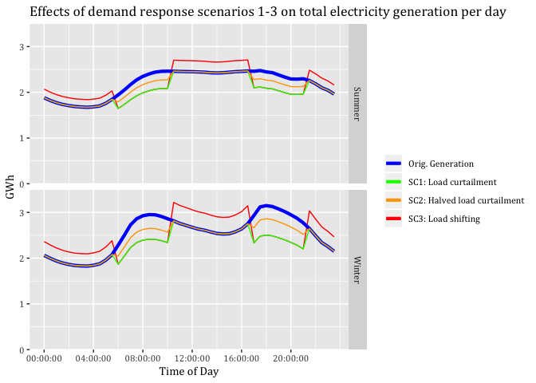<!-- -->

```r
ggsave("Effects of DR.jpeg", dpi = 600)
```

```
## Saving 7 x 5 in image
```
#Energy Efficiency: Lighting
##Data import


```r
LightingHCS <- data.table::as.data.table(
 readr::read_csv("/Volumes/hum-csafe/Research Projects/GREEN Grid/cleanData/safe/gridSpy/1min/dataExtracts/Lighting_2015-04-01_2016-03-31_observations.csv.gz",
                       col_types = cols(
                       hhID = col_character(),
                       linkID = col_character(),
                       r_dateTime = col_datetime(format = ""),
                       circuit = col_character(),
                       powerW = col_double() # <- crucial otherwise readr infers integers for some reason
                     )
                 )
)

LightObsDT <- data.table::as.data.table(LightingHCS)

LightObsDT <- LightObsDT[, year := lubridate::year(r_dateTime)]
LightObsDT <- LightObsDT[, obsHourMin := hms::as.hms(r_dateTime)]
LightObsDT <- LightObsDT[, month := lubridate::month(r_dateTime)]

LightObsDT <- LightObsDT[month >= 12 | month == 1 | month == 2, season := "Summer"]
LightObsDT <- LightObsDT[month >= 3 | month == 4 | month == 5, season := "Autumn"]
LightObsDT <- LightObsDT[month == 6 | month == 7 | month == 8, season := "Winter"]
LightObsDT <- LightObsDT[month == 9 | month == 10 | month == 11, season := "Spring"]

#Building daily average per season

LightDT <- LightObsDT[, .(meanW = mean(powerW)), keyby = .(obsHourMin, season)]


#ggplot2::ggplot(LightDT, aes(x = obsHalfHour, y = meanW, colour = season)) + #geom_line()
```

##Lighting calculation per household

```r
LEDfac <- 0.11270924 # This is out of the Excel calculation
nzHouseholds <- 1457464 # Census 2013 data on households (copied from HP calc)

LightDT <- LightDT[, meanMWtotal := ((meanW * nzHouseholds)/1000/1000)]  
LightDT <- LightDT[, meanWLed := meanW * LEDfac]
LightDT <- LightDT[, meanMWLedTot := ((meanW * LEDfac * nzHouseholds)/1000/1000)]
LightDT <- LightDT[, oriWh := meanW/60]
LightDT <- LightDT[, oriMWhTot := (meanW/60/1000/1000) * nzHouseholds]
LightDT <- LightDT[, LedWh := meanWLed/60]
LightDT <- LightDT[, LedMWhTot := (meanWLed/60/1000/1000) * nzHouseholds]


consumOrigPDDT <- LightDT[, .(consumOrigPDkWh = sum(meanW/60)/1000),
                          keyby = .(season)]

consumOrigTotPDDT <- LightDT[, .(consumOrigTotPDGWh = sum(meanW/60 * nzHouseholds)/1000/1000/1000), keyby = .(season)]

consumOrigPYDT <- LightDT[, .(consumOrigPYkWh = sum(meanW/60*90)/1000), keyby = .(season)]

consumOrigTotPYDT <- LightDT[, .(consumOrigTotPYGWh = sum(meanW/60*90*nzHouseholds)/1000/1000/1000), keyby = .(season)]

consumLEDPDDT <- LightDT[, .(consumLEDPDkWh = sum(meanW*LEDfac)/60/1000), keyby = .(season)]

consumLEDTotPDDT <- LightDT[, .(consumLEDTotPDGWh = sum(meanW*LEDfac*nzHouseholds)/60/1000/1000/1000), keyby = .(season)]

consumLEDPYDT <- LightDT[, .(consumLEDPYkWh = sum(meanW*LEDfac*90)/60/1000), keyby = .(season)]

consumLEDTotPYDT <- LightDT[, .(consumLEDTotPYGWh = sum(meanW*LEDfac*90*nzHouseholds)/60/1000/1000/1000), keyby = .(season)]
```

##Visualisation

```r
consumOrigPDDT #Consumption in kWh for an avg day per season for one household
```

```
##    season consumOrigPDkWh
## 1: Autumn        2.573960
## 2: Spring        2.459135
## 3: Summer        1.736652
## 4: Winter        3.472153
```

```r
consumOrigTotPDDT #Consumption in GWh for an avg day per season for total NZ
```

```
##    season consumOrigTotPDGWh
## 1: Autumn           3.751455
## 2: Spring           3.584101
## 3: Summer           2.531108
## 4: Winter           5.060538
```

```r
consumOrigPYDT #Consumption in kWh per season for one household
```

```
##    season consumOrigPYkWh
## 1: Autumn        231.6564
## 2: Spring        221.3222
## 3: Summer        156.2987
## 4: Winter        312.4937
```

```r
consumOrigTotPYDT #Consumption in GWh per season for total NZ
```

```
##    season consumOrigTotPYGWh
## 1: Autumn           337.6309
## 2: Spring           322.5691
## 3: Summer           227.7998
## 4: Winter           455.4484
```

```r
consumLEDPDDT #Consumption in kWh for an avg day per season for one household LED 100%
```

```
##    season consumLEDPDkWh
## 1: Autumn      0.2901091
## 2: Spring      0.2771673
## 3: Summer      0.1957368
## 4: Winter      0.3913437
```

```r
consumLEDTotPDDT #Consumption in GWh for an avg day per season for total NZ LED 100%
```

```
##    season consumLEDTotPDGWh
## 1: Autumn         0.4228236
## 2: Spring         0.4039613
## 3: Summer         0.2852793
## 4: Winter         0.5703693
```

```r
consumLEDPYDT #Consumption in kWh per season for one household LED 100%
```

```
##    season consumLEDPYkWh
## 1: Autumn       26.10982
## 2: Spring       24.94506
## 3: Summer       17.61631
## 4: Winter       35.22093
```

```r
consumLEDTotPYDT #Consumption in GWh per season for total NZ LED 100%
```

```
##    season consumLEDTotPYGWh
## 1: Autumn          38.05412
## 2: Spring          36.35652
## 3: Summer          25.67514
## 4: Winter          51.33324
```

```r
#Change the order in facet_grid()
LightDT$season <- factor(LightDT$season, levels = c("Spring","Summer",
                                                    "Autumn", "Winter"))

#Visualising shifted and original consumption two colours
myPlot <- ggplot2::ggplot(LightDT, aes(x = obsHourMin)) +
  geom_line(aes(y=oriMWhTot, color="red"), size=0.5) +
  geom_line(aes(y=LedMWhTot, color="blue"), size=0.5) +
  theme(text = element_text(family = "Cambria")) +
  ggtitle("Lighting energy for an average day per season total NZ") +
  scale_colour_manual(name = element_blank(), 
                      values = c('red'='red', 'blue'='blue'),  labels = c('LED technology', 'Current technologies')) +
  facet_grid(season ~ .) +
  labs(x='Time of Day', y='Energy (MWh)') +
  #scale_y_continuous( limits = c(0,3.5), expand = c(0,0) )+
  #scale_y_continuous(breaks = c(0.1)) +
  scale_x_time(breaks = c(hms::as.hms("00:00:00"), 
                          hms::as.hms("04:00:00"), 
                          hms::as.hms("08:00:00"),       
                          hms::as.hms("12:00:00"), 
                          hms::as.hms("16:00:00"), 
                          hms::as.hms("20:00:00"),
                          hms::as.hms("24:00:00"))) 
myPlot
```

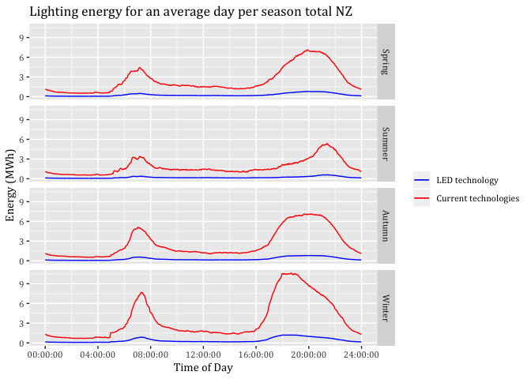<!-- -->

```r
ggsave("Lighting energy for an average day per season total NZ.jpg", dpi=600)
```

```
## Saving 7 x 5 in image
```


#MyPlot example

```r
#sc1data <- heatPumpProfileDT
#sc1data[, c("medianW", "obsHourMin", "meanW", "nObs", "sdW", "scaledMWmethod1", "EECApmMethod2"):=NULL] #Deleting unnecessary columns

#sc1data <- sc1data[, .(GWh = sum(scaledGWh)), 
                   # keyby = .(season, obsHalfHour)]

#myPlot <- ggplot2::ggplot(sc1data, aes(x = obsHalfHour, color=GWh)) +
  #geom_step(aes(y=GWh), size=0.5) +
 # theme(text = element_text(family = "Cambria")) +
 # ggtitle("Total New Zealand half hour heat pump energy consumption by season for 2015") +
 # facet_grid(season ~ .) +
 # labs(x='Time of Day', y='GWh') +
 # scale_y_continuous(breaks = c(3, 6, 9, 12)) +
 # scale_x_time(breaks = c(hms::as.hms("00:00:00"), hms::as.hms("03:00:00"), hms::as.hms("06:00:00"),       hms::as.hms("09:00:00"), hms::as.hms("12:00:00"), 
 # hms::as.hms("15:00:00"), hms::as.hms("18:00:00"), hms::as.hms("21:00:00"))) +
 # scale_colour_gradient(low= "green", high="red", guide = "colorbar")

#myPlot

#ggsave("Total New Zealand half hour heat pump energy consumption by season for 2015.jpeg",
      # dpi=600)


#Other examples

#AuMP <- 38.35385
#WiMP <- 96.89743
#SpMP <- 39.09743
#SuMP <- 23.28916
#AuEP <- 29.11365
#WiEP <- 75.27774
#SpEP <- 35.80694
#SuEP <- 10.12392

#AuNP1 <- sc1data[ GWhs1[1:12 42:48]]
#AuNP2 <- sc1data[ c(22:32), "GWhs1"]
#WiNP1 <- sc1data[ c(145:156, 186:192), "GWhs1"]
#WiNP2 <- sc1data[ c(166:176), "GWhs1"]
#SpNP1 <- sc1data[ c(49:60, 90:96), "GWhs1"]
#SpNP2 <- sc1data[ c(70:80), "GWhs1"]
#SuNP1 <- sc1data[ c(97:108, 138:144), "GWhs1"]
#SuNP2 <- sc1data[ c(118:128), "GWhs1"]

#sc1data <- sc1data[, ShiftL := GWhs1] # Creating new column ShiftL based on GWhs1

# Updating ShiftL predefined rows with the percentage of peak-period sum. Spreading Morning Peak load over a longer duration than Evening Peak
#sc1data <- sc1data[, ShiftL := AuNP1 * AuMP * 1/19]
#sc1data <- sc1data[, ShiftL := WiNP1 * WiMP * 1/19]
#sc1data <- sc1data[, ShiftL := SpNP1 * SpMP * 1/19]
#sc1data <- sc1data[, ShiftL := SuNP1 * SuMP * 1/19]

#sc1data <- sc1data[, ShiftL := AuNP2 * AuEP * 1/11]
#sc1data <- sc1data[, ShiftL := WiNP2 * WiEP * 1/11]
#sc1data <- sc1data[, ShiftL := SpNP2 * SpEP * 1/11]
#sc1data <- sc1data[, ShiftL := SuNP2 * SuEP * 1/11]


#sc1data <- sc1data[, ShiftL:= ifelse(Period == "Evening Peak", 0, ShiftL )]
#sc1data <- sc1data[, ShiftL:= ifelse(Period == "Morning Peak", 0, ShiftL )]
```


# Runtime


Analysis completed in 207.99 seconds ( 3.47 minutes) using [knitr](https://cran.r-project.org/package=knitr) in [RStudio](http://www.rstudio.com) with R version 3.4.4 (2018-03-15) running on x86_64-apple-darwin15.6.0.

# R environment

R packages used:

 * base R - for the basics [@baseR]
 * data.table - for fast (big) data handling [@data.table]
 * lubridate - date manipulation [@lubridate]
 * ggplot2 - for slick graphics [@ggplot2]
 * readr - for csv reading/writing [@readr]
 * skimr - for skim [@skimr]
 * knitr - to create this document & neat tables [@knitr]
 * GREENGrid - for local NZ GREEN Grid project utilities

Session info:


```
## R version 3.4.4 (2018-03-15)
## Platform: x86_64-apple-darwin15.6.0 (64-bit)
## Running under: macOS High Sierra 10.13.6
## 
## Matrix products: default
## BLAS: /Library/Frameworks/R.framework/Versions/3.4/Resources/lib/libRblas.0.dylib
## LAPACK: /Library/Frameworks/R.framework/Versions/3.4/Resources/lib/libRlapack.dylib
## 
## locale:
## [1] en_NZ.UTF-8/en_NZ.UTF-8/en_NZ.UTF-8/C/en_NZ.UTF-8/en_NZ.UTF-8
## 
## attached base packages:
## [1] stats     graphics  grDevices utils     datasets  methods   base     
## 
## other attached packages:
## [1] bindrcpp_0.2.2    knitr_1.20        skimr_1.0.3       hms_0.4.2        
## [5] readr_1.1.1       lubridate_1.7.4   ggplot2_3.0.0     data.table_1.11.6
## [9] GREENGrid_0.1.0  
## 
## loaded via a namespace (and not attached):
##  [1] tidyselect_0.2.4  xfun_0.3          purrr_0.2.5      
##  [4] reshape2_1.4.3    lattice_0.20-35   colorspace_1.3-2 
##  [7] htmltools_0.3.6   yaml_2.2.0        rlang_0.2.2      
## [10] pillar_1.3.0      glue_1.3.0        withr_2.1.2      
## [13] sp_1.3-1          jpeg_0.1-8        plyr_1.8.4       
## [16] bindr_0.1.1       stringr_1.3.1     munsell_0.5.0    
## [19] gtable_0.2.0      RgoogleMaps_1.4.2 mapproj_1.2.6    
## [22] evaluate_0.11     labeling_0.3      highr_0.7        
## [25] proto_1.0.0       Rcpp_0.12.18      geosphere_1.5-7  
## [28] openssl_1.0.2     scales_1.0.0      backports_1.1.2  
## [31] rjson_0.2.20      png_0.1-7         digest_0.6.17    
## [34] stringi_1.2.4     bookdown_0.7      dplyr_0.7.6      
## [37] grid_3.4.4        rprojroot_1.3-2   cli_1.0.1        
## [40] tools_3.4.4       magrittr_1.5      maps_3.3.0       
## [43] lazyeval_0.2.1    tibble_1.4.2      crayon_1.3.4     
## [46] tidyr_0.8.1       pkgconfig_2.0.2   assertthat_0.2.0 
## [49] rmarkdown_1.10    R6_2.2.2          ggmap_2.6.1      
## [52] compiler_3.4.4
```

# References
