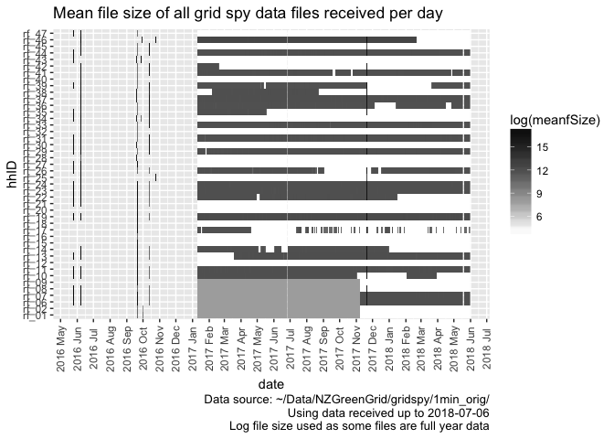
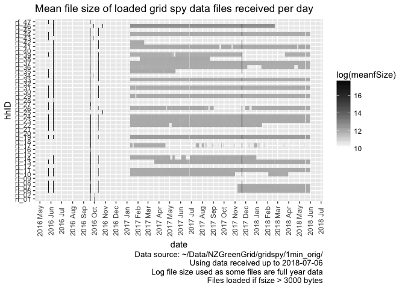
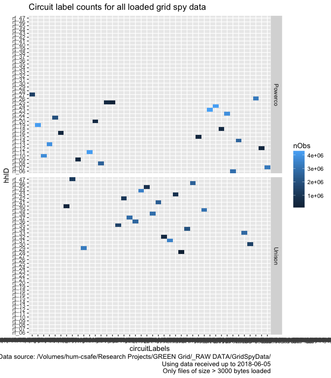
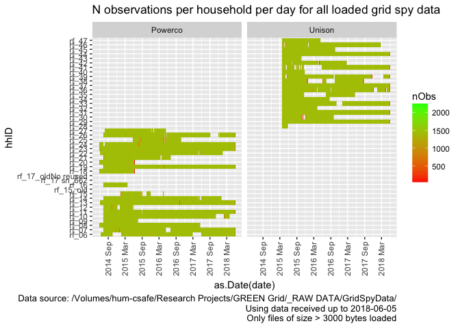
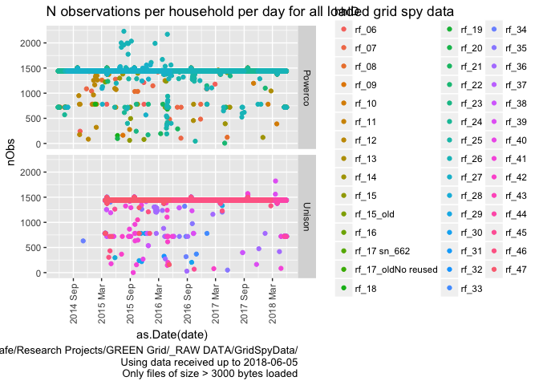
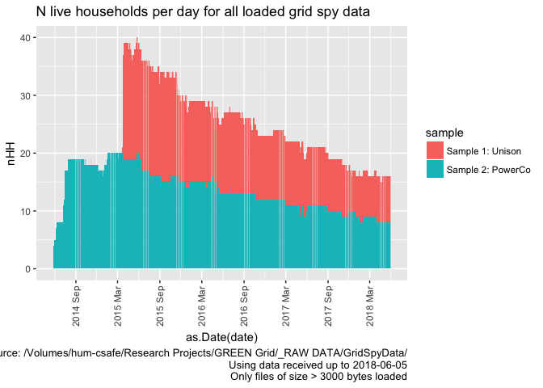

\newpage

# Status


Full run using all data from /Volumes/hum-csafe/Research Projects/GREEN Grid/_RAW DATA/GridSpyData/


refreshData = 0 so re-using previous output. Should be relatively quick.

# Citation

If you wish to use any of the material from this report please cite as:

 * Anderson, B. (2018) Processing, cleaning and saving NZ GREEN Grid project 1 minute electricity power data, University of Otago: Dunedin, NZ.

\newpage

# Introduction

Report circulation:

 * Restricted to: [NZ GREEN Grid](https://www.otago.ac.nz/centre-sustainability/research/energy/otago050285.html) project partners and contractors.

## Purpose

This report is intended to: 

 * load and clean the project electricity power data (Grid Spy)
 * save the cleaned data out as a single file per household
 * produce summary data quality statistics

The resulting cleaned data has _no_ identifying information such as names, addresses, email addresses, telephone numbers and is therefore safe to share across all partners.

The data contains a unique household id which can be used to link it to the NZ GREEN Grid time use diaries and dwelling/appliance surveys. With some additional non-disclosure checks it should also be safe to archive all of these linkable datasets for re-use via the UK [reshare](http://reshare.ukdataservice.ac.uk/) service.

## Requirements:

 * grid spy 1 minute data downloads

## History

Generally tracked via our git.soton [repo](https://git.soton.ac.uk/ba1e12/nzGREENGrid):

 * [history](https://git.soton.ac.uk/ba1e12/nzGREENGrid/commits/master)
 * [issues](https://git.soton.ac.uk/ba1e12/nzGREENGrid/issues)
 
## Support

This work was supported by:

 * The [University of Otago](https://www.otago.ac.nz/)
 * The New Zealand [Ministry of Business, Innovation and Employment (MBIE)](http://www.mbie.govt.nz/)
 * [SPATIALEC](http://www.energy.soton.ac.uk/tag/spatialec/) - a [Marie Skłodowska-Curie Global Fellowship](http://ec.europa.eu/research/mariecurieactions/about-msca/actions/if/index_en.htm) based at the University of Otago’s [Centre for Sustainability](http://www.otago.ac.nz/centre-sustainability/staff/otago673896.html) (2017-2019) & the University of Southampton's Sustainable Energy Research Group (2019-202).
 
This work is (c) 2018 the University of Southampton.

We do not 'support' the code but if you have a problem check the [issues](https://git.soton.ac.uk/ba1e12/nzGREENGrid/issues) on our [repo](https://git.soton.ac.uk/ba1e12/nzGREENGrid) and if it doesn't already exist, open one. We might be able to fix it :-)

# Obtain listing of files

In this section we generate a listing of all 1 minute data files that we have received. If we are running over the complete dataset then we will be using data from:

 * /hum-csafe/Research Projects/GREEN Grid/_RAW DATA/GridSpyData/
 
In this run we are using data from:

 * /Volumes/hum-csafe/Research Projects/GREEN Grid/_RAW DATA/GridSpyData/

If these do not match then this may be a test run.


```
## [1] "Re-using filelist"
```

```
## [1] "Overall we have 22376 files from 44 households."
```

Overall we have 22,376 files from 44 households. Of the 22,376,  13,080 (58.46%) were _not_ loaded/checked as their file sizes indicated that they contained no data.

## Date format checks

We now need to check how many of the loaded files have an ambiguous or default date - these could introduce errors.


Table: Number of files and min/max date (as char) with given date column names by inferred date format

dateColName                            dateFormat                                   nFiles  minDate      maxDate    
-------------------------------------  ------------------------------------------  -------  -----------  -----------
date NZ                                dmy - definite                                    1  27/03/2015   27/03/2015 
date NZ                                mdy - definite                                    2  5/26/2016    5/26/2016  
date NZ                                ymd - default (but day/month value <= 12)        12  2014-01-06   2016-06-07 
date NZ                                ymd - definite                                   67  2014-05-24   2016-07-13 
date UTC                               ambiguous                                        28  11-10-16     27/07/14   
date UTC                               ymd - default (but day/month value <= 12)      3607  2014-11-03   2018-05-12 
date UTC                               ymd - definite                                 5579  2015-03-26   2018-05-28 
unknown - do not load (fsize = 2751)   NA                                             1812  NA           NA         
unknown - do not load (fsize = 43)     NA                                            11268  NA           NA         

Results to note:

 * There are 28 ambiguous files
 * The non-loaded files only have 2 distinct file sizes, confirming that they are unlikely to contain useful data. 
 
We now inspect the ambiguous and (some of) the default files.

To help with data cleaning the following table lists files that have ambiguous dates.


```r
# list ambigious files
aList <- fListCompleteDT[dateFormat == "ambiguous", 
                         .(file, dateColName, dateExample, dateFormat)]

cap <- paste0("All ", nrow(aList), 
              " files with an ambiguous dateFormat")

knitr::kable(caption = cap, aList)
```


Table: All 28 files with an ambiguous dateFormat

file                               dateColName   dateExample   dateFormat 
---------------------------------  ------------  ------------  -----------
rf_06/15Jul2014-25May2016at1.csv   date UTC      14/07/14      ambiguous  
rf_07/15Jul2014-25May2016at1.csv   date UTC      14/07/14      ambiguous  
rf_08/15Jul2014-25May2016at1.csv   date UTC      14/07/14      ambiguous  
rf_10/15Jul2014-25May2016at1.csv   date UTC      14/07/14      ambiguous  
rf_11/15Jul2014-25May2016at1.csv   date UTC      14/07/14      ambiguous  
rf_13/15Jul2014-25May2016at1.csv   date UTC      14/07/14      ambiguous  
rf_19/15Jul2014-25May2016at1.csv   date UTC      14/07/14      ambiguous  
rf_21/15Jul2014-25May2016at1.csv   date UTC      14/07/14      ambiguous  
rf_22/15Jul2014-25May2016at1.csv   date UTC      14/07/14      ambiguous  
rf_23/15Jul2014-25May2016at1.csv   date UTC      14/07/14      ambiguous  
rf_24/15Jul2014-25May2016at1.csv   date UTC      27/07/14      ambiguous  
rf_25/12Oct2016-20Nov2017at1.csv   date UTC      11-10-16      ambiguous  
rf_26/15Jul2014-25May2016at1.csv   date UTC      14/07/14      ambiguous  
rf_27/15Jul2014-25May2016at1.csv   date UTC      27/07/14      ambiguous  
rf_29/24Mar2015-25May2016at1.csv   date UTC      25/03/15      ambiguous  
rf_30/15Feb2016-25May2016at1.csv   date UTC      14/02/16      ambiguous  
rf_30/24Mar2015-25May2016at1.csv   date UTC      27/03/15      ambiguous  
rf_31/24Mar2015-25May2016at1.csv   date UTC      25/03/15      ambiguous  
rf_34/18Jan2016-25May2016at1.csv   date UTC      17/01/16      ambiguous  
rf_34/20Jul2015-25May2016at1.csv   date UTC      19/07/15      ambiguous  
rf_34/24Mar2015-25May2016at1.csv   date UTC      26/03/15      ambiguous  
rf_35/24Mar2015-25May2016at1.csv   date UTC      23/03/15      ambiguous  
rf_39/24Mar2015-25May2016at1.csv   date UTC      27/03/15      ambiguous  
rf_43/24Mar2015-25May2016at1.csv   date UTC      26/03/15      ambiguous  
rf_43/27Mar2015-18Oct2015at1.csv   date UTC      26/03/15      ambiguous  
rf_44/24Mar2015-25May2016at1.csv   date UTC      24/03/15      ambiguous  
rf_46/12Oct2016-20Nov2017at1.csv   date UTC      11-10-16      ambiguous  
rf_47/24Mar2015-25May2016at1.csv   date UTC      24/03/15      ambiguous  

Check against file names to see what is reasonable and then fix them.


```r
fListCompleteDT <- nzGREENGrid::fixAmbiguousDates(fListCompleteDT)
```

```
## [1] "Fixed 28 files with an ambiguous dateFormat"
```


The following table lists up to 10 of the 'date NZ' files which are set by default - do they look OK to assume the default dateFormat? Compare the file names with the dateExample...


```r
# list default files with NZ time
aList <- fListCompleteDT[dateColName == "date NZ" & dateFormat %like% "default", 
                         .(file, fSize, dateColName, dateExample, dateFormat)]

cap <- paste0("First 10 (max) of ", nrow(aList), 
              " files with dateColName = 'date NZ' and default dateFormat")

knitr::kable(caption = cap, head(aList))
```


Table: First 10 (max) of 12 files with dateColName = 'date NZ' and default dateFormat

file                                   fSize  dateColName   dateExample   dateFormat                                
---------------------------------  ---------  ------------  ------------  ------------------------------------------
rf_01/1Jan2014-24May2014at1.csv      6255737  date NZ       2014-01-06    ymd - default (but day/month value <= 12) 
rf_02/1Jan2014-24May2014at1.csv      6131625  date NZ       2014-03-03    ymd - default (but day/month value <= 12) 
rf_06/24May2014-24May2015at1.csv    19398444  date NZ       2014-06-09    ymd - default (but day/month value <= 12) 
rf_10/24May2014-24May2015at1.csv    24386048  date NZ       2014-07-09    ymd - default (but day/month value <= 12) 
rf_11/24May2014-24May2015at1.csv    23693893  date NZ       2014-07-08    ymd - default (but day/month value <= 12) 
rf_12/24May2014-24May2015at1.csv    21191785  date NZ       2014-07-09    ymd - default (but day/month value <= 12) 

The following table lists up to 10 of the 'date UTC' files which are set by default - do they look OK to assume the default dateFormat? Compare the file names with the dateExample...


```r
# list default files with UTC time
aList <- fListCompleteDT[dateColName == "date UTC" & dateFormat %like% "default", 
                         .(file, fSize, dateColName, dateExample, dateFormat)]

cap <- paste0("First 10 (max) of ", nrow(aList), 
              " files with dateColName = 'date UTC' and default dateFormat")

knitr::kable(caption = cap, head(aList, 10))
```


Table: First 10 (max) of 3607 files with dateColName = 'date UTC' and default dateFormat

file                                 fSize  dateColName   dateExample   dateFormat                                
---------------------------------  -------  ------------  ------------  ------------------------------------------
rf_06/10Apr2018-11Apr2018at1.csv    156944  date UTC      2018-04-09    ymd - default (but day/month value <= 12) 
rf_06/10Dec2017-11Dec2017at1.csv    156601  date UTC      2017-12-09    ymd - default (but day/month value <= 12) 
rf_06/10Feb2018-11Feb2018at1.csv    153353  date UTC      2018-02-09    ymd - default (but day/month value <= 12) 
rf_06/10Jan2018-11Jan2018at1.csv    153982  date UTC      2018-01-09    ymd - default (but day/month value <= 12) 
rf_06/10Mar2018-11Mar2018at1.csv    156471  date UTC      2018-03-09    ymd - default (but day/month value <= 12) 
rf_06/10May2018-11May2018at1.csv    156683  date UTC      2018-05-09    ymd - default (but day/month value <= 12) 
rf_06/10Nov2017-11Nov2017at1.csv    155639  date UTC      2017-11-09    ymd - default (but day/month value <= 12) 
rf_06/11Apr2018-12Apr2018at1.csv    157181  date UTC      2018-04-10    ymd - default (but day/month value <= 12) 
rf_06/11Dec2017-12Dec2017at1.csv    157814  date UTC      2017-12-10    ymd - default (but day/month value <= 12) 
rf_06/11Feb2018-12Feb2018at1.csv    153859  date UTC      2018-02-10    ymd - default (but day/month value <= 12) 

Check final date formats:


Table: Number of files & min/max dates (as char) with given date column names by final imputed date format

dateColName                            dateFormat                                   nFiles  minDate      maxDate    
-------------------------------------  ------------------------------------------  -------  -----------  -----------
date NZ                                dmy - definite                                    1  27/03/2015   27/03/2015 
date NZ                                mdy - definite                                    2  5/26/2016    5/26/2016  
date NZ                                ymd - default (but day/month value <= 12)        12  2014-01-06   2016-06-07 
date NZ                                ymd - definite                                   67  2014-05-24   2016-07-13 
date UTC                               dmy - inferred                                   28  11-10-16     27/07/14   
date UTC                               ymd - default (but day/month value <= 12)      3607  2014-11-03   2018-05-12 
date UTC                               ymd - definite                                 5579  2015-03-26   2018-05-28 
unknown - do not load (fsize = 2751)   NA                                             1812  NA           NA         
unknown - do not load (fsize = 43)     NA                                            11268  NA           NA         

## Data file quality checks

The following chart shows the distribution of these files over time using their sizes. Note that white indicates the presence of small files which may not contain observations.

<!-- -->

```
## Saving 7 x 5 in image
```


The following chart shows the same chart but only for files which we think contain data.

<!-- -->

```
## Saving 7 x 5 in image
```

# Load data files

## Grid Spy metadata

In this section we load metadata from /Users/ben/Syncplicity Folders/Green Grid Project Management Folder/Gridspy/Master list of Gridspy units.xlsx to link to the power data.


Table: Meta data for sample

sample    hhID                 Adults            Teenagers       Children                removed  
--------  -------------------  ----------------  --------------  ----------------------  ---------
Unison    rf_28                2                 NA              3(12,8,4)               NA       
Unison    rf_29                2                 NA              1 (7 months old)        live     
Unison    rf_30                2                 0               0                       NA       
Unison    rf_31                2 (Plus cousin)   NA              NA                      live     
Unison    rf_32                2                 NA              2 (7 and 4years old)    NA       
Unison    rf_33                2                 1(14yold)       1 (6yold)               live     
Unison    rf_34                3                 NA              NA                      NA       
Unison    rf_35                2                 NA              NA                      42322    
Unison    rf_36                1                 2 (14 and 12)   NA                      live     
Unison    rf_37                2                 NA              NA                      live     
Unison    rf_38                NA                NA              NA                      NA       
Unison    rf_38                2                 NA              2 (<12)                 NA       
Unison    rf_39                2                 1 (16 YO)       NA                      live     
Unison    rf_40                2                 NA              NA                      42330    
Unison    rf_41                2                 NA              2 (11 and 8)            live     
Unison    rf_42                2                 NA              3 (<12 yold, 1 10 YO)   NA       
Unison    rf_43                2                 NA              NA                      42296    
Unison    rf_44                2                 NA              2 (10 and 7)            NA       
Unison    rf_45                2                 NA              3 (<12 years old)       NA       
Unison    rf_46                2                 NA              1 (4yold-50%)           live     
Unison    rf_47                3                 2               NA                      NA       
Powerco   rf_12                1                 NA              NA                      3/6/1015 
Powerco   rf_25                1                 NA              NA                      NA       
Powerco   rf_23                1                 NA              NA                      NA       
Powerco   rf_26                2                 NA              NA                      NA       
Powerco   rf_06                2                 NA              NA                      NA       
Powerco   rf_19                1                 NA              NA                      NA       
Powerco   rf_10                2                 NA              1(3yo)                  NA       
Powerco   rf_11                NA                NA              NA                      NA       
Powerco   rf_13                2                 1(16yo)         1(11)                   NA       
Powerco   rf_09                2                 NA              1                       42171    
Powerco   rf_07                2                 NA              2                       NA       
Powerco   rf_22                2                 NA              NA                      NA       
Powerco   rf_08                2                 NA              NA                      NA       
Powerco   rf_18                2                 NA              1(1yo)                  42532    
Powerco   rf_17_oldNo reused   2                 1(13yo)         1(11yo)                 42457    
Powerco   rf_14                1                 NA              1 (11 yo)               NA       
Powerco   rf_16                2                 NA              NA                      42089    
Powerco   rf_21                2                 NA              NA                      42821    
Powerco   rf_20                2                 NA              2                       42166    
Powerco   rf_27                2                 1               1                       NA       
Powerco   rf_15_old            1                 NA              NA                      42019    
Powerco   rf_24                2                 NA              2                       NA       
Powerco   rf_15                NA                NA              NA                      42462    
Powerco   rf_17 sn_662         NA                NA              NA                      NA       

## Grid Spy data

In this section we load the data files that have a file size > 3000 bytes. Things to note:

 * We assume that any files smaller than this value have no observations. This is based on:
     * Manual inspection of several small files
     * The identical (small) file sizes involved
     * _But_ we should probably test the first few lines to double check...
 * We have to deal with quite a lot of duplication some of which has caused the different date formats. See our [repo issues list](https://git.soton.ac.uk/ba1e12/nzGREENGrid/issues?scope=all&utf8=%E2%9C%93&state=all).
 
The following table shows the number of files per household that we will load.


```r
# check files to load
t <- fListCompleteDT[dateColName %like% "do not load", .(nFiles = .N,
                       meanSize = mean(fSize),
                       minFileDate = min(fMDate),
                       maxFileDate = max(fMDate)), keyby = .(hhID)]

knitr::kable(caption = "Summary of household files to load", t)
```


Table: Summary of household files to load

hhID     nFiles   meanSize  minFileDate   maxFileDate 
------  -------  ---------  ------------  ------------
rf_01       506   1659.237  2017-01-11    2018-05-30  
rf_02       506   1659.237  2017-01-11    2018-05-30  
rf_06       302   2751.000  2017-01-11    2017-11-08  
rf_07       302   2751.000  2017-01-11    2017-11-08  
rf_08       505   1662.438  2017-01-11    2018-05-30  
rf_09       506   1659.237  2017-01-11    2018-05-30  
rf_10       152     43.000  2017-11-03    2018-05-30  
rf_12       506     43.000  2017-01-11    2018-05-30  
rf_13        68     43.000  2017-01-11    2017-03-18  
rf_14       180     43.000  2017-05-04    2018-05-30  
rf_15       506     43.000  2017-01-11    2018-05-30  
rf_16       506     43.000  2017-01-11    2018-05-30  
rf_17       296     43.000  2017-01-18    2018-05-28  
rf_18       506     43.000  2017-01-11    2018-05-30  
rf_20       506     43.000  2017-01-11    2018-05-30  
rf_21       506     43.000  2017-01-11    2018-05-30  
rf_22       139     43.000  2017-05-01    2018-05-30  
rf_25       505     43.000  2017-01-11    2018-05-30  
rf_26        94     43.000  2017-08-21    2017-12-17  
rf_27       506     43.000  2017-01-11    2018-05-30  
rf_28       506     43.000  2017-01-11    2018-05-30  
rf_29         3     43.000  2017-01-25    2017-01-27  
rf_30       506     43.000  2017-01-11    2018-05-30  
rf_32       506     43.000  2017-01-11    2018-05-30  
rf_34       506     43.000  2017-01-11    2018-05-30  
rf_35       376     43.000  2017-05-19    2018-05-30  
rf_36        49     43.000  2017-12-06    2018-04-26  
rf_38       308     43.000  2017-01-11    2018-05-30  
rf_39       124     43.000  2017-05-14    2018-03-20  
rf_40       506     43.000  2017-01-11    2018-05-30  
rf_41         8     43.000  2017-09-19    2018-04-27  
rf_42       464     43.000  2017-02-20    2018-05-30  
rf_43       506     43.000  2017-01-11    2018-05-30  
rf_45       505     43.000  2017-01-11    2018-05-30  
rf_46        98     43.000  2018-02-22    2018-05-30  
rf_47       506     43.000  2017-01-11    2018-05-30  


Now load, clean and save the valid data giving feedback where appropriate.


```r
# process the data & update the fListCompleteDT
# get a few rows of data as an example
# refresh the data depending on refreshData (set in ./setup.R)

if(refreshData){
  print(paste0("'refreshData' = ", refreshData, " so re-building filelist"))
  # returns the updated file list into fListCompleteDT
  # creates hhStatDT (used below)
  # puts top 6 rows of last file into lastOfHeadDT
  fListCompleteDT <- nzGREENGrid::processGridSpyDataFiles(fListCompleteDT, fListFinal)
} else {
  print(paste0("'refreshData' = ", refreshData, " so re-using filelist"))
  fListCompleteDT <- fread(paste0(outPath,fListFinal))
  
  # need to create hhStatDT
  ofile <- paste0(outPath, "hhDailyObservationsStats.csv")
  hhStatDT <- fread(ofile)
  
  # need to get lastOfHeadDT
  # do this by getting the first in the processed list
  dPath <- paste0(outPath,"data/")
  fList <- list.files(path = dPath, pattern = "csv.gz")
  print(paste0("Re-using saved data file..."))
  lastOfHeadDT <- head(read_csv(paste0(dPath, fList[1])))
}
```

```
## [1] "'refreshData' = 0 so re-using filelist"
## [1] "Re-using saved data file..."
```

```
## Parsed with column specification:
## cols(
##   hhID = col_character(),
##   r_dateTime = col_datetime(format = ""),
##   circuit = col_character(),
##   powerW = col_double()
## )
```

```r
# test
kable(caption = "Example data rows", lastOfHeadDT)
```


Table: Example data rows

hhID    r_dateTime            circuit               powerW
------  --------------------  -------------------  -------
rf_01   2014-01-06 03:03:00   Kitchen power$1632     45.58
rf_01   2014-01-06 03:04:00   Kitchen power$1632     45.58
rf_01   2014-03-07 02:56:00   Kitchen power$1632     45.58
rf_01   2014-03-07 02:57:00   Kitchen power$1632     54.13
rf_01   2014-03-07 02:58:00   Kitchen power$1632    136.26
rf_01   2014-03-07 02:59:00   Kitchen power$1632    141.96


# Data quality analysis

Now produce some data quality plots & tables.

## Circuit label checks

The following table shows the number of data files with different circuit labels by household. In theory there should only be one unique list per household and it should be present in every data file. If this is not the case then this implies that:

 * some of the circuit labels for these households may have been changed during the data collection process;
 * some of the circuit labels may have character conversion errors which have changed the labels during the data collection process;
 * at least one file from one household has been saved to a folder containing data from a different household (unfortunately the raw data files do _not_ contain household IDs in the data or the file names which would enable checking/preventative filtering). This will be visible in the table if two households appear to share _exactly_ the same list of circuit labels.

Some or all of these may be true at any given time!

> NB: This table is only legible in the html version of this report because latex does a very bad job of wrapping table cell text. A version is saved in /Volumes/hum-csafe/Research Projects/GREEN Grid/Clean_data/safe/gridSpy/1min/circuitLabelCheck.csv for viewing in e.g. xl.


Table: Circuit labels list by household

                                                                                                                                                                                                                                                                                                                                          rf_06   rf_07   rf_08   rf_09   rf_10   rf_11   rf_12   rf_13   rf_14   rf_15   rf_15_old   rf_16   rf_17 sn_662   rf_17_oldNo reused   rf_18   rf_19   rf_20   rf_21   rf_22   rf_23   rf_24   rf_25   rf_26   rf_27   rf_28   rf_29   rf_30   rf_31   rf_32   rf_33   rf_34   rf_35   rf_36   rf_37   rf_38   rf_39   rf_40   rf_41   rf_42   rf_43   rf_44   rf_45   rf_46   rf_47
---------------------------------------------------------------------------------------------------------------------------------------------------------------------------------------------------------------------------------------------------------------------------------------------------------------------------------------  ------  ------  ------  ------  ------  ------  ------  ------  ------  ------  ----------  ------  -------------  -------------------  ------  ------  ------  ------  ------  ------  ------  ------  ------  ------  ------  ------  ------  ------  ------  ------  ------  ------  ------  ------  ------  ------  ------  ------  ------  ------  ------  ------  ------  ------
Bed 2, 2nd Fridge$2828, Heat Pump$2826, Hot Water - Controlled$2825, Incomer - Uncontrolled$2824, Kitchen, Laundry & Beds 1&3$2829, Oven & Oven Wall Appliances$2827                                                                                                                                                                          0       0       0       0       0       0       0       0       0       0           0       0              0                    0       0       0       0       0       0       0       0       0       0       3       0       0       0       0       0       0       0       0       0       0       0       0       0       0       0       0       0       0       0       0
Bedroom & Lounge Heat Pumps$2741, Incomer 1 - All$2738, Incomer 2 - All$2737, Kitchen Appliances$2735, Laundry$2734, Oven$2736, PV 1$2739, PV 2$2733, Theatre Heat Pump$2740                                                                                                                                                                  0       0       0       0       0       0       0       0       0       0           0       0              0                    0       0     508       0       0       0       0       0       0       0       0       0       0       0       0       0       0       0       0       0       0       0       0       0       0       0       0       0       0       0       0
Bedrooms & Lounge$2602, Heat Pump$2598, Incomer - All$2599, Kitchen Appliances$2601, Laundry & Garage$2597, Oven$2600                                                                                                                                                                                                                         0       0       0       0     358       0       0       0       0       0           0       0              0                    0       0       0       0       0       0       0       0       0       0       0       0       0       0       0       0       0       0       0       0       0       0       0       0       0       0       0       0       0       0       0
Downstairs (inc 1 Heat Pump)$2212, Hot Water - Controlled$2208, Incomer - Uncontrolled$2209, Kitchen & Laundry$2213, Oven & Hob$2210, Upstairs Heat Pumps$2211                                                                                                                                                                                0       0       0       0       0       0       0     440       0       0           0       0              0                    0       0       0       0       0       0       0       0       0       0       0       0       0       0       0       0       0       0       0       0       0       0       0       0       0       0       0       0       0       0       0
Fridge$2752, Heat Pump & Washing Machine$2750, Incomer - All$2748, Kitchen Appliances & Garage$2753, Lower Bedrooms & Bathrooms$2751, Oven$2749                                                                                                                                                                                               0       0       0       0       0       0       0       0       0       0           0       0              0                    0       0       0       0       4       0       0       0       0       0       0       0       0       0       0       0       0       0       0       0       0       0       0       0       0       0       0       0       0       0       0
Hallway & Washing Machine$2683, Hot Water - Controlled$2679, Incomer 1 - Uncont inc Oven$2681, Incomer 2 - Uncont inc Stove$2680, Kitchen Appliances & Bedrooms$2684, Microwave & Breadmaker$2682                                                                                                                                             0       0       0       0       0       0       0       0       0       0           0       1              0                    0       0       0       0       0       0       0       0       0       0       0       0       0       0       0       0       0       0       0       0       0       0       0       0       0       0       0       0       0       0       0
Heat Pump (x2) & Lounge Power$4166, Hot Water - Controlled$4167, Incomer - Uncontrolled$4168, Kitchen Appliances$4163, Laundry$4164, Lighting$4165                                                                                                                                                                                            0       0       0       0       0       0       0       0       0       0           0       0              0                    0       0       0       0       0       0       0       0       0       0       0       0       0       0       0       0       0       0       0       0       0       0       0       2       0       0       0       0       0       0       0
Heat Pump & 2 x Bathroom Heat$4171, Incomer - All$4170, Kitchen Power & Heat, Lounge$4174, Laundry, Garage & 2 Bedrooms$4173, Lighting$4172, Wall Oven$4169                                                                                                                                                                                   0       0       0       0       0       0       0       0       0       0           0       0              0                    0       0       0       0       0       0       0       0       0       0       0       0       0       0       0       0       0       0       0       0       0       0       0       0       0       0       0       0       0       0       3
Heat Pump & Bedroom 2$2731, Incomer 1 - Uncont - Inc Hob$2729, Incomer 2 - Uncont - Inc Oven$2730, Kitchen Appliances$2727, Laundry$2732, Lounge, Dining & Bedrooms$2728                                                                                                                                                                      0       0       0       2       0       0       0       0       0       0           0       0              0                    0       0       0       0       0       0       0       0       0       0       0       0       0       0       0       0       0       0       0       0       0       0       0       0       0       0       0       0       0       0       0
Heat Pump & Kitchen Appliances$4186, Hot Water - Controlled$4184, Incomer - Uncontrolled$4181, Laundry$4185, Lighting$4183, Oven$4182                                                                                                                                                                                                         0       0       0       0       0       0       0       0       0       0           0       0              0                    0       0       0       0       0       0       0       0       0       0       0       0     505       0       0       0       0       0       0       0       0       0       0       0       0       0       0       0       0       0       0
Heat Pump & Lounge$2590, Hob$2589, Hot Water Cpbd Heater- Cont$2586, Incomer - Uncontrolled$2585, Kitchen Appliances & Laundry$2588, Spa - Uncontrolled$2587                                                                                                                                                                                  0       0       0       0       0     508       0       0       0       0           0       0              0                    0       0       0       0       0       0       0       0       0       0       0       0       0       0       0       0       0       0       0       0       0       0       0       0       0       0       0       0       0       0       0
Heat Pump & Misc$2107, Hob$2109, Hot Water - Controlled$2110, Incomer 1 - Uncontrolled$2112, Incomer 2 - Uncontrolled$2111, Oven & Kitchen Appliances$2108                                                                                                                                                                                    0       0       0       0       0       0       0       0       0       0           0       0              0                    0       0       0       2       0       0       0       0       0       0       0       0       0       0       0       0       0       0       0       0       0       0       0       0       0       0       0       0       0       0       0
Heat Pump$2092, Hot Water - Controlled$2094, Incomer - Uncontrolled$2093, Kitchen$2089, Laundry & 2nd Fridge Freezer$2090, Oven & Hob$2091                                                                                                                                                                                                    0       0       5       0       0       0       0       0       0       0           0       0              0                    0       0       0       0       0       0       0       0       0       0       0       0       0       0       0       0       0       0       0       0       0       0       0       0       0       0       0       0       0       0       0
Heat Pump$2758, Hob & Kitchen Appliances$2759, Hot Water - Controlled$2761, Incomer 1 - Uncontrolled $2763, Incomer 1 - Uncontrolled$2757, Incomer 2 - Uncontrolled $2762, Oven$2760                                                                                                                                                          0       0       0       0       0       0       0       0       0       0           0       0              0                    0       0       0       0       0       0       0       0       1       0       0       0       0       0       0       0       0       0       0       0       0       0       0       0       0       0       0       0       0       0       0
Heat Pump$2758, Hob & Kitchen Appliances$2759, Hot Water - Controlled$2761, Incomer 1 - Uncontrolled $2763, Incomer 2 - Uncontrolled $2762, Oven$2760                                                                                                                                                                                         0       0       0       0       0       0       0       0       0       0           0       0              0                    0       0       0       0       0       0       0       0       2       0       0       0       0       0       0       0       0       0       0       0       0       0       0       0       0       0       0       0       0       0       0
Heat Pump$4124, Hot Water - Uncontrolled$4125, Incomer - Uncontrolled$4126, Kitchen Appliances$4121, Laundry, Garage Fridge Freezer$4122, Lighting$4123                                                                                                                                                                                       0       0       0       0       0       0       0       0       0       0           0       0              0                    0       0       0       0       0       0       0       0       0       0       0       0       0       0       0       0       0       0     134       0       0       0       0       0       0       0       0       0       0       0       0
Heat Pump$4130, Hot Water - Uncontrolled$4131, Incomer - All$4132, Kitchen Appliances$4127, Laundry & Freezer$4128, Lighting (inc heat lamps)$4129                                                                                                                                                                                            0       0       0       0       0       0       0       0       0       0           0       0              0                    0       0       0       0       0       0       0       0       0       0       0       0       0       0       0       0       0       0       0       0       0       0       0       0       0      45       0       0       0       0       0
Heat Pump$4134, Hot Water - Controlled$4135, Incomer -Uncontrolled$4136, Kitchen Appliances$4137, Laundry & Fridge Freezer$4138, Lighting$4133                                                                                                                                                                                                0       0       0       0       0       0       0       0       0       0           0       0              0                    0       0       0       0       0       0       0       0       0       0       0       0       0       0       0       0       0       0       0       0     507       0       0       0       0       0       0       0       0       0       0
Heat Pump$4150, Hot Water - Uncontrolled$4147, Incomer - All$4148, Kitchen Appliances$4145, Lighting$4149, Washing Machine$4146                                                                                                                                                                                                               0       0       0       0       0       0       0       0       0       0           0       0              0                    0       0       0       0       0       0       0       0       0       0       0       0       0       0       0       0       0       0       0     458       0       0       0       0       0       0       0       0       0       0       0
Heat Pump$4154, Hot Water - Controlled$4155, Incomer - Uncontrolled$4156, Kitchen Appliances$4151, Laundry $4152, Lighting$4153                                                                                                                                                                                                               0       0       0       0       0       0       0       0       0       0           0       0              0                    0       0       0       0       0       0       0       0       0       0       0       0       0       0       0       0       0       0       0       0       0       0       0       0       0       0       0     508       0       0       0
Heat Pump$4160, Hot Water - Controlled$4158, Incomer - Uncontrolled$4157, Kitchen Appliances$4161, Laundry & Garage Fridge$4162, Lighting$4159                                                                                                                                                                                                0       0       0       0       0       0       0       0       0       0           0       0              0                    0       0       0       0       0       0       0       0       0       0       0       0       0       0       0       0       0       0       0       0       0       0       0       0       0       0       0       0       4       0       0
Heat Pump$4175, Hot Water - Controlled$4178, Incomer - Uncontrolled$4177, Kitchen, Dining & Office$4179, Laundry, Lounge, Garage, Bed$4180, Lighting$4176                                                                                                                                                                                     0       0       0       0       0       0       0       0       0       0           0       0              0                    0       0       0       0       0       0       0       0       0       0       0       0       0       0       0       0       0       0       0       0       0     402       0       0       0       0       0       0       0       0       0
Heat Pump$4190, Incomer - All$4192, Kitchen Appliances$4187, Laundry$4188, Lighting$4189, Oven$4191                                                                                                                                                                                                                                           0       0       0       0       0       0       0       0       0       0           0       0              0                    0       0       0       0       0       0       0       0       0       0       0       0       0       0       0       0       0       0       0       0       0       0       0       0     499       0       0       0       0       0       0
Heat Pump$4196, Hot Water - Controlled$4198, Incomer - All$4193, Kitchen Appliances$4195, Laundry$4194, Lighting$4197                                                                                                                                                                                                                         0       0       0       0       0       0       0       0       0       0           0       0              0                    0       0       0       0       0       0       0       0       0       0       0       0       0       0       0       2       0       0       0       0       0       0       0       0       0       0       0       0       0       0       0
Heat Pump$4204, Hot Water - Controlled$4200, Incomer - All$4199, Kitchen Appliances$4201, Laundry$4202, Lighting$4203                                                                                                                                                                                                                         0       0       0       0       0       0       0       0       0       0           0       0              0                    0       0       0       0       0       0       0       0       0       0       0       0       0       0     508       0       0       0       0       0       0       0       0       0       0       0       0       0       0       0       0
Heat Pump$4211, Incomer - All$4213, Kitchen Appliances$4210, Laundry, Garage & Guest Bed$4215, Lighting$4212, Oven$4214                                                                                                                                                                                                                       0       0       0       0       0       0       0       0       0       0           0       0              0                    0       0       0       0       0       0       0       0       0       0       0       0       0       0       0       0       0       0       0       0       0       0       0       0       0       0       4       0       0       0       0
Heat Pump$4219, Incomer - All$4221, Kitchen Appliances$4216, Laundry$4217, Lighting$4218, PV & Garage$4220                                                                                                                                                                                                                                    0       0       0       0       0       0       0       0       0       0           0       0              0                    0       0       0       0       0       0       0       0       0       0       0       2       0       0       0       0       0       0       0       0       0       0       0       0       0       0       0       0       0       0       0
Heat Pump$4223, Hot Water - Uncontrolled$4224, Incomer - All$4225, Kitchen Appliances$4226, Laundry & Garage Freezer$4227, Lighting$4222                                                                                                                                                                                                      0       0       0       0       0       0       0       0       0       0           0       0              0                    0       0       0       0       0       0       0       0       0       0       0       0       0       0       0       0       0       7       0       0       0       0       0       0       0       0       0       0       0       0       0
Heat Pumps (2x) & Power$4232, Heat Pumps (2x) & Power$4399, Hot Water - Controlled$4231, Hot Water - Controlled$4400, Incomer - Uncontrolled$4230, Incomer - Uncontrolled$4401, Incomer Voltage$4405, Kitchen & Bedrooms$4229, Kitchen & Bedrooms$4402, Laundry & Bedrooms$4228, Laundry & Bedrooms$4403, Lighting$4233, Lighting$4404        0       0       0       0       0       0       0       0       0       0           0       0              0                    0       0       0       0       0       0       0       0       0       0       0       0       0       0       0       0       0       0       0       0       0       0       0       0       0       0       0       0       0     411       0
Hob$3954, Hot Water$3952, Incomer 1$3956, Incomer 2$3955, Laundry & Kitchen Appliances$3951, Oven$3953                                                                                                                                                                                                                                        0       0       0       0       0       0       0       0       0       2           0       0              0                    0       0       0       0       0       0       0       0       0       0       0       0       0       0       0       0       0       0       0       0       0       0       0       0       0       0       0       0       0       0       0
Hot Water  (2 elements)$4247, Incomer - Uncontrolled$4248, Kitchen Appliances$4244, Lighting & 2 Towel Rail$4245, Oven$4246                                                                                                                                                                                                                   0       0       0       0       0       0       0       0       0       0           0       0              0                    0       0       0       0       0       0       0       0       0       0       0       0       0       0       0       0       0       0       0       0       0       0     384       0       0       0       0       0       0       0       0
Hot Water - Controlled (HEMS)$2081, Incomer - Uncontrolled$2082, Kitchen, Laundry & Ventilation$2084, Oven$2085, PV & Storage$2083, Spa (HEMS)$2080                                                                                                                                                                                           0       0       0       0       0       0       0       0       0       0           0       0              0                    0       0       0       0       0       0     508       0       0       0       0       0       0       0       0       0       0       0       0       0       0       0       0       0       0       0       0       0       0       0       0
Hot Water - Controlled$2102, Incomer - Uncontrolled$2101, Kitchen$2104, Laundry, Fridge & Freezer$2105, Oven & Hob$2103, PV$2106                                                                                                                                                                                                              0       0       0       0       0       0       0       0       0       0           0       0              0                    0       0       0       0       0       0       0     508       0       0       0       0       0       0       0       0       0       0       0       0       0       0       0       0       0       0       0       0       0       0       0
Hot Water - Controlled$2129, Incomer 1 - Uncontrolled$2128, Incomer 2 - Uncontrolled$2130, Kitchen Appliances & Ventilati$2131, Laundry & Hob$2133, Oven$2132                                                                                                                                                                                 0       0       0       0       0       0       0       0       0       0           0       0              0                    0       2       0       0       0       0       0       0       0       0       0       0       0       0       0       0       0       0       0       0       0       0       0       0       0       0       0       0       0       0       0
Hot Water - Controlled$2236, Incomer - Uncontrolled$2237, Kitchen & Laundry$2234, Lighting$2232, Oven$2235, Ventilation & Lounge Power$2233                                                                                                                                                                                                   0       0       0       0       0       0       0       0       0       0           0       0              0                    0       0       0       0       0     371       0       0       0       0       0       0       0       0       0       0       0       0       0       0       0       0       0       0       0       0       0       0       0       0       0
Hot Water - Controlled$2248, Incomer - Uncontrolled$2249, Kitchen$2246, Laundry, Downstairs & Lounge$2245, Lighting$2244, Oven & Hob$2247                                                                                                                                                                                                   206       0       0       0       0       0       0       0       0       0           0       0              0                    0       0       0       0       0       0       0       0       0       0       0       0       0       0       0       0       0       0       0       0       0       0       0       0       0       0       0       0       0       0       0
Hot Water - Controlled$2719, Incomer 1 - Uncont inc Stove$2718, Incomer 2 - Uncont inc Oven$2717, Kitchen Appliances$2715, Laundry & Microwave$2720, Power Outlets$2716                                                                                                                                                                       0       0       0       0       0       0       0       0     329       0           0       0              0                    0       0       0       0       0       0       0       0       0       0       0       0       0       0       0       0       0       0       0       0       0       0       0       0       0       0       0       0       0       0       0
Hot Water - Controlled$4144, Incomer - Uncontrolled$4143, Kitchen Appliances & Heat Pump$4140, Laundry & Teenagers Bedroom$4139, Lighting$4142, Oven, Hob & Microwave$4141                                                                                                                                                                    0       0       0       0       0       0       0       0       0       0           0       0              0                    0       0       0       0       0       0       0       0       0       0       0       0       0       0       0       0     507       0       0       0       0       0       0       0       0       0       0       0       0       0       0
Hot Water - Controlled$4238, Incomer - All$4239, Kitchen Appliances$4234, Laundry & Kitchen$4235, Lighting$4236, Oven & Hobb$4237                                                                                                                                                                                                             0       0       0       0       0       0       0       0       0       0           0       0              0                    0       0       0       0       0       0       0       0       0       0       0       0       0       5       0       0       0       0       0       0       0       0       0       0       0       0       0       0       0       0       0
Incomer 1 - All$2703, Incomer 2 - All$2704, Kitchen Appliances$2706, Laundry, Sauna & 2nd Fridge$2707, Oven$2705, Spa$2708                                                                                                                                                                                                                    0       0       0       0       0       0       0       0       0       0           0       0              0                    0       0       0       0       0       0       0       0       0     414       0       0       0       0       0       0       0       0       0       0       0       0       0       0       0       0       0       0       0       0       0
Incomer 1 - Hot Water - Cont$2626, Incomer 2 - Uncontrolled$2625, Incomer 3 - Uncontrolled$2627, Kitchen Appliances & Lounge$2630, Laundry, Fridge & Microwave$2628, Oven$2629                                                                                                                                                                0       0       0       0       0       0       2       0       0       0           0       0              0                    0       0       0       0       0       0       0       0       0       0       0       0       0       0       0       0       0       0       0       0       0       0       0       0       0       0       0       0       0       0       0
Incomer 1 - Uncontrolled$2726, Incomer 2 - Uncontrolled$2725, Kitchen Appliances & Laundry$2722, Microwave$2721, Oven$2724, Workshop$2723                                                                                                                                                                                                     0     206       0       0       0       0       0       0       0       0           0       0              0                    0       0       0       0       0       0       0       0       0       0       0       0       0       0       0       0       0       0       0       0       0       0       0       0       0       0       0       0       0       0       0

Errors are easy to spot in the following plot where a hhID spans 2 or more circuit labels.

<!-- -->

```
## Saving 7 x 8 in image
```

The following table provides more detail to aid error checking. Check for:

 * 2+ adjacent rows which have exactly the same circuit labels but different hh_ids. This implies some data from one household has been saved in the wrong folder;
 * 2+ adjacent rows which have different circuit labels but identical hh_ids. This could imply the same thing but is more likely to be errors/changes to the circuit labelling. 
 
If the above plot and this table flag a lot of errors then some re-naming of the circuit labels (column names) may be necessary. 

> NB: As before, the table is only legible in the html version of this report because latex does a very bad job of wrapping table cell text. A version is saved in /Volumes/hum-csafe/Research Projects/GREEN Grid/Clean_data/safe/gridSpy/1min/circuitLabelMetaDataCheckTable.csv for viewing in e.g. xl.


Table: Circuit labels by household with addiitonal meta-data

circuitLabels                                                                                                                                                                                                                                                                                                                            hhID    sample     nFiles  minObsDate   maxObsDate   minFileDate   maxFileDate       nObs
---------------------------------------------------------------------------------------------------------------------------------------------------------------------------------------------------------------------------------------------------------------------------------------------------------------------------------------  ------  --------  -------  -----------  -----------  ------------  ------------  --------
Bed 2, 2nd Fridge$2828, Heat Pump$2826, Hot Water - Controlled$2825, Incomer - Uncontrolled$2824, Kitchen, Laundry & Beds 1&3$2829, Oven & Oven Wall Appliances$2827                                                                                                                                                                     rf_27   Powerco         3  2014-07-27   2016-05-13   2016-05-25    2016-09-21     1419097
Bedroom & Lounge Heat Pumps$2741, Incomer 1 - All$2738, Incomer 2 - All$2737, Kitchen Appliances$2735, Laundry$2734, Oven$2736, PV 1$2739, PV 2$2733, Theatre Heat Pump$2740                                                                                                                                                             rf_19   Powerco       508  2014-07-14   2018-05-30   2016-05-25    2018-05-30     4173266
Bedrooms & Lounge$2602, Heat Pump$2598, Incomer - All$2599, Kitchen Appliances$2601, Laundry & Garage$2597, Oven$2600                                                                                                                                                                                                                    rf_10   Powerco       358  2014-07-08   2018-03-29   2016-05-25    2018-03-30     3734792
Downstairs (inc 1 Heat Pump)$2212, Hot Water - Controlled$2208, Incomer - Uncontrolled$2209, Kitchen & Laundry$2213, Oven & Hob$2210, Upstairs Heat Pumps$2211                                                                                                                                                                           rf_13   Powerco       440  2014-06-05   2018-05-30   2016-05-25    2018-05-30     3896353
Fridge$2752, Heat Pump & Washing Machine$2750, Incomer - All$2748, Kitchen Appliances & Garage$2753, Lower Bedrooms & Bathrooms$2751, Oven$2749                                                                                                                                                                                          rf_21   Powerco         4  2014-07-14   2016-07-01   2016-05-25    2016-10-12     1972512
Hallway & Washing Machine$2683, Hot Water - Controlled$2679, Incomer 1 - Uncont inc Oven$2681, Incomer 2 - Uncont inc Stove$2680, Kitchen Appliances & Bedrooms$2684, Microwave & Breadmaker$2682                                                                                                                                        rf_16   Powerco         1  2014-07-09   2015-03-25   2016-09-20    2016-09-20      373523
Heat Pump & 2 x Bathroom Heat$4171, Incomer - All$4170, Kitchen Power & Heat, Lounge$4174, Laundry, Garage & 2 Bedrooms$4173, Lighting$4172, Wall Oven$4169                                                                                                                                                                              rf_47   Unison          3  2015-03-24   2016-05-08   2016-05-25    2016-09-20     1180942
Heat Pump & Bedroom 2$2731, Incomer 1 - Uncont - Inc Hob$2729, Incomer 2 - Uncont - Inc Oven$2730, Kitchen Appliances$2727, Laundry$2732, Lounge, Dining & Bedrooms$2728                                                                                                                                                                 rf_09   Powerco         2  2014-07-13   2015-07-16   2016-09-21    2016-09-21      529363
Heat Pump & Kitchen Appliances$4186, Hot Water - Controlled$4184, Incomer - Uncontrolled$4181, Laundry$4185, Lighting$4183, Oven$4182                                                                                                                                                                                                    rf_29   Unison        505  2015-03-25   2018-05-30   2016-05-25    2018-05-30     3288151
Heat Pump & Lounge$2590, Hob$2589, Hot Water Cpbd Heater- Cont$2586, Incomer - Uncontrolled$2585, Kitchen Appliances & Laundry$2588, Spa - Uncontrolled$2587                                                                                                                                                                             rf_11   Powerco       508  2014-07-07   2018-05-30   2016-05-25    2018-05-30     4189933
Heat Pump & Misc$2107, Hob$2109, Hot Water - Controlled$2110, Incomer 1 - Uncontrolled$2112, Incomer 2 - Uncontrolled$2111, Oven & Kitchen Appliances$2108                                                                                                                                                                               rf_20   Powerco         2  2014-05-28   2015-06-11   2016-09-21    2016-09-21      545138
Heat Pump (x2) & Lounge Power$4166, Hot Water - Controlled$4167, Incomer - Uncontrolled$4168, Kitchen Appliances$4163, Laundry$4164, Lighting$4165                                                                                                                                                                                       rf_40   Unison          2  2015-03-24   2015-11-22   2016-06-08    2016-09-20      349528
Heat Pump$2092, Hot Water - Controlled$2094, Incomer - Uncontrolled$2093, Kitchen$2089, Laundry & 2nd Fridge Freezer$2090, Oven & Hob$2091                                                                                                                                                                                               rf_08   Powerco         5  2014-05-28   2017-05-15   2016-05-25    2017-11-21     2536195
Heat Pump$2758, Hob & Kitchen Appliances$2759, Hot Water - Controlled$2761, Incomer 1 - Uncontrolled $2763, Incomer 1 - Uncontrolled$2757, Incomer 2 - Uncontrolled $2762, Oven$2760                                                                                                                                                     rf_25   Powerco         1  2015-05-24   2016-05-25   2016-06-08    2016-06-08      507847
Heat Pump$2758, Hob & Kitchen Appliances$2759, Hot Water - Controlled$2761, Incomer 1 - Uncontrolled $2763, Incomer 2 - Uncontrolled $2762, Oven$2760                                                                                                                                                                                    rf_25   Powerco         2  2016-05-25   2016-10-22   2016-10-25    2017-11-21      213418
Heat Pump$4124, Hot Water - Uncontrolled$4125, Incomer - Uncontrolled$4126, Kitchen Appliances$4121, Laundry, Garage Fridge Freezer$4122, Lighting$4123                                                                                                                                                                                  rf_35   Unison        134  2015-03-22   2017-05-17   2016-05-25    2017-11-21     1494089
Heat Pump$4130, Hot Water - Uncontrolled$4131, Incomer - All$4132, Kitchen Appliances$4127, Laundry & Freezer$4128, Lighting (inc heat lamps)$4129                                                                                                                                                                                       rf_42   Unison         45  2015-03-23   2017-02-18   2016-06-08    2017-11-21     1099072
Heat Pump$4134, Hot Water - Controlled$4135, Incomer -Uncontrolled$4136, Kitchen Appliances$4137, Laundry & Fridge Freezer$4138, Lighting$4133                                                                                                                                                                                           rf_37   Unison        507  2015-03-23   2018-05-30   2016-06-08    2018-05-30     2849674
Heat Pump$4150, Hot Water - Uncontrolled$4147, Incomer - All$4148, Kitchen Appliances$4145, Lighting$4149, Washing Machine$4146                                                                                                                                                                                                          rf_36   Unison        458  2015-03-23   2018-05-30   2016-06-08    2018-05-30     2675600
Heat Pump$4154, Hot Water - Controlled$4155, Incomer - Uncontrolled$4156, Kitchen Appliances$4151, Laundry $4152, Lighting$4153                                                                                                                                                                                                          rf_44   Unison        508  2015-03-24   2018-05-30   2016-05-25    2018-05-30     3464121
Heat Pump$4160, Hot Water - Controlled$4158, Incomer - Uncontrolled$4157, Kitchen Appliances$4161, Laundry & Garage Fridge$4162, Lighting$4159                                                                                                                                                                                           rf_45   Unison          4  2015-03-24   2016-10-15   2016-06-08    2017-11-21      821472
Heat Pump$4175, Hot Water - Controlled$4178, Incomer - Uncontrolled$4177, Kitchen, Dining & Office$4179, Laundry, Lounge, Garage, Bed$4180, Lighting$4176                                                                                                                                                                                rf_38   Unison        402  2015-03-24   2017-08-22   2016-06-08    2017-11-21     2913338
Heat Pump$4190, Incomer - All$4192, Kitchen Appliances$4187, Laundry$4188, Lighting$4189, Oven$4191                                                                                                                                                                                                                                      rf_41   Unison        499  2015-03-25   2018-05-30   2016-06-08    2018-05-30     2441615
Heat Pump$4196, Hot Water - Controlled$4198, Incomer - All$4193, Kitchen Appliances$4195, Laundry$4194, Lighting$4197                                                                                                                                                                                                                    rf_32   Unison          2  2015-03-25   2016-04-05   2016-06-08    2016-09-20      542484
Heat Pump$4204, Hot Water - Controlled$4200, Incomer - All$4199, Kitchen Appliances$4201, Laundry$4202, Lighting$4203                                                                                                                                                                                                                    rf_31   Unison        508  2015-03-25   2018-05-30   2016-05-25    2018-05-30     3459721
Heat Pump$4211, Incomer - All$4213, Kitchen Appliances$4210, Laundry, Garage & Guest Bed$4215, Lighting$4212, Oven$4214                                                                                                                                                                                                                  rf_43   Unison          4  2015-03-26   2015-10-18   2016-05-25    2016-09-28      890700
Heat Pump$4219, Incomer - All$4221, Kitchen Appliances$4216, Laundry$4217, Lighting$4218, PV & Garage$4220                                                                                                                                                                                                                               rf_28   Unison          2  2015-03-26   2015-05-26   2016-06-08    2016-09-19       87417
Heat Pump$4223, Hot Water - Uncontrolled$4224, Incomer - All$4225, Kitchen Appliances$4226, Laundry & Garage Freezer$4227, Lighting$4222                                                                                                                                                                                                 rf_34   Unison          7  2014-11-03   2016-08-24   2016-05-25    2016-10-13     2066074
Heat Pumps (2x) & Power$4232, Heat Pumps (2x) & Power$4399, Hot Water - Controlled$4231, Hot Water - Controlled$4400, Incomer - Uncontrolled$4230, Incomer - Uncontrolled$4401, Incomer Voltage$4405, Kitchen & Bedrooms$4229, Kitchen & Bedrooms$4402, Laundry & Bedrooms$4228, Laundry & Bedrooms$4403, Lighting$4233, Lighting$4404   rf_46   Unison        411  2015-03-26   2018-02-19   2016-06-08    2018-02-21     2529107
Hob$3954, Hot Water$3952, Incomer 1$3956, Incomer 2$3955, Laundry & Kitchen Appliances$3951, Oven$3953                                                                                                                                                                                                                                   rf_15   Powerco         2  2015-01-14   2016-04-18   2016-09-21    2016-09-21      395011
Hot Water  (2 elements)$4247, Incomer - Uncontrolled$4248, Kitchen Appliances$4244, Lighting & 2 Towel Rail$4245, Oven$4246                                                                                                                                                                                                              rf_39   Unison        384  2015-03-27   2018-05-30   2016-05-25    2018-05-30     3014770
Hot Water - Controlled (HEMS)$2081, Incomer - Uncontrolled$2082, Kitchen, Laundry & Ventilation$2084, Oven$2085, PV & Storage$2083, Spa (HEMS)$2080                                                                                                                                                                                      rf_23   Powerco       508  2014-05-25   2018-05-30   2016-05-25    2018-05-30     4253222
Hot Water - Controlled$2102, Incomer - Uncontrolled$2101, Kitchen$2104, Laundry, Fridge & Freezer$2105, Oven & Hob$2103, PV$2106                                                                                                                                                                                                         rf_24   Powerco       508  2014-05-28   2018-05-30   2016-05-25    2018-05-30     4203991
Hot Water - Controlled$2129, Incomer 1 - Uncontrolled$2128, Incomer 2 - Uncontrolled$2130, Kitchen Appliances & Ventilati$2131, Laundry & Hob$2133, Oven$2132                                                                                                                                                                            rf_18   Powerco         2  2014-05-29   2015-06-11   2016-09-21    2016-09-21      543098
Hot Water - Controlled$2236, Incomer - Uncontrolled$2237, Kitchen & Laundry$2234, Lighting$2232, Oven$2235, Ventilation & Lounge Power$2233                                                                                                                                                                                              rf_22   Powerco       371  2014-06-05   2018-01-14   2016-05-25    2018-01-16     3837181
Hot Water - Controlled$2248, Incomer - Uncontrolled$2249, Kitchen$2246, Laundry, Downstairs & Lounge$2245, Lighting$2244, Oven & Hob$2247                                                                                                                                                                                                rf_06   Powerco       206  2014-06-08   2018-05-30   2016-05-25    2018-05-30     2964716
Hot Water - Controlled$2719, Incomer 1 - Uncont inc Stove$2718, Incomer 2 - Uncont inc Oven$2717, Kitchen Appliances$2715, Laundry & Microwave$2720, Power Outlets$2716                                                                                                                                                                  rf_14   Powerco       329  2014-07-13   2017-12-30   2016-06-08    2017-12-31     2654180
Hot Water - Controlled$4144, Incomer - Uncontrolled$4143, Kitchen Appliances & Heat Pump$4140, Laundry & Teenagers Bedroom$4139, Lighting$4142, Oven, Hob & Microwave$4141                                                                                                                                                               rf_33   Unison        507  2015-03-23   2018-05-30   2016-06-08    2018-05-30     2749942
Hot Water - Controlled$4238, Incomer - All$4239, Kitchen Appliances$4234, Laundry & Kitchen$4235, Lighting$4236, Oven & Hobb$4237                                                                                                                                                                                                        rf_30   Unison          5  2015-03-27   2016-09-29   2016-05-25    2016-10-13     1454037
Incomer 1 - All$2703, Incomer 2 - All$2704, Kitchen Appliances$2706, Laundry, Sauna & 2nd Fridge$2707, Oven$2705, Spa$2708                                                                                                                                                                                                               rf_26   Powerco       414  2014-07-10   2018-05-30   2016-05-25    2018-05-30     3239136
Incomer 1 - Hot Water - Cont$2626, Incomer 2 - Uncontrolled$2625, Incomer 3 - Uncontrolled$2627, Kitchen Appliances & Lounge$2630, Laundry, Fridge & Microwave$2628, Oven$2629                                                                                                                                                           rf_12   Powerco         2  2014-07-08   2015-06-02   2016-09-21    2016-09-21      410063
Incomer 1 - Uncontrolled$2726, Incomer 2 - Uncontrolled$2725, Kitchen Appliances & Laundry$2722, Microwave$2721, Oven$2724, Workshop$2723                                                                                                                                                                                                rf_07   Powerco       206  2014-07-13   2018-05-30   2016-05-25    2018-05-30     3216449

Things to note:

 * rf_25 has an aditional unexpected "Incomer 1 - Uncontrolled$2757" circuit in some files but it's value is always NA so we have not 'corrected' this.
 
## Observations

The following plots show the number of observations per day per household. In theory we should not see:

 * dates before 2014 or in to the future. These may indicate:
    * date conversion errors;
 * more than 1440 observations per day. These may indicate:
    * duplicate time stamps - i.e. they have the same time stamps but different power (W) values or different circuit labels;
    * observations from files that are in the 'wrong' rf_XX folder and so are included in the 'wrong' household as 'duplicate' time stamps.

If present both of the latter may have been implied by the table above and would have evaded the de-duplication filter which simply checks each complete row against all others within it's consolidated household dataset (a _within household absolute duplicate_ check).


```
## Warning: Removed 3 rows containing missing values (geom_tile).
```

<!-- -->

```
## Saving 7 x 5 in image
```

```
## Warning: Removed 3 rows containing missing values (geom_tile).
```


```
## Warning: Removed 3 rows containing missing values (geom_point).
```

<!-- -->

```
## Saving 7 x 5 in image
```

```
## Warning: Removed 3 rows containing missing values (geom_point).
```

The following table shows the min/max observations per day and min/max dates for each household. As above, we should not see:

 * dates before 2014 or in to the future (indicates date conversion errors)
 * more than 1440 observations per day (indicates potentially duplicate observations)
 * non-integer counts of circuits as it suggests some column errors
 
 We should also not see NA in any row (indicates date conversion errors). 
 
 If we do see any of these then we still have data cleaning work to do!


Table: Summary observation stats by hhID (sorted by date last heard from)

hhID                 sample     minObs   maxObs   meanNDataColumns  minDate      maxDate    
-------------------  --------  -------  -------  -----------------  -----------  -----------
rf_16                Powerco       720     1500                  6  2014-07-09   2015-03-25 
rf_28                Unison        297     1440                  6  2015-03-26   2015-05-26 
rf_12                Powerco        85     1500                  6  2014-07-08   2015-06-02 
rf_18                Powerco       157     1500                  6  2014-05-29   2015-06-11 
rf_20                Powerco        98     1500                  6  2014-05-28   2015-06-11 
rf_09                Powerco       163     1500                  6  2014-07-13   2015-07-16 
rf_43                Unison        780     1495                  6  2015-03-26   2015-10-18 
rf_40                Unison        268     1500                  6  2015-03-24   2015-11-22 
rf_32                Unison        325     1500                  6  2015-03-25   2016-04-05 
rf_15                Powerco        62     1440                  6  2015-01-14   2016-04-18 
rf_47                Unison        159     1500                  6  2015-03-24   2016-05-08 
rf_27                Powerco       567     1560                  6  2014-07-27   2016-05-13 
rf_21                Powerco       195     1500                  6  2014-07-14   2016-07-01 
rf_34                Unison        317     1500                  6  2014-11-03   2016-08-24 
rf_30                Unison        205     1500                  6  2015-03-27   2016-09-29 
rf_45                Unison         69     1499                  6  2015-03-24   2016-10-15 
rf_25                Powerco        45     1500                  6  2015-05-24   2016-10-22 
rf_42                Unison         79     1500                  6  2015-03-23   2017-02-18 
rf_08                Powerco       123     1500                  6  2014-05-28   2017-05-15 
rf_35                Unison         50     1500                  6  2015-03-22   2017-05-17 
rf_38                Unison        398     1500                  6  2015-03-24   2017-08-22 
rf_14                Powerco       120     1500                  6  2014-07-13   2017-12-30 
rf_22                Powerco         6     1500                  6  2014-06-05   2018-01-14 
rf_46                Unison        305     1500                 13  2015-03-26   2018-02-19 
rf_10                Powerco       389     1500                  6  2014-07-08   2018-03-29 
rf_06                Powerco       243     1500                  6  2014-06-08   2018-05-30 
rf_07                Powerco       105     1500                  6  2014-07-13   2018-05-30 
rf_11                Powerco       278     1500                  6  2014-07-07   2018-05-30 
rf_13                Powerco       456     1500                  6  2014-06-05   2018-05-30 
rf_19                Powerco       387     1500                  9  2014-07-14   2018-05-30 
rf_23                Powerco       171     1500                  6  2014-05-25   2018-05-30 
rf_24                Powerco       571     1500                  6  2014-05-28   2018-05-30 
rf_26                Powerco       362     2231                  6  2014-07-10   2018-05-30 
rf_29                Unison        720     1500                  6  2015-03-25   2018-05-30 
rf_31                Unison        720     1500                  6  2015-03-25   2018-05-30 
rf_33                Unison        369     1500                  6  2015-03-23   2018-05-30 
rf_36                Unison         29     1500                  6  2015-03-23   2018-05-30 
rf_37                Unison        720     1500                  6  2015-03-23   2018-05-30 
rf_39                Unison        163     1823                  5  2015-03-27   2018-05-30 
rf_41                Unison          1     1573                  6  2015-03-25   2018-05-30 
rf_44                Unison        720     1500                  6  2015-03-24   2018-05-30 
rf_15_old            Powerco        NA       NA                 NA  NA           NA         
rf_17 sn_662         Powerco        NA       NA                 NA  NA           NA         
rf_17_oldNo reused   Powerco        NA       NA                 NA  NA           NA         


Finally we show the total number of households which we think are still sending data.


```
## Warning: Removed 1 rows containing missing values (position_stack).
```

<!-- -->

```
## Saving 7 x 5 in image
```

```
## Warning: Removed 1 rows containing missing values (position_stack).
```

# Summary

The cleaned data has been saved as gzipped .csv files to /Volumes/hum-csafe/Research Projects/GREEN Grid/Clean_data/safe/gridSpy/1min/ in 'long' form so that each file only has 4 columns:

 * hhID: household id
 * r_dateTime: time of observation
 * circuit: the circuit label
 * powerW: power observation (Watts)

Each file has data for one household and there should be one file per household.

As an example, here are the first few rows of one of the files:


Table: Example data rows

hhID    r_dateTime            circuit               powerW
------  --------------------  -------------------  -------
rf_01   2014-01-06 03:03:00   Kitchen power$1632     45.58
rf_01   2014-01-06 03:04:00   Kitchen power$1632     45.58
rf_01   2014-03-07 02:56:00   Kitchen power$1632     45.58
rf_01   2014-03-07 02:57:00   Kitchen power$1632     54.13
rf_01   2014-03-07 02:58:00   Kitchen power$1632    136.26
rf_01   2014-03-07 02:59:00   Kitchen power$1632    141.96

This format makes it much easier to do future data extraction in R as we can select by date and circuit label as we load. It also means we can load a lot of data in memory without breaking R's memory limits as R likes 'long' rather than wide data.

# Runtime


Analysis completed in 34.24 seconds ( 0.57 minutes) using [knitr](https://cran.r-project.org/package=knitr) in [RStudio](http://www.rstudio.com) with R version 3.5.0 (2018-04-23) running on x86_64-apple-darwin15.6.0.

The time taken will have depended on:

>Full run using all data from /Volumes/hum-csafe/Research Projects/GREEN Grid/_RAW DATA/GridSpyData/

>
refreshData = 0 so re-using previous output. Should be relatively quick.

# R environment

R packages used:

 * base R - for the basics [@baseR]
 * data.table - for fast (big) data handling [@data.table]
 * lubridate - date manipulation [@lubridate]
 * ggplot2 - for slick graphics [@ggplot2]
 * readr - for csv reading/writing [@readr]
 * dplyr - for select and contains [@dplyr]
 * progress - for progress bars [@progress]
 * knitr - to create this document & neat tables [@knitr]
 * kableExtra - for extra neat tables [@kableExtra]
 * nzGREENGrid - for local NZ GREEN Grid project utilities

Session info:


```
## R version 3.5.0 (2018-04-23)
## Platform: x86_64-apple-darwin15.6.0 (64-bit)
## Running under: macOS High Sierra 10.13.4
## 
## Matrix products: default
## BLAS: /Library/Frameworks/R.framework/Versions/3.5/Resources/lib/libRblas.0.dylib
## LAPACK: /Library/Frameworks/R.framework/Versions/3.5/Resources/lib/libRlapack.dylib
## 
## locale:
## [1] en_GB.UTF-8/en_GB.UTF-8/en_GB.UTF-8/C/en_GB.UTF-8/en_GB.UTF-8
## 
## attached base packages:
## [1] stats     graphics  grDevices utils     datasets  methods   base     
## 
## other attached packages:
## [1] knitr_1.20        readr_1.1.1       ggplot2_2.2.1     data.table_1.11.2
## [5] nzGREENGrid_0.1.0
## 
## loaded via a namespace (and not attached):
##  [1] Rcpp_0.12.17      cellranger_1.1.0  highr_0.6        
##  [4] pillar_1.2.2      compiler_3.5.0    plyr_1.8.4       
##  [7] bindr_0.1.1       prettyunits_1.0.2 tools_3.5.0      
## [10] progress_1.1.2    digest_0.6.15     lubridate_1.7.4  
## [13] evaluate_0.10.1   tibble_1.4.2      gtable_0.2.0     
## [16] pkgconfig_2.0.1   rlang_0.2.0       yaml_2.1.19      
## [19] bindrcpp_0.2.2    dplyr_0.7.5       stringr_1.3.1    
## [22] hms_0.4.2         rprojroot_1.3-2   grid_3.5.0       
## [25] tidyselect_0.2.4  glue_1.2.0        R6_2.2.2         
## [28] readxl_1.1.0      rmarkdown_1.9     purrr_0.2.4      
## [31] reshape2_1.4.3    magrittr_1.5      backports_1.1.2  
## [34] scales_0.5.0      htmltools_0.3.6   assertthat_0.2.0 
## [37] colorspace_1.3-2  labeling_0.3      stringi_1.2.2    
## [40] lazyeval_0.2.1    munsell_0.4.3
```

# References
