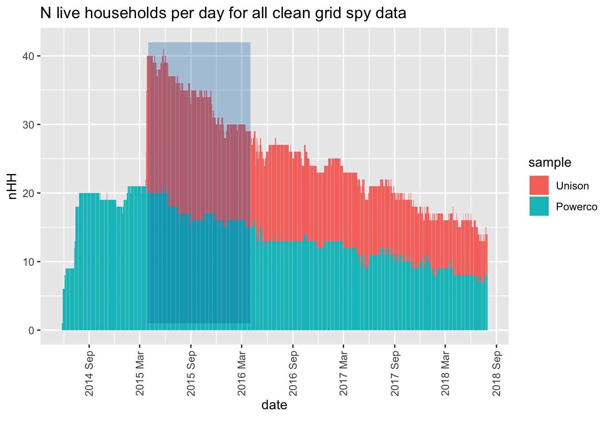

\newpage

# About

## Report circulation:

 * Public - this report is intended to accompany the data release.
 
## License


This work is made available under the Creative Commons [Attribution-ShareAlike 4.0 International (CC BY-SA 4.0) License](https://creativecommons.org/licenses/by-sa/4.0/).

This means you are free to:

 * _Share_ — copy and redistribute the material in any medium or format
 * _Adapt_ — remix, transform, and build upon the material for any purpose, even commercially.
 
Under the following terms:

 * _Attribution_ — You must give appropriate credit, provide a link to the license, and indicate if changes were made. You may do so in any reasonable manner, but not in any way that suggests the licensor endorses you or your use.
 * ShareAlike — If you remix, transform, or build upon the material, you must distribute your contributions under the same license as the original.
 * No additional restrictions — You may not apply legal terms or technological measures that legally restrict others from doing anything the license permits.

## Notices:

 * You do not have to comply with the license for elements of the material in the public domain or where your use is permitted by an applicable exception or limitation.
 * No warranties are given. The license may not give you all of the permissions necessary for your intended use. For example, other rights such as publicity, privacy, or moral rights may limit how you use the material. #YMMV

For the avoidance of doubt and explanation of terms please refer to the full [license notice](https://creativecommons.org/licenses/by-sa/4.0/) and [legal code](https://creativecommons.org/licenses/by-sa/4.0/legalcode).
 
## Citation

If you wish to use any of the material from this report please cite as:

 * Anderson, B. (2018) NZ GREEN Grid project: Research data overview, [Centre for Sustainability](http://www.otago.ac.nz/centre-sustainability/), University of Otago: Dunedin. 
 
> XX replace with UKDA DOI when available XX

## History

Code history is generally tracked via our github [repo](https://github.com/dataknut/nzGREENGridDataR):

 * [Report history](https://github.com/dataknut/nzGREENGridDataR/commits/master/docs/ggOverviewReport.Rmd)
 * [General issues](https://github.com/dataknut/nzGREENGridDataR/issues)
 
## Requirements:

This report uses:
 
 * safe versions of the project research data and associated data quality statistics produced during processing of the original data. 

## Support


This work was supported by:

 * The [University of Otago](https://www.otago.ac.nz/);
 * The [University of Southampton](https://www.southampton.ac.uk/);
 * The New Zealand [Ministry of Business, Innovation and Employment (MBIE)](http://www.mbie.govt.nz/) through the [NZ GREEN Grid](https://www.otago.ac.nz/centre-sustainability/research/energy/otago050285.html) project;
 * [SPATIALEC](http://www.energy.soton.ac.uk/tag/spatialec/) - a [Marie Skłodowska-Curie Global Fellowship](http://ec.europa.eu/research/mariecurieactions/about-msca/actions/if/index_en.htm) based at the University of Otago’s [Centre for Sustainability](http://www.otago.ac.nz/centre-sustainability/staff/otago673896.html) (2017-2019) & the University of Southampton's Sustainable Energy Research Group (2019-202).
 
\newpage

# Introduction


The NZ GREEN Grid project recruited a sample of c 25 households in each of two regions of New Zealand. The first sample was recruited in early 2014 and the second in early 2015. Research data includes:

 * 1 minute electricity power (W) data was collected for each dwelling circuit using [gridSpy](https://gridspy.com/) monitors on each power circuit (and the incoming power). The power values represent mean(W) over the minute preceeding the observation timestamp.
 * Occupant time-use diaries (focused on energy use)
 * Dwelling & appliance surveys
 
We are working towards releasing 'clean' (anonymised) versions of this research data for re-use.
 
This report provides an overview of the GREEN Grid project research data. The most recent version of this report can be found at https://dataknut.github.io/nzGREENGridDataR/.

# Study recruitment


```
## Parsed with column specification:
## cols(
##   sample = col_character(),
##   hhID = col_character(),
##   newID = col_character(),
##   Location = col_character(),
##   nAdults = col_integer(),
##   nChildren0_12 = col_integer(),
##   nTeenagers13_18 = col_integer(),
##   notes = col_character(),
##   r_stopDate = col_date(format = "")
## )
```


```
## Parsed with column specification:
## cols(
##   hhID = col_character(),
##   date = col_date(format = ""),
##   nObs = col_integer(),
##   meanPower = col_double(),
##   sdPowerW = col_double(),
##   minPowerW = col_double(),
##   maxPowerW = col_double(),
##   circuitLabels = col_character(),
##   nCircuits = col_integer()
## )
```

The project research sample comprises 44 households who were recruited in two batches, one starting in May 2014 and the second starting in November 2014 via two local lines companies (Powerco and Unison). Recruitment was via a non-random (?) sampling method and a number of households were intentionally selected for their 'complex' electricity consumption (and embedded generation) patterns and appliances. As a result the sample cannot be assumed to represent the population of customers of either company, nor of the populations in each location.

Table \@ref{tab:sampleTable} shows the number in each sample and the dates from which Grid Spy data was collected. As can be seen data is still being collected on some households.

<table>
<caption>(\#tab:sampleTable)Sample location</caption>
 <thead>
  <tr>
   <th style="text-align:left;"> Location </th>
   <th style="text-align:left;"> sample </th>
   <th style="text-align:right;"> nHouseholds </th>
  </tr>
 </thead>
<tbody>
  <tr>
   <td style="text-align:left;"> Hawkes Bay </td>
   <td style="text-align:left;"> Unison </td>
   <td style="text-align:right;"> 20 </td>
  </tr>
  <tr>
   <td style="text-align:left;"> New Plymouth </td>
   <td style="text-align:left;"> Powerco </td>
   <td style="text-align:right;"> 24 </td>
  </tr>
</tbody>
</table>

Table \@ref{tab:allHhData} shows key attributes for the recruited sample. Note that two grid spy monitors were re-used and so require new hhIDs to be set from the dates given. This has already been done in the clean grid spy data for the relevant households. Linkage between the survey and grid spy data should always use `newID` to avoid errors.

<table>
<caption>(\#tab:allHhData)Sample details</caption>
 <thead>
  <tr>
   <th style="text-align:left;"> sample </th>
   <th style="text-align:left;"> hhID </th>
   <th style="text-align:left;"> newID </th>
   <th style="text-align:left;"> Location </th>
   <th style="text-align:left;"> notes </th>
   <th style="text-align:left;"> r_stopDate </th>
  </tr>
 </thead>
<tbody>
  <tr>
   <td style="text-align:left;"> Unison </td>
   <td style="text-align:left;"> rf_28 </td>
   <td style="text-align:left;"> rf_28 </td>
   <td style="text-align:left;"> Hawkes Bay </td>
   <td style="text-align:left;"> NA </td>
   <td style="text-align:left;"> NA </td>
  </tr>
  <tr>
   <td style="text-align:left;"> Unison </td>
   <td style="text-align:left;"> rf_29 </td>
   <td style="text-align:left;"> rf_29 </td>
   <td style="text-align:left;"> Hawkes Bay </td>
   <td style="text-align:left;"> NA </td>
   <td style="text-align:left;"> NA </td>
  </tr>
  <tr>
   <td style="text-align:left;"> Unison </td>
   <td style="text-align:left;"> rf_30 </td>
   <td style="text-align:left;"> rf_30 </td>
   <td style="text-align:left;"> Hawkes Bay </td>
   <td style="text-align:left;"> NA </td>
   <td style="text-align:left;"> NA </td>
  </tr>
  <tr>
   <td style="text-align:left;"> Unison </td>
   <td style="text-align:left;"> rf_31 </td>
   <td style="text-align:left;"> rf_31 </td>
   <td style="text-align:left;"> Hawkes Bay </td>
   <td style="text-align:left;"> NA </td>
   <td style="text-align:left;"> NA </td>
  </tr>
  <tr>
   <td style="text-align:left;"> Unison </td>
   <td style="text-align:left;"> rf_32 </td>
   <td style="text-align:left;"> rf_32 </td>
   <td style="text-align:left;"> Hawkes Bay </td>
   <td style="text-align:left;"> NA </td>
   <td style="text-align:left;"> NA </td>
  </tr>
  <tr>
   <td style="text-align:left;"> Unison </td>
   <td style="text-align:left;"> rf_33 </td>
   <td style="text-align:left;"> rf_33 </td>
   <td style="text-align:left;"> Hawkes Bay </td>
   <td style="text-align:left;"> NA </td>
   <td style="text-align:left;"> NA </td>
  </tr>
  <tr>
   <td style="text-align:left;"> Unison </td>
   <td style="text-align:left;"> rf_34 </td>
   <td style="text-align:left;"> rf_34 </td>
   <td style="text-align:left;"> Hawkes Bay </td>
   <td style="text-align:left;"> NA </td>
   <td style="text-align:left;"> NA </td>
  </tr>
  <tr>
   <td style="text-align:left;"> Unison </td>
   <td style="text-align:left;"> rf_35 </td>
   <td style="text-align:left;"> rf_35 </td>
   <td style="text-align:left;"> Hawkes Bay </td>
   <td style="text-align:left;"> NA </td>
   <td style="text-align:left;"> NA </td>
  </tr>
  <tr>
   <td style="text-align:left;"> Unison </td>
   <td style="text-align:left;"> rf_36 </td>
   <td style="text-align:left;"> rf_36 </td>
   <td style="text-align:left;"> Hawkes Bay </td>
   <td style="text-align:left;"> NA </td>
   <td style="text-align:left;"> NA </td>
  </tr>
  <tr>
   <td style="text-align:left;"> Unison </td>
   <td style="text-align:left;"> rf_37 </td>
   <td style="text-align:left;"> rf_37 </td>
   <td style="text-align:left;"> Hawkes Bay </td>
   <td style="text-align:left;"> NA </td>
   <td style="text-align:left;"> NA </td>
  </tr>
  <tr>
   <td style="text-align:left;"> Unison </td>
   <td style="text-align:left;"> rf_38 </td>
   <td style="text-align:left;"> rf_38 </td>
   <td style="text-align:left;"> Hawkes Bay </td>
   <td style="text-align:left;"> NA </td>
   <td style="text-align:left;"> NA </td>
  </tr>
  <tr>
   <td style="text-align:left;"> Unison </td>
   <td style="text-align:left;"> rf_39 </td>
   <td style="text-align:left;"> rf_39 </td>
   <td style="text-align:left;"> Hawkes Bay </td>
   <td style="text-align:left;"> NA </td>
   <td style="text-align:left;"> NA </td>
  </tr>
  <tr>
   <td style="text-align:left;"> Unison </td>
   <td style="text-align:left;"> rf_40 </td>
   <td style="text-align:left;"> rf_40 </td>
   <td style="text-align:left;"> Hawkes Bay </td>
   <td style="text-align:left;"> NA </td>
   <td style="text-align:left;"> NA </td>
  </tr>
  <tr>
   <td style="text-align:left;"> Unison </td>
   <td style="text-align:left;"> rf_41 </td>
   <td style="text-align:left;"> rf_41 </td>
   <td style="text-align:left;"> Hawkes Bay </td>
   <td style="text-align:left;"> NA </td>
   <td style="text-align:left;"> NA </td>
  </tr>
  <tr>
   <td style="text-align:left;"> Unison </td>
   <td style="text-align:left;"> rf_42 </td>
   <td style="text-align:left;"> rf_42 </td>
   <td style="text-align:left;"> Hawkes Bay </td>
   <td style="text-align:left;"> NA </td>
   <td style="text-align:left;"> NA </td>
  </tr>
  <tr>
   <td style="text-align:left;"> Unison </td>
   <td style="text-align:left;"> rf_43 </td>
   <td style="text-align:left;"> rf_43 </td>
   <td style="text-align:left;"> Hawkes Bay </td>
   <td style="text-align:left;"> NA </td>
   <td style="text-align:left;"> NA </td>
  </tr>
  <tr>
   <td style="text-align:left;"> Unison </td>
   <td style="text-align:left;"> rf_44 </td>
   <td style="text-align:left;"> rf_44 </td>
   <td style="text-align:left;"> Hawkes Bay </td>
   <td style="text-align:left;"> NA </td>
   <td style="text-align:left;"> NA </td>
  </tr>
  <tr>
   <td style="text-align:left;"> Unison </td>
   <td style="text-align:left;"> rf_45 </td>
   <td style="text-align:left;"> rf_45 </td>
   <td style="text-align:left;"> Hawkes Bay </td>
   <td style="text-align:left;"> NA </td>
   <td style="text-align:left;"> NA </td>
  </tr>
  <tr>
   <td style="text-align:left;"> Unison </td>
   <td style="text-align:left;"> rf_46 </td>
   <td style="text-align:left;"> rf_46 </td>
   <td style="text-align:left;"> Hawkes Bay </td>
   <td style="text-align:left;"> NA </td>
   <td style="text-align:left;"> NA </td>
  </tr>
  <tr>
   <td style="text-align:left;"> Unison </td>
   <td style="text-align:left;"> rf_47 </td>
   <td style="text-align:left;"> rf_47 </td>
   <td style="text-align:left;"> Hawkes Bay </td>
   <td style="text-align:left;"> NA </td>
   <td style="text-align:left;"> NA </td>
  </tr>
  <tr>
   <td style="text-align:left;"> Powerco </td>
   <td style="text-align:left;"> rf_12 </td>
   <td style="text-align:left;"> rf_12 </td>
   <td style="text-align:left;"> New Plymouth </td>
   <td style="text-align:left;"> NA </td>
   <td style="text-align:left;"> NA </td>
  </tr>
  <tr>
   <td style="text-align:left;"> Powerco </td>
   <td style="text-align:left;"> rf_25 </td>
   <td style="text-align:left;"> rf_25 </td>
   <td style="text-align:left;"> New Plymouth </td>
   <td style="text-align:left;"> NA </td>
   <td style="text-align:left;"> NA </td>
  </tr>
  <tr>
   <td style="text-align:left;"> Powerco </td>
   <td style="text-align:left;"> rf_23 </td>
   <td style="text-align:left;"> rf_23 </td>
   <td style="text-align:left;"> New Plymouth </td>
   <td style="text-align:left;"> NA </td>
   <td style="text-align:left;"> NA </td>
  </tr>
  <tr>
   <td style="text-align:left;"> Powerco </td>
   <td style="text-align:left;"> rf_26 </td>
   <td style="text-align:left;"> rf_26 </td>
   <td style="text-align:left;"> New Plymouth </td>
   <td style="text-align:left;"> NA </td>
   <td style="text-align:left;"> NA </td>
  </tr>
  <tr>
   <td style="text-align:left;"> Powerco </td>
   <td style="text-align:left;"> rf_06 </td>
   <td style="text-align:left;"> rf_06 </td>
   <td style="text-align:left;"> New Plymouth </td>
   <td style="text-align:left;"> NA </td>
   <td style="text-align:left;"> NA </td>
  </tr>
  <tr>
   <td style="text-align:left;"> Powerco </td>
   <td style="text-align:left;"> rf_19 </td>
   <td style="text-align:left;"> rf_19 </td>
   <td style="text-align:left;"> New Plymouth </td>
   <td style="text-align:left;"> NA </td>
   <td style="text-align:left;"> NA </td>
  </tr>
  <tr>
   <td style="text-align:left;"> Powerco </td>
   <td style="text-align:left;"> rf_10 </td>
   <td style="text-align:left;"> rf_10 </td>
   <td style="text-align:left;"> New Plymouth </td>
   <td style="text-align:left;"> NA </td>
   <td style="text-align:left;"> NA </td>
  </tr>
  <tr>
   <td style="text-align:left;"> Powerco </td>
   <td style="text-align:left;"> rf_11 </td>
   <td style="text-align:left;"> rf_11 </td>
   <td style="text-align:left;"> New Plymouth </td>
   <td style="text-align:left;"> NA </td>
   <td style="text-align:left;"> NA </td>
  </tr>
  <tr>
   <td style="text-align:left;"> Powerco </td>
   <td style="text-align:left;"> rf_13 </td>
   <td style="text-align:left;"> rf_13 </td>
   <td style="text-align:left;"> New Plymouth </td>
   <td style="text-align:left;"> NA </td>
   <td style="text-align:left;"> NA </td>
  </tr>
  <tr>
   <td style="text-align:left;"> Powerco </td>
   <td style="text-align:left;"> rf_09 </td>
   <td style="text-align:left;"> rf_09 </td>
   <td style="text-align:left;"> New Plymouth </td>
   <td style="text-align:left;"> NA </td>
   <td style="text-align:left;"> NA </td>
  </tr>
  <tr>
   <td style="text-align:left;"> Powerco </td>
   <td style="text-align:left;"> rf_07 </td>
   <td style="text-align:left;"> rf_07 </td>
   <td style="text-align:left;"> New Plymouth </td>
   <td style="text-align:left;"> NA </td>
   <td style="text-align:left;"> NA </td>
  </tr>
  <tr>
   <td style="text-align:left;"> Powerco </td>
   <td style="text-align:left;"> rf_22 </td>
   <td style="text-align:left;"> rf_22 </td>
   <td style="text-align:left;"> New Plymouth </td>
   <td style="text-align:left;"> NA </td>
   <td style="text-align:left;"> NA </td>
  </tr>
  <tr>
   <td style="text-align:left;"> Powerco </td>
   <td style="text-align:left;"> rf_08 </td>
   <td style="text-align:left;"> rf_08 </td>
   <td style="text-align:left;"> New Plymouth </td>
   <td style="text-align:left;"> NA </td>
   <td style="text-align:left;"> NA </td>
  </tr>
  <tr>
   <td style="text-align:left;"> Powerco </td>
   <td style="text-align:left;"> rf_18 </td>
   <td style="text-align:left;"> rf_18 </td>
   <td style="text-align:left;"> New Plymouth </td>
   <td style="text-align:left;"> NA </td>
   <td style="text-align:left;"> NA </td>
  </tr>
  <tr>
   <td style="text-align:left;"> Powerco </td>
   <td style="text-align:left;"> rf_17 </td>
   <td style="text-align:left;"> rf_17a </td>
   <td style="text-align:left;"> New Plymouth </td>
   <td style="text-align:left;"> Unusual &amp; specialist energy tech configuration. Disconnected 28/03/2016. Re-used. </td>
   <td style="text-align:left;"> 2016-03-28 </td>
  </tr>
  <tr>
   <td style="text-align:left;"> Powerco </td>
   <td style="text-align:left;"> rf_14 </td>
   <td style="text-align:left;"> rf_14 </td>
   <td style="text-align:left;"> New Plymouth </td>
   <td style="text-align:left;"> NA </td>
   <td style="text-align:left;"> NA </td>
  </tr>
  <tr>
   <td style="text-align:left;"> Powerco </td>
   <td style="text-align:left;"> rf_16 </td>
   <td style="text-align:left;"> rf_16 </td>
   <td style="text-align:left;"> New Plymouth </td>
   <td style="text-align:left;"> NA </td>
   <td style="text-align:left;"> NA </td>
  </tr>
  <tr>
   <td style="text-align:left;"> Powerco </td>
   <td style="text-align:left;"> rf_21 </td>
   <td style="text-align:left;"> rf_21 </td>
   <td style="text-align:left;"> New Plymouth </td>
   <td style="text-align:left;"> NA </td>
   <td style="text-align:left;"> NA </td>
  </tr>
  <tr>
   <td style="text-align:left;"> Powerco </td>
   <td style="text-align:left;"> rf_20 </td>
   <td style="text-align:left;"> rf_20 </td>
   <td style="text-align:left;"> New Plymouth </td>
   <td style="text-align:left;"> NA </td>
   <td style="text-align:left;"> NA </td>
  </tr>
  <tr>
   <td style="text-align:left;"> Powerco </td>
   <td style="text-align:left;"> rf_27 </td>
   <td style="text-align:left;"> rf_27 </td>
   <td style="text-align:left;"> New Plymouth </td>
   <td style="text-align:left;"> NA </td>
   <td style="text-align:left;"> NA </td>
  </tr>
  <tr>
   <td style="text-align:left;"> Powerco </td>
   <td style="text-align:left;"> rf_15 </td>
   <td style="text-align:left;"> rf_15a </td>
   <td style="text-align:left;"> New Plymouth </td>
   <td style="text-align:left;"> Disconnected 15/01/2015. Re-used </td>
   <td style="text-align:left;"> 2015-01-15 </td>
  </tr>
  <tr>
   <td style="text-align:left;"> Powerco </td>
   <td style="text-align:left;"> rf_24 </td>
   <td style="text-align:left;"> rf_24 </td>
   <td style="text-align:left;"> New Plymouth </td>
   <td style="text-align:left;"> NA </td>
   <td style="text-align:left;"> NA </td>
  </tr>
  <tr>
   <td style="text-align:left;"> Powerco </td>
   <td style="text-align:left;"> rf_15 </td>
   <td style="text-align:left;"> rf_15b </td>
   <td style="text-align:left;"> New Plymouth </td>
   <td style="text-align:left;"> Re-user. Then disconnected 02/04/2016 </td>
   <td style="text-align:left;"> 2016-04-02 </td>
  </tr>
  <tr>
   <td style="text-align:left;"> Powerco </td>
   <td style="text-align:left;"> rf_17 </td>
   <td style="text-align:left;"> rf_17b </td>
   <td style="text-align:left;"> New Plymouth </td>
   <td style="text-align:left;"> Re-user </td>
   <td style="text-align:left;"> NA </td>
  </tr>
</tbody>
</table>

The households labeled 'NA' were initial pilot/test households who did not form part of the sample and for whom no survey data is available. They should be excluded from any data analysis.


# Data collection duration

Figure \@ref{fig:liveDataHouseholds} shows the total number of households for whom grid spy data exists on a given date by sample and indicates that for analytic purposes the period from April 2015 to March 2016 (indicated) would offer the maximum number of households.

<div class="figure">

<p class="caption">(\#fig:liveDataHouseholds)Sample size over time</p>
</div>

# Runtime


Analysis completed in 5.2 seconds ( 0.09 minutes) using [knitr](https://cran.r-project.org/package=knitr) in [RStudio](http://www.rstudio.com) with R version 3.5.0 (2018-04-23) running on x86_64-apple-darwin15.6.0.

# R environment

R packages used:

 * base R - for the basics [@baseR]
 * data.table - for fast (big) data handling [@data.table]
 * lubridate - date manipulation [@lubridate]
 * ggplot2 - for slick graphics [@ggplot2]
 * readr - for csv reading/writing [@readr]
 * dplyr - for select and contains [@dplyr]
 * progress - for progress bars [@progress]
 * knitr - to create this document & neat tables [@knitr]
 * kableExtra - for extra neat tables [@kableExtra]
 * nzGREENGridDataR - for local NZ GREEN Grid project utilities

Session info:


```
## R version 3.5.0 (2018-04-23)
## Platform: x86_64-apple-darwin15.6.0 (64-bit)
## Running under: macOS High Sierra 10.13.6
## 
## Matrix products: default
## BLAS: /Library/Frameworks/R.framework/Versions/3.5/Resources/lib/libRblas.0.dylib
## LAPACK: /Library/Frameworks/R.framework/Versions/3.5/Resources/lib/libRlapack.dylib
## 
## locale:
## [1] en_GB.UTF-8/en_GB.UTF-8/en_GB.UTF-8/C/en_GB.UTF-8/en_GB.UTF-8
## 
## attached base packages:
## [1] stats     graphics  grDevices utils     datasets  methods   base     
## 
## other attached packages:
## [1] kableExtra_0.9.0       stringr_1.3.1          knitr_1.20            
## [4] readr_1.1.1            ggplot2_3.0.0          data.table_1.11.4     
## [7] nzGREENGridDataR_0.1.0
## 
## loaded via a namespace (and not attached):
##  [1] nzGREENGrid_0.1.0 progress_1.2.0    tidyselect_0.2.4 
##  [4] xfun_0.3          reshape2_1.4.3    purrr_0.2.5      
##  [7] lattice_0.20-35   colorspace_1.3-2  viridisLite_0.3.0
## [10] htmltools_0.3.6   yaml_2.2.0        rlang_0.2.1      
## [13] pillar_1.3.0      glue_1.3.0        withr_2.1.2      
## [16] sp_1.3-1          readxl_1.1.0      bindrcpp_0.2.2   
## [19] jpeg_0.1-8        bindr_0.1.1       plyr_1.8.4       
## [22] munsell_0.5.0     gtable_0.2.0      cellranger_1.1.0 
## [25] rvest_0.3.2       RgoogleMaps_1.4.2 mapproj_1.2.6    
## [28] evaluate_0.11     labeling_0.3      highr_0.7        
## [31] proto_1.0.0       Rcpp_0.12.18      geosphere_1.5-7  
## [34] openssl_1.0.2     backports_1.1.2   scales_0.5.0     
## [37] rjson_0.2.20      hms_0.4.2         png_0.1-7        
## [40] digest_0.6.15     stringi_1.2.4     bookdown_0.7     
## [43] dplyr_0.7.6       rprojroot_1.3-2   grid_3.5.0       
## [46] tools_3.5.0       magrittr_1.5      maps_3.3.0       
## [49] lazyeval_0.2.1    tibble_1.4.2      crayon_1.3.4     
## [52] pkgconfig_2.0.1   xml2_1.2.0        prettyunits_1.0.2
## [55] lubridate_1.7.4   httr_1.3.1        rstudioapi_0.7   
## [58] assertthat_0.2.0  rmarkdown_1.10    R6_2.2.2         
## [61] ggmap_2.6.1       compiler_3.5.0
```

# References
